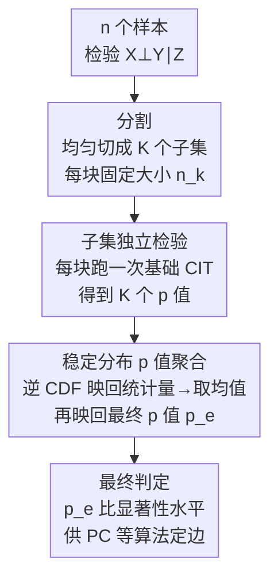

# Efficient Ensemble Conditional Independence Test Framework for Causal Discovery

**会议**: ICLR 2026  
**arXiv**: [2509.21021](https://arxiv.org/abs/2509.21021)  
**代码**: 无  
**领域**: 因果推理  
**关键词**: conditional independence test, causal discovery, ensemble method, stable distribution, p-value combination

## 一句话总结

提出 E-CIT（集成条件独立性检验）框架，通过将数据分割为子集后独立执行检验并基于**稳定分布**的 p 值聚合方法合并结果，将任意条件独立性检验的计算复杂度降至关于样本量线性，同时在重尾噪声和真实数据等复杂场景下保持甚至提升检验功效。

## 研究背景与动机

**领域现状**: 基于约束的因果发现（如 PC 算法）依赖大量条件独立性检验 (CIT) 来确定因果图结构。KCIT（基于核的 CIT）是最流行的方法之一，但关于样本量具有 $O(n^3)$ 的时间复杂度。

**现有痛点**: 
   - CIT 本身的高计算复杂度是因果发现的核心瓶颈（而非检验次数）
   - 现有加速方法（RCIT、FastKCIT）专门针对 KCIT 优化，不是通用框架
   - Shah & Peters (2018) 证明没有单一 CIT 在所有条件依赖结构下都有效——因此通用加速框架比改进单一方法更有价值

**核心矛盾**: 需要大样本保证检验功效，但 CIT 的高复杂度使大样本下计算不可行

**本文目标**: 设计一个通用的、即插即用的框架，可以应用于任意 CIT 方法以降低计算开销，同时保持统计功效

**切入角度**: 借鉴集成学习思想——将数据分割为固定大小的子集，独立检验后聚合 p 值。关键创新在聚合方法：利用稳定分布的封闭性质设计一致性有保证的 p 值合并方法

**核心 idea**: 分而治之 + 稳定分布 p 值聚合 = 任意 CIT 的线性复杂度加速框架

## 方法详解

### 整体框架

E-CIT 想解决的事很直接：基于约束的因果发现要做海量条件独立性检验 (CIT)，而单次 CIT 本身关于样本量复杂度很高（如 KCIT 是 $O(n^3)$），样本一大就算不动。它借鉴集成学习的"分而治之"，把一次大样本检验拆成多次小样本检验再合并——给定 $n$ 个样本和要检验的 $X \perp\!\!\!\perp Y \mid Z$，先把数据均匀切成 $K$ 个固定大小 $n_k$ 的子集（$n = K \cdot n_k$），对每个子集独立跑一遍**任意**基础 CIT 得到 $K$ 个 p 值 $\{p_1,\ldots,p_K\}$，最后用一套基于稳定分布的聚合方法把这 $K$ 个 p 值合回一个最终 p 值，供 PC 等算法判定这条边是否存在。

整条流水线里真正的难点不在"切"和"跑"——这两步是通用脚手架，谁都能做；难点在**怎么合**：子集小、p 值分布随数据机制和 CIT 方法剧烈变化，合并方法必须既保住统计性质、又能适配不同场景。所以 E-CIT 的全部技术含量都集中在聚合这一步。它的好处也来自固定子集大小：基础 CIT 总开销变成 $K \times O(f(n_k)) = O(n)$，无论原方法多复杂都被线性化；而且"即插即用"——不改基础 CIT 内部，只在外面套一层分割与聚合。

> 「分割」「子集独立检验」是通用脚手架，论文真正的创新只在「稳定分布 p 值聚合」这一步——下面三个关键设计都是围绕它展开：聚合公式本身、它的理论保证、以及用 $\alpha$ 调节的灵活性。

### 关键设计

**1. 基于稳定分布的 p 值聚合：让"合并 K 个 p 值"这一步既有封闭解又可调（Definition 2）**

分割之后真正棘手的是怎么把 $K$ 个子检验的 p 值合回一个、且仍保证统计性质。E-CIT 的做法是借力稳定分布的封闭性：若 $X_j \sim \mathbf{S}(\alpha, \beta, \gamma, \delta)$ 独立同分布，则它们的均值仍是稳定分布，$\frac{1}{K}\sum_j X_j \sim \mathbf{S}(\alpha, \beta, K^{1/\alpha - 1}\gamma, \delta)$。于是先把每个子检验 p 值经稳定分布的逆 CDF 映回统计量再取平均，得到检验统计量

$$T_e = \frac{1}{K} \sum_{k=1}^K F_S^{-1}(p_k),$$

最终 p 值就是 $p_e = F_{S'}(T_e)$，其中 $S' = \mathbf{S}(\alpha, \beta, K^{1/\alpha-1}\gamma, \delta)$。这一步之所以漂亮，是因为聚合后的分布有显式表达式（不必蒙特卡洛逼近），而参数 $\alpha$ 又恰好控制尾部厚度——取 $\alpha = 2$ 时退化为基于正态的 Stouffer 合并，取 $\alpha = 1$ 时则是 Cauchy 合并，等于把一族经典 p 值合并法统一在一个可调旋钮下，便于适配不同 CIT 和数据特性。

**2. 理论保证：把"集成不会损坏检验"做成可证的命题（Theorem 1 & 2）**

光有聚合公式还不够，得证明它没有破坏检验的统计性质。Theorem 1 给出有效性、可容许性与无偏性——在精确 p 值下，零假设成立时 $p_e$ 仍均匀分布于 $[0,1]$，因此 Type I error 可控。更关键的是 Theorem 2 的一致性：当 $K \to \infty$ 时功效趋于 1，而它要求的条件出奇地弱——只需 ① 子检验的期望 p 值 $\le \alpha_e$；② p 值密度在 $[0, 1/2]$ 上不低于其镜像值；③ 稳定分布参数取 $\alpha \ge 1,\ \beta = \delta = 0$。这三条都不对数据生成过程做任何假设，只要求每个子检验"合理有效"。这正是 E-CIT 比改进单一 CIT 更有价值的地方：即便基础 CIT 自身在复杂场景下缺乏一致性，集成框架仍能补回一致性。

**3. 灵活性：用一维 $\alpha$ 自适应不同 CIT 的备择分布**

为什么要让 $\alpha$ 可调，而不是像 Fisher、Stouffer 那样钉死？因为按 Neyman-Pearson 引理，最优的 p 值合并统计量应是 $-\sum_k \log f_1(p_k)$ 的单调变换，而备择假设下的密度 $f_1$ 随 CIT 方法和依赖结构而变——同一个固定合并法不可能对所有情形都最优。传统方法各自对应一个固定的 $\alpha$，缺乏调节余地；E-CIT 把这件事收成一个一维参数，用一个旋钮就能在不同 CIT、不同噪声特性间逼近最优合并，既简洁又保留了适配能力。

### 损失函数 / 训练策略

- 非监督学习方法，无需训练步骤
- 实践推荐：$n_k = 400$（基于经验），$\alpha \in \{1.75, 2.0\}$，$\beta = \delta = 0$，$\gamma = 1$

## 实验关键数据

### 主实验

数据生成：后非线性模型，$Z$ 服从正态或 Laplace 分布，噪声分别为 Student-t、Cauchy、Laplace

**计算效率对比 (Figure 2, KCIT 加速)**:

| 方法 | 时间复杂度 | n=2000 运行时间 | Type I Error | 检验功效 |
|------|-----------|----------------|-------------|---------|
| KCIT (原始) | $O(n^3)$ | ~100s | ~0.05 | 基线 |
| RCIT | $O(n)$ | ~0.1s | ~0.05 | 略低于 KCIT |
| FastKCIT | $O(n \log n)$ | ~1s | ~0.05 | 接近 KCIT |
| **E-KCIT** | $O(n)$ | ~0.1s | ~0.05 | **接近或优于 KCIT（重尾时更好）** |

**跨方法通用性 (Table 2, n=1200, Normal Z, t-noise df=2)**:

| 方法 | Orig. Power | Ensemble Power (α=1.75) |
|------|------------|------------------------|
| RCIT | 0.548 | **0.623** |
| LPCIT | 0.422 | **0.447** |
| CMIknn | 0.982 | 0.988 |
| FisherZ | 0.510 | **0.561** |
| CCIT | 0.904 (Type I=0.454!) | 0.816 (Type I=0.286↓) |

### 消融实验

**真实数据 Flow-Cytometry (Table 3)**:

| 方法 | Orig. F1 | Ensemble F1 |
|------|---------|------------|
| KCIT | 0.624 | **0.695** |
| RCIT | 0.665 | **0.687** |
| LPCIT | 0.691 | **0.741** |
| CMIknn | 0.779 | 0.756 |
| FisherZ | 0.737 | **0.767** |

### 关键发现

1. **显著加速**: E-KCIT 将 KCIT 的 $O(n^3)$ 降至 $O(n)$，运行时间与 RCIT 相当
2. **功效不降反升**: 在重尾噪声（Student-t df=2、Cauchy）下，E-KCIT 功效优于 KCIT 和 RCIT——子集上估计更稳定
3. **通用性**: 对 6 种不同 CIT 方法（KCIT、RCIT、LPCIT、CMIknn、CCIT、FisherZ）均有效
4. **真实数据优势**: 在 Flow-Cytometry 数据上，对大多数方法提升 F1-score 2-5 个百分点
5. **CCIT 的意外发现**: E-CIT 显著降低了 CCIT 过高的 Type I error（从 0.45+ 降至 0.28-0.34），牺牲少量功效换取了更好的校准
6. **因果发现应用 (Figure 3)**: 在非线性 + 加性噪声因果图上，E-KCIT 在 F1 和 SHD 上均优于 KCIT 和 RCIT

## 亮点与洞察

1. **通用框架而非特定方法**: 是**加速器**而非新 CIT——可即插即用到任意现有方法中
2. **理论一致性条件极其宽松**: 不对数据/模型做假设，只要求子检验"合理有效"
3. **稳定分布的巧妙应用**: 利用稳定分布的封闭性实现精确的 p 值聚合，$\alpha$ 参数提供灵活调控
4. **实际启示**: 在复杂场景（重尾、真实数据）下，集成反而能提升功效——因为小样本估计更稳定，聚合后取长补短

## 局限与展望

1. 理论假设子检验 p 值独立同分布——数据中可能存在相关性（如时序数据或分布漂移）
2. $\alpha$ 参数的最优选择是 context-dependent 的，当前仅给出经验推荐 $\{1.75, 2.0\}$
3. 子集大小 $n_k$ 需要足够大以保证子检验有效——对极高维条件集 $Z$ 可能仍面临维度灾难
4. CMIknn 这类本身已很强的方法受益较小，说明框架更适合加速中等功效的方法
5. 未来方向：处理相关 p 值、针对特定 CIT 优化 $\alpha$、自适应子集大小选择

## 相关工作与启发

- **RCIT (Strobl et al., 2019)**: 用随机傅里叶特征加速 KCIT——但仅适用于 KCIT，E-CIT 是通用框架
- **FastKCIT (Schacht & Huang, 2025)**: 用 GMM 分割数据——思路类似但专为 KCIT 设计
- **Cauchy 合并方法 (Liu & Xie, 2020)**: 用 Cauchy 分布合并 p 值用于 WGS 检验——E-CIT 推广到一般稳定分布并面向 CIT 场景
- **启发**: 分而治之 + 聚合是解决大规模统计检验的通用范式，有望推广到其他高计算开销的检验问题

## 评分

- 新颖性: ⭐⭐⭐⭐ 将稳定分布的封闭性创造性地应用于 CIT 的 p 值聚合，框架思想清晰实用；但"分割-聚合"本身不算全新
- 实验充分度: ⭐⭐⭐⭐⭐ 合成数据 + 真实数据 + 因果发现应用，6 种 CIT 方法 × 多种噪声分布 × 多种样本量，消融充分
- 写作质量: ⭐⭐⭐⭐ 结构清晰，理论和实验衔接好，Figure 1 的框架概览直观；证明放附录保持主文流畅
- 价值: ⭐⭐⭐⭐ 实用性强——可直接插入现有因果发现流水线；对大规模因果发现有实际意义

<!-- RELATED:START -->

## 相关论文

- [\[ACL 2025\] IRIS: An Iterative and Integrated Framework for Verifiable Causal Discovery](../../ACL2025/causal_inference/iris_an_iterative_and_integrated_framework.md)
- [\[CVPR 2026\] A Polynomial Chaos Framework for Causal Discovery in Nonlinear Uncertain Systems](../../CVPR2026/causal_inference/a_polynomial_chaos_framework_for_causal_discovery_in_nonlinear_uncertain_systems.md)
- [\[ICLR 2026\] Direct Doubly Robust Estimation of Conditional Quantile Contrasts](direct_doubly_robust_estimation_of_conditional_quantile_contrasts.md)
- [\[ICLR 2026\] Synthesising Counterfactual Explanations via Label-Conditional Gaussian Mixture Variational Autoencoders](synthesising_counterfactual_explanations_via_label-conditional_gaussian_mixture_.md)
- [\[CVPR 2026\] MaskDiME: Adaptive Masked Diffusion for Precise and Efficient Visual Counterfactual Explanations](../../CVPR2026/causal_inference/maskdime_adaptive_masked_diffusion_for_precise_and_efficient_visual_counterfactu.md)

<!-- RELATED:END -->
