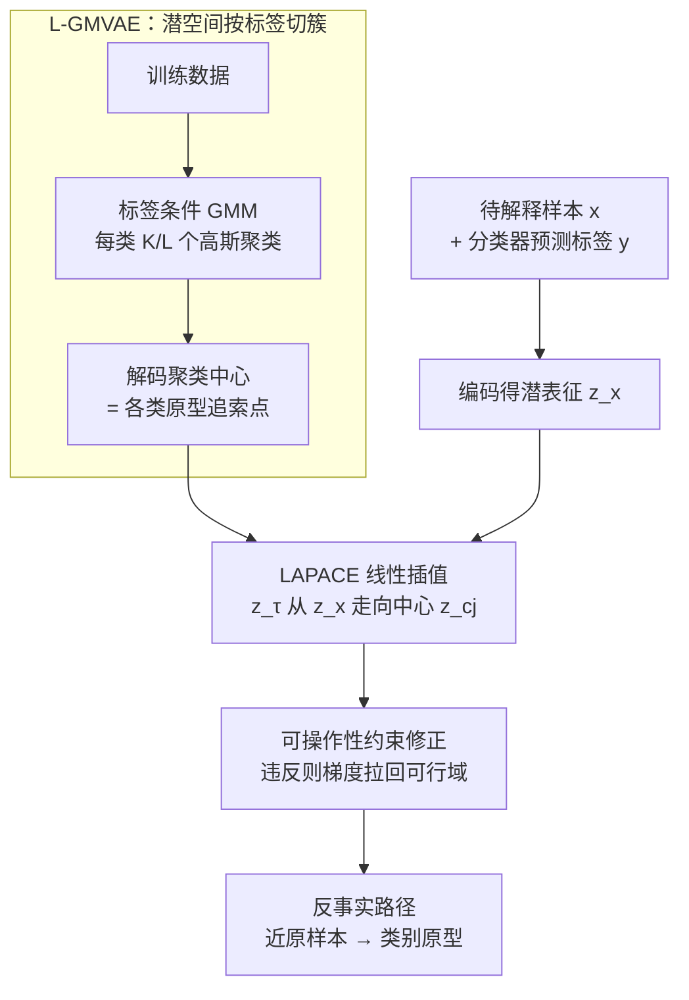

# Synthesising Counterfactual Explanations via Label-Conditional Gaussian Mixture Variational Autoencoders

**会议**: ICLR 2026  
**arXiv**: [2510.04855](https://arxiv.org/abs/2510.04855)  
**代码**: 无（使用 CARLA 库）  
**领域**: 可解释AI / 因果推断  
**关键词**: 反事实解释, 变分自编码器, 高斯混合, 鲁棒性, 算法追索

## 一句话总结
提出 L-GMVAE（标签条件高斯混合 VAE）和 LAPACE 算法，通过在潜空间中学习每个类别的多个高斯聚类中心，然后从输入潜表征到目标类别中心进行线性插值，生成路径式反事实解释，同时保证有效性、似合性、多样性和对输入扰动的完美鲁棒性。

## 研究背景与动机

**领域现状**：反事实解释（CE）为受算法决策影响的个体提供追索建议（如贷款申请被拒后应如何改变）。理想的 CE 需满足有效性、接近性、似合性（在数据流形上）和多样性。

**现有痛点**：现有方法大多孤立地处理这些属性，难以在单一框架中同时保证多种鲁棒性（输入扰动鲁棒、模型变化鲁棒）。基于 VAE 的方法通常是无条件的，忽略分类器标签信息，需要复杂的潜空间搜索。

**核心矛盾**：如何同时满足 CE 的多维需求——有效的同时似合、接近的同时鲁棒、多样的同时稳定？

**本文目标**：设计一个统一框架，生成同时满足有效性、接近性、似合性、多样性、输入鲁棒性和模型鲁棒性的 CE。

**切入角度**：识别一组多样的、原型性的目标类追索点，然后引导所有 CE 收敛到这些点。这些原型通过 label-conditional GMM 在 VAE 潜空间中自然学到。

**核心 idea**：将 GMVAE 的聚类按类别标签分区（每类 K/L 个聚类），解码后的聚类中心作为有效、似合、鲁棒的 CE 目标。从输入的潜表征到目标中心的线性插值路径提供了一系列 CE 选项。

## 方法详解

### 整体框架

方法分两步落地。训练时用一个 label-conditional 的高斯混合 VAE（L-GMVAE）把数据编码进潜空间，使每个类别都对应一簇专属的高斯聚类，聚类中心解码回去就是该类别的"原型追索点"。推理时的 LAPACE 算法把待解释样本编码到潜空间，再朝目标类别的某个聚类中心做线性插值并逐点解码，得到一条从"贴近原样本"到"落在类别原型上"的反事实路径；插值途中还会就地修正违反现实约束的潜向量。

### 关键设计

**1. L-GMVAE：把潜空间按标签切成簇，让聚类中心天然成为合格的反事实目标**

普通 VAE 的潜空间是无条件的，找反事实得在里面做复杂搜索，且不带分类器的标签信息。本文把 K 个高斯聚类的集合 $\mathcal{C} = \mathcal{C}_1 \cup \dots \cup \mathcal{C}_L$ 按 L 个类别均匀划分，每类分到 $K/L$ 个聚类。生成模型写成 $p(x,c,z\mid y) = p(c\mid y)\,p_\theta(z\mid c)\,p_\theta(x\mid z)$，推断模型为 $q(z,c\mid x,y)$，其中 $y$ 是分类器对样本的预测标签，从而把分类器的决策注入潜空间结构。训练目标是 ELBO，由三项构成：聚类分配项 $\mathrm{KL}(c)$ 鼓励均匀使用一个类别下的所有聚类（避免坍缩到单一原型，保证多样性），潜变量项 $\mathrm{KL}(z)$ 推开不同聚类（让类别间边界清晰），重建项保证解码质量。这样训练完，每个聚类中心解码出的样本既落在数据流形上（似合）、又被分类器判为对应类别（有效），不同中心彼此分散（多样），构成了一组开箱即用的目标点。

**2. LAPACE：朝固定中心做线性插值，用"收敛到同一个点"换来对输入扰动的完美鲁棒**

有了原型中心，反事实生成就不再是搜索而是插值。对输入 $x$ 编码得 $z_x$，对目标类的每个聚类中心 $z_{c_j}$，沿直线取 $z_\tau = (1-\tau) z_x + \tau z_{c_j}$，$\tau$ 从 0 到 1 逐点解码，得到一整条反事实路径：$\tau$ 小的点贴近原样本（接近性好），$\tau$ 大的点逼近原型（鲁棒性好），用户可在这条连续谱上按需取舍。关键在于路径的终点是训练时就固定下来的聚类中心，与输入无关——所以哪怕对 $x$ 加扰动，最终收敛的目标点不变，反事实对输入扰动完全不敏感，这正是固定中心相比 DRCE 那类启发式距离阈值能实现"完美"输入鲁棒的原因。同时利用 VAE 潜空间的局部平滑性，插值路径上的点也都保持在流形附近。

**3. 可操作性约束：在插值途中就地修正潜向量，让路径满足现实里"某些特征不能动"的限制**

现实追索中常有硬约束，比如年龄只能增不能减、某些特征取值固定。LAPACE 在每个 $\tau$ 步对解码结果检查约束 $g(\mathrm{Dec}(z_\tau))$，一旦违反就对潜向量 $z_\tau$ 做梯度下降把它拉回可行域，再继续插值。这样生成的整条路径上的每个反事实候选都符合用户指定的特征约束，而不只是终点合规。

### 损失函数 / 训练策略

训练损失即上文 ELBO，等于 $\mathrm{KL}(c) + \mathrm{KL}(z) +$ 重建损失；重建项对分类特征用二元交叉熵、对连续特征用 MSE。每个"数据集-分类器"组合单独训练一个 L-GMVAE，每个类别配 5 个聚类。

## 实验关键数据

### 主实验

| 方法 | 有效性 | 接近性 | 似合性(LOF) | 多样性 | 模型鲁棒 | 输入鲁棒 |
|------|--------|--------|-----------|--------|---------|---------|
| LAPACE-Last | 100% | 中等 | **最佳** | 高 | **100%** | **完美** |
| LAPACE-First | 100% | **竞争力** | 最佳 | 高 | 中等 | 完美 |
| NNCE | 100% | 最佳 | 好 | N/A | - | 好 |
| DiCE | <100% | 好 | 差 | 好 | - | - |
| DRCE | 100% | 好 | 好 | 好 | - | 好 |

### 消融实验

| 数据集 | 训练在真实 vs 合成 | 差距 | 中心精度 |
|--------|------------------|------|---------|
| heloc-RF | 73.97% vs 71.07% | 2.9% | 100% |
| wine-RF | 89.70% vs 87.42% | 2.3% | 100% |
| adult-RF | 93.82% vs 81.13% | 12.7% | 100% |
| compas-RF | 90.79% vs 85.03% | 5.8% | 100% |

### 关键发现
- **聚类中心精度 100%**：所有数据集上解码的聚类中心都被原分类器正确分类
- **LAPACE 似合性最佳**：LOF 分数在所有数据集上最低（最接近 1.0）
- **输入鲁棒性完美**：因为所有路径收敛到固定中心，对输入扰动完全不变
- **可操作性约束 100% 满足**：LAPACE-constrained 在所有测试中找到满足约束且有效的 CE
- 路径点的分类器概率随 $\tau$ 单调增长，验证潜空间与分类器对齐

## 亮点与洞察
- **路径式 CE 的实用价值**：用户可以在"接近但不够鲁棒"和"鲁棒但需要更大改变"之间选择——这比单点 CE 更有用
- **标签条件聚类的简单有效性**：通过简单地将 GMM 聚类按标签分区，自然获得了多样的原型追索点
- **隐私保护**：生成合成 CE 而非暴露训练数据点

## 局限与展望
- CE 有效性依赖于 L-GMVAE 训练质量，需要验证聚类中心被正确分类
- 对包含大量分类特征的数据集，合成数据质量有差距（如 adult 12.7%）
- 线性插值假设潜空间局部平滑，对复杂决策边界可能不够
- 未考虑因果约束（特征间因果关系）

## 相关工作与启发
- **vs DRCE**：DRCE 用最近邻确保输入鲁棒，但启发式的距离阈值不能完美保证。LAPACE 通过固定中心收敛实现完美鲁棒
- **vs DiCE**：DiCE 多目标优化产生多样 CE，但似合性差。LAPACE 通过 VAE 流形自然保证似合
- **vs RobXCE**：RobXCE 通过推远决策边界增强模型鲁棒，但不保证多样性

## 评分
- 新颖性: ⭐⭐⭐⭐ 标签条件 GMVAE + 路径式 CE 的组合新颖且自然
- 实验充分度: ⭐⭐⭐⭐⭐ 8 个指标、5 个基线、4 个数据集、可操作性、路径分析，非常全面
- 写作质量: ⭐⭐⭐⭐ 清晰有条理，图示直观
- 价值: ⭐⭐⭐⭐ 提供了统一框架解决 CE 的多属性需求

<!-- RELATED:START -->

## 相关论文

- [\[ICLR 2026\] Counterfactual Explanations on Robust Perceptual Geodesics](counterfactual_explanations_on_robust_perceptual_geodesics.md)
- [\[ICLR 2026\] Direct Doubly Robust Estimation of Conditional Quantile Contrasts](direct_doubly_robust_estimation_of_conditional_quantile_contrasts.md)
- [\[ICLR 2026\] Efficient Ensemble Conditional Independence Test Framework for Causal Discovery](efficient_ensemble_conditional_independence_test_framework_for_causal_discovery.md)
- [\[ACL 2025\] Counterfactual Explanations for Aspect-Based Sentiment Analysis](../../ACL2025/causal_inference/counterfactual_explanations_for_aspect-based_sentiment_analysis.md)
- [\[CVPR 2026\] Back to the Feature: Explaining Video Classifiers with Video Counterfactual Explanations](../../CVPR2026/causal_inference/back_to_the_feature_explaining_video_classifiers_with_video_counterfactual_expla.md)

<!-- RELATED:END -->
