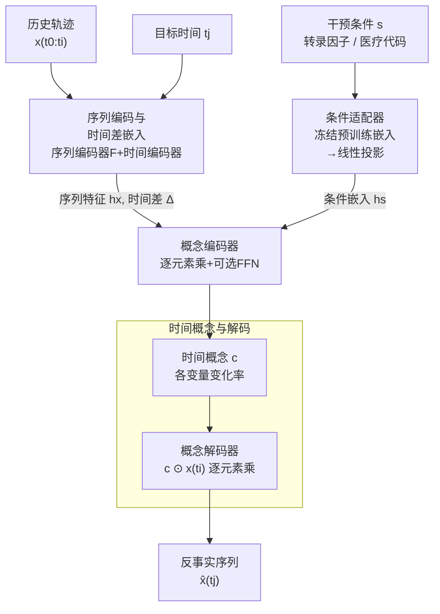

# Controllable Sequence Editing for Biological and Clinical Trajectories

**会议**: ICLR 2026  
**arXiv**: [2502.03569](https://arxiv.org/abs/2502.03569)  
**代码**: [https://github.com/mims-harvard/CLEF](https://github.com/mims-harvard/CLEF)  
**领域**: 计算生物学 / 生物信息学  
**关键词**: 反事实生成, 序列编辑, 时间概念, 病人轨迹, 细胞重编程

## 一句话总结

提出 Clef，一个基于"时间概念"（temporal concepts）的可控序列编辑模型，能够在给定条件（如药物、手术）下对生物/临床多变量轨迹进行即时和延迟编辑，在细胞重编程和患者实验室检测数据上，即时编辑 MAE 提升 16.28%，延迟编辑提升 26.73%，零样本反事实生成提升达 62.84%。

## 研究背景与动机

反事实推理（"如果给患者换一种药会怎样？""如果提前十天进行细胞扰动会怎样？"）是生物学和医学中的核心问题。现有方法存在以下痛点：

**可控文本生成（CTG）方法**只能执行"即时编辑"（预测下一个 token），无法进行"延迟编辑"（跳到未来某个时间步预测反事实轨迹）。CTG 模型需要逐步推进填补时间间隔，无法保证最终满足目标条件。

**时间序列扩散模型**虽然能做条件生成，但只支持单变量（univariate）序列，且假设条件影响整个序列，无法做出精确的局部编辑。

**真实干预的时空局部性**：实际场景中，干预（如给药、手术）只应在特定时间点之后生效，并且只影响部分变量（如某些检验指标），其余变量和历史数据应保持不变以维持时间因果一致性。

**核心矛盾**：如何在保持全局因果一致性的同时，对多变量序列进行精确的、条件引导的局部编辑？

**本文切入**：受可控文本生成中"条件引导"和图像 in-painting 中"空间上下文"的启发，Clef 引入"时间概念"——编码序列轨迹（变化率）的向量——来捕获条件如何以及何时影响序列，从而实现精确的、时间局部化的可控序列编辑。

## 方法详解

### 整体框架

Clef 要解决的是"在条件 $s$（如给某种药、敲入某个转录因子）作用下，把一段多变量历史轨迹 $\mathbf{x}_{:,t_0:t_i}$ 编辑成反事实未来"的问题。它的数据流是三路汇聚再一步生成：**序列编码器 $F$ + 时间编码器**把历史轨迹和"目标时间 $t_j$ 离当前多远"编码成序列特征 $\mathbf{h}_x$ 和时间差 $\Delta_{t_i,t_j}$；**条件适配器 $H$** 把干预条件映射成条件嵌入 $\mathbf{h}_s$；**概念编码器 $E$** 把这三路融合成一个"时间概念" $\mathbf{c}$；最后**概念解码器 $G$** 把 $\mathbf{c}$ 当作逐变量的变化倍率乘回当前状态，一步得到反事实序列 $\hat{\mathbf{x}}_{:,t_j}^s$。正因为目标时间 $t_j$ 被显式编码进概念，Clef 支持两种编辑：**即时编辑**只预测下一步 $\hat{\mathbf{x}}_{:,t_{i+1}}$，**延迟编辑**则给定在未来某步 $t_j \geq t_{i+1}$ 发生的条件，直接跳过中间步一步预测 $\hat{\mathbf{x}}_{:,t_j}$——这正是只能逐 token 推进的可控文本生成方法做不到的。

### 关键设计

**1. 序列编码与时间差嵌入：把"何时干预"显式编码进来**

延迟编辑能成立，前提是模型知道目标时间点离当前有多远，否则只能像可控文本生成那样逐步填补间隔。序列编码器 $F$ 先从历史轨迹提取时间特征 $\mathbf{h}_x = F(\mathbf{x}_{:,t_0:t_i})$，它对结构无要求，可换用 Transformer、xLSTM 乃至 MOMENT 等预训练时序基础模型，因此 Clef 实际上是一个可插在任意编码器之上的"可控编辑增强模块"。与此并行，时间编码器用年/月/日/时的正弦嵌入得到位置编码 $\mathbf{h}_t$，再以时间差 $\Delta_{t_i,t_j} = \mathbf{h}_{t_j} - \mathbf{h}_{t_i}$ 显式表示跨度。有了这个跨度信号，模型才能一步跳到任意未来时刻而不必逐步推进。

**2. 条件适配器：复用冻结的领域预训练嵌入表示"用什么干预"**

干预条件 $s$（转录因子、医疗代码等）本身是离散符号，需要先变成模型能用的向量。Clef 不从头学这层语义，而是先经冻结的预训练模型映射成嵌入 $\mathbf{z}_s$——细胞实验用 ESM-2 蛋白质语言模型，患者数据用临床知识图谱嵌入——再由一个线性层 $H$ 投影成隐藏表示 $\mathbf{h}_s = H(\mathbf{z}_s)$。借用现成的领域语义，使得即便面对训练时未见过的条件，也能凭嵌入空间里的相近性获得泛化能力，这正是零样本反事实生成得以工作的基础。

**3. 概念编码器：融合三路信号生成时间概念 $\mathbf{c}$**

这是把历史、条件、时间跨度拧到一起的环节。先将时间差嵌入与条件嵌入拼接成联合嵌入 $\mathbf{h}_s^{t_j} = \Delta_{t_i,t_j} \oplus \mathbf{h}_s$，再与序列特征逐元素相乘做交互，最后经可选的 FFN 与 GELU 激活生成时间概念：

$$\mathbf{c} = \text{GELU}(\text{FFN}(\mathbf{h}_x \odot \mathbf{h}_s^{t_j}))$$

逐元素乘法让"历史状态如何变化"被"条件 + 跨度"直接门控，于是同一段历史在不同干预下会得到不同的变化率。FFN 是否启用按数据复杂度选择：细胞数据动态简单，去掉 FFN（线性概念）反而在 WOT 上最优；患者数据更复杂，加上 FFN 提供的非线性表达力在 eICU/MIMIC 上更好。

**4. 时间概念与解码：用"变化率"而非"绝对值"承载条件，逐元素乘法一步生成**

这是整个模型的灵魂——对编辑目标的重新定义。Clef 不直接回归未来的绝对数值，而是把时间概念定义为两个时间步之间的变化率（每个变量的增长/衰减因子），解码时把概念逐元素乘回当前状态：$\hat{\mathbf{x}}_{:,t_j}^s = \mathbf{c} \odot \mathbf{x}_{:,t_i}$。这样做的好处是天然的局部性：条件干预只需改变少数几个变量的变化率，其余变量的概念值接近 1，对应数据"原样保持不变"，恰好满足了"干预只影响部分变量、其余历史维持因果一致"的需求。这个极简的乘法还让每个概念维度都对应一个变量的可解释变化率，于是用户能直接编辑某一维（如把葡萄糖相关概念减半）来生成反事实，得到一种罕见的概念级可控性。

### 损失函数 / 训练策略

训练目标用 Huber Loss，兼顾 MSE 对异常值的敏感与 MAE 的鲁棒：

$$\mathcal{L}(\mathbf{x}, \hat{\mathbf{x}}) = \begin{cases} 0.5\mathbf{a}^2, & \text{if } |\mathbf{a}| \leq \delta \\ \delta(|\mathbf{a}| - 0.5\delta), & \text{otherwise} \end{cases}$$

其中 $\mathbf{a} = \mathbf{x}_{:,t_j}^s - \hat{\mathbf{x}}_{:,t_j}^s$。训练在单块 NVIDIA A100 或 H100 上进行，超参数搜索范围为 dropout ∈ [0.3, 0.6]、学习率 ∈ [1e-3, 1e-5]、层数 ∈ [4, 8]。

## 实验关键数据

### 数据集

构建了 4 个核心数据集（后续版本扩展至 8 个）：
- **WOT**：基于 Waddington-OT 模型模拟的单细胞转录组发育轨迹，1479 个高变异基因
- **WOT-CF**：配对的反事实细胞轨迹，用于零样本评估
- **eICU**：来自 eICU 数据库的患者常规实验室检测轨迹，18 项检验
- **MIMIC-IV**：来自 MIMIC-IV 的患者检测轨迹

条件嵌入来源：细胞数据用 ESM-2（5120 维），患者数据用临床知识图谱嵌入（128 维）。

### 主实验

基线方法包括 VAR（传统时间序列）、Transformer、xLSTM、MOMENT（时间序列基础模型）及各自 +Clef 变体。

**即时编辑**：
- Clef 在所有数据集上一致超越基线，MAE 平均提升 16.28%
- 即使是简单的 SimpleLinear 消融（概念全为 1，不学习）在某些场景也有竞争力，但 Clef 在短期动态复杂的数据集上更优

**延迟编辑**：
- Clef 在 eICU 和 MIMIC-IV 上超越或持平 SimpleLinear 和 VAR
- Clef-transformer 和 Clef-xLSTM 具有最低 MAE
- MAE 平均提升 26.73%
- 在 WOT 数据集上，线性模型（SimpleLinear、VAR）表现最好，因为细胞发育轨迹每步变化较小且可能有噪声

### 消融实验

| 配置 | 关键指标 | 说明 |
|------|---------|------|
| SimpleLinear（概念全为 1） | 在部分场景有竞争力 | 说明当 $x_{t_j} \approx x_{t_i}$ 时线性近似有效 |
| Clef-FFN=0（无 FFN） | WOT 最优 | 细胞数据较简单，不需要额外非线性 |
| Clef-FFN=1（有 FFN） | eICU/MIMIC 最优 | 患者数据需要更多表达能力 |
| 不同序列编码器 | MOMENT 表现最差 | 基础模型的 1024 维嵌入不如从头训练有效 |

### 泛化性实验

使用 SPECTRA 方法创建不同train/test 相似度的数据划分：
- Clef 模型在训练/测试分布差异增大时表现更稳定
- 非 Clef 模型性能显著退化
- Clef-xLSTM 在延迟编辑中虽与 xLSTM 基线性能相似，但泛化能力显著更强

### 零样本反事实生成

在 WOT-CF 配对反事实轨迹上评估：
- 模型在"原始"轨迹上训练，在"反事实"轨迹上零样本评估
- Clef 模型在即时和延迟编辑上均一致超越非 Clef 模型
- 即时编辑提升可达 14.45% MAE，延迟编辑提升可达 63.19% MAE
- 在分歧时间点（$t=10$）之后，Clef 显著优于基线

### 关键发现

- 时间概念的引入使得模型可以直接进行概念层面的干预（如将葡萄糖相关概念值减半），无需条件 token
- 在 T1D 病例研究中，降低葡萄糖概念后，生成的反事实轨迹与健康个体更相似
- 干预葡萄糖概念还间接导致白细胞计数下降，符合 T1D 作为自身免疫疾病的临床知识
- 反向实验：干预白细胞概念也会导致葡萄糖水平变化，验证了变量间的内在关联
- 同时干预多个概念（葡萄糖 + 白细胞）产生累积效应，生成更接近健康个体的轨迹

## 亮点与洞察

- **设计极简但有效**：时间概念本质上就是一个"变化率向量"，解码器只是简单的逐元素乘法。这种简洁性使得模型可解释性极强——每个概念维度对应一个变量的变化率
- **一步延迟预测**：不同于 CTG 方法需要逐步推进，Clef 能直接一步预测任意未来时间点的反事实序列
- **编码器无关**：Clef 可以与任何序列编码器（Transformer、xLSTM、MOMENT 等）结合，作为一个"可控编辑增强模块"
- **概念可干预**：用户可以直接编辑时间概念的特定维度来生成反事实序列，这是独特的交互能力
- **正则化效果**：即使在线性模型更优的场景（WOT），Clef 也能显著减小神经网络模型的 MAE，起到正则化作用

## 局限与展望

- 时间概念的每个元素对应一个变量，缺乏对变量间高阶关系的建模。可以考虑学习层次化的抽象概念
- 模型完全依赖数据驱动，没有利用领域因果模型（causal model）的先验知识。未来可通过用户干预反馈来微调因果关系
- 条件嵌入依赖预训练模型（ESM-2、临床知识图谱），嵌入质量直接影响生成效果
- 目前只在生物和医学领域验证，尚未扩展到其他序列编辑场景（如金融、气候）
- MOMENT 作为序列编码器效果最差，说明现有时间序列基础模型可能不适合精细的反事实生成任务

## 相关工作与启发

- **可控文本生成**：CTG 方法通过条件 token 引导序列生成，但只能做即时编辑。Clef 将这一范式扩展到 temporal domain，支持延迟编辑
- **概念瓶颈模型**（Concept Bottleneck Models）：通过中间概念层提供可解释性和可干预性。Clef 的时间概念首次将这一思想用于条件生成
- **最优传输**（Optimal Transport）：WOT 模型使用 OT 推断细胞轨迹，Clef 在此基础上进行条件编辑
- **轨迹作为归纳偏置**：理解时间数据为轨迹模式比理解单个值更自然，Clef 的时间概念正是这一思想的体现

## 评分

- 新颖性: ⭐⭐⭐⭐ — 时间概念的定义及可干预性设计新颖，但核心操作（逐元素乘法）较为简单
- 实验充分度: ⭐⭐⭐⭐⭐ — 4+ 个数据集、9 个基线、泛化性测试、零样本实验、真实病例研究，非常全面
- 写作质量: ⭐⭐⭐⭐⭐ — 问题定义清晰，形式化严谨，实验设计合理
- 价值: ⭐⭐⭐⭐ — 在计算生物学和临床决策支持领域有重要应用价值

<!-- RELATED:START -->

## 相关论文

- [\[NeurIPS 2025\] CrossNovo: Bidirectional Representations Augmented Autoregressive Biological Sequence Generation](../../NeurIPS2025/computational_biology/bidirectional_representations_augmented_autoregressive_biological_sequence_gener.md)
- [\[ICML 2025\] Improved Off-policy Reinforcement Learning in Biological Sequence Design](../../ICML2025/computational_biology/improved_off-policy_reinforcement_learning_in_biological_sequence_design.md)
- [\[ICLR 2026\] VCWorld: A Biological World Model for Virtual Cell Simulation](vcworld_a_biological_world_model_for_virtual_cell_simulation.md)
- [\[ICML 2026\] Active Timepoint Selection for Learning Measure-Valued Trajectories](../../ICML2026/computational_biology/active_timepoint_selection_for_learning_measure-valued_trajectories.md)
- [\[ICLR 2026\] Extending Sequence Length is Not All You Need: Effective Integration of Multimodal Signals for Gene Expression Prediction](extending_sequence_length_is_not_all_you_need_effective_integration_of_multimoda.md)

<!-- RELATED:END -->
