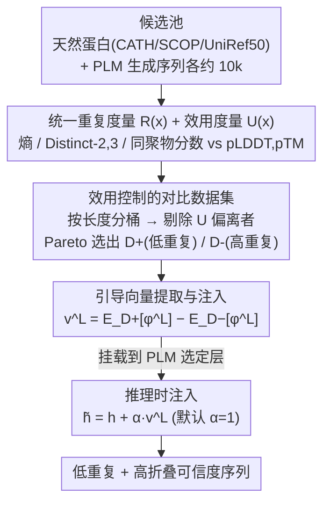

# Controlling Repetition in Protein Language Models

**会议**: ICLR2026  
**arXiv**: [2602.00782](https://arxiv.org/abs/2602.00782)  
**代码**: 待确认  
**领域**: 蛋白质/AI4Science  
**关键词**: 蛋白质语言模型, 重复控制, 对比引导, 表示工程, 序列生成  

## 一句话总结
首次系统性研究蛋白质语言模型（PLM）中的病态重复问题，提出统一的重复度量指标 $R(x)$ 和效用指标 $U(x)$，并设计 UCCS（Utility-Controlled Contrastive Steering）方法，通过在隐层注入与重复解耦的引导向量，在不重训模型的前提下有效抑制重复同时保持折叠可信度。

## 研究背景与动机
1. PLM（如 ESM-3、ProtGPT2）在蛋白质结构预测和从头设计中取得重大进展，但生成时频繁出现病态重复——序列坍缩为冗余 motif 或长同聚物
2. 与自然语言中重复仅降低可读性不同，蛋白质中的重复直接破坏结构多样性，导致折叠不稳定和功能丧失（如 Huntington 病中的 polyQ 扩展）
3. 现有解码策略（temperature、top-p、n-gram penalty）从 NLP 直接迁移，未针对蛋白质设计，且常以降低 AlphaFold pLDDT 为代价
4. 重复与结构效用高度纠缠：朴素降低重复往往同时损害折叠可靠性，需要解耦二者的方法
5. PLM 缺乏显式机制来分离重复与其他生成因素，传统文本重复指标也无法捕获蛋白质特有的退化模式
6. 病态重复作为 PLM 的关键失败模式此前完全被忽视，缺乏正式定义、评估指标和系统研究

## 方法详解

### 整体框架
UCCS 把"抑制重复但别伤折叠"形式化为一个约束优化问题 $\min_f R(f(M,p))$ s.t. $U(f(M,p)) \ge U(M,p) - \epsilon$，即在效用 $U(x)$ 不跌超过容差 $\epsilon$ 的前提下最小化重复度 $R(x)$。整条流水线分三步落地：先建立两套互不混淆的度量，把蛋白质特有的"重复"和"折叠效用"各自量化成标量；再从天然蛋白和 PLM 生成序列里筛出一对"重复差异大、效用对齐"的对比集，从隐层激活中抽出一个只编码重复的引导向量；推理时把这个向量按强度 $\alpha$ 加回选定层的激活即可生效，全程不重训、不改采样策略，对掩码式（MLM）和自回归式（AR-LM）两种 PLM 都能即插即用。

### 关键设计

**1. 统一重复度量：把蛋白质特有的退化模式量化成一个可优化的标量**

文本里的重复指标无法捕获蛋白质特有的两种坍塌——motif 级循环（如 AGAGAG 的短片段重复）和同聚物延伸（如 AAAAAA 的单氨基酸长链），而后者因氨基酸词表小得多，在 PLM 里远比文本常见。所以作者用三个互补信号刻画它们：归一化 token 熵 $H_{\text{norm}}$ 反映全局氨基酸分布是否失衡，Distinct-2/3 捕获局部 motif 循环，同聚物多样性分数 $R_{\text{hpoly}} = 1 - \frac{1}{T}\sum_i \ell_i \cdot \mathbf{1}(\ell_i \ge k)$ 专门惩罚长度 $\ell_i \ge k$（默认 $k=4$）的同聚物坍塌——n-gram 多样性对"重复单个残基"无能为力（单残基重复的 n-gram 重叠度很高却被判为多样），$R_{\text{hpoly}}$ 正好补上这个盲区。三者聚合成统一重复分数 $R(x)$；与之配对的效用分数 $U(x)$ 取 AlphaFold 的 pLDDT 与 pTM 均值，代表折叠可信度。有了这两把彼此独立的尺，"重复"和"效用"才能被分别测量、进而被解耦。

**2. 效用控制的对比数据集：让引导向量只学到重复、不混进折叠能力**

这一步对应框架图里从候选池到 $\mathcal{D}^+/\mathcal{D}^-$ 的环节。难点在于蛋白质中重复和折叠效用天然纠缠——极端重复的生成序列几乎总伴随低结构置信度，如果直接拿高重复和低重复序列做对比，抽出的方向会把"折叠好不好"也一起编码进去，降重复的同时连结构也压垮了。作者的做法是先从天然蛋白（CATH / SCOP / UniRef50）和 ESM-3 / ProtGPT2 生成序列收集候选池，按长度分桶后剔除 $U(x)$ 明显偏离参考均值 $\bar U$ 的序列（先削弱两个维度的内在相关性），再求解 $(\mathcal{D}^+,\mathcal{D}^-)=\arg\max \Delta R$ s.t. $\Delta U \le \epsilon$，用 Pareto 前沿或综合打分挑出一对在重复维度差异最大、却在效用维度对齐的子集 $\mathcal{D}^+$（低重复）与 $\mathcal{D}^-$（高重复）。这一步是整套方法解耦成功的关键：对比集里只剩重复这一个变量在变，后续抽出的向量才不会夹带折叠信号。

**3. 引导向量提取与注入：一次抽取、即插即用地干预生成**

拿到对比集后，对每条序列取层级表示 $\phi^L(x)$——MLM 用全 token 均值池化（契合其双向编码），AR-LM 用末 token 嵌入（其预测信息集中在最后一个 token）以适配两种范式——再算两组均值之差 $v^L = \mathbb{E}_{\mathcal{D}^+}[\phi^L] - \mathbb{E}_{\mathcal{D}^-}[\phi^L]$，得到指向"低重复"的引导向量。推理时在选定层把它加进每个位置的激活 $\tilde{h}_t^L = h_t^L + \alpha \cdot v^L$（默认强度 $\alpha=1$）即可。因为干预发生在表示空间而非解码概率上，UCCS 不必重训、也不依赖具体采样策略，对 MLM 和 AR-LM 都能直接挂载。

### 损失函数 / 训练策略
UCCS 是推理时干预，不修改任何模型参数、不需要训练，只需一次性离线构建对比集并提取引导向量。候选池约 10k 天然蛋白质 + 10k PLM 生成序列，经效用过滤和 Pareto 选择后每个长度桶各保留约 100 条精炼序列。可调超参数仅两个：注入强度 $\alpha$（默认 1）和注入层 $L$。

## 实验关键数据

### 主实验 — ProtGPT2 无条件生成（Table 2a）

| 方法 | R↑ (CATH) | U↑ (CATH) | R↑ (SCOP) | U↑ (SCOP) |
|------|-----------|-----------|-----------|-----------|
| Original | 0.728 | 0.621 ✓ | 0.728 | 0.621 ✓ |
| Repetition Penalty | 0.780 | 0.622 ✓ | 0.780 | 0.622 ✓ |
| **UCCS** | **0.845** | **0.711** ✓ | **0.835** | **0.722** ✓ |

### 消融/条件生成（Table 2b）

| 方法 | R↑ (CATH) | U↑ (CATH) |
|------|-----------|-----------|
| Original | 0.836 | 0.704 ✓ |
| Temperature | 0.847 | 0.700 |
| **UCCS** | **0.877** | **0.743** ✓ |

### 关键发现
- ESM-3 上 UCCS 在 CATH 无条件生成中 $R(x)$ 相对原始模型提升 **+55%**
- ProtGPT2 上 UCCS $R(x)$ 比 temperature sampling 高约 **+20%**，且是唯一在所有数据集和任务上同时满足效用约束的方法
- 条件生成中 UCCS 在 SCOP 上达到 R=0.890（最高值）且 U=0.737 满足约束
- UCCS 生成的蛋白质展现高结构置信度（pLDDT > 90 的蓝色区域主导）和多样折叠
- Neuron Deactivation 和 Probe Steering 方法在部分设置上降低 U 至约束以下，不如 UCCS 稳定
- 消融实验表明 $\alpha$ 在较大范围内稳定，层选择对结果有影响但非极端敏感
- Jensen-Shannon 散度热图确认所提指标能清晰分离 PLM 生成与天然蛋白质分布

## 亮点与洞察
- **首创性**：这是首篇系统性识别、量化并解决 PLM 病态重复问题的工作，填补了该领域的关键空白
- **解耦设计精巧**：通过效用控制的对比集构建，确保引导向量仅编码重复信号而非折叠能力的混杂因素
- **即插即用**：不需要重训模型，仅在推理时注入向量，适用于 MLM 和 AR-LM 两种范式
- **生物学动机充分**：同聚物多样性分数 $R_{\text{hpoly}}$ 的阈值 $k=4$ 有明确的生物学依据（≥4 的同聚物几乎总是低复杂度不稳定区域）

## 局限与展望
- 仅在 ESM-3 和 ProtGPT2 两个模型上验证，未覆盖更大规模的 PLM（如 ESM-2 15B 或 ProGen2）
- $U(x)$ 基于 AlphaFold 置信度而非真实实验验证，折叠可靠性的评估仍有gap
- 引导向量 $v^L$ 的可解释性可进一步研究——目前尚不清楚它在表示空间中精确编码了什么特征
- 对比数据集构建依赖预计算的 $R(x)$ 和 $U(x)$，在新领域蛋白质（如膜蛋白）上可能需要重新标定

## 相关工作与启发
- **vs Repetition Penalty（解码惩罚）**：简单但粗糙，在 ProtGPT2 上 R=0.780 vs UCCS R=0.845，且后者同时大幅提升 U（0.622→0.711）
- **vs Probe Steering**：使用探针训练引导向量，但未控制效用纠缠；在 SCOP 上 R=0.735 且 U=0.619 < 原始值，而 UCCS 为 R=0.835/U=0.722
- **vs Activation Steering（NLP）**：UCCS 将表示引导思想从 NLP 安全/情感领域迁移到蛋白质生成，创新在于效用控制的对比集构建

## 评分
- 新颖性: ⭐⭐⭐⭐⭐ 首次识别并系统解决 PLM 病态重复，问题定义和方法均有开创性
- 实验充分度: ⭐⭐⭐⭐ 两种模型 × 三个数据集 × 两种生成设置，对比全面
- 写作质量: ⭐⭐⭐⭐ 问题动机清晰，指标设计有理有据，结构严谨
- 价值: ⭐⭐⭐⭐ 为 PLM 可靠蛋白质生成提供了实用工具，方法可推广至其他生成退化问题

<!-- RELATED:START -->

## 相关论文

- [\[ICML 2025\] Steering Protein Language Models](../../ICML2025/computational_biology/steering_protein_language_models.md)
- [\[ICLR 2026\] Protein as a Second Language for LLMs](protein_as_a_second_language_for_llms.md)
- [\[ACL 2025\] Concept Bottleneck Language Models For Protein Design](../../ACL2025/computational_biology/concept_bottleneck_language_models_for_protein_design.md)
- [\[ICLR 2026\] Tracing Pharmacological Knowledge in Large Language Models](tracing_pharmacological_knowledge_in_large_language_models.md)
- [\[AAAI 2026\] ProtSAE: Disentangling and Interpreting Protein Language Models via Semantically-Guided Sparse Autoencoders](../../AAAI2026/computational_biology/protsae_disentangling_and_interpreting_protein_language_models_via_semantically-.md)

<!-- RELATED:END -->
