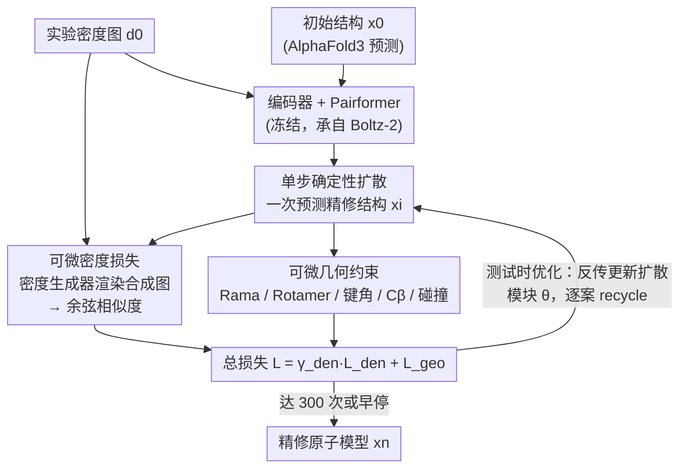

# CryoNet.Refine: A One-step Diffusion Model for Rapid Refinement of Structural Models with Cryo-EM Density Map Restraints

**会议**: ICLR 2026  
**arXiv**: [2602.22263](https://arxiv.org/abs/2602.22263)  
**代码**: [GitHub](https://github.com/kuixu/cryonet.refine)  
**领域**: 结构生物学/冷冻电镜/扩散模型  
**关键词**: cryo-EM, 原子模型精修, 单步扩散, 密度损失, 几何约束, 蛋白质结构

## 一句话总结
提出CryoNet.Refine——首个基于AI的冷冻电镜(cryo-EM)原子模型精修框架：设计单步扩散模型(初始化自Boltz-2权重)→创新可微分密度生成器(物理模拟合成密度图)→首次将密度图相关性作为可微损失函数(余弦相似度)→联合Ramachandran/Rotamer/键角等几何约束损失→测试时优化策略逐案定制→在120个蛋白质/DNA-RNA复合物上全面超越Phenix.real_space_refine(CC_mask 0.59 vs 0.54, Ramachandran favored 98.92%)。

## 研究背景与动机

**Cryo-EM精修瓶颈**：冷冻电镜已成为结构生物学革命性技术，但从密度图到精确原子模型的精修仍是核心瓶颈。传统方法如Phenix.real_space_refine和Rosetta计算昂贵，需专家逐案调参。

**初始模型质量不足**：即使高分辨率密度图，外围和柔性区域常出现低分辨率密度。ModelAngelo等构建工具可能产生碎片化结构、错误残基类型，甚至无法完成建模。精修步骤因此不可或缺。

**传统方法局限**：
   - (1) **计算成本高**：模拟退火+构象空间采样→迭代优化→耗时
   - (2) **依赖专家调参**：权重、约束参数需case-by-case手动调整→学习曲线陡峭
   - (3) **手动精修更费时**：Coot等交互工具虽灵活但极端耗时→高通量结构测定的瓶颈

**现有AI方法的空白**：DeepAccNet、GNNRefine、AtomRefine等AI方法仅从已知结构学习几何特征→不与实验cryo-EM密度图直接耦合→预测结构虽几何合理但不匹配实验数据。**文献中缺乏支持cryo-EM实验数据约束下可微精修的神经网络方法。**

**扩散模型的机遇**：AlphaFold3、RFDiffusion等扩散模型在蛋白质生成中展现卓越能力→能学习几何特征(键长/键角)→但不原生支持实验密度图约束下的精修。将扩散模型的生成能力与cryo-EM密度图约束结合→变革性路径。

**核心洞察**：将密度图拟合和几何约束统一为可微损失函数→端到端驱动扩散模型精修→无需手动调参→自动化+高效+高质量。

## 方法详解

### 整体框架

CryoNet.Refine 接收一张实验 cryo-EM 密度图 $d_0$ 和一份初始原子结构 $x_0$（如 AlphaFold3 的预测），目标是把原子坐标推到既贴合实验密度、又符合立体化学的状态。整个网络由五个模块组成：结构先经 Atom encoder 提取成对特征 $z$、Sequence embedder 编码原子类型 $s$，再用承自 Boltz-2 的 Pairformer 做交叉注意力，随后由单步扩散模块一次性输出精修结构 $x_i$；一个可微密度生成器把 $x_i$ 渲染成模拟密度图，与实验图比对得到密度损失，再叠加几何约束损失，合成总损失 $\mathcal{L} = \gamma_{\text{den}}\,\mathcal{L}_{\text{den}} + \mathcal{L}_{\text{geo}}$ 反传更新。关键的是参数初始化自 Boltz-2 后只让扩散模块可训练（编码器与 Pairformer 全程冻结），并以测试时优化的方式对每个案例单独迭代——固定输入反复 recycle、每轮用损失梯度微调扩散模块权重（最多 300 次 + 早停），相当于为每份结构现场拟合而非套用一个通用模型。

### 关键设计

**1. 单步确定性扩散：从初始结构出发而非从噪声**

像 AlphaFold3 这类扩散模型要从高斯噪声起步、反复去噪数百步才能成型，对"已经有一份大致正确结构、只需微调"的精修场景既浪费又危险——多步随机采样反而会破坏已有的正确部分。CryoNet.Refine 把精修写成一次预条件化的确定性映射 $\hat{\mathbf{x}} = c_{\text{skip}}(\sigma)\,\mathbf{x}_0 + c_{\text{out}}(\sigma)\,\mathcal{F}_\theta\!\left(c_{\text{in}}(\sigma)\mathbf{x}_0,\, c_{\text{noise}}(\sigma),\, \mathcal{C}\right)$，其中 $c_{\text{skip}}, c_{\text{out}}, c_{\text{in}}, c_{\text{noise}}$ 是与噪声水平 $\sigma$ 相关的预条件系数，$\mathcal{F}_\theta$ 是可训练网络。它直接以初始结构（而非噪声）为输入做单步预测，并去掉了 AlphaFold3 里的 MSA 处理和置信度头，转而完全依赖物理密度约束来定方向。后续实验也印证这一取舍：经典 200 步扩散的 CC_mask 只有 0.30，而单步版本达到 0.65。

**2. 可微密度损失：让密度图相关性第一次能反传**

此前的 AI 精修方法只从已知结构学几何特征，与实验密度图完全脱钩，预测出来的结构"看着合理却对不上数据"。本文的关键是把密度匹配做成端到端可微的损失。密度生成器是一个物理模拟器而非神经网络：以每个原子位置为中心叠加高斯球得到合成密度 $\hat{\boldsymbol{\rho}}(\vec{\boldsymbol{m}}, \vec{\mathbf{x}}) = \sum_{i=1}^{N} w_i e^{-k|\vec{\boldsymbol{m}} - \vec{\mathbf{x}}_i|^2}$，其中权重 $w_i$ 取原子序数，宽度 $k = 8 \cdot res / (\pi \cdot v)$ 由分辨率和体素大小决定。合成图与实验图之间用余弦相似度构造损失 $\mathcal{L}_{\text{den}} = 1 - \frac{\hat{\boldsymbol{\rho}} \cdot \boldsymbol{\rho}}{\lVert\hat{\boldsymbol{\rho}}\rVert \cdot \lVert\boldsymbol{\rho}\rVert}$。由于整条链路用 PyTorch 重写，梯度可以一路回传到原子坐标，这也是首次把密度图相关性直接当作可微损失——其平均相关系数 0.892，高于 ChimeraX 的 0.803。

**3. 可微几何约束：把立体化学规则写成可优化项**

光拟合密度容易让原子陷进密度噪声里、产生违反化学常识的构象，因此还需要一组几何损失共同把关：$\mathcal{L}_{\text{geo}} = \gamma_{\text{rama}} \mathcal{L}_{\text{rama}} + \gamma_{\text{rot}} \mathcal{L}_{\text{rot}} + \gamma_{\text{angle}} \mathcal{L}_{\text{angle}} + \gamma_{C_\beta} \mathcal{L}_{C_\beta} + \gamma_{\text{viol}} \mathcal{L}_{\text{viol}}$。其中 Ramachandran 损失依据 Top8000 数据集，惩罚骨架二面角 $\phi, \psi$ 落入异常值区域，守住主链构象；Rotamer 损失约束侧链的 4 个 $\chi$ 角不偏离常见转子；$C_\beta$ 偏差损失把实际 $C_\beta$ 与理想位置偏差超过 0.25Å 的情况记为惩罚；键角损失以键角 RMSD 拉近理想几何；碰撞损失则按 Van der Waals 半径惩罚非键合原子的空间冲突。消融显示这几项缺一不可——去掉 Ramachandran 后骨架 favored 比例从 98.80% 跌到 90.75%，去掉 Rotamer 后侧链 favored 从 98.58% 跌到 94.48%。

**4. 测试时优化：把精修当成一次逐案过拟合**

cryo-EM 每份密度图各不相同，一个训练好的通用模型很难对任意结构都精确贴合。CryoNet.Refine 因此放弃静态推理，把每个案例当成一次小型训练：固定输入 $x_0$，单步前向得到精修结构，在输出上算密度损失与几何损失，再把梯度反传回去——但只更新扩散模块的参数 $\theta$（编码器与 Pairformer 始终冻结），如此循环（recycle）。迭代最多 300 次并配早停（patience 20），收敛呈两阶段：前约 100 次 recycle 的 CC 急剧上升（高敏感期），此后趋于平台（鲁棒收敛期）。这本质上是类似 NeRF 的逐场景过拟合思路，把网络的全部优化容量都集中到贴合当前这张密度图上，也正是它区别于 AlphaFold3「固定权重一次推理」的根本所在。

## 实验关键数据

### 蛋白质复合物精修 (110个案例)

| 指标 | AlphaFold3 | Phenix.real_space_refine | **CryoNet.Refine** |
|------|-----------|------------------------|-------------------|
| CC_mask ↑ | 0.38 | 0.54 | **0.59** |
| CC_box ↑ | 0.41 | 0.53 | **0.57** |
| CC_mc ↑ | 0.40 | 0.55 | **0.60** |
| CC_sc ↑ | 0.39 | 0.55 | **0.58** |
| CC_peaks ↑ | 0.27 | 0.40 | **0.45** |
| CC_volume ↑ | 0.42 | 0.55 | **0.60** |
| Angle RMSD (°) ↓ | 1.58 | 0.72 | **0.36** |
| Rama favored (%) ↑ | 95.73 | 96.39 | **98.92** |
| Rama outlier (%) ↓ | 0.82 | 0.02 | 0.06 |
| Rotamer favored (%) ↑ | 97.08 | 85.42 | **98.64** |
| Rotamer outlier (%) ↓ | 1.08 | 1.15 | **0.49** |

### DNA/RNA-蛋白质复合物精修 (10个案例)

| 指标 | AlphaFold3 | Phenix.real_space_refine | **CryoNet.Refine** |
|------|-----------|------------------------|-------------------|
| CC_mask ↑ | 0.40 | 0.57 | **0.65** |
| CC_box ↑ | 0.49 | 0.61 | **0.67** |
| CC_sc ↑ | 0.42 | 0.58 | **0.67** |
| CC_peaks ↑ | 0.35 | 0.51 | **0.60** |
| CC_volume ↑ | 0.48 | 0.61 | **0.69** |

### 消融实验 (27个蛋白质复合物)

| 配置 | CC_mask | Rama favored | Rot favored |
|------|---------|-------------|-------------|
| 去掉密度损失 $\gamma_{\mathrm{den}}=0$ | 0.41 (↓35%) | 99.09% | 98.67% |
| 去掉Ramachandran $\gamma_{\mathrm{rama}}=0$ | 0.65 | 90.75% (↓) | 98.64% |
| 去掉Rotamer $\gamma_{\mathrm{rot}}=0$ | 0.64 | 99.22% | 94.48% (↓) |
| **CryoNet.Refine (完整)** | **0.65** | **98.80%** | **98.58%** |

### vs 经典多步扩散 (200步) vs 直接数值优化

| 方法 | CC_mask | Angle RMSD |
|------|---------|-----------|
| 经典200步扩散 | 0.30 | 1.66° |
| 直接SGD坐标优化 | 0.46 | **0.27°** |
| **CryoNet.Refine (单步)** | **0.65** | 0.54° |

## 关键发现

1. **密度损失是核心驱动力**：去掉密度损失后CC_mask从0.65暴跌至0.41（降幅>35%）→密度约束是准确密度图拟合的必要条件。

2. **单步扩散远优于多步**：经典200步扩散CC_mask仅0.30→随步数增加CC值单调下降→因为输入已是完整结构(非噪声)→多步采样反而破坏结构。

3. **扩散模型的生成能力不可替代**：直接SGD坐标优化虽几何指标极好(Angle RMSD 0.27°)但CC_mask仅0.46→陷入局部最小值→无法遍历构象空间找到全局最优。扩散模型的探索能力是平衡密度拟合与几何合理性的关键。

4. **几何约束互补不可缺**：Ramachandran约束保护骨架构象(去掉后favored从98.80%降至90.75%)；Rotamer约束保护侧链堆积(去掉后favored从98.58%降至94.48%)→三类损失协同。

5. **收敛行为分两阶段**：前100次recycle CC值急剧上升（高敏感期）→100次后趋于平台（鲁棒收敛期）→300次迭代+早停提供足够安全边际。

6. **运行效率有竞争力**：在120个复合物中54.2%的案例CryoNet.Refine比Phenix更快→尤其大型复合物优势明显（Phenix仅支持CPU）。

## 亮点与洞察

- **"首次"三连**：首个AI-based cryo-EM精修方法 + 首个可微分密度生成器 + 首次密度图相关性作为损失函数→填补了neural network精修与实验数据之间的关键空白。
- **测试时优化范式**：不是学一个通用模型然后推理→而是对每个案例做迭代优化→类似NERF的思路→适合cryo-EM精修这种"每个案例都独特"的场景。
- **物理模拟+神经网络融合**：密度生成器是物理模拟器（高斯球）而非神经网络→但用PyTorch实现使其可微→物理先验与学习能力的优雅结合。
- **统一框架**：同一框架处理蛋白质和DNA/RNA-蛋白质复合物→现有AI精修方法多限于纯蛋白质。

## 局限性

1. **逐案优化成本**：测试时优化策略意味着每个案例需独立训练→虽单次recycle较快但总体仍需几百次迭代→未来需并行精修框架和更快收敛策略。
2. **核酸几何约束缺失**：当前未实现DNA/RNA特定的立体化学约束→核酸精修仅依赖密度损失→几何质量可能不足。
3. **模拟密度图的局限**：高斯球物理模拟无法捕捉真实实验条件引入的伪影/噪声/二级结构密度特征→未来需深度学习密度生成器。
4. **缺乏碰撞损失的充分评估**：虽有violation loss但论文未详细评估其对空间冲突的效果。

## 相关工作对比

| 维度 | Phenix.real_space_refine | DeepAccNet/GNNRefine | CryoNet.Refine |
|------|------------------------|---------------------|----------------|
| 方法类型 | 传统优化（模拟退火+采样） | AI预测（GNN/3D CNN） | AI精修（单步扩散+测试时优化） |
| 密度图约束 | ✅ 直接使用但非可微 | ❌ 不使用实验密度图 | ✅ 首次可微密度损失 |
| 几何约束 | ✅ 静态约束库 | ✅ 从数据学习 | ✅ 可微几何损失 |
| 自动化程度 | 中（需调参） | 高 | 高（全自动） |
| 适用范围 | 蛋白质+核酸 | 仅蛋白质 | 蛋白质+DNA/RNA复合物 |
| 计算效率 | 慢（CPU-only） | 快 | 中等（GPU, 54%案例更快） |

| 维度 | AlphaFold3/RFDiffusion | CryoNet.Refine |
|------|----------------------|----------------|
| 任务 | 结构预测/设计（从噪声生成） | 结构精修（从初始模型优化） |
| 扩散步数 | 多步随机去噪（~200步） | 单步确定性预测 |
| 实验数据 | ❌ 不使用 | ✅ cryo-EM密度图约束 |
| 优化策略 | 固定权重推理 | 测试时优化（每案例更新参数） |

## 评分
- 新颖性: ⭐⭐⭐⭐⭐ 首个AI cryo-EM精修+可微密度损失+单步扩散精修→多个"first"
- 实验充分度: ⭐⭐⭐⭐ 120案例benchmark+多消融+对比数值优化/多步扩散，但缺乏与更多AI方法的对比
- 写作质量: ⭐⭐⭐⭐ 方法描述清晰，动机论证充分
- 价值: ⭐⭐⭐⭐⭐ 填补cryo-EM AI精修空白，对结构生物学社区直接重大影响

<!-- RELATED:START -->

## 相关论文

- [\[CVPR 2026\] CryoHype: Reconstructing a Thousand Cryo-EM Structures with Transformer-Based Hypernetworks](../../CVPR2026/computational_biology/cryohype_reconstructing_a_thousand_cryo-em_structures_with_transformer-based_hyp.md)
- [\[NeurIPS 2025\] One Small Step with Fingerprints, One Giant Leap for De Novo Molecule Generation from Mass Spectra](../../NeurIPS2025/computational_biology/one_small_step_with_fingerprints_one_giant_leap_for_de_novo_molecule_generation_.md)
- [\[ICCV 2025\] CryoFastAR: Fast Cryo-EM Ab initio Reconstruction Made Easy](../../ICCV2025/computational_biology/cryofastar_fast_cryoem_ab_initio_reconstruction_made_easy.md)
- [\[CVPR 2026\] CryoKRAQEN: Kernel-Regularized Annealing for Quantized Embedding Networks in Cryo-EM Heterogeneous Reconstruction](../../CVPR2026/computational_biology/cryokraqen_kernel-regularized_annealing_for_quantized_embedding_networks_in_cryo.md)
- [\[ICLR 2026\] Fine-Tuning Diffusion Models via Intermediate Distribution Shaping](fine-tuning_diffusion_models_via_intermediate_distribution_shaping.md)

<!-- RELATED:END -->
