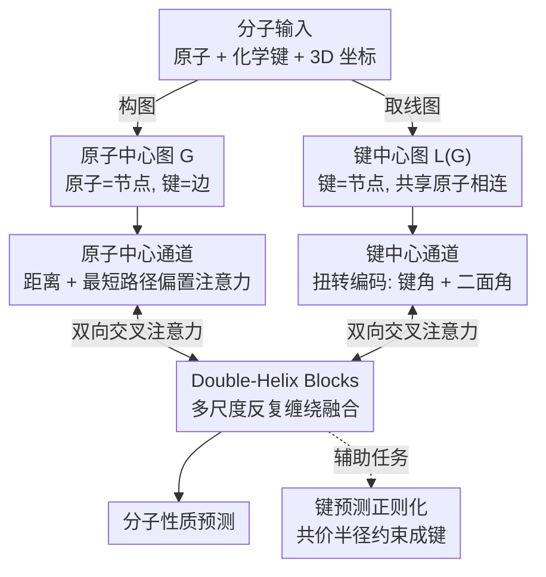

# Enhancing Molecular Property Predictions by Learning from Bond Modelling and Interactions

**会议**: ICLR 2026  
**arXiv**: [2603.00568](https://arxiv.org/abs/2603.00568)  
**代码**: 有  
**领域**: 自监督学习 / 分子表征学习 / 图神经网络  
**关键词**: molecular representation, dual-graph, bond modeling, GNN, property prediction

## 一句话总结
提出 DeMol 双图增强多尺度交互框架，通过并行的原子中心图和键中心图通道以及 Double-Helix Blocks 显式建模原子-原子、原子-键、键-键三类交互，在 PCQM4Mv2、OC20、QM9 等基准上取得 SOTA。

## 研究背景与动机

**领域现状**：分子表征学习主流方法基于 GNN，将分子建模为图（原子=节点，键=边），近期方法进一步利用 3D 几何信息（距离、角度）来增强预测。

**现有痛点**：现有方法是"原子中心"的，化学键只被当作原子间的成对交互。但键本身携带丰富信息（键级、长度、杂化态），且键与键之间存在非加性交互（如苯环的离域 π 电子系统、顺铂/反铂的构型差异直接决定药效）。

**核心矛盾**：单图模型无法同时充分编码原子的拓扑关系和键的几何关系（二面角、键角），导致预测精度受限。

**本文目标** 显式建模化学键信息及键间交互，构建原子-键双通道融合框架。

**切入角度**：信息论分析证明键中心图（line graph）包含原图不具备的额外结构信息（Proposition 1），双图表示严格保留更多互信息（Proposition 2）。

**核心 idea**：用双图（原子图+键图）并行编码分子，通过 Double-Helix Blocks 在多尺度上融合两个通道的信息，同时用共价半径正则确保几何一致性。

## 方法详解

### 整体框架
DeMol 想解决的核心问题是：主流分子模型都是"原子中心"的，把化学键退化成原子间的一条边，丢掉了键本身的丰富信息和键-键之间的非加性交互。它的办法是同时维护两张图——原子中心图 $\mathcal{G}$（原子为节点、键为边）和它的线图（line graph）键中心图 $\mathcal{L}(\mathcal{G})$（键为节点、共享同一原子的两条键相连）。两张图各自有一条 Transformer 编码通道：**原子中心通道**负责拓扑与空间关系，**键中心通道**负责键级几何（键角、二面角）；两条通道在中途由 **Double-Helix Blocks** 反复做跨通道信息交换，同时一项**键预测正则化**用共价半径把几何表示拉回化学合理区间，最后把融合后的表示送去预测分子性质。整套设计的理论依据来自论文的几个 Proposition：键中心图携带原图不具备的额外结构信息，双图表示严格保留更多互信息，而最终的预测能力正来自两个表示的有效融合。

### 关键设计

**1. 原子中心通道：把空间和拓扑信息塞进注意力偏置**

这条通道处理原子级特征和原子间关系，本质是一个带结构编码的 Transformer。它把两类先验当作自注意力的偏置项注入：3D 原子间距离经高斯基核展开、2D 图上的最短路径距离编码拓扑邻近度，二者叠加到注意力分数上再更新原子嵌入。这样做既捕获了几何（谁离谁近）又捕获了拓扑（谁和谁相连），而且偏置式注入让它能直接兼容 Transformer-M 这类现有原子中心方法的设计。

**2. 键中心通道：在键的天然域里建模键-键几何**

原子通道天生不擅长表达键角、二面角这类"键之间"的关系，而键中心图恰恰是表示这类几何关系的天然域（Proposition 3）——在线图里键变成节点，共享原子的键彼此相连，键-键关系直接成了一阶邻接。这条通道最关键的创新是**扭转编码** $\Phi_b^{tors}$：它把键角 $\theta_{ijk}$（两条相邻键的夹角）和二面角 $\varphi_{ijkl}$（四原子构型的扭转角）同样用高斯基核编码成注意力偏置，加进键节点之间的自注意力。正因为有这条通道，苯环的离域 π 系统、顺铂/反铂的构型差异这类"原子组成相同、靠键几何区分"的信息才能被显式建模。

**3. Double-Helix Blocks：让两条通道像双螺旋一样反复缠绕融合**

光有两条独立通道还不够——Proposition 2 指出预测能力来自两个表示的**有效融合**，而非简单拼接。Double-Helix Blocks 用双向交叉注意力实现这一点：原子嵌入作为 query 去查询键嵌入，键嵌入反过来也查询原子嵌入，两个方向在多个尺度上交替进行。这样原子级表示能借到键的几何细节、键级表示能借到原子的拓扑上下文，两条信息流像双螺旋一样在网络深处不断交换，而不是各编各的、最后才草草相加。

**4. 键预测正则化：用共价半径把几何拉回化学合理区间**

为了防止学到的结构表示偏离真实化学，模型额外加了一项基于共价半径的键预测任务：根据原子对的距离和共价半径约束，预测它们之间是否应当成键。这相当于给几何表示加了一道化学先验的"护栏"，保证网络内部学到的结构与化学上合理的成键模式一致，而不是单纯拟合标签。

### 损失函数 / 训练策略
训练目标由三部分组成：任务相关的主损失（如性质回归的 MAE 损失）、上面共价半径键预测正则项、以及一个结构感知的掩码策略以提高训练效率。

## 实验关键数据

### 主实验：PCQM4Mv2

| 模型 | 参数量 | MAE↓ |
|------|--------|------|
| GPS++ | 44.3M | 0.0778 |
| Transformer-M | 69M | 0.0772 |
| Unimol+ | 77M | 0.0693 |
| TGT-At | 203M | 0.0671 |
| **DeMol** | **186M** | **0.0603** |

### OC20 IS2RE 验证集

| 模型 | 平均能量MAE(eV)↓ | 平均EwT(%)↑ |
|------|------|------|
| Unimol+ | 0.4088 | 8.61 |
| TGT-At | 0.4030 | 8.82 |
| **DeMol** | **0.3879** | **9.23** |

### 消融实验

| 配置 | 说明 |
|------|------|
| 仅原子通道 | 性能降低，缺失键信息 |
| 无Double-Helix | 性能降低，通道间无融合 |
| 无扭转编码 | 性能降低，缺失键角/二面角 |
| Full DeMol | 0.0603，完整模型最优 |

### 关键发现
- 比上一个 SOTA（TGT-At）提升 10.1%，且使用单模型而非集成
- 在 OC20 IS2RE 的 OOD 场景中表现稳定，泛化能力强
- 键中心通道中的扭转编码贡献显著

## 亮点与洞察
- 信息论分析为双图设计提供严格理论支撑：4个 Proposition 从不同角度论证
- 顺铂/反铂的例子极为直观——相同原子组成、不同键构型、药效天差地别
- Double-Helix Blocks 可迁移到其他多视图融合场景

## 局限与展望
- 模型参数量较大（186M），训练成本高
- 主要在小分子/材料上验证，大分子适用性待探索
- 信息论分析是必要条件，不保证网络充分利用

## 相关工作与启发
- **vs Transformer-M**: 只在原子图上集成 3D 距离编码，DeMol 额外引入键中心通道
- **vs ALIGNN**: 用 line graph 做消息传递但没有原子-键交叉注意力
- **vs GemNet**: 编码二面角但仍在原子空间操作

## 评分
- 新颖性: ⭐⭐⭐⭐ 双图+信息论动机+Double-Helix融合是新颖组合
- 实验充分度: ⭐⭐⭐⭐⭐ 覆盖4个主流基准，全面SOTA
- 写作质量: ⭐⭐⭐⭐ 理论分析扎实，示例直观
- 价值: ⭐⭐⭐⭐ 对分子表征学习有重要推动

<!-- RELATED:START -->

## 相关论文

- [\[ICLR 2026\] Learning Molecular Chirality via Chiral Determinant Kernels](learning_molecular_chirality_via_chiral_determinant_kernels.md)
- [\[NeurIPS 2025\] FGBench: A Dataset and Benchmark for Molecular Property Reasoning at Functional Group-Level in Large Language Models](../../NeurIPS2025/computational_biology/fgbench_a_dataset_and_benchmark_for_molecular_property_reasoning_at_functional_g.md)
- [\[CVPR 2026\] Coordinate Denoising for Non-Equilibrium Molecular Representation Learning](../../CVPR2026/computational_biology/coordinate_denoising_for_non-equilibrium_molecular_representation_learning.md)
- [\[ICLR 2026\] A Genetic Algorithm for Navigating Synthesizable Molecular Spaces](a_genetic_algorithm_for_navigating_synthesizable_molecular_spaces.md)
- [\[ICLR 2026\] DistMLIP: A Distributed Inference Platform for Machine Learning Interatomic Potentials](distmlip_a_distributed_inference_platform_for_machine_learning_interatomic_poten.md)

<!-- RELATED:END -->
