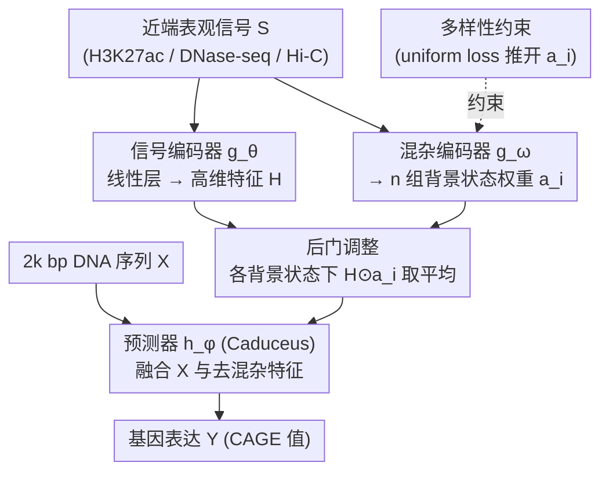

# Extending Sequence Length is Not All You Need: Effective Integration of Multimodal Signals for Gene Expression Prediction

**会议**: ICLR 2026  
**arXiv**: [2602.21550](https://arxiv.org/abs/2602.21550)  
**代码**: [https://github.com/yangzhao1230/Prism](https://github.com/yangzhao1230/Prism)  
**领域**: 计算生物
**关键词**: 基因表达预测, 表观基因组信号, 因果推断, 后门调整, 混杂变量

## 一句话总结
挑战基因表达预测中"越长越好"的长序列建模范式，发现当前 SSM 模型本质上只利用近端信息；进而识别出背景染色质信号（DNase-seq/Hi-C）作为混杂变量引入虚假关联，提出 Prism 框架通过后门调整去混杂，仅用 2k 短序列即超越 200k 长序列的 SOTA。

## 研究背景与动机

**领域现状**：基因表达预测旨在从 DNA 序列预测 mRNA 表达水平（CAGE值）。主流方法关注扩展输入序列长度以捕获远端增强子（可能在数十万碱基对之外），常用 SSM（如 Caduceus, Mamba）实现线性复杂度的长序列建模。同时越来越多方法引入多模态表观基因组信号（H3K27ac、DNase-seq、Hi-C）提供细胞类型特异性信息。

**现有痛点**：(a) SSM 的固定大小隐藏状态难以记忆超长序列的全部信息，且存在"近期偏差"；实验显示 Caduceus 在序列超过 2k 后性能持续下降，Seq2Exp（200k训练）截短到 2.5k 测试性能几乎不变。(b) 现有方法对多模态表观基因组信号仅做简单拼接，忽略了不同信号的生物学角色差异。

**核心矛盾**：不同表观基因组信号扮演不同角色——H3K27ac 直接标记活性调控元件（"前景信号"），而 DNase-seq/Hi-C 反映背景染色质状态（"背景信号"）。模型在训练时会对背景信号产生过度依赖（移除后性能骤降），但背景信号本身对性能的独立贡献很小。这种不对称表明模型学到了虚假关联：开放染色质区域往往与高表达共现，但基因表达可以在低可及性区域独立发生。

**本文目标** (a) 证明长序列建模对当前技术工具并不有效；(b) 识别并消除背景染色质信号引入的混杂效应；(c) 用短序列+正确的多模态信号整合达到 SOTA。

**切入角度**：用因果推断框架看待多模态信号融合——将背景染色质状态建模为混杂变量 $C$，通过后门调整（backdoor adjustment）切断 $H \leftarrow C \rightarrow Y$ 路径，只保留直接因果效应 $H \rightarrow Y$。

**核心 idea**：不要盲目延长序列，而应正确整合近端表观基因组信号——通过因果去混杂处理不同信号的角色差异。

## 方法详解

### 整体框架
Prism 只吃以 TSS 为中心的 2k bp DNA 序列 $X$ 和近端多模态表观基因组信号 $S$（H3K27ac、DNase-seq、Hi-C），核心是在融合信号时做一次因果去混杂。整篇论文的逻辑是"先诊断、再下药"：前两个设计是诊断——用控制实验证明长序列无效、再用结构因果模型把"信号该怎么融合"形式化成"该怎么去混杂"；后两个设计是 Prism 架构本身。运行时，信号编码器 $g_\theta$ 把 $S$ 映射成高维特征 $H$，混杂编码器 $g_\omega$ 从 $S$ 学出 $n$ 组刻画不同背景染色质状态的权重 $\{a_1,\dots,a_n\}$，预测器 $h_\phi$（基于 Caduceus）在这些背景状态下对 $H$ 做后门调整（边缘化干预）后再与 $X$ 一起预测表达量 $Y$；多样性约束在训练时把 $n$ 组权重推开，保证不同背景状态真有区分度。

### 关键设计

**1. 长序列无效性的实证分析：先证明"越长越好"是个假象**

整个领域都在堆序列长度去捕获远端增强子，但本文用两个控制实验戳破了这一前提。其一，Caduceus 这类 SSM 的性能在序列长度超过 2k 之后不升反降——固定大小的隐藏状态根本记不住超长序列的全部信息，还带着天然的"近期偏差"。其二，Seq2Exp 虽然在 200k 上训练且性能不掉，但把它的输入截短到 2.5k 再测试，性能几乎纹丝不动，说明它训练时学到的有效信息其实全集中在近端。两个证据合起来表明：当前技术工具下，长序列建模并没有真正兑现远端调控的承诺，注意力应该从"延长序列"转回"被忽视的近端信号整合"。

**2. 结构因果模型（SCM）：把信号融合问题翻译成因果推断问题**

为什么简单拼接多模态信号会出问题？本文用一张因果图给出形式化解释。图里有三个变量：高维表观基因组特征 $H$、基因表达 $Y$、以及背景染色质状态 $C$。$H$ 与 $Y$ 之间存在两条通路——$H \rightarrow Y$ 是真正的直接调控效应，而 $H \leftarrow C \rightarrow Y$ 是一条经由背景状态的混杂路径。标准训练直接优化 $P(Y|H)$，等于把这两条路径混在一起学，于是模型对 DNase-seq/Hi-C 这类背景信号产生了过度依赖（移除后性能骤降），尽管它们的独立贡献很小。识别出这条混杂路径，就把"该怎么融合信号"变成了"该怎么去混杂"，为后面的干预提供了理论靶点。

**3. 混杂编码器 + 后门调整：用数据驱动的方式切断混杂路径**

要切断 $H \leftarrow C \rightarrow Y$，朴素做法是按生物学先验直接删掉某些信号，但这太粗糙。本文改用后门调整：混杂编码器 $g_\omega$ 从原始信号 $S$ 学出 $n$ 组权重向量 $\{a_1, \dots, a_n\}$，每组刻画一种可能的背景染色质状态，把"未观测的混杂"显式参数化成一组可枚举的状态。预测时不再用单一的 $H$，而是在每种背景状态下各做一次干预再取平均：

$$P(Y|X, do(H)) = \frac{1}{n} \sum_{i=1}^{n} h_\phi(X, H \odot a_i)$$

这相当于对背景状态做边缘化，让预测器 $h_\phi$ 在"控制住 $C$"的条件下只学 $H$ 对 $Y$ 的直接效应。好处是不依赖任何过度简化的生物学假设，背景状态完全从数据里学出来。

**4. 多样性约束：防止 $n$ 组权重坍缩成同一个**

后门调整要有效，前提是 $n$ 组权重真的覆盖了不同的背景状态；如果它们都收敛到同一个模式，干预就退化成普通预测。为此加入一个 uniform loss 惩罚权重向量两两之间的相似度：

$$\mathcal{L}_3 = \log\Big(\sum_{i,j} \exp(2t \cdot \tilde{a}_i^T \tilde{a}_j - 2t)\Big)$$

它把归一化后的权重向量在特征空间里推开，逼着每组权重强调不同的信号组合——比如一组侧重染色质可及性、另一组侧重 3D 染色质组织，从而让学到的背景状态真正具有多样性。

### 损失函数 / 训练策略

总损失 $\mathcal{L} = \mathcal{L}_1 + \alpha \mathcal{L}_2 + \beta \mathcal{L}_3$：
- $\mathcal{L}_1$：标准预测损失（Huber loss），直接用 $H$ 预测 $Y$
- $\mathcal{L}_2$：干预正则化，在不同背景状态下的平均预测与 $Y$ 的 Huber loss
- $\mathcal{L}_3$：多样性损失，确保权重向量互不相同

信号编码器 $g_\theta$ 为简单线性层，混杂编码器 $g_\omega$ 为轻量 1D-CNN，仅增加 11K 参数。

## 实验关键数据

### 主实验

在 K562 和 GM12878 两种细胞系上预测 CAGE 值，对比 9 种方法：

| 方法 | K562 MSE↓ | K562 Pearson↑ | GM12878 MSE↓ | GM12878 Pearson↑ |
|------|------|------|------|------|
| Enformer (200k) | 0.2920 | 0.7961 | 0.2889 | 0.8327 |
| Caduceus (200k) | 0.2197 | 0.8475 | 0.2124 | 0.8819 |
| Seq2Exp-soft (200k) | 0.1856 | 0.8723 | 0.1873 | 0.8951 |
| **Prism (2k)** | **0.1789** | **0.8751** | **0.1759** | **0.9016** |

Prism 用 2k 序列超越了所有使用 200k 序列的方法。

### 消融实验

| 配置 | K562 MSE↓ | 说明 |
|------|---------|------|
| $n=0$（无去混杂） | 0.1863 | 退化为标准训练 |
| $n=1$ | 0.1891 | 单一背景状态不够 |
| $n=2$（默认） | 0.1789 | 平衡性能与效率 |
| $n=4$（最优） | **0.1762** | 更多状态更好但边际递减 |
| $\alpha=0$（无干预损失） | 退化 | 验证干预正则化的必要性 |
| $\beta$ 敏感性 | 0.1~1.0 均稳定 | 多样性约束很鲁棒 |

### 关键发现
- 长序列建模的"皇帝的新衣"：Seq2Exp 训练 200k 但只用 2.5k 的近端信息，长序列不仅无益反而可能有害
- H3K27ac（前景信号）贡献最大，单独使用已接近全信号；但背景信号被简单拼接后会引入虚假关联
- 学到的权重向量呈现有意义的生物学模式：基因间有结构相似性（如"激活态" vs "抑制态"），基因内有多样性
- Prism 仅增加 11K 参数（vs Seq2Exp 增加 500K+），极其轻量

## 亮点与洞察
- **反直觉的核心发现**：在一个所有人都追求更长序列的领域，用严谨的实验证明短序列+好的信号整合更有效。这种"做减法"的思路非常有价值
- **因果推断框架迁移**：将 CV 领域的去混杂方法（Qiang et al. 2022 的背景去混杂）迁移到基因组学，连接了两个看似无关的领域。后门调整的思路可迁移到任何多源信号融合中存在前景/背景混杂的场景
- **极低参数开销**：仅 11K 额外参数获得 SOTA，说明问题的关键不在模型容量而在建模方式——这一洞察对整个领域有启示意义
- **可视化验证因果假说**：权重向量的可视化清晰展示了"激活态/抑制态"的互补模式，为因果框架提供了直觉支持

## 局限与展望
- 仅在两种细胞系（K562, GM12878）上验证，缺乏跨组织/跨物种的泛化性评估
- 混杂变量定义为"背景染色质状态"较为抽象，缺乏直接的生物学验证——学到的权重是否真的对应已知的染色质状态（如 ChromHMM 的 15 种状态）？
- 近端表观基因组信号通过染色质环反映远端调控的假说虽然合理，但未提供直接的实验证据
- $n$（背景状态数）仍需手动调节，且最优值（4）与默认值（2）不同
- 当更强的长序列模型出现时（如未来的 SSM 改进），该结论是否仍然成立？

## 相关工作与启发
- **vs Seq2Exp**: Seq2Exp 用可学习 mask 在 200k 序列上筛选重要区域+简单信号拼接。本文证明其实质只用了近端信息，且信号拼接引入混杂。Prism 用短序列+去混杂更简洁有效
- **vs EPInformer**: EPInformer 基于 ABC 模型用 DNase-seq 峰值定位候选调控区域。本文指出 DNase-seq 是背景信号，直接使用可能引入混杂
- **vs Enformer**: Enformer 做 128x 下采样丢失单核苷酸分辨率，在基因表达专门任务上不如保持单碱基分辨率的方法
- **因果思路的通用性**：后门调整去混杂的思路可迁移到其他多模态融合场景——任何时候不同模态信号有"前景/背景"性质差异时，都可能存在类似的混杂问题

## 评分
- 新颖性: ⭐⭐⭐⭐ 因果去混杂框架在基因组学中的应用新颖，但方法本身来自 CV 领域
- 实验充分度: ⭐⭐⭐⭐ 消融/敏感性分析充分，但仅两种细胞系
- 写作质量: ⭐⭐⭐⭐⭐ 动机展开层层递进，实验设计精巧，反直觉的核心发现论证严密
- 价值: ⭐⭐⭐⭐ 对基因表达预测领域有重要启示，方法简洁实用

<!-- RELATED:START -->

## 相关论文

- [\[NeurIPS 2025\] Is Sequence Information All You Need for Bayesian Optimization of Antibodies?](../../NeurIPS2025/computational_biology/is_sequence_information_all_you_need_for_bayesian_optimization_of_antibodies.md)
- [\[CVPR 2026\] From Spots to Pixels: Dense Spatial Gene Expression Prediction from Histology Images](../../CVPR2026/computational_biology/from_spots_to_pixels_dense_spatial_gene_expression_prediction_from_histology_ima.md)
- [\[AAAI 2026\] HiFusion: Hierarchical Intra-Spot Alignment and Regional Context Fusion for Spatial Gene Expression Prediction from Histopathology](../../AAAI2026/computational_biology/hifusion_hierarchical_intra-spot_alignment_and_regional_context_fusion_for_spati.md)
- [\[ICLR 2026\] Controllable Sequence Editing for Biological and Clinical Trajectories](controllable_sequence_editing_for_biological_and_clinical_trajectories.md)
- [\[ICLR 2026\] Zatom-1: A Multimodal Flow Foundation Model for 3D Molecules and Materials](zatom-1_a_multimodal_flow_foundation_model_for_3d_molecules_and_materials.md)

<!-- RELATED:END -->
