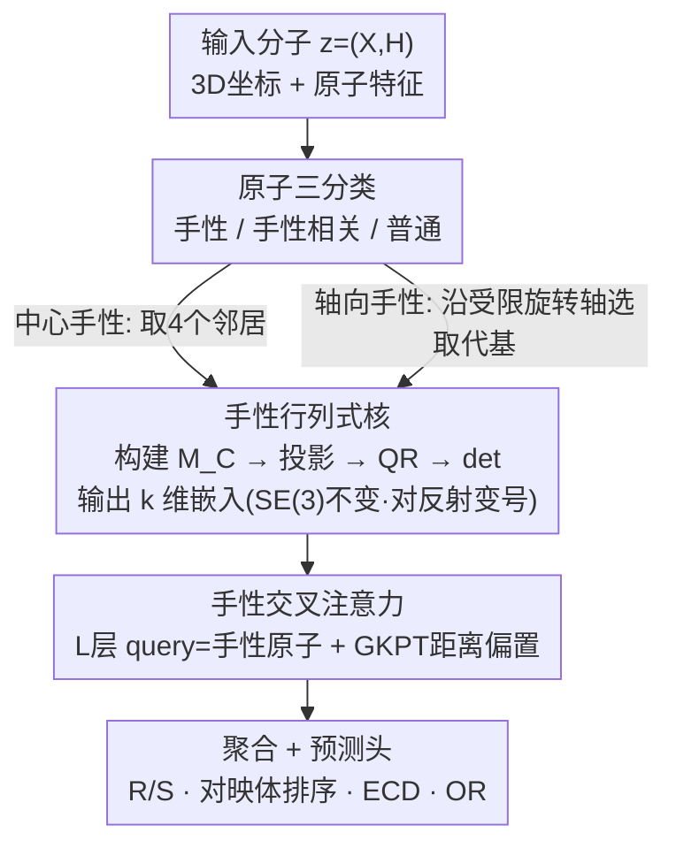

# Learning Molecular Chirality via Chiral Determinant Kernels

**会议**: ICLR2026  
**arXiv**: [2602.07415](https://arxiv.org/abs/2602.07415)  
**代码**: 待确认  
**领域**: 计算生物
**关键词**: 分子手性, 手性行列式核, 等变图神经网络, 轴向手性, SE(3)不变性  

## 一句话总结
提出手性行列式核(ChiDeK)来编码 SE(3) 不变的手性矩阵，首次在 GNN 框架中统一处理中心手性和轴向手性，结合交叉注意力传播立体化学信息，在新构建的轴向手性基准上准确率提升 >7%。

## 研究背景与动机
- 手性(chirality)是药物化学的核心概念：对映异构体化学式相同但3D结构互为镜像，生物活性可能截然不同（经典案例：沙利度胺的R构型为镇静剂、S构型致畸）
- 现有GNN分子表征方法主要关注**中心手性**（四面体碳），但**轴向手性**（因联苯键等受限旋转产生）在药物化学中同样重要且更难建模
- 传统方法用CIP规则（R/S标记）或手性体积来编码手性，存在两个问题：
  1. 仅处理中心手性，忽略轴向手性
  2. 手性体积(chiral volume)是SE(3)不变的标量，信息量有限
- 需要一个统一框架同时捕获两种手性并保持SE(3)不变性

## 方法详解

### 整体框架
ChiDeK 把一个分子表示成 $\bm{z} = (\bm{X}, \bm{H})$（3D 坐标加原子特征），先按原子在立体化学中扮演的角色分成手性原子 $\mathcal{I}_c$、手性相关原子 $\mathcal{I}_r$ 和普通原子 $\mathcal{I}_n$ 三类，再由 Chiral Encoder 用行列式核为每个手性原子算出一段 SE(3) 不变的立体化学嵌入，最后用一个以手性原子为 query、其余原子为 key/value 的 Chiral Transformer 把这段手性信息扩散到整张图后送入预测头。核心创新都集中在“怎么用行列式把手性编码成既不变又能区分镜像的向量”，以及如何用同一套数学同时覆盖中心手性与轴向手性这两步上。

### 关键设计

**1. 手性行列式核：把手性写成 SE(3) 不变、对反射变号的向量**

传统做法用 CIP 规则的 R/S 符号或单个手性体积标量来表示手性，前者只是离散标签丢掉了几何信息，后者只有一维、信息量太薄。ChiDeK 先为手性原子 $i$ 取它的 4 个取代基坐标拼成 $3\times3$ 的手性矩阵 $\bm{M}_C(i)$，再用一组可学习投影 $\bm{W}\in\mathbb{R}^{k\times d_p\times 3}$ 把它变换后做 QR 分解，取上三角阵的行列式 $\det(\bm{R})$ 当特征。关键性质是 $\det(\bm{R}) = \alpha(\bm{W})\cdot P_C(i)$，即它正比于原始手性积 $P_C(i)$：旋转平移分子时不变（SE(3) 不变），但取镜像时符号翻转，因此天生能区分对映体——这正是 DimeNet 一类只用距离/角度的 E(3) 不变模型做不到的。用 $k$ 个核就得到 $k$ 维嵌入，比单标量手性体积丰富了 $k$ 倍。

**2. 用同一套数学统一中心手性与轴向手性：把轴向手性也塞进行列式框架**

中心手性来自四面体碳，轴向手性来自联苯键等受限旋转，过去这两类要分别建模、轴向手性几乎没人碰。ChiDeK 发现只要换一种方式选“构成手性矩阵的四个点”，就能用完全相同的 $\bm{M}_C$ 公式覆盖两者：中心手性以四面体中心原子为核心、取它的 4 个邻居；轴向手性以旋转受限键为轴、在键两侧各取最近的取代基原子。两种手性共享同一组行列式核与同一证明，因此模型不需要为轴向手性新增任何专用模块，这也是它能首次系统建模轴向手性的根本原因。

**3. 手性交叉注意力：让手性信号从手性中心扩散到全分子**

手性虽然定义在局部原子上，但它会影响整个分子的性质（如 ECD 谱、旋光角），只编码在手性中心而不传播出去会限制表达力。ChiDeK 让手性原子嵌入做 query，把手性相关原子和普通原子分别投影成 key/value，做交叉注意力；注意力里额外加一个 GKPT（Gaussian Kernel with Pair Type）距离偏置，按原子对类型（手性–手性相关、手性–普通）区别地编码空间距离。堆叠 $L$ 层并逐层更新这个 pairwise bias，手性信息就能沿着几何近邻一路渗透到全图，消融里去掉交叉注意力会让 ECD RMSE 从 2.75 退到 3.12。

### 损失函数 / 训练策略
训练用标准的分类/回归损失，再加一项权重正则 $\mathcal{L}_{reg} = \|W^\top W - I_3\|^2$ 把投影矩阵约束成近正交以保证满秩——这点很关键，因为 rank-deficient 的 $\bm{W}$ 会让行列式恒为 0、手性信息整段丢失。配合在投影前对权重直接做 QR 分解保证列独立，整条手性通路才稳定可微。评测覆盖 R/S 分类（Acc）、对映体排序（Acc）、ECD 谱预测（RMSE）和旋光角预测（RMSE）四个任务。

## 实验关键数据

### 主实验

| 任务 | 指标 | ChiDeK | ChiGNN | SphereNet | 提升 |
|------|------|--------|--------|-----------|------|
| 中心手性 R/S 分类 | Acc↑ | 98.2% | 97.8% | 94.5% | +0.4% |
| 对映体排序 | Acc↑ | 77.8% | 75.6% | 65.7% | +2.2% |
| 中心手性 ECD (Position) | RMSE↓ | 2.75 | 3.21 | 3.85 | -14.3% |
| **轴向手性 ECD** | RMSE↓ | **较强基线** | **N/A** | 较弱 | **>7%↑** |
| **轴向手性 OR** | RMSE↓ | **较强基线** | **N/A** | 较弱 | **>7%↑** |

### 消融实验

| 配置 | R/S Acc | ECD RMSE | 说明 |
|------|---------|----------|------|
| ChiDeK 完整 | 98.2% | 2.75 | 行列式核 + 交叉注意力 |
| w/o 行列式核（用手性体积标量） | 95.1% | 3.45 | 标量信息量不足 |
| w/o 交叉注意力 | 96.0% | 3.12 | 手性信息无法传播到全分子 |
| w/o GKPT 距离偏置 | 97.3% | 2.95 | 距离信息辅助作用明显 |

### 关键发现
- ChiDeK 在轴向手性任务上准确率比最强基线高 >7%——首次系统性评估轴向手性
- 行列式核比标量手性体积提供更丰富的立体化学信息（消融验证）
- 交叉注意力使手性信息不局限于手性中心，而是扩散影响整个分子表征
- 权重正则化对训练稳定性至关重要——rank-deficient 的投影矩阵会导致手性信息完全丢失

## 亮点与洞察
- 首次在 GNN 框架中统一处理中心手性和轴向手性，概念突破明确——此前所有方法仅处理中心手性
- 手性行列式核的数学设计优雅：SE(3) 不变性有严格证明（Proposition 3.1 + Lemma 3.1 + Lemma 4.1），不依赖经验近似
- 构建 ACMP（Axial Chiral Molecular Properties）基准填补了轴向手性评测的空白，对社区有持续贡献价值
- 交叉注意力机制使手性信息不局限于手性中心，而是通过 GKPT 距离偏置扩散影响全分子图
- QR 分解保证了梯度可微性同时保持行列式的手性判别性——处理了 rank deficiency 的边界情况

## 局限与展望
- 轴向手性的识别需要先知道哪些键是旋转受限的，目前依赖化学知识/启发式规则——自动检测是重要方向
- 仅在小分子上验证，蛋白质/多肽等大分子的手性建模未涉及——计算开销随手性中心数量增加
- 与 3D 坐标预测任务（如构象生成）的结合未探索——ChiDeK 可否作为分子生成中的手性约束？
- 更复杂的手性形式（如平面手性、螺旋手性）未覆盖，虽然理论框架可扩展

## 相关工作与启发
- **vs ChIRo**：ChIRo 学习对键旋转不变但对立体异构体敏感的 3D 表征，但仅处理中心手性；ChiDeK 统一处理中心和轴向两种手性
- **vs ChiGNN**：ChiGNN 通过原子排列解析策略编码手性，但缺乏显式的定位手性描述符；ChiDeK 的行列式核提供了更丰富的特征
- **vs SphereNet/DimeNet**：E(3)-不变模型无法区分对映体（距离和角度在镜像下不变）；ChiDeK 的行列式在反射下变号，天然区分对映体
- **vs Tetra-DMPNN**：2D 图上的手性编码仅能用 R/S 标签等符号信息，缺少 3D 几何上下文
- **ACMP 基准**：首个轴向手性分子性质预测基准，包含 ECD 和 OR 预测任务，填补了社区空白，预期将成为后续手性建模研究的标准评测
- **启发**：行列式作为手性的数学表征，可能也适用于其他需区分镜像对称的几何深度学习任务（如晶体结构分类、手性纳米材料设计）

## 评分
- 新颖性: ⭐⭐⭐⭐⭐ (手性行列式核是全新概念，统一两种手性)
- 实验充分度: ⭐⭐⭐⭐ (新基准+多任务验证，但缺大分子实验)
- 写作质量: ⭐⭐⭐⭐ (数学推导严谨，化学动机清晰)
- 价值: ⭐⭐⭐⭐ (对药物设计有实际意义，基准贡献持久)

<!-- RELATED:START -->

## 相关论文

- [\[ICML 2026\] Cross-Chirality Generalization by Axial Vectors for Hetero-Chiral Protein-Peptide Interaction Design](../../ICML2026/computational_biology/cross-chirality_generalization_by_axial_vectors_for_hetero-chiral_protein-peptid.md)
- [\[ICLR 2026\] Enhancing Molecular Property Predictions by Learning from Bond Modelling and Interactions](enhancing_molecular_property_predictions_by_learning_from_bond_modelling_and_int.md)
- [\[CVPR 2026\] Coordinate Denoising for Non-Equilibrium Molecular Representation Learning](../../CVPR2026/computational_biology/coordinate_denoising_for_non-equilibrium_molecular_representation_learning.md)
- [\[ICLR 2026\] A Genetic Algorithm for Navigating Synthesizable Molecular Spaces](a_genetic_algorithm_for_navigating_synthesizable_molecular_spaces.md)
- [\[ICML 2026\] Learning the Neighborhood: Contrast-Free Multimodal Self-Supervised Molecular Graph Pretraining](../../ICML2026/computational_biology/learning_the_neighborhood_contrast-free_multimodal_self-supervised_molecular_gra.md)

<!-- RELATED:END -->
