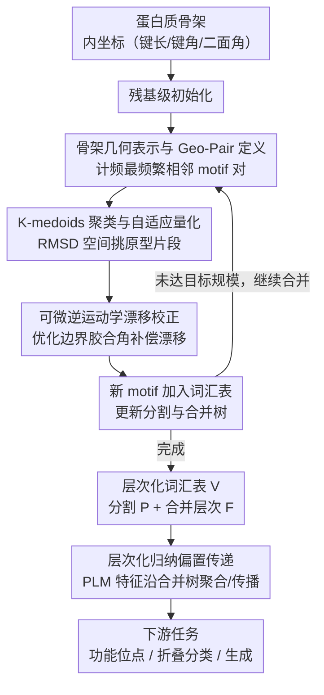

# Protein Structure Tokenization via Geometric Byte Pair Encoding

**会议**: ICLR 2026  
**arXiv**: [2511.11758](https://arxiv.org/abs/2511.11758)  
**代码**: [GitHub](https://github.com/shiningsunnyday/PT-BPE)  
**领域**: 蛋白质AI / 结构tokenization  
**关键词**: GeoBPE, Protein Structure Tokenizer, Hierarchical Vocabulary, Differentiable IK, Multi-resolution

## 一句话总结

提出 GeoBPE——首个将 BPE（字节对编码）从离散文本扩展到连续蛋白质骨架几何的 tokenizer，通过交替执行"局部合并（k-medoids聚类+量化）"和"全局校正（可微逆运动学）"构建层次化结构 motif 词汇表，以 >10× 压缩比和 >10× 数据效率超越 VQ-VAE 类 PST，在 12 个下游任务 24 个测试集上排名第一。

## 研究背景与动机

**领域现状**：蛋白质语言模型（PLMs）如 ESM 系列在序列上取得巨大成功，但不显式建模折叠几何，在结构依赖的功能任务上表现受限。蛋白质结构 tokenizer（PST）是连接序列和结构的关键桥梁，当前主流是 VQ-VAE 方法（ESM3、FoldSeek 的 3Di 字母表、ProToken 等），通过训练自编码器将连续结构映射到离散码本。

**现有痛点**：VQ-VAE 类 PST 存在三个根本性限制：（1）**固定码本容易崩溃**——codebook collapse 导致 token 使用不均衡，压缩效率受限；（2）**向量作为 token 不可解释**——码本中的实向量行无法像 BPE 子词那样展现层次化的组合关系；（3）**固定 token 大小阻碍多尺度分析**——所有 token 都是固定残基长度，无法适应自然存在的可变长度功能域。此外 VQ-VAE 的 OOD 泛化很差（test/train RMSD 比可达 6.4×）。

**核心矛盾**：蛋白质结构是连续的、有噪声的、多尺度的，而 BPE 是为离散符号设计的。核心难题是如何在离散化过程中保持全局几何一致性——局部量化会引入累积漂移（drift），导致远端原子坐标偏离。

**切入角度**：蛋白质折叠由模块化子结构组成（helix、sheet、loop 等），天然适合 BPE 的"迭代合并频繁对"策略。关键观察是：局部量化引入的漂移可以通过优化边界处的"胶合角"（glue angles）来补偿，因为每个边界提供 3 个自由度（一个键角 + 两个二面角）。

**核心 idea**：将 BPE 从离散符号扩展到连续几何，通过"局部 k-medoids 量化 + 全局可微逆运动学漂移校正"的交替迭代，构建蛋白质结构的层次化 motif 词汇表。

## 方法详解

### 整体框架

GeoBPE 要解决的问题是：把为离散文本设计的 BPE 搬到连续、有噪声、多尺度的蛋白质骨架几何上，构建一套可解释、可多分辨率压缩的结构 motif 词汇表。整体怎么转：以蛋白质骨架的内坐标表示（键长、键角、二面角）为输入，从残基级初始化出发，像文本 BPE 一样**反复"找最频繁的相邻对并合并"**——只不过每一轮合并都要额外处理"连续几何怎么计频"和"量化后几何会漂移"两件事。

具体地，每一轮迭代依次做四件事：先弹出当前最频繁的 Geo-Pair（相邻 motif 对），再用 k-medoids 在 RMSD 空间聚类挑出代表性原型片段，接着把所有 occurrence 硬量化到最近原型，最后用可微逆运动学回头优化边界胶合角、把量化引入的漂移消化掉；这一轮产出的新 motif 类型加入词汇表，并更新分割与合并树。如此循环直到词汇表达到目标规模，最终输出层次化词汇表 $\mathcal{V}$、各骨架的分割 $\mathcal{P}$ 和合并层次 $\mathcal{F}$。这套合并树之后还能反过来当作递归计算树，把预训练 PLM 特征沿层次聚合/传播，服务下游任务。

### 关键设计

**1. 骨架几何表示与 Geo-Pair 定义：让"连续 3D 几何"也能像离散符号一样被计频**

BPE 的第一步是统计哪对相邻符号出现得最频繁，但蛋白质骨架是连续的 3D 坐标，根本没有"符号"可数。GeoBPE 的解法是先把骨架改写成内坐标系统：每个残基 $i$ 用 bond-residue 表示，三个原子坐标 $(N_i, CA_i, C_i)$ 对应键长 $\ell^{N-CA}_i, \ell^{CA-C}_i, \ell^{C-N}_i$、键角 $\theta^{NCAC}_i, \theta^{CACN}_i$ 和二面角 $\psi_i$；相邻残基则通过一组胶合参数 $\Gamma_i = \{\theta^{CNCA}_i, \phi_i, \omega_i\}$ 衔接。一段连续的残基块 $\mathcal{M}_{p:q}$ 构成一个 motif，相邻两个 motif 加上它们之间的边界胶合角就构成一个 Geo-Pair occurrence。最后通过一个 canonical hashable key 把所有 occurrence 映射到离散标识符，"计数最频繁的对"这一 BPE 核心操作才得以在连续几何上落地。

这种内坐标表示之所以关键，是因为它天然是 SE(3) 不变的，消除了全局旋转/平移的干扰；同时它把骨架自然拆成两类参数——motif 内部的局部几何，和连接处的胶合角——正好对应后续"合并—量化—校正"三步各自要操作的对象，使这套分离式流程成为可能。

**2. K-medoids 聚类与自适应量化：用真实观测到的片段当原型，而非抽象向量**

离散 BPE 直接把高频对替换成一个新符号，但连续数据的"替换"本质是量化——需要在一堆构象变异中挑出一个最佳代表。GeoBPE 对最频繁 Geo-Pair key 下的全部 occurrence，在 RMSD 度量空间上跑 k-medoids 聚类，得到 $K$ 个原型；量化步骤则把每个非 medoid 的 occurrence 的全部内部参数硬拷贝成它所分配 medoid 的参数。这里的关键创新是**自适应多分辨率**：量化虽然有损，但每一步都从原始片段重新量化（而非在已量化结果上层层叠加），且 $K$ 值可随 motif 长度调整——小 motif 用粗粒度、大 motif 用细粒度，从而精确拨动压缩与重建之间的权衡。选 medoid 而不是 centroid 是有意为之：medoid 本身就是一个真实观测到的蛋白质片段，保证每个词表项都物理合理、可被专家解读，这正是它区别于 VQ-VAE 学出的抽象码向量之处。

**3. 可微逆运动学（IK）漂移校正：把累积的量化误差按到边界胶合角上消化掉**

量化把一个 occurrence 的内部变换 $T^{\text{occ}}_u$ 换成 medoid 的 $T^{\text{med}}_u$，就会引入漂移 $\Delta T_u = T^{\text{occ}}_u (T^{\text{med}}_u)^{-1}$；若不处理，这些误差会沿肽链一路累积，让远端原子的 RMSD 彻底爆炸。GeoBPE 不去动 motif 内部，而是回头优化边界处的胶合角，让新的链路变换 $G^{\text{new}}_{i_{u}-1} \approx G^{\text{orig}}_{i_{u}-1} \cdot \Delta T_u$ 重新逼近原始几何。具体做法是最小化端帧损失

$$\mathcal{L}_u(\Gamma) = w_R \|\log(\hat{R}^\top R^*)\|^2 + w_t \|\hat{t} - t^*\|^2$$

其中 $\hat{F}$ 由前向运动学算出、$F^*$ 为原始帧。实现上采用全局批量优化——一次性同时优化整条骨架上所有胶合角自由度，把补偿灵活性拉到最大。这一步是 GeoBPE 区别于"简单离散化"的命门：每个边界恰好有 3 个胶合自由度（一个键角 + 两个二面角），刚好张成足够的方向性补偿空间，让量化后的全局几何依然站得住。

**4. 层次化归纳偏置传递：把合并树复用为递归计算树，让离散化反而提升下游表征**

离散 PST 通常因量化损失而下游性能不如连续方法，GeoBPE 却反过来——靠的正是合并步骤副产的那棵合并层次 $\mathcal{F}$。它把这棵树当成递归计算树：叶节点用预训练 PLM（如 ESM3）特征初始化，沿父子关系自底向上聚合到 motif / 蛋白质级表征，再自顶向下传播回残基级。这样每个残基级嵌入都带上了层次化的结构感知，支持功能位点预测、折叠分类等下游任务。这个设计是"意外收获"式的价值：合并树本是压缩过程的中间产物，却恰好编码了蛋白质天然的模块化层级，把它当归纳偏置注入表征，离散化带来的就不再只是损失，而是结构先验。

## 实验关键数据

### 主实验（下游迁移性能，AUROC%）

| 任务 | ProteinMPNN | MIF | FoldSeek | ProTokens | ESM3 | VQ-VAE | AminoASeed | **GeoBPE-Transfer** |
|------|-------------|-----|----------|-----------|------|--------|------------|-------------------|
| BindInt-Fold | 51.83 | 50.38 | 53.18 | 44.66 | 44.30 | 47.25 | 47.11 | **59.19 (+33.6%)** |
| BindBio-Fold | 78.42 | 85.79 | 32.37 | 58.47 | 62.84 | 62.02 | 65.73 | **94.94 (+51.1%)** |
| CatBio-Fold | 82.49 | 85.85 | 56.33 | 67.68 | 65.33 | 67.58 | 65.95 | **95.01 (+45.4%)** |
| Con-SupFam | 84.68 | 92.66 | 51.31 | 70.64 | 80.53 | 74.60 | 86.60 | **84.84 (+5.4%)** |
| 平均 AUROC% | 75.92 | 79.82 | 51.90 | 65.37 | 69.24 | 68.30 | 72.43 | **80.20 (+18.1%)** |

GeoBPE-Transfer 在 12 个任务 24 个测试中平均排名第一，相比 ESM3 提升 +18.13%（功能位点预测）。

### 消融实验（压缩-重建权衡 & OOD 泛化）

| Tokenizer | BPR (bits/res) | Test RMSD (Å) | Test/Train RMSD 比 | 训练数据量 |
|-----------|---------------|---------------|-------------------|-----------|
| ESM3 | ~30× GeoBPE | 较低 | ~1.0 | 236M 结构 |
| ProToken | 1× (参考) | 参考 | ~1.0 | ~700K |
| VQ-VAE | 中等 | 中等 | **6.4×** | ~48K |
| **GeoBPE** | **0.27-0.36× ProToken** | 适中 | **1.16-1.28** | **~48K** |

GeoBPE 的 BPR 仅为 ProToken 的 27-36%（>10× 压缩优势），ESM3 的 1.6-2.1%（>50×），且 OOD 泛化极强（test/train RMSD 比 1.16-1.28 vs VQ-VAE 的 6.4）。GeoBPE 在仅 1% 训练数据上性能不降，展现 >10× 数据效率。

### 关键发现

- **层次化词汇表逆转了"离散化损害下游性能"的趋势**：离散 VQ-VAE PST 通常因量化损失导致下游性能不如连续 PST，而 GeoBPE 的层次化归纳偏置使其超越所有连续和离散基线
- **GeoBPE token 与 CATH 功能家族对齐**：token 边界与蛋白质结构域注释高度一致，支持专家可解释的案例分析
- **词汇表沿 Pareto 前沿平滑扩展**：增大词汇表大小（600→21000）时，BPR-distortion 曲线平滑移动，这种弹性是 VQ-VAE（固定码本维度）不具备的
- **语言建模生成**：配合 ~7.3M Transformer 进行无条件骨架生成，GeoBPE 生成的骨架 99% unique & designable，scTM 比 VQ-VAE 高达 49%

## 亮点与洞察

- **BPE 到连续几何的优雅扩展**：核心难题是"连续数据如何计频率"和"量化后如何保持全局一致"，GeoBPE 用 canonical hashing（离散化 key）回答前者，用可微 IK（校正胶合角）回答后者，两个机制的结合非常精巧
- **Medoid 作为原型保证物理合理性**：与 VQ-VAE 学习的抽象向量不同，medoid 是真实观测到的结构片段，每个 token 都有明确的物理意义，支持专家级解释
- **层次化词汇表的双重价值**：既提供压缩-重建的多分辨率控制（tokenizer 本身的功能），又作为递归计算树的归纳偏置提升下游表征质量（意外收获）

## 局限与展望

- **计算复杂度**：k-medoids 聚类 + 全局 IK 优化的迭代开销较高，虽然已通过限制采样数（$M_{\max}=5000$）缓解，但仍限制了大规模应用
- **仅处理骨架原子**：当前仅覆盖 N-CA-C 骨架，未建模侧链构象，限制了对侧链依赖功能的建模
- **语言建模生成质量有限**：使用的 Transformer 仅 7.3M 参数，生成质量还有很大提升空间
- **与端到端训练的比较不够公平**：GeoBPE-Transfer 依赖 ESM3 的预训练特征，下游性能提升部分归功于 ESM3 的强大表征

## 相关工作与启发

- **vs ESM3 VQ-VAE**：ESM3 用 236M 结构训练 VQ-VAE 达到低重建误差，GeoBPE 用不到 0.02% 的数据达到可比性能，代价是略高的 RMSD，但泛化性和可解释性远优
- **vs FoldSeek 3Di**：3Di 用 20 个固定离散码做高效搜索，GeoBPE 的词汇表可动态扩展且支持多分辨率
- **vs ProToken**：ProToken 在 Pareto 前沿上与 GeoBPE 互补，但 GeoBPE 的可解释性（CATH 对齐）和数据效率是其独特优势

## 评分

- 新颖性: ⭐⭐⭐⭐⭐ 首次将 BPE 原理扩展到连续蛋白质几何，理论和算法设计都有原创性突破
- 实验充分度: ⭐⭐⭐⭐⭐ 10 个研究问题覆盖压缩/重建/泛化/效率/下游/可解释性，24 个测试集，分析极为全面
- 写作质量: ⭐⭐⭐⭐ 数学符号严谨，算法描述清晰，但符号系统较复杂，学习曲线陡峭
- 价值: ⭐⭐⭐⭐⭐ 为蛋白质结构表示学习开辟了全新范式，层次化词汇表的思路对其他连续结构数据（分子、材料）也有启发

<!-- RELATED:START -->

## 相关论文

- [\[ICML 2025\] Protein Structure Tokenization: Benchmarking and New Recipe](../../ICML2025/computational_biology/protein_structure_tokenization_benchmarking_and_new_recipe.md)
- [\[ICLR 2026\] AntigenLM: Structure-Aware DNA Language Modeling for Influenza](antigenlm_structure-aware_dna_language_modeling_for_influenza.md)
- [\[ICML 2026\] Protein Autoregressive Modeling via Multiscale Structure Generation](../../ICML2026/computational_biology/protein_autoregressive_modeling_via_multiscale_structure_generation.md)
- [\[ICLR 2026\] Protein Counterfactuals via Diffusion-Guided Latent Optimization](protein_counterfactuals_via_diffusion-guided_latent_optimization.md)
- [\[ICLR 2026\] Protein as a Second Language for LLMs](protein_as_a_second_language_for_llms.md)

<!-- RELATED:END -->
