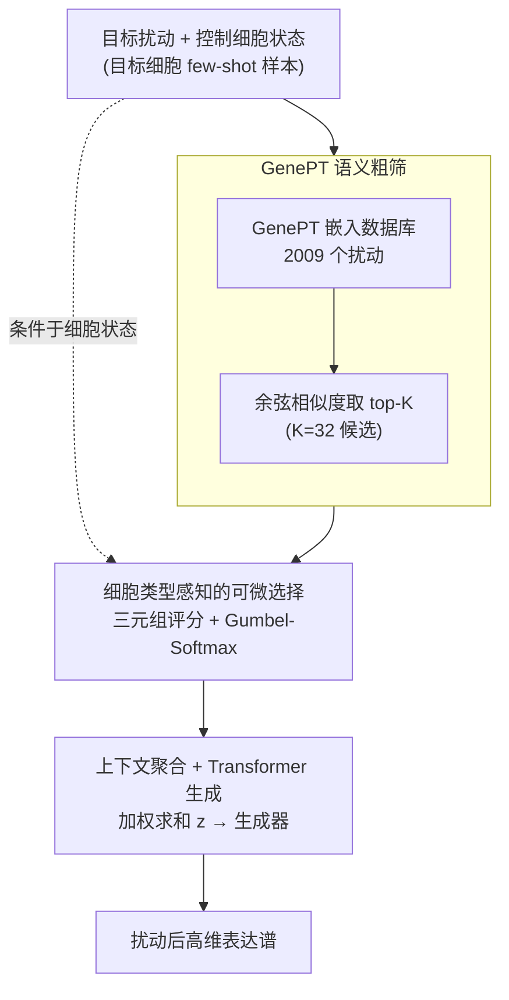

# Retrieval-Augmented Generation for Predicting Cellular Responses to Gene Perturbation

**会议**: ICLR2026  
**arXiv**: [2603.07233](https://arxiv.org/abs/2603.07233)  
**作者**: Andrea Giuseppe Di Francesco, Andrea Rubbi, Pietro Liò (Sapienza University of Rome / University of Cambridge / Wellcome Sanger Institute)
**代码**: [github.com/difra100/PT-RAG_ICLR](https://github.com/difra100/PT-RAG_ICLR)  
**领域**: 计算生物
**关键词**: RAG, 可微检索, 基因扰动预测, 单细胞转录组, Gumbel-Softmax, 细胞类型感知

---

## 一句话总结

提出 **PT-RAG**（Perturbation-aware Two-stage Retrieval-Augmented Generation），首次将可微检索增强生成范式应用于单细胞基因扰动响应预测：通过 GenePT 语义检索候选扰动 + Gumbel-Softmax 条件离散采样实现细胞类型感知的端到端检索优化，在 Replogle-Nadig 数据集上超越 STATE 基线（Pearson 0.633 vs 0.624），同时发现朴素 RAG 会严重损害性能（Pearson 仅 0.396），证明**可微且细胞类型感知的检索**在该领域不可或缺。

---

## 研究背景与动机

**基因扰动预测的重要性**：理解细胞对基因扰动的响应是系统生物学核心挑战，对药物发现、疾病建模和基因治疗至关重要。高通量 Perturb-seq 技术产生的组合爆炸使实验穷举不可行，需要计算方法预测扰动响应。

**现有方法的局限**：scGen、CPA、GEARS、STATE 等方法仅基于控制细胞状态和扰动身份生成预测，不利用相关扰动的生物学知识，限制了对未见细胞类型的泛化能力。

**RAG 在 NLP 之外的空白**：RAG 在 NLP 中已十分成功，但扩展到细胞生物学面临根本挑战——没有预训练检索器、没有公认的扰动相似性度量、"生成器"需产出高维细胞分布而非文本。

**朴素检索的失败风险**：细胞类型不同，同一扰动可能产生截然不同的效应。细胞类型无关的固定检索提供相同上下文，可能引入噪声而非有用信息。

**可微检索的必要性**：当检索目标本身需要学习（不存在先验的"相关性"定义）时，端到端可微检索成为刚需。

**核心 idea**：功能相似的扰动应诱导相似的细胞响应；通过可微检索让模型**学会**为不同细胞上下文动态选择最有信息量的参考扰动，而非盲目检索。

---

## 方法详解

### 整体框架

PT-RAG 把"为一个扰动预测细胞响应"拆成一条两阶段流水线：先用 GenePT 语义嵌入从约 2009 个扰动里**粗筛**出 $K$ 个候选，再用一个可微、且条件于当前细胞状态的**选择器**决定到底借用哪几个候选作参考，最后把选中的上下文**聚合**成一个条件向量喂给 Transformer 生成器，吐出扰动后的高维表达谱。粗筛保证检索空间足够小，可微选择保证"借谁"这件事能随生成误差一起被反向传播优化——这正是它区别于固定检索的朴素 RAG 的地方。

### 关键设计

**1. GenePT 语义粗筛：把两千个扰动压成 K 个语义相关候选**

可微地在两千个扰动上直接挑选既慢又容易引入噪声，所以第一阶段先做一次不可微的语义粗筛，难点在于"功能相似"本身要可度量。先前方法用 one-hot 表示扰动身份，两个功能相近的基因在向量空间里却彼此正交，模型无从知道哪些扰动可以互相参考。PT-RAG 改用 GenePT 嵌入 $h_g^{gpt} \in \mathbb{R}^d$——它由 GPT-3.5 编码基因的 NCBI 文本描述得到，于是 aminoacyl-tRNA 合成酶这类功能同族的基因天然在嵌入空间里靠拢。所有扰动的嵌入预先构成数据库 $\mathcal{D} = \{h_p^{gpt}; \forall p \in \mathcal{P}\}$（$|\mathcal{P}| \approx 2009$），对目标扰动 $h_{pert}^{gpt}$ 按余弦相似度取 top-$K$ 即得候选集 $\mathcal{R}_{p^{pert}} = \text{TOP}_K(h_{pert}^{gpt}, \mathcal{P}) = \{p_{(1)}, \ldots, p_{(K)}\}$（实验取 $K=32$）。这一步只缩范围、不做"该不该用"的决策，把后者留给下一阶段。

**2. 细胞类型感知的可微选择：用三元组评分 + Gumbel-Softmax 把"借谁"变成可学习的硬决策**

这是全文的核心创新，要解决的痛点是：同一个扰动在不同细胞里效应可能完全不同，因此检索必须看当前细胞状态，而"该选谁"又没有现成标签、只能让模型自己学。具体做法是把每个候选 $k$ 先编码成 $h_k^{cxt} = \text{PertEncoder}(h_{p_{(k)}}^{gpt}) \in \mathbb{R}^{d_h}$，再拼成三元组 $c_k = [h^{ctrl}; h_{pert}; h_k^{cxt}]$，同时容纳"控制细胞状态、目标扰动、候选上下文"三方信息；经一个打分头 $s_k = \text{MLP}_{\text{score}}(\text{LayerNorm}(c_k)) \in \mathbb{R}^2$ 输出"排除/包含"两个 logit。为了既能输出 0/1 的硬选择又能让梯度流回打分头，用 Straight-Through Gumbel-Softmax 得到 $w_k = \text{GumbelSoftmax}(s_k, \tau)[\texttt{include}] \in \{0, 1\}$：前向用 $\arg\max$ 拿硬决策，反向用软概率算梯度。由于评分条件于 $h^{ctrl}$，同一个候选在不同细胞类型下会被给出不同的取舍，这正是细胞类型感知的来源。相比之下，Vanilla RAG 只按扰动嵌入做固定 top-$K$、检索步骤梯度被截断、再用 cross-attention 硬塞上下文，既看不到细胞状态也无法端到端调整检索目标——后文实验里它的 Pearson 仅 0.396，反而把基线拖垮。

**3. 上下文聚合与生成：把选中的参考压成一个条件向量喂给生成器**

选完之后还要把被选中的候选汇成生成器能用的输入。每个三元组先经投影 $h_k' = \text{MLP}_{\text{proj}}(c_k)$，再用选择权重做加权求和 $z = \sum_{k=1}^{K} w_k \cdot h_k'$——被 Gumbel-Softmax 判为"排除"的候选权重为 0、自动不贡献，于是 $z$ 只携带模型认可的参考信息。最后 $\hat{x}^{pert} = \text{TransformerGenerator}(z)$ 生成扰动后的高维表达谱。这样检索的"选谁"和生成的"长什么样"被串到同一条计算图上，可以一起优化。

### 损失函数 / 训练策略

训练目标由分布拟合项与稀疏正则项两部分组成：

$$\mathcal{L} = \mathcal{L}_{\text{dist}} + \lambda_{\text{sparse}} \mathcal{L}_{\text{sparse}}$$

分布损失用 Energy Distance $\mathcal{L}_{\text{dist}} = \text{Energy}(\hat{x}^{pert}, x^{pert})$ 直接对齐预测与真实的细胞群体分布，而非逐点回归，契合"输出是高维细胞分布"的任务设定。稀疏正则 $\mathcal{L}_{\text{sparse}} = \frac{1}{K}\sum_{k=1}^{K} w_k$（$\lambda_{\text{sparse}} = 0.1$）惩罚被选中的候选比例：若没有这一项，模型会倾向于把所有候选全选进来、退化成无差别检索（即模式坍塌），加上它才逼着选择器只保留少数真正有用的参考。

---

## 实验

### 数据集与设置

- **数据集**：Replogle-Nadig 单基因扰动数据集，2009 个唯一扰动，2000 个高变异基因
- **细胞类型**：K562（慢性粒细胞白血病）、Jurkat（T 细胞淋巴瘤）、RPE1（视网膜色素上皮）、HepG2（肝细胞癌）
- **评估协议**：留一细胞类型交叉验证——在 3 个细胞类型上训练，在第 4 个上测试，目标细胞类型提供 30% few-shot 样本，70% 用于验证/测试
- **统计检验**：Mann-Whitney U 检验 + Benjamini-Hochberg FDR 校正

### 主实验结果

**Table 1: 跨细胞类型泛化性能（1635 个测试扰动均值）**

| 指标 | STATE | STATE+GenePT | Vanilla RAG | **PT-RAG** |
|------|-------|-------------|-------------|-----------|
| Pearson DEG ↑ | 0.624† | 0.631 | 0.396† | **0.633** |
| Spearman DEG ↑ | 0.403† | 0.411 | 0.307† | **0.412** |
| MSE ↓ | 0.211 | **0.210** | 0.316† | **0.210** |
| RMSE ↓ | 0.458 | 0.458 | 0.562† | **0.457** |
| MAE ↓ | 0.298† | 0.296 | 0.429† | **0.295** |
| MSE_PCA50 ↓ | 8.43 | 8.42 | 12.64† | **8.39** |
| $W_1$ ↓ | 35.70† | 35.53†† | 48.48† | **35.41** |
| $W_2$ ↓ | 646.1† | 638.7†† | 1189.5† | **633.7** |
| Energy ↓ | 9.41†† | 9.40 | 14.18† | **9.33** |

> † 表示 FDR 校正后 $p<0.01$；†† $p<0.05$

### 消融分析：检索策略对比

**Table 2: 不同 K 值下 Vanilla RAG vs PT-RAG 的 Pearson 相关**

| K 值 | Vanilla RAG | PT-RAG |
|------|------------|--------|
| 2 | ~0.29 | ~0.62 |
| 5 | ~0.31 | ~0.63 |
| 10 | ~0.33 | ~0.63 |
| 32 | 0.351 | **0.633** |

无论 $K$ 如何变化，Vanilla RAG 始终远低于基线；可微检索是性能回升的关键。

### 细胞类型特异性检索分析

- 对 33 个跨所有 4 种细胞类型的共同基因计算 Jaccard 相似度
- 所有细胞类型对的 Jaccard 相似度仅为 **0.185–0.196**（均值 0.191），即只有 ~19% 的检索扰动在不同细胞类型间重叠
- **WARS 基因案例**：PT-RAG 始终检索 aminoacyl-tRNA 合成酶（功能一致），但具体选择因细胞类型而异——Jurkat 选 EARS2/DARS/VARS，HepG2 选 SARS2/GART/TARS，K562 选 FARSB/KARS/FARS2，RPE1 选 KARS/GART/TARS/QARS

### 关键发现

1. **朴素 RAG 严重损害性能**：Vanilla RAG 的 Pearson 仅 0.396（远低于无检索的 STATE 0.624），$W_2$ 高达 1189.5（STATE 为 646.1），说明不加选择的检索引入大量噪声
2. **GenePT 嵌入提供温和提升**：STATE+GenePT 在大部分指标上小幅优于 STATE，但改进集中在语义表示层面
3. **PT-RAG 的增益集中在分布相似性**：$W_1$（35.41 vs 35.70）和 $W_2$（633.7 vs 646.1）的改进最为显著且统计显著，说明可微检索主要帮助捕捉细胞群体的异质性和分布结构
4. **细胞类型感知是必须的**：仅 19% 的检索重叠率证明模型确实学会了针对不同细胞上下文选择不同参考信息

---

## 亮点

- **首创性**：首次将 RAG 范式扩展到细胞生物学的扰动响应建模，且证明"可微检索"在该领域是刚需而非可选
- **负面结果的价值**：Vanilla RAG 的失败本身就是一个重要发现——揭示了不同领域对 RAG 的需求差异
- **端到端可微设计**：三元组评分 + Gumbel-Softmax 的组合简洁有效，使检索目标与生成目标联合优化
- **生物学可解释性**：Jaccard 分析和 WARS 案例展示了模型学到的检索模式具有生物学合理性

---

## 局限性

1. **计算开销**：PT-RAG 每 batch 约比基线多 ~1.7× FLOPs（评分和 Gumbel-Softmax 机制的代价）
2. **仅限单基因扰动**：未验证组合扰动（多基因同时敲除）、化合物或 CRISPR 激活/干扰等场景
3. **改进幅度温和**：相比 STATE+GenePT，PT-RAG 的绝对提升较小且主要集中在 Wasserstein 距离
4. **生物学验证有限**：细胞类型特异性检索模式的分析更多是定性观察，缺乏严格的生物学实验验证
5. **检索机制单一**：未探索 GraphRAG（利用基因调控网络结构）或多模态检索（结合序列、结构和功能注释）

---

## 相关工作

- **扰动预测方法**：scGen (Lotfollahi 2019)、CPA (Lotfollahi 2023)、GEARS (Roohani 2024)、CellOT (Bunne 2023)、STATE (Adduri 2025)、CellFlow (Klein 2025) 均基于细胞状态+扰动身份生成，不利用相关扰动知识
- **可微 RAG**：Stochastic RAG (Zamani & Bendersky 2024)、D-RAG (Gao 2025) 在文本域证明端到端优化的价值，但依赖成熟的相似度度量和预训练生成器
- **生物学中的 RAG**：GeneRAG (Lin 2024)、scRAG (Yu 2025) 用 LLM 检索文本注释，E1 (Jain 2025) 增强蛋白质编码器——但均未涉及细胞响应生成

---

## 评分

- **新颖性**: ⭐⭐⭐⭐ — 首次将可微 RAG 应用于细胞扰动预测，跨领域创新性强
- **实验充分度**: ⭐⭐⭐⭐ — 多指标全面评估、统计检验严格、消融和 Jaccard 分析详尽
- **写作质量**: ⭐⭐⭐⭐ — 三种方法的对比清晰，图表专业
- **实用价值**: ⭐⭐⭐⭐ — 为计算生物学提供新工具，负面结果有指导意义
- **总体推荐**: ⭐⭐⭐⭐ — 跨界创新 + 负面结果的深入分析，绝对提升虽温和但 insight 有价值

<!-- RELATED:START -->

## 相关论文

- [\[ICML 2025\] Neural Graph Matching Improves Retrieval Augmented Generation in Molecular Machine Learning](../../ICML2025/computational_biology/neural_graph_matching_improves_retrieval_augmented_generation_in_molecular_machi.md)
- [\[ACL 2026\] AROMA: Augmented Reasoning Over a Multimodal Architecture for Virtual Cell Genetic Perturbation Modeling](../../ACL2026/computational_biology/aroma_augmented_reasoning_over_a_multimodal_architecture_for_virtual_cell_geneti.md)
- [\[NeurIPS 2025\] PRESCRIBE: Predicting Single-Cell Responses with Bayesian Estimation](../../NeurIPS2025/computational_biology/prescribe_predicting_single-cell_responses_with_bayesian_estimation.md)
- [\[ICLR 2026\] scDFM: Distributional Flow Matching for Robust Single-Cell Perturbation Prediction](scdfm_distributional_flow_matching_model_for_robust_single-cell_perturbation_pre.md)
- [\[ICML 2026\] Scalable Single-Cell Gene Expression Generation with Latent Diffusion Models](../../ICML2026/computational_biology/scalable_single-cell_gene_expression_generation_with_latent_diffusion_models.md)

<!-- RELATED:END -->
