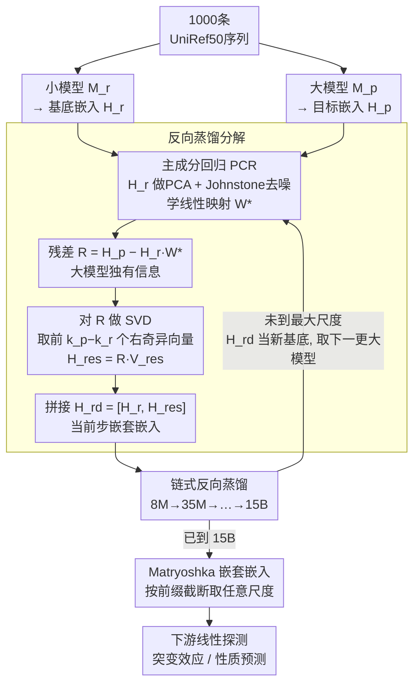

# Reverse Distillation: Consistently Scaling Protein Language Model Representations

**会议**: ICLR 2026  
**arXiv**: [2603.07710](https://arxiv.org/abs/2603.07710)  
**代码**: [GitHub](https://github.com/rohitsinghlab/plm_reverse_distillation)  
**领域**: 蛋白质AI / 表示学习  
**关键词**: 反向蒸馏, 蛋白质语言模型, 缩放行为, Matryoshka嵌套表示, ESM-2

## 一句话总结

针对蛋白质语言模型（PLM）"模型越大性能不一定越好"的反常缩放现象，提出反向蒸馏框架：以小模型表示为基底、用SVD提取大模型正交残差信息，构造Matryoshka嵌套嵌入，使得更大的反向蒸馏模型一致优于更小的，ESM-2 15B经反向蒸馏后首次成为全家族最强。

## 研究背景与动机

**领域现状**：蛋白质语言模型（PLM）通过在海量序列上自监督训练，学到丰富的蛋白质表示，在结构预测、功能注释和蛋白质设计等任务上取得了突破性进展。NLP和CV领域中scaling law表现稳定——模型越大性能越好，但PLM家族却表现出违反直觉的缩放行为。

**现有痛点**：以ESM-2家族为例，性能在650M–3B参数处达到峰值，15B参数的最大模型反而出现性能退化。这带来两个关键问题：（1）**非单调缩放**——无法预测哪些下游任务会出现大模型不如小模型的情况，导致模型选择困难；（2）**嵌入不可截断**——不同规模模型的嵌入维度互不兼容，无法像NLP中的Matryoshka嵌入那样"嵌入一次、按需截断使用"。

**核心矛盾**：大模型虽然有足够容量编码更丰富的高阶特征（酶催化位点、别构耦合等），但这些高阶特征与基础特征（二级结构倾向、疏水性模式等）纠缠在同一表示空间中。当下游使用线性探测器时，任务无关的高阶特征实际上成为噪声，掩盖了驱动性能的基础模式。

**切入角度**：作者从偏差-方差权衡的视角出发：小模型受容量限制，被迫优先编码出现频率最高、最广泛共享的蛋白质特征（高偏差低方差）；大模型额外编码稀有高阶现象但引入方差。如果能以小模型表示为"基底"，将大模型表示分解为"共享基础 + 正交残差"，就能避免两类特征的破坏性干扰。

**核心 idea**：用同家族小模型的表示作为分解基底，通过线性回归+SVD提取大模型的正交残差信息，构造嵌套式嵌入以恢复单调缩放行为。

## 方法详解

### 整体框架

给定同家族的小模型 $M_r$ 和大模型 $M_p$（$|M_r| < |M_p|$），反向蒸馏将大模型的 $k_p$ 维表示空间分解为两个正交子空间：$\mathcal{S}_r$（保留小模型的 $k_r$ 维表示）和 $\mathcal{S}_{res}$（捕获大模型独有的 $k_p - k_r$ 维残差信息）。最终输出 $H_{rd} = [H_r, H_{res}]$，前 $k_r$ 维恰好是小模型的完整嵌入，天然具备Matryoshka嵌套性质。

整个流程仅涉及线性变换（回归 + SVD），无需重新训练任何模型，训练数据只需1000条UniRef50序列。对ESM-2家族，沿 8M → 35M → 150M → 650M → 3B → 15B 逐级链式蒸馏，最终得到每个尺度的反向蒸馏嵌入。

### 关键设计

**1. 反向蒸馏分解（Algorithm 1）：把大模型表示拆成"小模型可解释的部分"和"大模型独有的增量"**

针对的是基础特征与高阶特征纠缠的痛点，做法分三阶段。Phase 1 对同一序列集分别跑小模型和大模型，得到 $H_r \in \mathbb{R}^{L \times k_r}$ 和 $H_p \in \mathbb{R}^{L \times k_p}$。Phase 2 用主成分回归（PCR）学一个线性映射 $W^* = \arg\min_W \|H_p - H_r W\|_F^2$，把大模型表示尽量用小模型基底来拟合；关键是先对 $H_r$ 做 PCA、再用来自随机矩阵理论的 Johnstone 阈值剔除噪声主成分，只保留信号主成分参与回归，避免过拟合。Phase 3 计算回归残差 $R = H_p - H_r W^*$，这部分正是小模型基底解释不了的信息，对它做 SVD 取前 $k_p - k_r$ 个右奇异向量 $V_{res}$，投影得到 $H_{res} = R V_{res}$。整个分解全是线性的，所以两块各有清楚的物理含义：$H_r$ 是小模型的完整特征空间，$H_{res}$ 就是大模型独有的、与基础特征正交的高阶特征，两者互不干扰。

**2. 链式反向蒸馏（Algorithm 3）：把两两之间的分解扩展成整个模型家族的逐级分解**

单次分解只能处理一对模型，但一个家族有 6 个尺度，需要把它们的贡献依次叠起来。做法是从最小模型 $M_1$ 开始，把已经累积的嵌入 $H_{acc}^{(i-1)}$ 当作基底，对下一个更大的模型 $M_i$ 重复一次反向蒸馏——学线性映射、算残差、SVD 提正交分量，再把新增分量拼到累积嵌入末尾。对 ESM-2 就沿 8M→35M→150M→650M→3B→15B 逐级推进。实验里更长的渐进链（如 8M→35M→150M→650M）一致优于直接跳跃链（如 8M→650M），原因是每一步只分离相邻尺度的增量，粒度更细，能把不同层次的生物特征拆得更干净。

**3. Matryoshka 嵌套结构与最优性保证：让一份嵌入按前缀截断就能当作任意尺度使用**

因为最终输出 $H_{rd} = [H_r, H_{res}]$ 是按尺度顺序拼接出来的，它天然具备俄罗斯套娃性质：前 $k_1$ 维就是 8M 嵌入，前 $k_1 + k_2$ 维就是 rd.35M 嵌入，依此类推，截断到任意前缀都是该尺度的合法反向蒸馏嵌入。这就解决了原始 PLM"不同规模嵌入维度互不兼容、无法截断复用"的痛点——嵌入一次即可按需取不同维度，性能随截断平滑退化，不必为每个下游任务重新嵌入。最优性方面，Theorem 1 证明在所有以 $H_r$ 为前缀的 $k_p$ 维表示 $[H_r, X]$ 中，反向蒸馏给出的 $H_{res}$ 最小化了对原始大模型表示的重建误差，这一结论由 Eckart-Young 定理直接得出。

### 损失函数 / 训练策略

整个框架无需反向传播训练，全部基于闭式解：PCR的回归系数通过矩阵求逆获得，残差子空间通过SVD分解获得。训练数据仅需 $N=1000$ 条UniRef50随机采样序列（与评测数据集 <30% 序列一致性），总氨基酸位点数 $L = \sum n_i$ 作为有效样本量。由于只涉及线性变换，计算成本极低。

## 实验关键数据

### 主实验：ProteinGym DMS缩放一致性（28个数据集，单突变）

| 模型对比 | 优于对方的数据集比例 | 含义 |
|---------|-------------------|------|
| rd.650M > 原始650M | 71.4% | 反向蒸馏提升同尺度性能 |
| rd.3B > 原始3B | 85.7% | 反向蒸馏提升同尺度性能 |
| rd.15B > 原始15B | 67.9% | 反向蒸馏修复15B退化 |
| 原始3B > 原始650M | 53.6% | 原始缩放几乎不work |
| rd.3B > rd.650M | **92.9%** | 反向蒸馏后缩放一致 |
| rd.15B > rd.3B | **85.7%** | 反向蒸馏后缩放一致 |

### 下游蛋白质性质预测（Table 4）

| 任务 | 650M | rd.650M | 3B | rd.3B | 15B | rd.15B |
|------|------|---------|-----|-------|-----|--------|
| SSP Q3 (aupr↑) | 0.831 | 0.833 | 0.791 | 0.816 | 0.845 | **0.861** |
| SSP Q8 (aupr↑) | 0.365 | 0.369 | 0.379 | 0.395 | 0.418 | **0.431** |
| MIB (aupr↑) | 0.881 | 0.855 | 0.893 | 0.891 | 0.900 | **0.901** |
| R2/R1 (aupr↑) | 0.343 | 0.405 | 0.369 | 0.425 | 0.368 | **0.468** |

### 消融实验：链式配置对比（Table 1，3个DMS数据集）

| 链式配置 | ARGR_ECOLI | DN7A_SACS2 | ILF3_HUMAN |
|---------|-----------|-----------|-----------|
| 原始650M（baseline） | 0.834 | 0.868 | 0.712 |
| 直接 8M→650M | 0.849 | 0.878 | 0.765 |
| 直接 150M→650M | 0.845 | 0.866 | 0.751 |
| 完整链 8M→35M→150M→650M | **0.858** | 0.867 | **0.786** |
| 原始3B（baseline） | 0.845 | 0.880 | 0.749 |
| 完整链→3B（rd.3B） | **0.873** | **0.890** | **0.801** |

### 关键发现

- **缩放一致性修复效果显著**：原始ESM-2中3B优于650M的比例仅53.6%，反向蒸馏后rd.3B优于rd.650M的比例飙升至92.9%，单调缩放行为基本恢复
- **同尺度性能提升**：rd.650M在71.4%的数据集上优于原始650M，说明反向蒸馏不只是修复缩放关系，还能直接提升嵌入质量
- **15B退化被逆转**：rd.15B成为全家族最强模型，在单突变和双突变任务中均优于原始15B（67.9%和57.1%）
- **更长链一致更优**：完整渐进链（8M→35M→150M→650M）在所有3个探索数据集上优于直接跳跃链（如8M→650M），验证了逐步分解的优越性
- **R2/R1预测提升最大**：在RNA二级结构任务上rd.15B（0.468）相比原始15B（0.368）提升27%，表明反向蒸馏对需要精细特征分离的任务特别有效
- **SAE分析验证特征解耦**：稀疏自编码器训练在rd.35M嵌入上比原始35M嵌入平均多捕获25%的GO terms（40 vs 32），且特异性显著更高（更少general），支持反向蒸馏能解耦生物特征表示

## 亮点与洞察

- **逆向思维的精妙**：传统蒸馏是大模型→小模型的知识压缩；反向蒸馏反其道行之，用小模型为大模型"导航"——小模型充当分解基底，再提取大模型的增量信息。这个视角转换非常优雅，将"大模型为什么不好"重新定义为"如何系统性组合不同尺度的贡献"
- **偏差-方差视角下的PLM理解**：小模型因容量受限偏向编码高频共性特征（高偏差），大模型额外编码稀有高阶特征但引入方差。这一框架不仅解释了为什么小模型常优于大模型，还直接指导了分解策略——沿偏差-方差轴进行正交分解
- **极简实现的工程美感**：整个方法仅需线性回归+SVD，1000条序列即可训练，推理端额外计算开销仅1.5-1.7倍。没有任何神经网络训练、没有梯度回传、没有超参搜索，却能系统性修复缩放行为。这种"用最简单的数学工具解决根本性问题"的风格值得学习
- **Matryoshka嵌套的可迁移思路**：反向蒸馏构造嵌套嵌入的方式可以迁移到任何模型家族存在缩放问题的场景。特别是在基因组学、药物发现等领域的foundation model中，如果也存在类似的非单调缩放，反向蒸馏框架可以直接套用

## 局限与展望

- **仅线性分解**：作者自己指出非线性映射能显著提升重建R²（8M→35M从0.422→0.528），但牺牲了可解释性和Matryoshka保证。未来可以探索非线性残差提取（如UMAP）或LoRA微调，在保持嵌套结构的同时捕获非线性交互
- **多模型推理开销**：rd.15B需要6个ESM-2模型的前向传播，虽然小模型快，总耗时仍为基线1.7倍。作者提出用LoRA在大模型最后一层直接产出反向蒸馏嵌入的方向，这将实现单次前向传播
- **仅验证ESM-2家族**：尚未在其他PLM家族（ProtTrans、Ankh、ProGen等）或非蛋白质领域的foundation model上验证。框架的通用性声称需要更广泛的实证支持
- **训练数据极少（1000序列）**：虽然线性方法对样本量需求低，但在更大规模数据集上是否能进一步提升、在何种任务上边际递减，缺乏系统性分析
- **下游任务评估有限**：主要在DMS突变效应预测和少量蛋白质性质预测上评估，对蛋白质设计、蛋白质-蛋白质相互作用预测等生成式/复杂任务的适用性未知

## 相关工作与启发

- **vs 传统知识蒸馏（Hinton et al.）**：传统蒸馏将大模型压缩为小模型，目标是"用小模型模拟大模型"；反向蒸馏则是"用小模型理解大模型"，目的不是压缩而是分解。两者方向相反但互补
- **vs Matryoshka Representation Learning（Kusupati et al., NeurIPS 2022）**：MRL通过训练时的多尺度损失学习嵌套嵌入，需要重新训练模型；反向蒸馏是后处理方法，在已训练好的模型家族上直接构造嵌套结构，不需要任何训练修改
- **vs o-LoRA / Adaptive SVD（持续学习方向）**：这些方法在任务维度上维护正交子空间，反向蒸馏则在模型规模维度上分解正交子空间，视角不同但数学工具相似
- **vs PLM嵌入压缩（Lu et al., Devkota et al.）**：压缩方法证明PLM嵌入存在大量冗余，反向蒸馏利用了这一发现——大模型的冗余正是因为高阶特征和基础特征纠缠，分解后自然去除冗余

## 评分

- 新颖性: ⭐⭐⭐⭐⭐ 反向蒸馏的概念简洁而深刻，逆转了知识蒸馏的方向，用小模型引导大模型表示分解是全新视角
- 实验充分度: ⭐⭐⭐⭐ ProteinGym 28个数据集+5个下游任务+SAE分析构成了较完整的验证，但缺少其他PLM家族的验证
- 写作质量: ⭐⭐⭐⭐⭐ 动机阐述清晰（偏差-方差视角非常直观），算法伪代码完整，理论证明简洁有力
- 价值: ⭐⭐⭐⭐ 对蛋白质AI领域解决缩放挑战有直接指导意义，框架通用性强，但实际影响取决于能否扩展到更多模型家族

<!-- RELATED:START -->

## 相关论文

- [\[ICLR 2026\] How to Make the Most of Your Masked Language Model for Protein Engineering](how_to_make_the_most_of_your_masked_language_model_for_protein_engineering.md)
- [\[ICML 2026\] Protein Language Model Embeddings Improve Generalization of Implicit Transfer Operators](../../ICML2026/computational_biology/protein_language_model_embeddings_improve_generalization_of_implicit_transfer_op.md)
- [\[ICLR 2026\] Protein as a Second Language for LLMs](protein_as_a_second_language_for_llms.md)
- [\[ICLR 2026\] Controlling Repetition in Protein Language Models](controlling_repetition_in_protein_language_models.md)
- [\[ICLR 2026\] DriftLite: Lightweight Drift Control for Inference-Time Scaling of Diffusion Models](driftlite_lightweight_drift_control_for_inference-time_scaling_of_diffusion_mode.md)

<!-- RELATED:END -->
