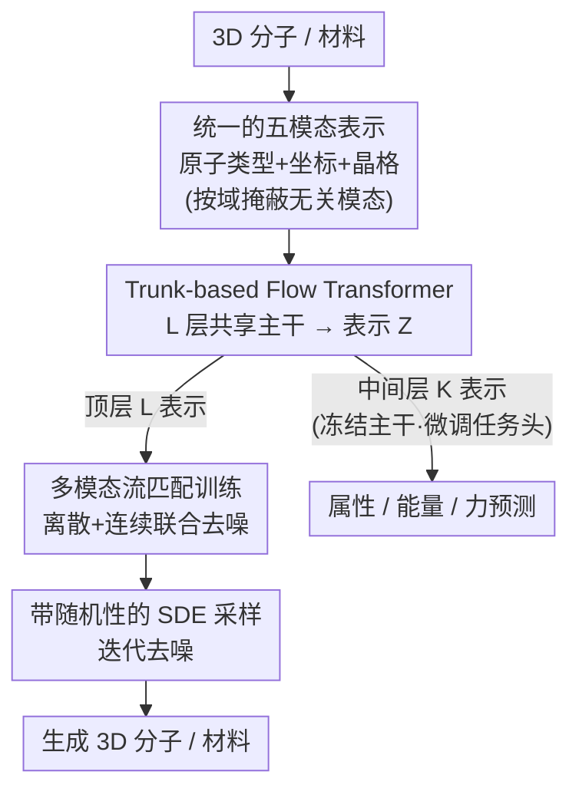

# Zatom-1: A Multimodal Flow Foundation Model for 3D Molecules and Materials

**会议**: ICLR 2026  
**arXiv**: [2602.22251](https://arxiv.org/abs/2602.22251)  
**代码**: 开源（fully open-source）  
**领域**: 计算生物
**关键词**: 基础模型, 流匹配, 3D分子, 3D材料, 多模态生成, 属性预测

## 一句话总结
Zatom-1是首个端到端全开源的基础模型，通过多模态流匹配(multimodal flow matching)统一了3D分子和材料的生成建模与属性预测，使用标准Transformer架构在欧几里得空间直接建模离散原子类型和连续3D几何，实现了跨化学域的正迁移学习。

## 研究背景与动机

**领域现状**：AI驱动的化学建模已取得重大突破（AlphaFold等），但现有方法通常针对单一领域（分子或材料）和单一任务（生成或预测）进行优化，限制了表示共享和迁移学习。

**现有痛点**：(1) 分子和材料的生成模型分开训练，无法利用跨域数据的互补信息。(2) 稀疏图神经网络架构和手工设计的生成先验限制了扩展性和推理速度。(3) 生成和预测任务使用不同模型，无法共享表示。

**核心矛盾**：3D化学系统包含离散（原子类型）和连续（3D坐标、晶格参数）多种模态，如何在统一框架下同时建模这些模态？如何让生成预训练为下游预测任务提供好的初始化？

**本文目标**：构建一个统一的基础模型，能同时进行3D分子和材料的生成建模和表示学习，实现跨域正迁移。

**切入角度**：将生成建模视为化学表示学习的理想预训练任务，采用标准Transformer架构 + 多模态流匹配，在环境全原子空间 $\mathbb{R}^3$ 中直接建模。

**核心 idea**：用多模态流匹配在统一的Transformer中联合建模离散原子类型和连续3D几何，预训练后可微调用于多任务属性预测。

## 方法详解

### 整体框架
Zatom-1要解决的核心问题是：3D分子和材料本来分属两套建模范式（前者非周期、后者周期），生成与预测又各用一套模型，数据和表示无法互通。它的做法是把这些差异全部塞进同一套五模态输入格式，再用同一个标准Transformer——Trunk-based Flow Transformer (TFT)——把整个流程跑完。TFT是一个 $L$ 层编码器主干，它从含噪输入里抽出共享表示，这套表示有两个出口：训练分两步走，第一步用顶层表示做多模态流预训练，让模型学会从噪声生成合法的3D分子和材料；第二步冻结主干、只在某中间层 $K$ 的表示上挂任务头微调，预测能量、力和分子属性。正因为生成与预测共用一个主干，生成预训练学到的几何先验能直接迁移给预测任务，这也是本文跨域正迁移的来源。

### 关键设计

**1. 统一的五模态表示：让一个模型同时吃下周期材料和非周期分子**

分子和材料的几何描述天然不同——材料有晶格、要考虑周期性，分子没有。为了让单一模型通吃，Zatom-1把任何一个化学系统都拆成五种模态：原子类型 $\bm{A} \in \mathbb{Z}^{1 \times N}$（离散）、3D坐标 $\bm{X} \in \mathbb{R}^{3 \times N}$、分数坐标 $\bm{F} \in [0,1)^{3 \times N}$、晶格长度 $\bm{L}_{\text{len}} \in \mathbb{R}^{3 \times 1}$、晶格角度 $\bm{L}_{\text{ang}} \in \mathbb{R}^{3 \times 1}$。处理分子时把晶格相关的三种模态掩蔽掉，处理材料时则掩蔽3D坐标。这样同一套token格式就覆盖了两个化学域，跨域数据可以共享一个模型，也为后面的正迁移打下基础。

**2. Trunk-based Flow Transformer (TFT)：一个共享主干同时供生成和预测取用**

有了统一表示，还需要一个既能生成又能预测的主干，否则又会退回"两套模型"的老路。TFT用 $L$ 层Transformer编码器把输入压成共享表示 $\bm{Z}$，再用残差交叉注意力解码器为每种模态分别预测去噪输出。它的巧思在于分层取表示：第 $L$ 层（顶层）表示用于生成去噪（预训练阶段），第 $K$ 层（中间层）表示则在微调阶段冻结主干后挂上任务头，预测属性、能量、力——论文发现顶层 $K=L$ 更适合3D分子任务、中间层 $K=L/2$ 更适合材料任务。这意味着同一个主干既是生成器又是特征提取器，生成预训练学到的几何先验可以直接迁移给预测头。整个主干用的是标准Transformer组件（QK Normalization、Flash Attention、SwiGLU FFN），没有领域特定的等变GNN，因此能享受到可预测的参数缩放规律——堆参数就稳定涨点。

**3. 多模态流匹配训练：用一套流匹配目标同时生成离散原子和连续几何**

主干要学会生成，就得有一个能同时管离散原子类型和连续几何的训练目标。3D系统里既有离散量（原子类型）又有连续量（坐标、晶格），二者得用不同的流匹配公式。连续模态走欧几里得CFM，在数据和噪声之间线性插值 $\bm{X}_t = t \cdot \bm{X} + (1-t) \cdot \epsilon$，训练目标是回归到真实端点：

$$L_{\text{metric}}(\bm{X}) = \mathbb{E}_{\epsilon,t}\left[\frac{1}{N}\|\bm{X}' - \bm{X}\|_2^2\right]$$

离散模态走Discrete CFM，在真实类别 $\delta(\bm{A})$ 和均匀分布之间插值 $\bm{A}_t \sim \text{Cat}(t \cdot \delta(\bm{A}) + (1-t) \cdot \delta(\frac{1}{\#\text{atom types}}))$，用交叉熵把噪声态拉回真实原子类型：

$$L_{\text{discrete}}(\bm{A}) = \mathbb{E}_t\left[-\sum_i a_i \log(a_i')\right]$$

关键在于两者都采用直接预测端点的formulation——模型直接输出干净的目标而非速度场。这种写法在科学应用里表现更稳，更重要的是它绕开了latent diffusion那套需要预训练自编码器的pipeline，直接在原始的全原子空间 $\mathbb{R}^3$ 里建模，训练和推理都因此大幅提速。

**4. 带随机性的SDE采样：在确定性ODE之上注入可控噪声提升多样性**

预训练好的模型在采样时若走纯ODE，轨迹是确定的，容易塌缩到少数模式。Zatom-1对连续模态改用SDE采样，在速度场 $\mathbf{v}_t$ 和score $\mathbf{s}_t$ 之外叠加一个布朗扰动项：

$$\mathbf{z}_t \leftarrow (\mathbf{v}_t + \mathbf{s}_t + d\mathbf{W}_t)\Delta t, \quad d\mathbf{W}_t \leftarrow \sqrt{2\gamma_g g(t)}\mathcal{N}(0,I)$$

其中 $\gamma_g$ 控制随机性强度，$g(t)$ 是噪声调度。离散模态则按categorical分布采样。这点额外随机性让生成样本更多样，采样质量也随之提升。

### 损失函数 / 训练策略
总损失 $L_{\text{total}} = L_{\text{metric}}(\bm{X}) + L_{\text{metric}}(\bm{F}) + L_{\text{metric}}(\bm{L}_{\text{len}}) + L_{\text{metric}}(\bm{L}_{\text{ang}}) + \lambda_{\text{discrete}} \cdot L_{\text{discrete}}(\bm{A})$，其中 $\lambda_{\text{discrete}} = 0.1$。时间采样 $t \sim \text{Beta}(1.8, 1)$，损失缩放 $\beta(t) = \min\{100, \frac{1}{(1-t)^2}\}$。训练时随机旋转和平移输入数据用于数据增强。模型规模300M参数，单A100生成10,000样本不到4分钟。

## 实验关键数据

### 主实验（材料生成 - MP20数据集）

| 方法 | Match Rate ↑ | RMSD ↓ | 推理时间 |
|------|-------------|--------|---------|
| DiffCSP | - | - | 慢 |
| FlowMM (500M) | 基准 | 基准 | ~50分钟/10K |
| **Zatom-1 (300M)** | **竞争力** | **竞争力** | **<4分钟/10K** |

### 分子生成（QM9 + GEOM-Drugs）

| 方法 | QM9 Stability ↑ | GEOM-Drugs Validity ↑ |
|------|-----------------|----------------------|
| EDM | 基准 | 基准 |
| **Zatom-1** | **SOTA** | **SOTA** |

### 属性预测（QM9 Multi-task）

Zatom-1在QM9多任务属性预测上达到SOTA，证明生成预训练可以为预测任务提供有效的表示初始化。

### 消融实验

| 配置 | 说明 |
|------|------|
| 仅分子预训练 → 分子属性预测 | 基准 |
| 分子+材料联合预训练 → 分子属性预测 | **更好**（跨域正迁移） |
| 无预训练 → 属性预测 | 明显更差 |

### 关键发现
- **跨域正迁移**：在预训练中加入材料数据可以提升分子属性预测精度，这是首次在化学基础模型中观察到的正迁移
- **12.5x推理速度**：相比500M参数的latent diffusion基线（FlowMM），300M的Zatom-1实现12.5倍加速
- **3x训练节省**：相比latent diffusion方法，因无需预训练自编码器，GPU训练小时减少3倍
- **可预测的缩放**：随着模型参数从50M增至300M，生成和预测性能均可预测地提升

## 亮点与洞察
- **范式统一**：首次在单一模型中统一了分子/材料的生成和预测，证明了"生成即预训练"在化学领域的可行性。这一思路可推广到蛋白质、晶体等其他科学领域
- **去latent化设计**：直接在环境空间建模，避免了latent diffusion需要的自编码器，大幅简化pipeline且提速。这与视觉领域"latent优于pixel"的趋势形成有趣对比
- **标准化架构**：使用标准Transformer而非领域特定的等变GNN，说明足够大的数据增强+标准架构可以替代手工等变性设计
- **O(3)等变变体Platom-1**：还实验了等变版本的Platonic Transformer变体，展示了灵活性

## 局限与展望
- 当前只支持最多约200原子的系统（受token长度限制），无法处理蛋白质等大分子
- 材料生成仍主要在MP20数据集上评估，高温高压等极端条件的泛化未知
- 预训练数据的组合（分子vs材料的比例）对下游性能的影响需进一步研究
- 可以探索与大语言模型结合，实现文本条件的分子设计

## 相关工作与启发
- **vs FlowMM**: FlowMM也用flow matching做材料生成，但使用稀疏GNN且不支持属性预测。Zatom-1用标准Transformer + 统一框架实现13x推理加速
- **vs EDM/GeoLDM**: 这些分子生成方法不支持材料，也缺乏预测能力。Zatom-1在QM9上超越它们
- **vs AlphaFold3**: AlphaFold3启发了"用标准Transformer学习科学数据"的思路，Zatom-1将其推广到化学生成

## 评分
- 新颖性: ⭐⭐⭐⭐⭐ 首个统一分子/材料生成+预测的基础模型，跨域正迁移是重要发现
- 实验充分度: ⭐⭐⭐⭐ 多数据集多任务评估，有缩放实验和消融分析
- 写作质量: ⭐⭐⭐⭐ 思路清晰，动机充分，但部分细节在附录中
- 价值: ⭐⭐⭐⭐⭐ 对科学AI的基础模型研究有重要推动，开源贡献大

<!-- RELATED:START -->

## 相关论文

- [\[NeurIPS 2025\] Multimodal 3D Genome Pre-training](../../NeurIPS2025/computational_biology/multimodal_3d_genome_pre-training.md)
- [\[AAAI 2026\] Distributional Priors Guided Diffusion for Generating 3D Molecules in Low Data Regimes](../../AAAI2026/computational_biology/distributional_priors_guided_diffusion_for_generating_3d_molecules_in_low_data_r.md)
- [\[ICLR 2026\] SynCoGen: Synthesizable 3D Molecule Generation via Joint Reaction and Coordinate Modeling](syncogen_synthesizable_3d_molecule_generation_via_joint_reaction_and_coordinate_.md)
- [\[NeurIPS 2025\] Iterative Foundation Model Fine-Tuning on Multiple Rewards](../../NeurIPS2025/computational_biology/iterative_foundation_model_fine-tuning_on_multiple_rewards.md)
- [\[NeurIPS 2025\] Manipulating 3D Molecules in a Fixed-Dimensional E(3)-Equivariant Latent Space](../../NeurIPS2025/computational_biology/manipulating_3d_molecules_in_a_fixed-dimensional_e3-equivariant_latent_space.md)

<!-- RELATED:END -->
