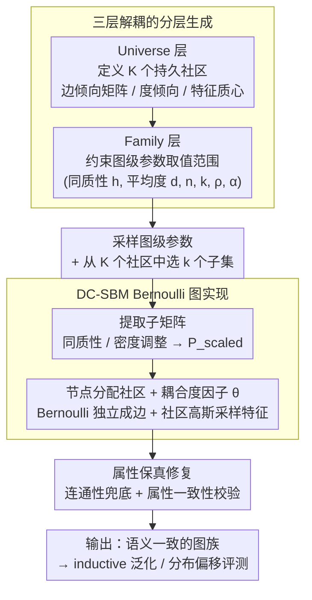

# GraphUniverse: Synthetic Graph Generation for Evaluating Inductive Generalization

**会议**: ICLR2026  
**arXiv**: [2509.21097](https://arxiv.org/abs/2509.21097)  
**代码**: [GitHub](https://github.com/LouisVanLangendonck/GraphUniverse)  
**领域**: 图学习  
**关键词**: synthetic graph generation, inductive generalization, graph benchmarking, stochastic block model, distribution shift

## 一句话总结
提出 GraphUniverse 框架，通过分层生成具有持久语义社区的图族（graph families），首次实现对图学习模型归纳泛化能力的系统性评估，揭示了 transductive 性能无法可靠预测 inductive 泛化能力这一关键发现。

## 背景与动机

**领域现状**：图学习领域的基准评测存在根本性缺陷——现有合成图生成工具（如 GraphWorld）仅能生成独立的单图，评测局限于 transductive 设置（模型在同一图结构上训练和测试）。这使得以下两项被公认为构建图基础模型所必需的能力无法被评估：(1) **归纳泛化**，即模型对未见过的全新图的泛化能力；(2) **分布偏移鲁棒性**，即图属性（同质性、度分布等）发生变化时的性能稳定性。

**现有痛点**：近期的批评性分析（Bechler-Speicher et al., 2025; Wang et al., 2025）指出，现有静态基准数据集覆盖不足、属性不可调、对异质图支持有限，严重阻碍了图学习模型向通用化发展。

**本文目标**：如何生成结构可控、语义一致的多图族，使同一组社区语义贯穿整族图，从而系统性地评估图学习模型的归纳泛化能力和分布偏移鲁棒性。

## 方法详解

### 整体框架

GraphUniverse 把"生成一族语义一致的图"拆成三个层级——Universe 层固定一组贯穿全族的持久社区，Family 层约束每张图的属性可取范围，Graph 层在范围内采样得到具体图实例。关键在于全局社区属性（连接模式、度倾向、特征质心）在 Universe 层一次定义、被所有图共享，从而让同一个"社区 $k$"在不同图里保持相同语义。在此之上，Graph 层用 Degree-Corrected SBM 的 Bernoulli 方式把目标参数真正落成一张满足约束的图，再做一道属性保真修复保证连通与一致，最终产出一族"共享同一套社区、但结构各异"的图——这正是 inductive 设置下跨图迁移评测所需要的受控基础。

### 关键设计

**1. 三层解耦的分层生成：把"什么是社区"和"这张图长什么样"分开**

现有工具（GraphWorld）每次独立采一张图，社区语义无法跨图复用，因此只能做 transductive 评测。GraphUniverse 在最上层的 Universe 定义 $K$ 个持久社区，每个社区携带三类属性：编码社区间连接强度的边倾向矩阵 $\tilde{\mathbf{P}} \in \mathbb{R}^{K\times K}$，通过 $\tilde{P}_{rs}=1+\xi_{rs}$（$\xi_{rs}\sim\mathcal{N}(0,(2\epsilon)^2)$）注入异质性；刻画节点连接倾向的社区级度倾向向量 $\boldsymbol{\delta}\in[-1,1]^K$，$\delta_k=-1$ 表示该社区偏低度、$+1$ 偏高度；以及决定节点特征的社区质心 $\boldsymbol{\mu}_k\sim\mathcal{N}(\mathbf{0},\sigma_{\text{center}}^2\mathbf{I}_d)$，节点特征再从 $\mathcal{N}(\boldsymbol{\mu}_k,\sigma_{\text{cluster}}^2\mathbf{I}_d)$ 采样。中间的 Family 层只规定图级参数的取值范围——同质性 $h$、平均度 $d$、节点数 $n$、社区数 $k$、度分离度 $\rho$、幂律指数 $\alpha$；最底层的 Graph 层从该范围采样并继承 Universe 社区属性，生成单张图。这样结构属性可以在 Family 层自由扰动，而社区语义在 Universe 层保持恒定，二者互不干扰，跨图的"同一个社区"才有了恒定含义。

**2. 基于 DC-SBM 的 Bernoulli 图实现：让采样出的图真正满足目标属性**

给定一张图的参数后，生成分四步落地：先从 Family 范围均匀采样 $(n,k,h,d,\rho,\alpha)$；再从 Universe 的 $K$ 个社区里随机选 $k$ 个子集；接着提取对应子矩阵并做同质性调整与密度调整，使其满足目标的 $h$、$d$ 约束；最后把节点均匀分配到社区，将幂律度因子 $\theta_i$ 与社区度倾向耦合得到每个节点的度，按 Bernoulli 概率

$$P_{ij}=\min\!\big(1,\ \theta_i\theta_j\,\mathbf{P}_{\text{scaled}}[c(i),c(j)]\big)$$

独立成边，并从社区高斯分布采样节点特征。这里特意采用 Degree-Corrected SBM 的 Bernoulli 重构而非传统的 Poisson 多图采样：Poisson 会产生多重边，折叠成简单图后实际属性与设定值发生偏移，导致"参数设了却生成不出来"；而 Bernoulli 单边采样直接对齐目标属性，是受控评测能成立的前提。

**3. 属性保真修复：保证生成的图既符合约束又结构合理**

受控评测要求生成图的属性精确可信，因此在图实现后还要做一致性兜底——当图出现断开的连通分量时，添加对目标块结构偏差最小的边把它们连起来，既保证连通又尽量不破坏设定的社区结构。整套流程是线性时间复杂度，100 节点图约 23ms、1000 节点图约 1.3s，使得大规模批量生成图族在实践中可行。

### 一个完整示例

以生成一张目标图为例，可以看清参数如何从三层逐级流到边：Universe 层先定好 $K=10$ 个持久社区及其 $\tilde{\mathbf{P}}$、$\boldsymbol{\delta}$、$\boldsymbol{\mu}_k$；Family 层规定这族图的同质性落在某区间、节点数 50–200；轮到具体一张图时，先采得 $(n,k,h,d,\rho,\alpha)$，例如 $n=150,k=5$；从 10 个社区里挑出 5 个，取出它们之间的 $5\times5$ 子矩阵并按目标 $h$、$d$ 缩放成 $\mathbf{P}_{\text{scaled}}$；150 个节点均匀分到 5 个社区，每个节点拿到耦合后的度因子 $\theta_i$；逐对节点按 $P_{ij}=\min(1,\theta_i\theta_j\mathbf{P}_{\text{scaled}}[c(i),c(j)])$ 掷 Bernoulli 决定连边；特征按各自社区质心采样。换一张图时社区语义不变、只重采图级参数，于是整族图共享"同一套社区"但结构各异——这正是 inductive 评测所需要的设置。

## 实验关键数据

### RQ1: Inductive vs. Transductive 性能差异
- 在社区检测任务上系统比较了 9 种架构（DeepSet、GraphMLP、GCN、GraphSAGE、GIN、GATv2、TopoTune、Neural Sheaf Diffusion、GPS）
- **核心发现**：模型排名在两种设置间显著不同。Neural Sheaf Diffusion 在 inductive 设置下表现优异但 transductive 下表现一般；GIN 在 transductive 下表现最好但 inductive 下失败
- Transductive 设置会放大图属性（同质性、平均度）对性能的影响

### RQ2: 分布偏移鲁棒性
- 对同质性 (±0.1)、平均度 (±4)、节点数 (±200) 进行受控偏移测试
- **核心发现**：鲁棒性不是模型固有属性，而是架构与图属性交互的结果。相同偏移在不同训练域可产生相反效果（如增加同质性在低同质性域下损害性能，在中等域下提升性能）

### RQ3: 图大小泛化
- 训练图：50-200 节点；测试图：250-400 和 550-700 节点
- 节点级任务（社区检测）：性能下降仅约 2%
- 图级任务（三角形计数）：传统 MPNN（如 GIN）无法泛化到更大图，GPS 和 NSD 可保持性能

### RQ4: 对真实数据的预测能力
- 在 5 个真实 inductive 数据集上验证
- GraphUniverse 与真实数据集的模型排名相关性显著高于 GraphWorld，对所有数据集均为正相关；GraphWorld 对半数数据集为负相关

## 亮点与洞察
1. **填补关键空白**：首个支持 inductive 图学习系统评估的合成图生成框架，解决了该领域长期缺乏多图基准的问题
2. **持久语义社区设计**：通过分层架构保证跨图语义一致性，同时允许结构属性的精细控制——这是区别于 GraphWorld 的核心创新
3. **揭示评测范式偏差**：transductive 性能不能可靠预测 inductive 泛化能力，这一发现对图学习领域的评测文化有重要影响
4. **鲁棒性分析框架**：提供了受控分布偏移测试能力，发现模型鲁棒性高度依赖于架构与初始图域的交互，非固有属性
5. **工程完整度高**：PyPI 包、TopoBench 集成、Streamlit 交互工具、完善的验证体系

## 局限与展望
1. **生成模型限制**：基于 DC-SBM，缺乏高阶结构（如三角形、团）的精细控制，无法完全模拟真实网络的丰富拓扑特征
2. **社区结构假设**：默认均匀社区大小分配，真实网络中社区大小通常服从幂律分布
3. **特征生成过于简单**：社区特征为各向同性高斯分布，真实场景中特征分布可能更复杂（多模态、非高斯）
4. **任务覆盖有限**：实验仅涵盖节点分类和图级回归，缺少链接预测、图分类等重要任务
5. **扩展到大规模图的验证不足**：最大实验规模为 1000 节点，对万级以上节点图的表现尚未验证

## 相关工作与启发

| 方法 | 多图生成 | 语义一致性 | 属性可控 | Inductive 评估 |
|------|---------|-----------|---------|---------------|
| GraphWorld | ✗ | ✗ | ✓ | ✗ |
| OGB | ✗ (固定数据集) | N/A | ✗ | 部分 |
| GOOD | ✗ (固定数据集) | N/A | ✗ | ✓ (OOD 分割) |
| CGT | ✗ | ✗ | ✓ | ✗ |
| **GraphUniverse** | **✓** | **✓** | **✓** | **✓** |

GraphUniverse 的核心优势在于同时支持多图生成和跨图语义一致性，使得 inductive 设置下的受控实验首次成为可能。

## 相关工作与启发
- 该框架的分层生成思想可推广到其他结构化数据（如分子图、点云），构建通用的合成数据生成管线
- "Transductive ≠ Inductive" 的发现提示在图基础模型开发中需要重新审视现有评测方案
- 受控分布偏移测试为理解 GNN 的泛化机制提供了新的实验工具，与 OOD 泛化理论研究互补
- 合成图作为真实数据代理的验证结果，为图基础模型的大规模预训练数据准备提供了新思路

## 评分
- 新颖性: ⭐⭐⭐⭐ — 首个面向 inductive 泛化评估的合成图族生成框架，填补重要空白
- 实验充分度: ⭐⭐⭐⭐⭐ — 4 个研究问题覆盖全面，验证体系严谨，真实数据对比令人信服
- 写作质量: ⭐⭐⭐⭐ — 结构清晰，动机充分，技术细节完善
- 价值: ⭐⭐⭐⭐ — 对图学习评测范式的反思具有长远价值，开源工具链对社区贡献显著

<!-- RELATED:START -->

## 相关论文

- [\[ACL 2026\] Evaluating LLMs on Large-Scale Graph Property Estimation via Random Walks](../../ACL2026/graph_learning/evaluating_llms_on_large-scale_graph_property_estimation_via_random_walks.md)
- [\[ICML 2026\] What Structural Inductive Bias Helps Transformers Reason Over Knowledge Graphs? A Study with Tabula RASA](../../ICML2026/graph_learning/what_structural_inductive_bias_helps_transformers_reason_over_knowledge_graphs_a.md)
- [\[ICLR 2026\] RAS: Retrieval-And-Structuring for Knowledge-Intensive LLM Generation](ras_retrieval-and-structuring_for_knowledge-intensive_llm_generation.md)
- [\[ACL 2026\] MegaRAG: Multimodal Knowledge Graph-Based Retrieval Augmented Generation](../../ACL2026/graph_learning/megarag_multimodal_knowledge_graph-based_retrieval_augmented_generation.md)
- [\[CVPR 2025\] Universal Scene Graph Generation](../../CVPR2025/graph_learning/universal_scene_graph_generation.md)

<!-- RELATED:END -->
