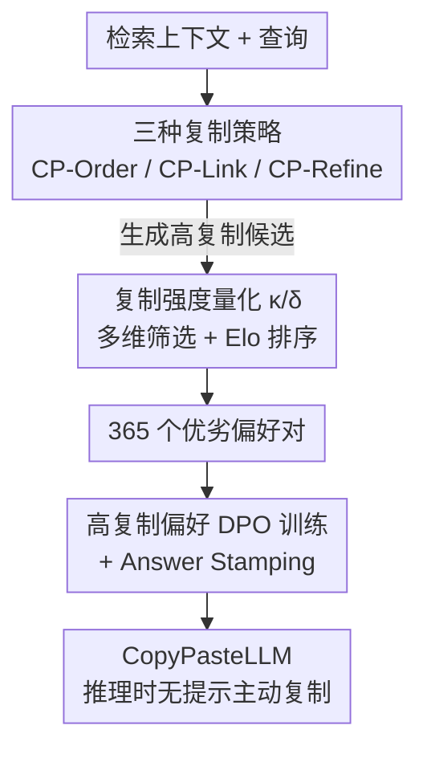

# Copy-Paste to Mitigate Large Language Model Hallucinations

**会议**: ICLR 2026  
**arXiv**: [2510.00508](https://arxiv.org/abs/2510.00508)  
**代码**: [https://github.com/longyongchao/CopyPasteLLM](https://github.com/longyongchao/CopyPasteLLM)  
**领域**: 幻觉检测  
**关键词**: 幻觉缓解, RAG, 复制粘贴, DPO, 忠实性

## 一句话总结
提出 Copy-Paste 生成范式，通过训练 LLM 优先直接复制检索上下文中的片段来生成回答，而非自由改写，配合高复制偏好的 DPO 训练，在反事实 RAG 基准上将忠实度从 80.2% 提升到 92.8%。

## 研究背景与动机

**领域现状**：RAG（检索增强生成）通过为 LLM 提供外部上下文来减少幻觉，但 LLM 在生成回答时经常"改写"而非直接引用上下文，导致信息扭曲和幻觉。

**现有痛点**：LLM 的改写过程引入两类幻觉——"Twist"（扭曲上下文中的事实）和"Causal"（因果链上游错误传播到下游）。引用标注方法只标记来源但不改变生成方式。

**核心矛盾**：高度流畅的改写和高度忠实的复制之间存在权衡——改写虽然读起来流畅，但每一次改写都是幻觉的风险点。

**本文目标** 能否让 LLM 在保持可读性的同时，尽可能直接复制上下文片段？

**切入角度**：从注意力锚定角度分析——如果上一个生成 token 是从上下文复制的，那么下一个 token 的查询向量与上下文键向量强相关，自然倾向于继续复制。

**核心 idea**：训练 LLM 建立"高复制偏好"——通过 DPO 让模型偏好直接嵌入上下文片段的回答风格。

## 方法详解

### 整体框架

整套流程分两阶段：先用 Copy-Paste-Prompting 把一个普通 LLM 引导出大量"高复制率"的候选回答，再用一套多维度筛选 + Elo 排序的流水线挑出最优劣对，喂给 DPO 把"优先复制"的偏好固化进模型权重。换句话说，前半段靠提示工程造数据，后半段靠偏好训练让模型把复制变成默认习惯，最终得到的 CopyPasteLLM 在推理时无需任何特殊提示就会主动嵌入上下文原文。

### 关键设计

**1. 三种复制策略：在忠实与流畅之间铺出梯度**

直接命令模型"照抄上下文"往往得到生硬甚至语法断裂的回答，因此本文设计了三档逐渐放松的复制策略，让数据覆盖从"严格抽取"到"高质量改写"的整个谱系。CP-Order 最严格，只允许重排上下文里的相关原句、不许新增任何词，保证每个 token 都可溯源；CP-Link 在此基础上放开一点，允许插入不超过 15 词的过渡短语来连接被复制的片段，解决纯抽取读起来跳跃的问题；CP-Refine 则跑一个 writer-reviewer 迭代循环，最多 5 轮反复精化，在尽量维持高复制率的前提下把可读性拉满。三档策略并存的意义在于：后续 DPO 需要的是"复制多 vs 复制少"的对比信号，三种策略天然提供了不同复制强度的样本，让偏好对的构造有梯度可选。

**2. 复制强度量化：用两个指标把"抄了多少"算清楚**

要训练模型偏好复制，先得能度量复制。本文定义两个指标：Copy Coverage $\kappa$ 衡量回答中来自上下文的 token 占比，回答的"原文含量"越高 $\kappa$ 越大；Copy Density $\delta$ 则对连续复制片段的长度做平方加权，即一段长连续原文的贡献远大于若干零散短词。区分这两个量是关键——实验发现 $\delta$ 比 $\kappa$ 更能预测忠实性，因为长连续片段意味着模型搬运的是完整语义单元，而高覆盖率也可能是大量碎片化拼贴，反而更容易在拼接处引入扭曲。两个指标共同作为后续筛选偏好对的核心打分维度。

**3. 高复制偏好的 DPO 训练：把习惯固化进权重，并用 Answer Stamping 兜底**

最后用 DPO 把复制偏好写进模型。偏好对的筛选是多维度的：AlignScore 与 MiniCheck 把关忠实性，$\kappa$、$\delta$ 衡量复制强度，再叠加查询相关性与流畅度，多个维度联合 Elo 排序后选出优劣分明的样本对。值得注意的是整个训练只用了 365 个高质量偏好对——之所以如此数据高效，是因为"复制还是改写"主要是生成风格的偏好问题而非能力问题，少量对比信号就足以扭转默认行为。但纯复制有个副作用：模型可能把上下文整段搬过来却漏掉最终该给出的答案，于是引入 Answer Stamping——在回答末尾显式附加正确答案。这一步看似简单却至关重要，消融显示去掉它后准确率从 92.8% 暴跌到 45.1%，因为它在不牺牲复制忠实度的前提下补回了回答的完整性。

## 实验关键数据

### 主实验

| 数据集 | 模型 | 方法 | 准确率 |
|--------|------|------|--------|
| FaithEval (反事实) | Llama-3-8B | Context-DPO | 80.2% |
| FaithEval (反事实) | Llama-3-8B | **CopyPasteLLM** | **92.8%** |
| ConFiQA-MC | Llama-3-8B | Attributed | 37.3% |
| ConFiQA-MC | Llama-3-8B | **CopyPasteLLM** | **82.5%** |

### 消融实验

| 变体 | FaithEval | 说明 |
|------|----------|------|
| w/o 复制偏好 | 71.2% | 无高复制训练数据 |
| w/o Answer Stamping | 45.1% | 复制过多导致答案丢失 |
| **CopyPasteLLM** | **92.8%** | 完整方法 |

### 关键发现
- Answer Stamping 至关重要——没有它准确率从 92.8% 暴跌到 45.1%
- 仅需 365 个偏好对即可有效训练，数据效率极高
- Copy Density 比 Coverage 更好地预测忠实性，长连续片段比短碎片更可靠

## 亮点与洞察
- **注意力锚定理论**：复制操作在注意力机制层面有天然优势——上一 token 复制自上下文时，键值向量自然引导继续复制，形成"复制惯性"。
- **极少数据高效训练**：365 个样本的 DPO 就能显著改变生成风格，说明"复制 vs 改写"主要是偏好问题而非能力问题。
- **Answer Stamping 的必要性**：提示模型在末尾显式给出答案，平衡了复制忠实性和回答完整性。

## 局限与展望
- 高复制率可能降低回答的自然度和可读性
- 仅在英文 RAG 任务上验证，跨语言效果未知
- Copy-Paste 策略对需要推理综合的问题（非直接查找）可能不适用

## 相关工作与启发
- **vs Context-DPO**: 同为 DPO 方法，但 Context-DPO 不强调复制偏好，本文显式优化复制
- **vs Attributed LLM**: 仅标注引用来源但不改变生成方式，本文从生成方式本身入手

## 评分
- 新颖性: ⭐⭐⭐⭐ "复制优先于改写"的理念新颖且反直觉
- 实验充分度: ⭐⭐⭐⭐ 多数据集多模型验证，消融清晰
- 写作质量: ⭐⭐⭐⭐ 注意力锚定分析有趣
- 价值: ⭐⭐⭐⭐⭐ 实用价值高，RAG 系统可直接采用

<!-- RELATED:START -->

## 相关论文

- [\[ACL 2025\] Hallucination Detox: Sensitivity Dropout (SenD) for Large Language Model Training](../../ACL2025/hallucination/hallucination_detox_send.md)
- [\[CVPR 2026\] VES-RFT: Rewarding Visual Evidence Sensitivity to Mitigate Hallucinations in Large Vision-Language Models](../../CVPR2026/hallucination/ves-rft_rewarding_visual_evidence_sensitivity_to_mitigate_hallucinations_in_larg.md)
- [\[ICLR 2026\] Dynamic Multimodal Activation Steering for Hallucination Mitigation in Large Vision-Language Models](dynamic_multimodal_activation_steering_for_hallucination_mitigation_in_large_vis.md)
- [\[ICML 2026\] Revis: Sparse Latent Steering to Mitigate Object Hallucination in Large Vision-Language Models](../../ICML2026/hallucination/revis_sparse_latent_steering_to_mitigate_object_hallucination_in_large_vision-la.md)
- [\[ACL 2025\] Retrieval Visual Contrastive Decoding to Mitigate Object Hallucinations in Large Vision-Language Models](../../ACL2025/hallucination/retrieval_visual_contrastive_decoding_to_mitigate_object_hallucinations_in_large.md)

<!-- RELATED:END -->
