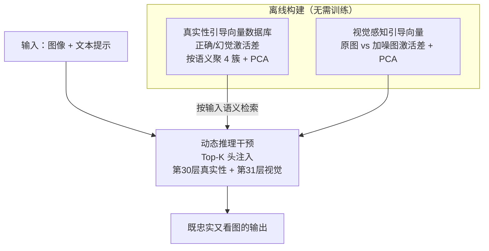

# Dynamic Multimodal Activation Steering for Hallucination Mitigation in Large Vision-Language Models

**会议**: ICLR 2026  
**arXiv**: [2602.21704](https://arxiv.org/abs/2602.21704)  
**代码**: 无  
**领域**: 幻觉检测  
**关键词**: 幻觉缓解, 激活工程, 注意力头干预, 无训练方法, 大视觉语言模型

## 一句话总结
提出动态多模态激活引导（DMAS），通过构建基于语义的真实性引导向量数据库和视觉感知引导向量，在推理时动态选择最相关的引导向量对关键注意力头进行干预，无需训练即可显著缓解LVLM幻觉，在MME上提升94.66分，在CHAIR上降低20.2%幻觉率。

## 研究背景与动机
大视觉语言模型（LVLM）在VQA、图像描述等任务上表现出色，但存在严重的幻觉问题——编造不存在的物体或错误描述图像内容。现有方法分为两类：训练方法需要精心标注数据和大量算力（如LRV、RLHF-V），解码方法（如VCD、ICD）虽然不需训练但往往损害生成质量。

近期的激活工程方法（如ICT、VTI）尝试通过干预模型内部表示来减少幻觉，但存在关键不足：ICT仅关注视觉层面干预，忽略了LVLM的多模态特性；VTI使用固定的引导向量，忽略了不同语义上下文下引导向量的差异。

**核心发现**：作者通过分析LLaVAv1.5的注意力模式，发现两个关键现象：(1) 真实性能力和视觉感知能力主要激活不同的注意力头子集（真实性集中在第30层，视觉感知集中在第31层）；(2) 真实性引导向量在不同语义上下文间差异显著（t-SNE可视化显示不同语义簇明显分离）。这两个发现直接启发了动态多模态激活引导的设计。

## 方法详解

### 整体框架
DMAS 是一套无需训练、即插即用的推理时干预方案，要解决的是 LVLM"编造不存在物体、无视图像内容"的幻觉问题。它分离线、在线两个阶段：离线先建好一个按语义索引的真实性引导向量数据库，再单独提取一组视觉感知引导向量；在线时根据当前输入的语义从数据库里动态检索最匹配的真实性向量，连同视觉向量一起注入到激活差异最大的少数注意力头上，把模型的内部表示同时推向"忠实"和"看图"两个方向，输出既不臆造又紧扣图像证据的回答。

### 关键设计

**1. 真实性引导向量数据库：让干预随语义上下文自适应**

作者发现真实性引导向量在不同语义簇间差异显著（t-SNE 上不同语义簇明显分离），单一固定向量无法覆盖，于是把数据库做成可检索的形式。具体地，从 AMBER 和 SEED 数据集中取样并按语义聚类成 4 簇（聚类数 4 在两个模型上都最优，更少则语义粒度过粗）；对每个样本构造一对正确/幻觉回答，分别送入 LVLM 取最后一个 token 在各层各注意力头的激活 $A_{pos}$ 与 $A_{neg}$，簇内对二者之差求平均得到该簇的引导向量 $D_i = \frac{1}{|C_i|}\sum_{j \in C_i}(A_{pos,j} - A_{neg,j})$，再用 PCA 降噪保留主成分。最终以每簇的平均句嵌入为 Key、引导向量为 Value 构成 Key-Value 库；推理时把输入文本编码后与各 Key 算语义相似度，检索出最贴合当前上下文的那条向量，避免"一刀切"式干预在某些子任务上反而失效。

**2. 视觉感知引导向量：强行拉高模型对图像证据的关注**

仅靠真实性方向不足以纠正"无视图像内容"这类幻觉，所以额外构造一个视觉维度的向量。给定原始图像 $V$ 和经前向扩散加噪得到的 $V'$，用 YOLOv11 检测物体并生成描述模板，再对比原始输入 $(V, T+Y_O)$ 与扰动输入 $(V', T+Y_{O'})$ 在注意力头上的激活差 $D_v = A_v - A_{v'}$，同样经 PCA 提取主成分。由于 $V'$ 视觉信息被破坏而文本提示保留，二者之差恰好编码了"依赖图像证据"的方向，注入它能让模型更看重视觉输入。

**3. 动态推理干预：只动该动的少数头**

真实性能力集中在第 30 层、视觉感知集中在第 31 层，且分属不同注意力头子集，因此干预无需全局施加。推理时检索得到真实性向量 $D_f$，并分别为两个维度构造二值掩码 $M_f$、$M_v$，仅在激活差异最大的 Top-K 个头上生效，注意力更新为 $\mathbf{x}^{(l+1)} = \mathbf{x}^{(l)} + \text{Concat}[\text{Attn}^{(l,h)}(\mathbf{x}^{(l)}) + \alpha \cdot M_f^{(l,h)} \cdot D_f^{(l,h)} + \beta \cdot M_v^{(l,h)} \cdot D_v^{(l,h)}] \cdot \mathbf{W}_o^{(l)}$，其中 $\alpha$、$\beta$ 控制两路干预强度。掩码的稀疏性很关键——干预头太少效果不显著，太多则会破坏模型基础能力。

### 损失函数 / 训练策略
整套方法无需任何训练，仅有少量推理超参通过网格搜索确定：干预强度 $\alpha, \beta \in \{0.5, 1, \dots, 10\}$、干预头数 $K \in \{32, 64, \dots, 1024\}$，生成时温度设为 0、top_p 为 1。实现上，Key 句嵌入用 sentence transformer（all-mpnet-base-v2）获取；视觉部分用 YOLOv11 检测图中物体，并从同类别物体库里随机挑一个不在图中的物体作为扰动对照；PCA 降噪对真实性与视觉两类向量分别应用；全部实验在单张 NVIDIA RTX 4090 上完成，离线构库需对约 3000 个样本提取激活。

## 实验关键数据

### 主实验

| 模型 | 方法 | Existence↑ | Count↑ | Position↑ | Color↑ | Total↑ |
|------|------|-----------|--------|-----------|--------|--------|
| LLaVAv1.5 | Regular | 175.67 | 124.67 | 114.00 | 151.00 | 565.33 |
| LLaVAv1.5 | ICT | 190.00 | 160.43 | 128.67 | 170.00 | 649.10 |
| LLaVAv1.5 | **DMAS** | **195.00** | **158.33** | **133.33** | **173.33** | **659.99** |
| QwenVL | Regular | 155.00 | 127.67 | 131.67 | 173.00 | 587.33 |
| QwenVL | VAF | 165.00 | 155.00 | 133.33 | 175.00 | 628.33 |
| QwenVL | **DMAS** | **170.00** | **145.00** | **133.33** | **185.00** | **633.33** |

**CHAIR结果**（LLaVAv1.5）:

| 方法 | CHAIR_S↓ | CHAIR_I↓ |
|------|----------|----------|
| Regular | 51.0 | 15.2 |
| VTI | 35.8 | 11.1 |
| **DMAS** | **30.8** | **11.4** |

### 消融实验

| 方法 | CHAIR_S↓ | CHAIR_I↓ | POPE Acc↑ | POPE F1↑ |
|------|----------|----------|-----------|----------|
| 完整DMAS | 30.8 | 11.4 | 81.70 | 82.47 |
| 仅真实性向量 | 34.2 | 11.7 | 81.67 | 82.42 |
| 仅视觉向量 | 42.4 | 13.2 | 81.40 | 82.01 |
| 无干预 | 51.0 | 15.2 | 75.08 | 76.06 |

### 关键发现
- 动态语义匹配选择引导向量显著优于固定引导向量，在QwenVL的Position子任务上，固定向量甚至不如原始模型
- 聚类数为4时两个模型均达最优；聚类过少导致语义粒度过粗
- 方法在ScienceQA和ViQuAE等完全不同类型的数据集上也有显著提升（LLaVAv1.5在ScienceQA从52.75%→62.27%），证明泛化性
- POPE实验中LLaVAv1.5在MSCOCO上Accuracy提升5.43%，F1提升7.14%；在GQA上Accuracy提升6.94%，F1提升6.5%
- $\alpha$ 和 $\beta$ 为负值时F1下降（即向幻觉方向干预），过大时模型基础能力被破坏
- 干预的注意力头数过少效果不显著，过多则也会导致性能下降

## 亮点与洞察
- 揭示了真实性和视觉感知在LVLM中激活不同注意力头子集的现象，为后续研究提供了重要依据
- 动态语义匹配的设计合理有效，避免了"一刀切"式干预的局限性
- 完全无需训练，可即插即用到不同LVLM架构
- 实验设计全面：判别任务（MME、POPE）+ 生成任务（CHAIR）+ 泛化验证（ScienceQA、ViQuAE），形成完整评估体系
- 可视化分析（注意力头激活图、t-SNE聚类图、超参数敏感性曲线）充分支撑了方法的动机和有效性

## 局限与展望
- 引导向量数据库的构建依赖AMBER和SEED数据集的特定选择，更大更多样的数据源可能进一步提升性能
- 聚类数目前固定为4，自适应确定最优聚类数是值得探索的方向
- 超参数 $\alpha, \beta, K$ 需要网格搜索，自动化调参值得研究
- 仅在7B规模模型上验证，更大规模模型（如13B、70B）的效果有待验证
- 构建引导向量数据库需要一定的预处理成本（对3000样本提取激活）
- 方法假设注意力头的分工模式在不同LVLM架构间具有一致性，该假设的普适性需更多验证

## 相关工作与启发
- **与ICT的关系**: ICT通过对图像中物体加噪来增强注意力，而DMAS从真实性和视觉感知两个维度同时干预，且支持动态语义匹配
- **与VTI的关系**: VTI使用固定引导向量，DMAS证明了动态选择的必要性
- **启发**: 激活工程这一范式值得在更多多模态任务中探索，如视觉推理、多模态对话等

## 评分
- 新颖性: ⭐⭐⭐⭐ 动态语义匹配引导向量的想法有新意，但激活工程本身已有先驱工作
- 实验充分度: ⭐⭐⭐⭐⭐ 覆盖MME/POPE/CHAIR三个基准，两个模型，消融完备，泛化性验证充分
- 写作质量: ⭐⭐⭐⭐ 写作清晰，可视化好，动机阐述自然
- 价值: ⭐⭐⭐⭐ 无训练方法的实用价值高，但聚类和超参搜索增加了部署复杂度

<!-- RELATED:START -->

## 相关论文

- [\[ACL 2025\] Activation Steering Decoding: Mitigating Hallucination in Large Vision-Language Models through Bidirectional Hidden State Intervention](../../ACL2025/hallucination/activation_steering_decoding_mitigating_hallucination_in_large_vision-language_m.md)
- [\[ICLR 2026\] Look Carefully: Adaptive Visual Reinforcements in Multimodal Large Language Models for Hallucination Mitigation](look_carefully_adaptive_visual_reinforcements_in_multimodal_large_language_model.md)
- [\[ICML 2026\] Adaptive Residual-Update Steering for Low-Overhead Hallucination Mitigation in Large Vision Language Models](../../ICML2026/hallucination/adaptive_residual-update_steering_for_low-overhead_hallucination_mitigation_in_l.md)
- [\[ICML 2026\] Revis: Sparse Latent Steering to Mitigate Object Hallucination in Large Vision-Language Models](../../ICML2026/hallucination/revis_sparse_latent_steering_to_mitigate_object_hallucination_in_large_vision-la.md)
- [\[ICLR 2026\] Copy-Paste to Mitigate Large Language Model Hallucinations](copy-paste_to_mitigate_large_language_model_hallucinations.md)

<!-- RELATED:END -->
