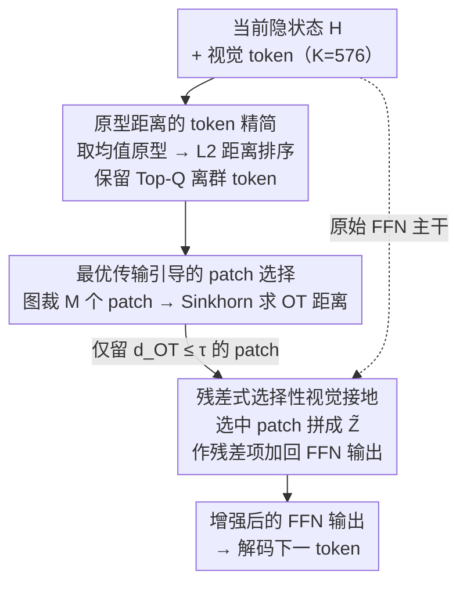

# Look Carefully: Adaptive Visual Reinforcements in Multimodal Large Language Models for Hallucination Mitigation

**会议**: ICLR 2026  
**arXiv**: [2602.24041](https://arxiv.org/abs/2602.24041)  
**代码**: 暂未公开  
**领域**: 幻觉检测  
**关键词**: MLLM幻觉缓解, 视觉增强, 最优传输, token精简, 无训练推理

## 一句话总结
提出 AIR（Adaptive vIsual Reinforcement）框架，通过原型距离的 token 精简 + 最优传输引导的 patch 选择性增强，在推理时无训练地减少 MLLM 幻觉（LLaVA-1.5-7B CHAIR_S: 22→18.4，POPE 准确率 +5.3%），同时保持多模态通用能力。

## 研究背景与动机

**领域现状**: MLLM（LLaVA、Qwen-VL 等）在视觉语言推理上取得显著进展，但仍易产生"幻觉"——生成的文本与图像内容不一致，如描述不存在的物体或产生矛盾。幻觉缓解方法主要分为训练时（需额外标注）、后处理（需外部模型）、推理时（如对比解码）三类。

**现有痛点**: 近期的视觉增强方法（如 MemVR）尝试在解码时将视觉 token 重新注入 FFN 层以强化视觉信号，但存在关键问题——**将所有视觉 token 不加区分地注入**，导致背景区域的冗余信号干扰模型对关键区域的关注，反而可能引入新的幻觉。

**核心矛盾**: 视觉 token 数量大（如 LLaVA 的 576 个），其中大量是背景冗余 token；全量注入引入噪声，不注入则视觉信号衰减——需要在"增强视觉信号"和"避免背景干扰"之间取得平衡。

**本文目标** 设计一种选择性视觉增强机制，只将与当前生成最相关的视觉 patch 注入解码过程，既强化关键视觉线索又避免冗余干扰。

**切入角度**: 观察到隐状态与不同视觉 token 的相似度差异显著——有效目标区域相似度高、背景区域低——据此设计自适应选择策略。

**核心 idea**: 用原型距离精简冗余视觉 token，用最优传输量化 patch 与隐状态的对齐程度，仅注入高对齐 patch。

## 方法详解

### 整体框架
AIR 嵌在 Transformer 每一层的 FFN 阶段，做的事情就一件——在解码当前 token 时，把"真正相关"的视觉信息以残差形式补回 FFN 输出。它先用原型距离把数百个视觉 token 精简成少数最有信息量的子集，再用最优传输衡量当前隐状态和各图像 patch 的对齐程度，只把高对齐的 patch 注入增强。整个过程无需训练，可直接挂载到 LLaVA、Qwen-VL、GLM-4V 等任意 MLLM 上。

### 关键设计

**1. 原型距离的 token 精简：先把背景冗余 token 筛掉**

LLaVA 一张图就有 576 个视觉 token，其中绝大多数编码的是天空、地面这类高度相似的背景，全量参与后续计算既慢又会引入噪声。AIR 先对所有视觉 token 取均值得到一个"原型" $h_p$，把它当作整图的平均语义中心，再按每个 token 到原型的 L2 距离 $\|h_i - h_p\|_2$ 排序，只保留距离最大的 Top-$Q$ 个（$Q \ll K$）。背景 token 彼此雷同、紧贴原型会被淘汰，而前景目标这类"离群"token 编码了独特信息、离原型远会被保留。这一步既抑制了冗余，又把后续最优传输的计算量从 $K$ 压到 $Q$。

**2. 最优传输引导的 patch 选择：只增强和当前生成对齐的区域**

精简之后还要回答"该补哪块图像区域"。AIR 把原图裁成 $M$ 个 patch，将精简后的隐状态和每个 patch 的 embedding 各自建模为离散分布，用 Sinkhorn 算法高效求解二者之间的最优传输距离 $d_{\text{OT}}(m)$。OT 距离捕捉的是两个分布间的整体几何匹配，比逐点余弦相似度对"是否真的对齐"更敏感——论文给出形式化证明，OT 的区分灵敏度严格高于余弦距离，这也解释了消融里 OT 选择优于 Cosine（CHAIR_S 18.4 vs 19.8）。设一个阈值 $\tau$，只挑出 $d_{\text{OT}}(m) \le \tau$ 的 patch 集合 $\mathcal{M}$，把它们的 embedding 拼成 $\tilde{Z}$ 送进增强。这样无关背景 patch 自然被滤掉，避免了 MemVR 那种全量注入带来的干扰。

**3. 残差式选择性视觉接地：增强不改变原始行为**

选好 patch 后，AIR 把视觉信号以残差项的形式加回 FFN 输出，而不是替换原计算：

$$\text{FFN}(H\mid \tilde{Z}) = \phi(HW_1)W_2^\top + \phi(H'\tilde{Z}^\top)\tilde{Z}$$

其中第一项是原始 FFN，第二项是新增的视觉接地项，$H'$ 是精简后的隐状态，$\tilde{Z}$ 是 OT 选中的 patch embeddings。残差形式保证了在没有高对齐 patch 时增强项趋近于零、模型行为不变；只有当确实存在与当前生成强相关的视觉证据时才注入额外接地。整套方法无需训练，唯一需要调的就是精简保留数 $Q$、OT 阈值 $\tau$ 和 patch 数 $M$ 三个超参数。

## 实验关键数据

### 主实验 - CHAIR 幻觉评测（MSCOCO, max 64 token）

| 方法 | LLaVA-1.5-7B CHAIR_S↓ | CHAIR_I↓ | Qwen-VL CHAIR_S↓ | CHAIR_I↓ | GLM-4V CHAIR_S↓ | CHAIR_I↓ |
|------|----------------------|----------|-------------------|----------|-----------------|----------|
| Vanilla | 22.0 | 6.7 | 20.0 | 6.2 | 13.0 | 5.6 |
| VCD | 24.6 | 7.3 | 19.2 | 5.7 | 14.8 | 6.5 |
| MemVR | 21.6 | 6.4 | 20.0 | 6.1 | 13.0 | 5.6 |
| VAF | 20.4 | 6.5 | 20.6 | 6.6 | 11.6 | 5.3 |
| **AIR** | **18.4** | **5.7** | **18.6** | **5.9** | **11.6** | **5.3** |

### POPE 基准（LLaVA-1.5-7B）

| 数据集 | 设置 | Vanilla Acc | MemVR Acc | AIR Acc | AIR F1 |
|--------|------|-------------|-----------|---------|--------|
| MSCOCO | Random | 83.7 | 87.6 | **89.0** | **88.2** |
| MSCOCO | Popular | 78.2 | 86.0 | **87.1** | **86.4** |
| MSCOCO | Adversarial | 75.0 | 83.5 | **83.9** | **83.6** |
| A-OKVQA | Random | 83.4 | 89.0 | **89.0** | **88.5** |

### 消融实验

| 组件 | CHAIR_S↓ | POPE Acc↑ |
|------|----------|-----------|
| Vanilla | 22.0 | 83.7 |
| +Token Reduction only | 20.1 | 86.8 |
| +Patch Reinforcement only | 19.5 | 87.2 |
| +Full AIR | **18.4** | **89.0** |
| OT替换为Cosine | 19.8 | 87.5 |

### 关键发现
- AIR 在三个不同架构的 MLLM 上均取得最优或并列最优的幻觉缓解效果
- OT 选择优于余弦相似度选择（CHAIR_S: 18.4 vs 19.8），验证了理论分析
- 在 POPE 对抗设置下表现稳健，说明选择性增强对对抗性提示也有效
- 通用能力（LLaVA-Bench、MME、MMBench）未显著下降，证明方法不是以牺牲通用性换取低幻觉

## 亮点与洞察
- **理论+实践完美结合**: OT 的理论优势（区分灵敏度严格高于余弦）有形式化证明，且实验验证了理论
- **无训练即插即用**: 不需要任何标注或微调，可直接应用于 LLaVA、Qwen-VL、GLM-4V 等任意 MLLM
- **"少即是多"**: 精简 token + 选择性增强比全量注入效果更好，说明视觉增强的质量比数量重要
- 注意力热图可视化清晰展示了 AIR 将注意力聚焦在语义关键区域

## 局限与展望
- 需要将图像裁剪为 patch 并分别编码，引入额外推理计算；大分辨率图像下开销更大
- OT 阈值 τ 和精简数 Q 需要调优，不同模型/数据可能需要不同配置
- 目前仅在 caption 和 VQA 场景验证，在多轮对话、长文本生成等场景下效果未知
- 原型距离排序假设"离群=有信息"，对于特定场景（如均匀纹理图像）可能不成立

## 相关工作与启发
- 与 MemVR（全量视觉 token 注入 FFN）是直接改进关系：AIR 证明选择性注入显著优于全量注入
- 与 VCD（视觉对比解码）互补：VCD 通过加噪对比减少幻觉，AIR 通过增强关键视觉信号
- OT 在 VLM 中的应用为后续工作提供新方向：如可用于 attention 分配、token 合并等

## 评分
- 新颖性: ⭐⭐⭐⭐ OT 引导的选择性视觉增强思路新颖，理论证明加分
- 实验充分度: ⭐⭐⭐⭐ 三个模型、多个幻觉基准、通用能力验证、消融完整
- 写作质量: ⭐⭐⭐⭐ 问题分析深入，动机图示清晰
- 价值: ⭐⭐⭐⭐ MLLM 幻觉缓解的实用无训练方案，即插即用价值高

<!-- RELATED:START -->

## 相关论文

- [\[ICLR 2026\] Dynamic Multimodal Activation Steering for Hallucination Mitigation in Large Vision-Language Models](dynamic_multimodal_activation_steering_for_hallucination_mitigation_in_large_vis.md)
- [\[ICML 2025\] Look Twice Before You Answer: Memory-Space Visual Retracing for Hallucination Mitigation in Multimodal Large Language Models](../../ICML2025/hallucination/look_twice_before_you_answer_memory-space_visual_retracing_for_hallucination_mit.md)
- [\[ICML 2026\] Adaptive Residual-Update Steering for Low-Overhead Hallucination Mitigation in Large Vision Language Models](../../ICML2026/hallucination/adaptive_residual-update_steering_for_low-overhead_hallucination_mitigation_in_l.md)
- [\[CVPR 2026\] MAD: Modality-Adaptive Decoding for Mitigating Cross-Modal Hallucinations in Multimodal Large Language Models](../../CVPR2026/hallucination/mad_modality-adaptive_decoding_for_mitigating_cross-modal_hallucinations_in_mult.md)
- [\[ACL 2025\] ReefKnot: A Comprehensive Benchmark for Relation Hallucination Evaluation, Analysis and Mitigation in Multimodal Large Language Models](../../ACL2025/hallucination/reefknot_a_comprehensive_benchmark_for_relation_hallucination_evaluation_analysi.md)

<!-- RELATED:END -->
