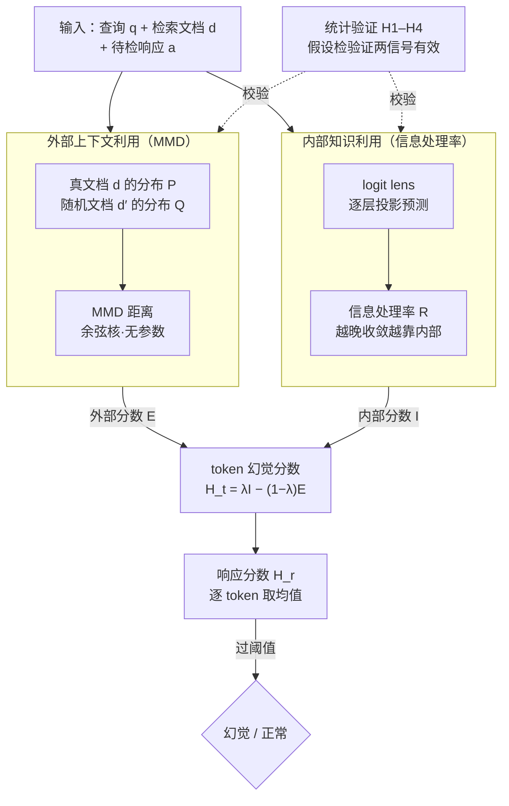

# LUMINA: Detecting Hallucinations in RAG System with Context-Knowledge Signals

**会议**: ICLR 2026  
**arXiv**: [2509.21875](https://arxiv.org/abs/2509.21875)  
**代码**: [有](https://github.com/deeplearning-wisc/LUMINA)  
**领域**: 幻觉检测  
**关键词**: RAG幻觉检测, 外部上下文利用, 内部知识利用, 最大均值差异, 信息处理率

## 一句话总结

提出 Lumina 框架，通过"上下文-知识信号"检测RAG系统中的幻觉：用MMD度量**外部上下文利用**程度，用跨层token预测演化度量**内部知识利用**程度，无需超参调优即可泛化。

## 研究背景与动机

RAG系统旨在通过检索的外部文档来减少LLM幻觉，但即便提供了正确充分的上下文，RAG系统仍会产生幻觉。

根本原因：模型在内部知识与外部上下文之间的平衡失调——当模型过度依赖内部参数知识而忽视检索到的外部上下文时，幻觉就会发生。

现有方法（如ReDeEP、SEReDeEP）虽验证了"内外知识利用"这一方向的有效性，但存在两大局限：

**超参依赖严重**：需要选择特定的attention head和transformer层来计算分数，选择过程需大量调优，且参数因数据集和模型而异

**缺乏验证**：虽展示了分数与幻觉的相关性，但未验证分数是否真正反映了外部上下文/内部知识的"利用程度"

## 方法详解

### 整体框架

Lumina 要解决的是 RAG 系统"喂了正确充分的文档却仍然幻觉"的问题，根因是模型在**外部上下文**和**内部参数知识**之间失衡——过度依赖脑子里记的、忽视检索来的。整篇方法只做一件事：给每个生成的 token 同时量出两个信号——它**用了多少外部上下文**（$\mathcal{E}$）和**用了多少内部知识**（$\mathcal{I}$），当后者远大于前者时就判为幻觉。关键是两个信号都**绕开模型内部结构**（不挑 attention head、不选 transformer 层），因此无需逐数据集/逐模型调参；此外还配了一套假设检验，证明这两个信号确实在度量它们声称的东西。

整体流程是：输入查询 $q$、检索文档 $d$ 和待检响应 $a$，并行算两路信号——外部路把 $d$ 换成随机文档、看下一 token 输出分布变化多大（用 MMD 量），内部路用 logit lens 追踪预测在层间的收敛快慢（用信息处理率量）；两路汇成 token 级幻觉分数，按 token 取均值得到响应级分数，过阈值即判幻觉/正常。

其核心假设（Conjecture 1）写成：当 $\mathcal{I}_{p_\theta}(a|q,d) \gg \mathcal{E}_{p_\theta}(a|q,d)$（内部知识利用远大于外部上下文利用）时，响应更可能是幻觉。据此定义 token 级幻觉分数：

$$\mathcal{H}_t(a_t|q,d,a_{<t}) = \lambda \cdot \mathcal{I}_{p_\theta}(a_t|q,d,a_{<t}) - (1-\lambda) \cdot \mathcal{E}_{p_\theta}(a_t|q,d,a_{<t})$$

响应级分数为 token 级分数的均值：$\mathcal{H}_r(a|q,d) = \frac{1}{T}\sum_{t=1}^{T} \mathcal{H}_t$。

### 关键设计

**1. 外部上下文利用度量：用 MMD 看"换掉文档会不会改变输出"**

先前方法（ReDeEP 等）要靠人工挑出某些 attention head 和 transformer 层来算"外部利用分"，挑选过程既费调优、又随数据集和模型漂移。Lumina 换了个完全旁路模型内部结构的思路：如果模型真的在用检索到的外部上下文，那么把相关文档 $d$ 换成一篇随机文档 $d'$，下一个 token 的概率分布就应该明显改变；反之若模型只在吃自己的参数知识，换不换文档输出几乎不动。于是把"外部利用"具象成两个 token 概率分布之间的距离——$P(E_v)=p_\theta(v|q,d,a_{<t})$ 是基于检索文档的分布，$Q(E_v)=p_\theta(v|q,d',a_{<t})$ 是基于随机文档的分布，用最大均值差异（MMD）度量二者：

$$\mathcal{E}_{p_\theta}(a_t|q,d,a_{<t}) = \text{MMD}_k^2(P, Q)$$

展开到 token 嵌入空间上就是三组核函数求和：

$$\mathcal{E} = \sum_{u,v} P(E_u)P(E_v)k(E_u,E_v) + \sum_{u,v} Q(E_u)Q(E_v)k(E_u,E_v) - 2\sum_{u,v} P(E_u)Q(E_v)k(E_u,E_v)$$

核函数取余弦核 $k_{\cos}(E_u, E_v) = \frac{1}{2}(1 + \frac{E_u^T E_v}{\|E_u\|_2 \|E_v\|_2})$，本身无需调参。这个度量是非参数化、与具体 LLM 无关的，因此彻底甩掉了"选 head / 选 layer"这一最大的可移植性负担。

**2. 内部知识利用度量：用跨层预测的"收敛快慢"反推模型在加多少私货**

光看外部不够，还要量化模型有多依赖自身参数知识。Lumina 借 logit lens 把每一层的隐状态 $h_{t,l}$ 投影回 token 概率空间，追踪预测在层间的演化轨迹。直觉是：如果中间层早早就锁定了最终输出，说明答案主要来自上下文、模型没怎么额外加工；反过来，如果预测一直到很靠后的层才收敛，说明模型在层层往里"添信息"，也就更依赖内部知识。把这个"收敛快慢"量化成信息处理率：

$$\mathcal{R}_{p_\theta}(x_{<t}) = \frac{\sum_{l=1}^{L-1}(1 - \min\{\frac{[f(h_{t,l})]_{x_{t,1}}}{p_\theta(x_{t,1}|x_{<t})}, 1\}) \cdot l}{\sum_{l'=1}^{L-1} \frac{l'}{H(f(h_{t,l'}))}}$$

其中 $f(\cdot) = \text{Softmax}(\text{LogitLens}(\cdot))$，$H(\cdot)$ 为熵函数。分子度量每一层对最终预测的"未收敛程度"，并按层深 $l$ 加权，从而强调越靠后的处理越能反映内部知识的注入；分母则用各层预测熵做自适应归一化，让确定性更高（熵更低）的层获得更大权重。$\mathcal{R}$ 越大，意味着模型越晚收敛、越在靠自己脑补，对应更高的内部知识利用。

**3. 统计验证框架：先证明这两个分数真的在测"利用程度"，再拿去查幻觉**

先前工作只展示了分数和幻觉相关，却没回答一个更基本的问题——这些分数到底有没有真的反映"外部上下文/内部知识被利用了多少"。Lumina 把这件事变成可证伪的假设检验，构造 4 个可验证蕴含：H1，有检索文档的生成应比无文档时有更高的外部上下文利用；H2，摘要任务应比 QA 任务有更高的外部上下文利用；H3，无检索文档时应比有文档时需要更多内部知识；H4，数据到文本生成应比摘要需要更多内部知识。这些蕴含都是从度量的语义出发能预先推断方向的，因此能反过来检验度量是否站得住。结果在 4 个 LLM 上所有假设均以 $p < 0.001$ 通过检验，说明两个信号确实在度量它们声称的东西。

### 损失函数 / 训练策略

Lumina是**无监督方法**，无需训练。关键超参：
- $\lambda = 0.5$（平衡外部和内部分数）
- 余弦核（无需调整核参数）

## 实验关键数据

### 主实验

数据集：RAGTruth（QA+摘要+数据到文本）、HalluRAG（自由形式QA）。模型：Llama2-7B/13B、Llama3-8B、Mistral-7B。

| 方法类别 | 方法 | RAGTruth AUROC (Llama2-13B) | HalluRAG AUROC (Llama2-13B) |
|---------|------|:-:|:-:|
| 不确定性 | Perplexity | 0.454 | 0.255 |
| 不确定性 | LN-Entropy | 0.768 | 0.783 |
| 跨样本一致性 | EigenScore | 0.633 | 0.786 |
| 言语化 | P(True) | 0.754 | 0.691 |
| 利用度量 | ReDeEP | 0.806 | 0.765 |
| **利用度量** | **Lumina** | **0.857** | **0.917** |

| LLM | RAGTruth AUROC | HalluRAG AUROC |
|-----|:-:|:-:|
| Llama2-7B | 0.765 | 0.915 |
| Llama2-13B | 0.857 | 0.917 |
| Mistral-7B | 0.769 | 0.990 |

Lumina在HalluRAG上跨模型均超过0.9 AUROC，比ReDeEP最高提升 +13%。

### 消融实验

- **核函数选择**：余弦核与最优RBF核性能相当，更无参数，更实用
- **分数组合**：外部+内部联合优于单独使用，Llama2-13B上联合比单独提升 >10%
- **上下文噪声鲁棒性**：移除/添加0-30%句子，大多数LLM性能稳定
- **跨模型检测**：Llama2-7B检测Llama3-8B生成的幻觉，AUROC与Llama3-8B自检持平或更高

### 关键发现

- 幻觉与"低外部上下文分数 + 高内部知识分数"强相关（2D KDE可视化验证）
- 同模型检测并非必须——跨模型检测同样有效甚至更好
- 错误分析发现大部分假阳/假阴源于数据集标注质量和低质检索文档

## 亮点与洞察

1. **层无关设计**：不需要选择特定的attention head或layer，解决了先前方法最大的可移植性瓶颈
2. **统计验证框架**：首次对"内外知识利用分数"进行严格的假设检验验证
3. **无监督但强过有监督**：与训练二分类器的SAPLMA竞争性能，某些情况下超越
4. **跨模型泛化**：用小模型检测大模型的幻觉成为可能，大幅降低部署成本

## 局限与展望

- 对Llama2-13B在上下文噪声下性能下降 >0.1，需进一步分析
- 当前假设检索文档相关且充分，极端低质量检索场景未充分评估
- 信息处理率的logit lens投影可能在较新的架构（如MoE模型）上需要调整
- 未在推理密集型任务（如数学推理）上验证

## 相关工作与启发

- MMD作为分布距离度量的应用非常优雅，可扩展到其他信号检测场景
- 信息处理率提供了观察LLM内部状态的新视角，可能启发新的训练目标
- 跨模型检测结果表明LLM的"知识利用模式"可能具有跨模型共性
- 对RAG系统的可靠性保证具有直接实践意义

## 评分

- 新颖性：⭐⭐⭐⭐⭐ — MMD+信息处理率的组合设计新颖且有理论基础
- 技术深度：⭐⭐⭐⭐⭐ — 统计验证框架提升了方法的可信度
- 实验充分度：⭐⭐⭐⭐⭐ — 多模型多数据集+丰富消融+鲁棒性分析
- 实用价值：⭐⭐⭐⭐⭐ — 无监督、无需训练、跨模型泛化

<!-- RELATED:START -->

## 相关论文

- [\[ACL 2026\] TPA: Next Token Probability Attribution for Detecting Hallucinations in RAG](../../ACL2026/hallucination/tpa_next_token_probability_attribution_for_detecting_hallucinations_in_rag.md)
- [\[ACL 2025\] DRAG: Distilling RAG for SLMs from LLMs to Transfer Knowledge and Mitigate Hallucination](../../ACL2025/hallucination/drag_distilling_rag_slm.md)
- [\[ACL 2026\] Detecting Hallucinations in SpeechLLMs at Inference Time Using Attention Maps](../../ACL2026/hallucination/detecting_hallucinations_in_speechllms_at_inference_time_using_attention_maps.md)
- [\[ACL 2026\] FinGround: Detecting and Grounding Financial Hallucinations via Atomic Claim Verification](../../ACL2026/hallucination/finground_detecting_and_grounding_financial_hallucinations_via_atomic_claim_veri.md)
- [\[ACL 2026\] Understanding New-Knowledge-Induced Factual Hallucinations in LLMs: Analysis and Interpretation](../../ACL2026/hallucination/understanding_new-knowledge-induced_factual_hallucinations_in_llms_analysis_and_.md)

<!-- RELATED:END -->
