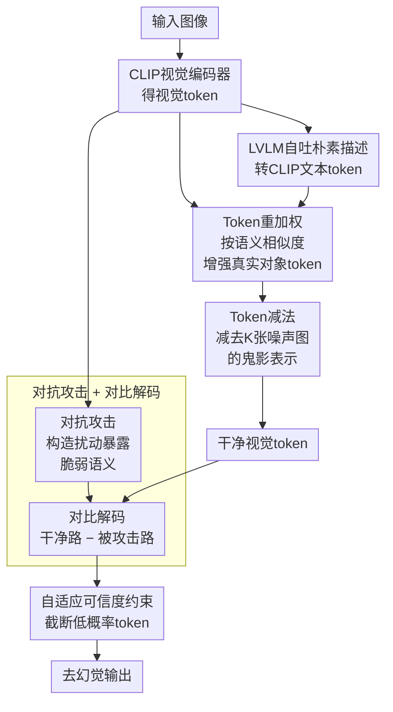

# SHIELD: Suppressing Hallucinations In LVLM Encoders via Bias and Vulnerability Defense

**会议**: ICLR 2026  
**arXiv**: [2510.16596](https://arxiv.org/abs/2510.16596)  
**代码**: [GitHub](https://github.com/hukcc/SHIELD)  
**领域**: 幻觉检测  
**关键词**: LVLM幻觉, 视觉编码器, 统计偏差, 固有偏差, 对抗鲁棒性, 对比解码, 免训练

## 一句话总结

首次将LVLM对象幻觉系统性追溯到视觉编码器，识别出统计偏差（高频模式token过度强调）、固有偏差（预训练主导对象的残余表示）、脆弱性（微小扰动即导致特征失真）三大问题，并提出SHIELD——一个完全免训练的框架，通过token重加权、token减法和对比解码三策略协同防御，在LLaVA-1.5/InstructBLIP/Qwen-VL上全面超越VCD和OPERA等方法。

## 研究背景与动机

**领域现状**：大型视觉语言模型（LVLM）在跨模态任务中表现出色，但对象幻觉问题——模型生成看似合理但与图像不符的对象描述——严重制约了其在医疗、自动驾驶、机器人等安全敏感领域的部署。

**现有方法的局限**：现有缓解幻觉的方法分为两类：训练类方法（CLIP-DPO、LURE、LLaVA-RLHF）资源消耗大；免训练方法（VCD用模糊图像对比、OPERA用过度信任惩罚、HALC用自适应焦点对比解码）更高效，但几乎全部聚焦于LLM组件，视觉编码器的角色被严重忽视。

**关键发现——统计偏差**：CLIP视觉编码器因预训练数据分布不均，会过度强调与高频视觉模式对应的token（L2范数异常高），导致下游LLM的注意力被这些过度激活的token"绑架"，扭曲细粒度感知。实验表明peak-to-average L2比值越高，幻觉样本比例越高。

**关键发现——固有偏差**：编码器对预训练数据中的主导对象产生了"鬼影表示"——即使输入纯随机噪声，LLaVA-1.5仍将"car"、"chair"、"table"等高频对象判定为存在，说明编码器本身就携带了与输入无关的错误先验。

**关键发现——脆弱性**：视觉编码器在预训练中未获得足够的噪声/扰动鲁棒性。实验显示在POPE COCO子集上，仅几步PGD对抗攻击就使F1值从约87骤降至70以下，小扰动即导致特征严重失真。

**核心思路**：三个问题对应三个解法——token重加权矫正统计偏差，token减法消除固有偏差，对抗+对比解码应对脆弱性——构成完整的"编码器侧幻觉防线"。

## 方法详解

### 整体框架

SHIELD要解决的是LVLM的对象幻觉，而它的判断和以往工作不同：幻觉不只发生在LLM解码端，视觉编码器本身就埋了三颗雷——统计偏差让少数L2范数畸高的token绑架下游注意力、固有偏差让编码器把与输入无关的"鬼影"对象混进表示、脆弱性让微小扰动就能扭曲特征。SHIELD是个完全免训练的框架，把防线整体前移到编码器产生的视觉token上，针对三颗雷依次设了四道处理。

整条流水线这样转：输入图像先过CLIP视觉编码器得到一组视觉token，同时让原始LVLM对图自吐一句朴素描述、转成CLIP文本token；接着 **Token重加权** 用文本-视觉语义相似度抬升真实对象的token、压住高范数噪声token，矫正统计偏差；**Token减法** 再减掉用随机噪声估计出的鬼影表示，清除固有偏差；解码阶段，**对抗攻击 + 对比解码** 主动构造扰动暴露编码器最易被骗的语义、用干净路减去被攻击路把脆弱性诱发的幻觉抵消掉；最后 **自适应可信度约束** 截断被对比放大的低概率token，给输出兜底。

### 关键设计

**1. Token重加权：让真实对象的token不再被高范数token压制**

统计偏差的表现是少数token因L2范数畸高而绑架了下游LLM的注意力，模型于是对图里大部分真实对象视而不见。SHIELD先让原始LVLM自己为图像吐一句朴素描述 $\mathbf{c}^{\text{naive}}$，再用CLIP文本编码器把它转成 $P$ 个文本token $\mathbf{c}$，与 $N$ 个视觉token $\mathbf{x}^v$ 算出余弦相似度矩阵 $\mathbf{M}\in\mathbb{R}^{N\times P}$；对每个视觉token取它对所有文本token的最大相似度、归一化成权重 $\mathbf{W}^v$，再以残差形式加回原token：$\mathbf{x}^{v\prime} = \mathbf{x}^v + \mathbf{x}^v \odot \mathbf{W}^v$。这样真正出现在描述里的对象token被相应增强，权重的重心从"范数高"转向"语义相关"。值得注意的是，朴素描述本身可能带幻觉，但幻觉对象在图里没有对应视觉内容、在相似度矩阵里匹配不到任何高相似度的视觉token，因此不会被放大——这条自清洁特性保证了重加权只惠及真实对象。

**2. Token减法：扣掉编码器与输入无关的鬼影表示**

固有偏差源于编码器对预训练主导对象的残余记忆，哪怕喂进纯噪声，它仍"看见"car、chair、table。因为这种偏差只取决于编码器参数、与当前输入无关，SHIELD就用 $K$ 张随机噪声图过一遍编码器、把输出token平均，作为鬼影表示的估计，再从重加权后的token中减掉：$\mathbf{x}^{v\prime\prime} = \mathbf{x}^{v\prime} - \frac{1}{K}\sum_{i=1}^{K}E(\mathbf{n}_i)$（实现中 $K=32$）。由于该估计与输入无关，可以离线预计算并缓存，推理时几乎不增加开销，却让token更纯粹地反映眼前这张图。

**3. 对抗攻击 + 对比解码：把脆弱性诱发的幻觉在解码端反向抵消**

编码器在预训练中没练出足够的扰动鲁棒性，几步PGD攻击就能让F1从约87跌到70以下。SHIELD反过来利用这一点：先构造扰动 $\delta^*$，让被扰图像的全局表示与朴素描述的对齐度最低，即最小化 $\ell_{\text{adv}} = \cos(E(\mathbf{v}+\delta), E_t(\mathbf{c}^{\text{naive}}))$，得到一组"被攻击"的视觉token $\bar{\mathbf{x}}^v = E(\mathbf{v}+\delta^*)$——这组token专门暴露了编码器最容易被骗的语义区域。解码时把干净token与被攻击token两路logit做对比：$p_{\text{shield}}(y_i) = \text{softmax}\big[(1+\alpha)\cdot\text{logit}(y_i\mid\mathbf{x}^{v\prime\prime}) - \alpha\cdot\text{logit}(y_i\mid\bar{\mathbf{x}}^v)\big]$（$\alpha=2$）。脆弱性诱发的幻觉token在两路里都会冒头、被差分抵消，而靠真实视觉支撑的正确内容只在干净路出现、得以保留。

**4. 自适应可信度约束：给对比解码兜底，挡住被放大的低概率token**

对比解码靠减法放大差异，副作用是可能把一些本不合理的低概率token顶上来。SHIELD因此只保留概率不低于峰值 $\beta$ 倍的候选，其余直接置零：$\nu_{\text{token}}(y_i) = \{y_i \in \nu : p(y_i) \geq \beta \max_\omega p(\omega)\}$（$\beta=0.35$）。这道截断把输出锁在模型仍有把握的范围内，避免对比机制以引入新噪声为代价换取去幻觉。

## 实验结果

### 表1：CHAIR幻觉评估（500张COCO图片，长描述）

| LVLM | 方法 | $C_S$↓ | $C_I$↓ |
|------|------|--------|--------|
| LLaVA-1.5 | Vanilla | 48.8 | 14.2 |
| LLaVA-1.5 | VCD | 46.8 | 13.2 |
| LLaVA-1.5 | OPERA | 44.6 | 12.8 |
| **LLaVA-1.5** | **SHIELD** | **36.6** | **10.3** |
| InstructBLIP | Vanilla | 54.6 | 24.8 |
| InstructBLIP | VCD | 44.0 | 13.6 |
| InstructBLIP | OPERA | 46.4 | 14.2 |
| **InstructBLIP** | **SHIELD** | **40.4** | **10.9** |
| Qwen-VL | Vanilla | 49.2 | 13.1 |
| Qwen-VL | VCD | 46.4 | 11.9 |
| Qwen-VL | OPERA | 34.6 | 9.5 |
| **Qwen-VL** | **SHIELD** | **28.9** | **9.2** |

SHIELD在LLaVA-1.5上相比次优的OPERA降低了$C_S$约18%（44.6→36.6），$C_I$降低约20%。

### 表2：POPE幻觉评估（COCO子集，Accuracy/F1）

| LVLM | 方法 | Random Acc↑ | Popular Acc↑ | Adversarial Acc↑ | Avg Acc↑ |
|------|------|-------------|--------------|------------------|----------|
| LLaVA-1.5 | Vanilla | 83.2 | 81.8 | 78.9 | 81.3 |
| LLaVA-1.5 | VCD | 87.7 | 85.3 | 80.8 | 84.6 |
| LLaVA-1.5 | OPERA | 89.1 | 86.0 | 79.1 | 84.7 |
| **LLaVA-1.5** | **SHIELD** | **91.3** | **87.4** | **82.5** | **87.0** |
| Qwen-VL | Vanilla | 84.7 | 84.1 | 82.2 | 83.6 |
| Qwen-VL | VCD | 88.6 | 87.1 | 84.2 | 86.6 |
| **Qwen-VL** | **SHIELD** | **89.2** | **87.6** | **84.3** | **87.0** |

SHIELD在最具挑战性的Adversarial分割上优势尤为明显，说明编码器偏差和脆弱性恰恰是对抗场景下幻觉的主要来源。

### 表3：MME幻觉子集评估

| LVLM | 方法 | Existence↑ | Count↑ | Position↑ | Color↑ | Total↑ |
|------|------|------------|--------|-----------|--------|--------|
| LLaVA-1.5 | Vanilla | 175.6 | 124.6 | 114.0 | 151.0 | 565.3 |
| LLaVA-1.5 | VCD | 184.6 | 138.3 | 128.6 | 153.0 | 604.6 |
| LLaVA-1.5 | OPERA | 180.6 | 133.3 | 123.3 | 155.0 | 592.3 |
| **LLaVA-1.5** | **SHIELD** | **195.0** | **141.6** | **148.3** | **183.3** | **668.3** |
| Qwen-VL | Vanilla | 155.0 | 127.6 | 131.6 | 173.0 | 587.3 |
| **Qwen-VL** | **SHIELD** | **180.0** | **170.0** | **128.3** | **190.0** | **668.3** |

Position和Color的提升尤其显著（LLaVA-1.5: Position 114→148, Color 151→183），证明缓解统计偏差后，模型对细粒度属性的感知能力大幅增强。

### 表4：消融实验（CHAIR, LLaVA-1.5）

| 模块配置 | $C_S$↓ | $C_I$↓ |
|----------|--------|--------|
| Vanilla | 48.8 | 14.2 |
| + 自适应可信度约束 | 50.2 | 13.8 |
| + 对抗脆弱性防御 | 46.4 | 12.8 |
| + 统计偏差缓解 | 40.4 | 11.0 |
| + 固有偏差消除（完整SHIELD） | **36.6** | **10.3** |

每个模块贡献独立且显著。统计偏差缓解模块单独贡献最大（$C_S$从46.4降至40.4，约13%降幅），固有偏差消除进一步降低约10%。

## 关键发现

1. **编码器是幻觉的重要源头**：此前所有免训练方法仅关注LLM端，SHIELD首次证明视觉编码器中的偏差和脆弱性是幻觉的独立且关键来源，在所有基准上超越现有方法。

2. **统计偏差是最大的幻觉推手**：消融实验表明，缓解统计偏差的贡献最大——高L2 token的过度强调对长描述场景的幻觉影响尤为显著。

3. **SHIELD不牺牲通用能力**：完整MME评估显示Perception从1279→1473（+194），Total从1632→1811（+179），说明缓解编码器偏差不仅减少幻觉，还提升了OCR、海报识别等通用感知能力。

4. **属性级幻觉改善最大**：Position提升30%+、Color提升21%+，说明编码器偏差对细粒度属性感知的伤害最大，矫正后收益最多。

5. **InstructBLIP上效果受限**：因其Q-Former模块限制了修改后视觉特征的传播，SHIELD的增益较小——这也间接说明了SHIELD确实在视觉token层面起作用。

## 亮点与洞察

- **"编码器侧幻觉"新范式**：此前所有工作都将幻觉归因于LLM的过度自信或数据偏差，SHIELD首次系统地将问题定位到视觉编码器——开辟了一个全新的研究方向。
- **噪声输入实验的说服力**：给编码器纯噪声→它仍然"看到"汽车和椅子→这不是模型的"理解"而是预训练数据分布的烙印。这一实验设计简洁但极具洞察力。
- **朴素描述的自清洁特性**：token重加权依赖朴素描述，但幻觉对象在相似度矩阵中天然无法匹配高相似度的视觉token→不会被放大→巧妙的自校正机制。
- **三重防御的正交性**：三个模块分别处理三个独立的问题维度（分布→残余→鲁棒性），消融实验证明它们互补且叠加有效。
- **噪声估计可预计算**：固有偏差的估计仅依赖编码器参数，可离线计算并缓存→推理时几乎零额外开销。

## 局限性

1. **推理成本增加**：需要额外生成朴素描述（一次前向推理）、计算CLIP相似度矩阵、采样噪声输入、运行对抗攻击→推理延迟预计增加2-3倍。
2. **依赖CLIP编码器架构**：token重加权和对抗攻击策略都依赖于CLIP的视觉-文本对齐→对不使用CLIP编码器的LVLM（如EVA-CLIP变种或原生ViT）适用性未验证。
3. **InstructBLIP效果有限**：Q-Former的中间瓶颈限制了修改后视觉特征的传播→对有中间适配器的架构效果可能打折。
4. **超参数敏感性**：$\alpha=2, \beta=0.35, K=32, l=0.02$ 跨模型固定使用→不同模型/任务的最优超参可能不同。
5. **评估局限**：主要在COCO系数据上评估→对分布外场景（医疗/遥感/工业）的泛化性未验证。

## 相关工作对比

### vs VCD (Visual Contrastive Decoding)

VCD通过对比自然图像和模糊图像的输出来抑制幻觉——本质是在LLM解码端操作。SHIELD则在编码器端直接修正视觉token，再结合对抗扰动（而非简单模糊）做对比解码。SHIELD在CHAIR上比VCD降低了$C_S$约22%（46.8→36.6），POPE Adversarial上高出约1.7个点（80.8→82.5）。VCD的模糊是语义无关的均匀降质，而SHIELD的对抗攻击是语义定向的→更精准地暴露脆弱性。

### vs OPERA

OPERA通过在beam search中添加过度信任惩罚来避免模型过度依赖特定token——同样作用于LLM解码端。SHIELD在LLaVA-1.5 CHAIR上比OPERA降低$C_S$约18%（44.6→36.6），MME幻觉总分高出76点（592→668）。OPERA对统计偏差有间接缓解效果但不治本，SHIELD直接在视觉token层面重加权→更根本性的修正。

### vs MARINE / VTI

MARINE引入外部视觉模型的图像-文本对齐引导，VTI在测试时调整latent表示以稳定视觉特征。两者关注的是特征层面的校正但未分析偏差和脆弱性的根因。SHIELD提供了更系统的根因分析和对应的三策略防御方案。

## 评分

- **新颖性**: ⭐⭐⭐⭐⭐ — 首次系统归因编码器侧幻觉（统计偏差+固有偏差+脆弱性），三策略防御框架有原创性
- **实验充分度**: ⭐⭐⭐⭐ — 5个幻觉基准(CHAIR/POPE/MME/AMBER/GPT-4o)×3个LVLM家族+完整消融+可视化
- **写作质量**: ⭐⭐⭐⭐ — 问题分析→根因识别→解决方案的逻辑链非常清晰，图表设计直观
- **价值**: ⭐⭐⭐⭐ — 为LVLM幻觉研究开辟了编码器侧的新方向，免训练特性有实用价值

<!-- RELATED:START -->

## 相关论文

- [\[CVPR 2026\] Cross-Modal Attention Calibration for LVLM Hallucination Mitigation](../../CVPR2026/hallucination/cross-modal_attention_calibration_for_lvlm_hallucination_mitigation.md)
- [\[CVPR 2026\] AdaIAT: Adaptively Increasing Attention to Generated Text to Alleviate Hallucinations in LVLM](../../CVPR2026/hallucination/adaiat_adaptively_increasing_attention_to_generated_text_to_alleviate_hallucinat.md)
- [\[CVPR 2026\] Fighting Hallucinations with Counterfactuals: Diffusion-Guided Perturbations for LVLM Hallucination Suppression](../../CVPR2026/hallucination/fighting_hallucinations_with_counterfactuals_diffusion-guided_perturbations_for_.md)
- [\[NeurIPS 2025\] Benford's Curse: Tracing Digit Bias to Numerical Hallucination in LLMs](../../NeurIPS2025/hallucination/benfords_curse_tracing_digit_bias_to_numerical_hallucination_in_llms.md)
- [\[CVPR 2025\] Antidote: A Unified Framework for Mitigating LVLM Hallucinations in Counterfactual Presupposition and Object Perception](../../CVPR2025/hallucination/antidote_a_unified_framework_for_mitigating_lvlm_hallucinations_in_counterfactua.md)

<!-- RELATED:END -->
