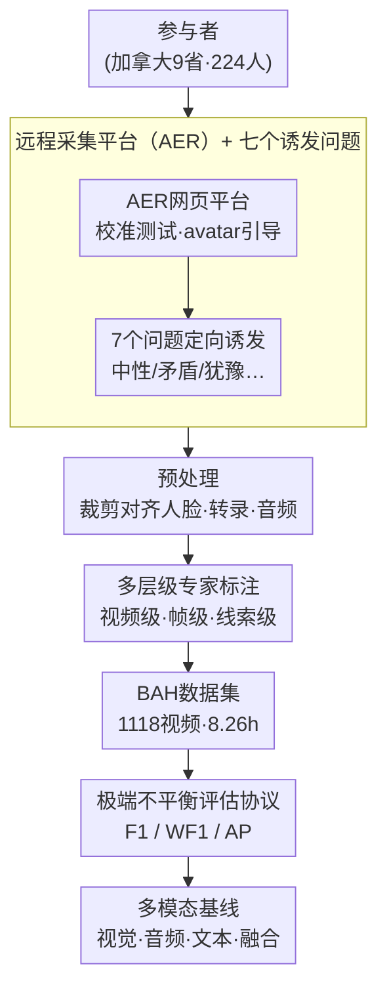

# BAH Dataset for Ambivalence/Hesitancy Recognition in Videos for Digital Behaviour Analysis

**会议**: ICLR 2026  
**arXiv**: [2505.19328](https://arxiv.org/abs/2505.19328)  
**代码**: [github.com/sbelharbi/bah-dataset](https://github.com/sbelharbi/bah-dataset)  
**领域**: 人类行为理解 / 情感计算  
**关键词**: 矛盾犹豫识别, 多模态视频数据集, 行为变化, 情感计算, 领域自适应

## 一句话总结

提出首个面向视频中矛盾/犹豫（A/H）识别的多模态数据集 BAH，包含来自加拿大9省224名参与者的1,118段视频共8.26小时，由行为科学专家标注，并提供了帧级和视频级的基线实验结果。

## 研究背景与动机

矛盾和犹豫（Ambivalence/Hesitancy, A/H）是行为变化过程中的核心心理状态，表现为个体同时经历改变的渴望和抗拒。在面对面临床访谈中，医疗提供者可以通过语音语调、面部表情、肢体语言等非语言线索识别 A/H，从而实施有针对性的个性化干预。然而在数字健康（eHealth）干预场景中，缺乏自动、可靠、非侵入式的 A/H 识别手段。

现有的情感计算研究主要聚焦于基本情绪（如快乐、悲伤、惊讶等7类）、连续情绪维度（效价-唤醒度）、疼痛估计等任务。复合情绪识别虽有进展，但 A/H 作为一种更微妙的复杂情绪——涉及态度和意图的内部冲突——仍然在机器学习社区中完全未被探索。根本原因是缺少专门的训练和评估数据集。BAH 数据集的提出正是为了填补这一空白。

## 方法详解

### 整体框架

BAH 的贡献不是一个算法，而是一条把"行为科学里的 A/H 概念"落地成"机器可学习的视频基准"的完整构建链路。这条链路要解决的核心难点只有一个：A/H 是微妙、短暂、且只在自然情境下才会真实流露的内部冲突，任何一步走样都会让标签失去意义。为此整条流水线从头到尾都围绕"让真实的 A/H 被诱发出来、被精确标出来、被公平地度量出来"展开——先用一个网页平台让参与者在家远程录制，用 7 个精心设计的问题定向诱发 A/H 而非让人表演；录完的视频经裁剪对齐人脸、语音转录、音频抽取等预处理后，由 3 位行为科学专家按统一代码本（codebook）做视频级/帧级/线索级的多层级标注；最后配上一套针对极端类别不平衡的评估协议（同时报告 F1、WF1、AP），保证后续基线分数真正反映模型识别稀有正类的能力。最终产出 224 名参与者、1,118 段视频、8.26 小时的多模态基准。

### 关键设计

**1. 远程采集平台（AER）：用低成本换规模与多样性**

A/H 这类微妙状态需要大量真实样本才能学，实验室录制既贵又难覆盖人群多样性。团队搭建了网页平台 AER（www.aerstudy.ca），让参与者用自己带摄像头和麦克风的电脑在家远程录制，由虚拟角色（avatar）引导完成约 30 分钟的全流程，并内置摄像头/麦克风校准测试过滤画质、音质不达标的录制。正因为采集发生在"自然野外"而非受控影棚，数据更接近 eHealth 干预的真实部署场景——代价是光照、背景、设备的噪声更大，这也是后续识别难度高的根源之一。最终经 Prolific 平台从加拿大 9 个省招募了 224 名 18–66 岁参与者，性别（59.8% 男 / 39.3% 女）、种族（52.2% 白人、21.0% 亚裔、11.6% 混血等）、年龄分布都较均衡，且 65.2% 为非学生，显著降低了常见的"大学生样本"招募偏差。

**2. 七个诱发问题：让 A/H 自然发生而非表演**

数据集质量的前提是标签对应的状态真实出现，而 A/H 无法靠演员"演"出来。行为科学团队设计了 7 个问题，分别定向诱发中性、积极、消极、矛盾、愿意、抗拒、犹豫等回应；例如问题 4（"告诉我们你喜欢做但希望停止做的事情"）专门勾起改变渴望与抗拒并存的矛盾感。问题顺序随机、且参与者并不知道每个问题想诱发什么情绪，进一步避免了刻意迎合。这种"问题—情绪"的对应设计，保证了 A/H 在真实自我表露中被诱发，而不是被摆拍。

**3. 多层级专家标注：同时给出"在不在""何时"和"凭什么"**

单一的视频级标签无法支撑时序定位和可解释研究，因此 3 位经过统一代码本（codebook）培训的行为科学专家用 ELAN 软件分两阶段标注：先在视频级判断整段是否出现 A/H；再在帧级精确标出每个 A/H 片段的起止时间（onset/offset）；同时在线索级记录判断依据的具体模态（面部表情、语言、音频、肢体语言，以及跨模态不一致性）。其中"跨模态不一致性"——嘴上说"是"、头却摇"不"——被反复强调为识别 A/H 的核心信号。论文特意不标注"apex"（峰值）或连续强度，因为 A/H 往往是持续或波动状态、没有可靠的最大强度时刻。受标注成本限制每段视频仅由一位标注者负责，但抽取 10 余段做多标注者一致性检验，视频级 Fleiss Kappa 达 0.65（基本一致）、帧级 0.41（中等一致），这条标注让数据集不止能训练分类器，还能支撑可解释性分析。

**4. 适配极端不平衡的评估协议：让分数反映真实识别力**

A/H 在时间轴上稀疏出现，这一事实直接决定了怎么衡量模型。数据集共 1,118 段视频、8.26 小时，其中 638 段含 A/H（A/H 总时长 1.5 小时）；按帧看共 714,005 帧、仅 131,103 帧（18.36%）为正类；A/H 片段共 1,274 个，平均时长 $4.25\pm2.47$ 秒（约 $102.92\pm59.16$ 帧），跨度从 0.01 秒到 23.8 秒。正类不到两成意味着"全预测为负"也能拿到虚高的加权指标，因此评估同时报告三项：正类 F1、加权 F1（WF1）、正类平均精度（AP）。WF1 因对多数的负类有天然偏好（全负基线就能达到 0.7148），主要用于对照；F1 和 AP 才真正反映模型对稀有正类的识别能力，也是后文判断各模态优劣的主依据。

## 实验关键数据

### 主实验：帧级分类

| 模态组合 | F1 | WF1 | AP |
|---------|-----|-----|-----|
| 视觉（ResNet152+TCN） | 0.2213 | 0.7450 | 0.2674 |
| 音频 | 0.2099 | 0.7387 | 0.2520 |
| 文本转录 | 0.2486 | 0.7149 | 0.2047 |
| 视觉+音频 | 0.2873 | 0.7338 | 0.2818 |
| 视觉+文本 | 0.3046 | 0.7424 | 0.2809 |
| 三模态融合 | 0.2737 | 0.7396 | 0.2416 |

### 消融实验：上下文建模的影响

| 配置 | F1 | WF1 | AP | 说明 |
|------|-----|-----|-----|------|
| ResNet152 无上下文 | 0.1757 | 0.7086 | 0.2096 | 单帧独立分类 |
| ResNet152 + TCN有上下文 | 0.2213 | 0.7450 | 0.2674 | 时序上下文建模 |

### 零样本推理（Video-LLaVA）

| 提示方式 | 帧级F1 | 视频级F1 |
|---------|--------|---------|
| 简单提示 | 0.0000 | 0.0000 |
| 仅定义 | 0.1360-0.3296 | 0.1836-0.7575 |
| 转录+定义 | 0.3604 | 0.7233 |

### 领域自适应（个性化）

| 方法 | F1 | WF1 | AP |
|------|-----|-----|-----|
| Source-only | 0.1547±0.1608 | 0.6814±0.1687 | 0.2462±0.1665 |
| UDA (MMD) | 0.2418±0.1513 | 0.6494±0.1484 | 0.2608±0.1685 |
| UDA (Sub-Based) | 0.2674±0.1475 | 0.6461±0.1534 | 0.2673±0.1642 |
| Oracle | 0.3699 | - | - |

### 关键发现

1. **A/H识别极具挑战性**：所有基线模型的 F1 都低于 0.32，AP 低于 0.28，说明 A/H 识别远比基本情绪识别困难
2. **文本转录至关重要**：文本模态单独使用时 F1(0.2486) 已超过视觉(0.2213)，而视觉+文本组合获得最佳 F1(0.3046)
3. **时序上下文有助**：使用 TCN 建模时序依赖可提升所有骨干网络的性能，因为 A/H 不是瞬时发生的
4. **零样本 M-LLM 文本依赖严重**：Video-LLaVA 的性能高度依赖文本转录的引入，纯视觉零样本几乎无法识别
5. **个性化有潜力**：基于参与者的域自适应（Sub-Based UDA）将 F1 从 0.1547 提升至 0.2674，但与 Oracle 上界(0.3699)仍有差距

## 亮点与洞察

- **首创性强**：这是 ML 社区首个专门面向 A/H 识别的数据集，填补了行为科学与机器学习交叉领域的重要空白
- **标注质量高**：行为科学专家按严格的 codebook 标注，不仅标记 A/H 出现，还提供面部、语言、音频、肢体、跨模态不一致性等详细线索
- **多任务适用**：数据集支持帧级分类、视频级分类、个性化学习（领域自适应）、可解释性分析等多种研究方向
- **跨模态不一致性**是识别 A/H 的关键线索——例如嘴上说"是"但头摇"不"——这为未来方法设计提供了重要启发
- **数据收集在自然野外环境**中进行（参与者使用自己设备），增加了任务难度但提高了实际应用价值

## 局限与展望

1. **部分视频由单个标注者标注**，缺乏系统的标注者间一致性检验
2. **视觉模态仅使用裁剪对齐的面部**，未利用完整帧中的肢体语言信息——而标注者强调肢体语言是重要线索
3. **数据不平衡严重**（帧级正类仅18%），虽文中使用了下采样策略，但未探索更先进的不平衡学习方法
4. **特征融合策略简单**（如拼接），未充分利用跨模态不一致性这一 A/H 的核心特征
5. **缺乏大规模预训练模型的系统测试**：零样本仅测试了 Video-LLaVA，未覆盖更强的多模态大模型

## 相关工作与启发

- 与 C-EXPR-DB（复合情绪）类似但更具针对性：BAH 专注于临床相关的 A/H 状态
- 与 MESC（情感支持对话）、IEMOCAP（演员表演）互补：BAH 使用真实参与者的自然回答
- 对数字健康干预领域意义重大：自动 A/H 识别可显著提升 eHealth 干预的个性化和效果
- 跨模态不一致性检测可借鉴谎言检测、讽刺识别等领域的方法
- 对多模态大模型(M-LLM)的"文本化"方向值得深入：将视觉和音频线索转化为文本描述，利用LLM的推理能力

## 评分
- 新颖性: ⭐⭐⭐⭐⭐ (首个A/H数据集，领域开创性贡献)
- 实验充分度: ⭐⭐⭐⭐ (基线全面但算法创新有限)
- 写作质量: ⭐⭐⭐⭐ (结构清晰，附录详尽)
- 价值: ⭐⭐⭐⭐⭐ (填补重要空白，应用前景广阔)

<!-- RELATED:START -->

## 相关论文

- [\[CVPR 2025\] Team LEYA in 10th ABAW Competition: Multimodal Ambivalence/Hesitancy Recognition Approach](../../CVPR2025/human_understanding/team_leya_in_10th_abaw_competition_multimodal_ambivalencehesitancy_recognition_a.md)
- [\[CVPR 2026\] HUMAPS-4D: A Multimodal Dataset for HUman Motion Analysis with Physiological and Semantic informations](../../CVPR2026/human_understanding/humaps-4d_a_multimodal_dataset_for_human_motion_analysis_with_physiological_and_.md)
- [\[AAAI 2026\] Facial-R1: Aligning Reasoning and Recognition for Facial Emotion Analysis](../../AAAI2026/human_understanding/facial-r1_aligning_reasoning_and_recognition_for_facial_emotion_analysis.md)
- [\[ICLR 2026\] NeuroGaze-Distill: Brain-informed Distillation and Depression-Inspired Geometric Priors for Robust Facial Emotion Recognition](neurogaze-distill_brain-informed_distillation_and_depression-inspired_geometric_.md)
- [\[CVPR 2026\] RGB-Event based Pedestrian Attribute Recognition: A Benchmark Dataset and An Asymmetric RWKV Fusion Framework](../../CVPR2026/human_understanding/rgb-event_based_pedestrian_attribute_recognition_a_benchmark_dataset_and_an_asym.md)

<!-- RELATED:END -->
