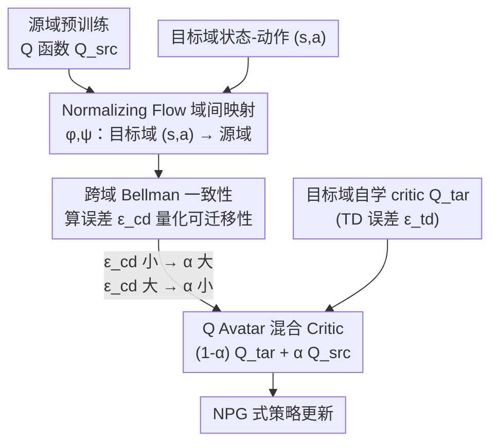

# Cross-Domain Policy Optimization via Bellman Consistency and Hybrid Critics

**会议**: ICLR 2026  
**arXiv**: [2603.12087](https://arxiv.org/abs/2603.12087)  
**代码**: [https://rl-bandits-lab.github.io/Cross-Domain-RL/](https://rl-bandits-lab.github.io/Cross-Domain-RL/)  
**领域**: 人体理解  
**关键词**: 跨域强化学习, Bellman一致性, 混合Critic, Q函数迁移, 负迁移防护

## 一句话总结

提出 Q Avatar 框架，通过跨域 Bellman 一致性量化源域模型可迁移性，利用自适应无超参权重函数混合源域和目标域 Q 函数，实现在状态-动作空间不同的跨域 RL 中的可靠知识迁移，无论源域模型质量或域相似性如何都能保证不产生负迁移。

## 研究背景与动机

### 问题背景
跨域强化学习（CDRL）旨在利用源域采集的数据来提升目标域的学习效率。实际场景中（如不同形态的机器人之间），源域和目标域往往具有**不同的状态空间和动作空间**，这使得直接迁移不可行。

### 两大根本挑战

**状态-动作空间不一致**：源域和目标域可能有不同维度的状态和动作表示，需要复杂的域间映射

**可迁移性未知**：源域模型的迁移效果难以事先判断，CDRL 容易产生**负迁移**——即迁移后性能反而不如从头学习

### 现有方法的不足
- 手工设计的潜空间映射方法（Ammar & Taylor, 2012）缺乏灵活性
- 学习型域间映射方法（Zhang et al., 2021; Gui et al., 2023）基于动态对齐，但无性能保证且忽略可迁移性问题
- 所有现有方法都假设域足够相似，未解决负迁移防护问题

## 方法详解

### 整体框架

Q Avatar 要解决的是这样一类跨域迁移：源域（如仿真器）和目标域（如真实机器人）连状态、动作空间的维度都不一样，既不能直接搬数据也不能直接搬模型，而且事先根本不知道源域模型搬过来到底是帮忙还是添乱。它的思路是"先架桥、再量化、再混合"三步走：先用一个 normalizing flow 学到的域间映射 $\phi,\psi$ 把目标域的状态-动作映回源域，让源域 Q 函数能在目标域上取值；再用跨域 Bellman 误差实时判断这个搬过来的 Q 此刻到底靠不靠谱；最后据此把源域和目标域两个 critic 动态加权成一个混合 critic 去驱动策略更新。整套机制的落脚点是让混合权重随可迁移性自动涨落——源域越可信就越多吃源域，越不可信就退回纯目标域学习——从而在源域模型再差、域差异再大时也不会拖累目标域自身的进度。

### 关键设计

**1. Normalizing Flow 域间映射：用可逆流稳定地架起跨域对应关系**

第一步要解决的是空间不通的问题：源域和目标域状态-动作维度不同，源域 Q 函数压根没法直接在目标域的 $(s,a)$ 上取值。Q Avatar 用 normalizing flow 来参数化映射 $\phi: \mathcal{S}_{\text{tar}} \to \mathcal{S}_{\text{src}}$、$\psi: \mathcal{A}_{\text{tar}} \to \mathcal{A}_{\text{src}}$，把目标域的状态、动作映回源域，从而让 $Q_{\text{src}}(\phi(s),\psi(a))$ 有定义。训练目标就是最小化下一步要讲的跨域 Bellman 损失，让映射朝着"使源域 Q 在目标域更自洽"的方向收敛。选 flow 而非普通编码器-解码器的好处是其结构天然可逆、训练稳定，避免了对齐过程中常见的退化解。值得一提的是，这一层是可替换的——Q Avatar 的可迁移性度量和混合机制并不绑定具体映射方法，flow 只是展示框架与现有域间映射工作兼容的一个实例。

**2. 跨域 Bellman 一致性：用一个误差量化"源域知识到底能不能搬"**

架好桥之后，CDRL 最棘手的地方仍在于事先无从判断这套搬过来的源域知识是帮忙还是添乱。Q Avatar 的破题点是把"可迁移性"翻译成一个可计算的量——跨域 Bellman 误差 $\epsilon_{\text{cd}}(s,a;\phi,\psi,Q_{\text{src}},\pi) = |Q_{\text{src}}(\phi(s),\psi(a)) - r_{\text{tar}}(s,a) - \gamma \mathbb{E}_{s',a'}[Q_{\text{src}}(\phi(s'),\psi(a'))]|$。直觉是：如果源域 Q 函数经映射后还能在目标域上满足 Bellman 方程（误差小），说明它对目标域的奖励和动态是自洽的、可信赖的；误差大则说明这套知识在目标域里"水土不服"。这个度量不依赖额外的环境交互或人工先验，纯靠数据本身就能算出来，为下一步的自适应加权提供了客观依据。

**3. Q Avatar 混合 Critic：用无超参权重让两边 Q 函数自动让位**

有了可迁移性度量，剩下的问题是怎么用它。每步策略更新时，Q Avatar 把目标域自学的 critic 和搬过来的源域 critic 线性混合成 $Q^{(t)}_{\text{avatar}} = (1-\alpha(t)) Q^{(t)}_{\text{tar}} + \alpha(t) Q_{\text{src}}(\phi^{(t)}, \psi^{(t)})$。关键在权重 $\alpha(t)$ 完全自适应、不含任何待调超参——它由跨域 Bellman 误差和目标域自身 TD 误差的倒数之比决定：$\alpha(t) = \frac{1/\|\epsilon_{\text{cd}}\|_{d^{\pi^{(t)}}}}{1/\|\epsilon_{\text{td}}^{(t)}\|_{d^{\pi^{(t)}}} + 1/\|\epsilon_{\text{cd}}\|_{d^{\pi^{(t)}}}}$。当源域 Q 的 Bellman 误差比目标域 TD 误差还小时（说明源域知识此刻更可信），$\alpha$ 自动变大、多吃源域；反之 $\alpha$ 趋近于 0，退化成几乎纯靠目标域学习。这种"谁误差小听谁的"的设计正是负迁移防护的来源：作者给出的次优性差距上界为 $O\left(\frac{\log|\mathcal{A}|}{\sqrt{T}(1-\gamma)}\right) + C \cdot \min\{\|\epsilon_{\text{td}}^{(t)}\|, \|\epsilon_{\text{cd}}\|\}$，第二项取的是两种误差的较小者，意味着无论源域模型质量多差，混合 critic 的表现也不会比纯目标域学习更糟。

## 实验关键数据

### 主实验

评估环境覆盖运动控制、机械臂操作和目标导航：

| 环境 | 阈值 | Q Avatar | SAC (从头学) | 比率 |
|------|------|----------|------------|------|
| HalfCheetah | 6000 | 126K步 | 176K步 | 0.71 |
| Ant | 1600 | 206K步 | 346K步 | 0.59 |
| Door Opening | 90 | 48K步 | 98K步 | 0.49 |
| Table Wiping | 45 | 72K步 | 98K步 | 0.73 |
| Navigation | 20 | 218K步 | 490K步 | **0.44** |

最佳情况下仅需 SAC 44% 的环境步数达到阈值。

### 对比方法
Q Avatar 在所有任务上优于 CMD、CAT-SAC、CAT-PPO 和 FT（fine-tuning），IQM 聚合指标显著领先。

### 消融实验

| 配置 | 关键指标 | 说明 |
|------|---------|------|
| 强正迁移（对称Ant） | $\alpha(t)$ 高 | 有效利用源域知识 |
| 强负迁移（目标相反的Ant） | $\alpha(t)$ 低 | 自动防护负迁移 |
| 低质量源模型（return 1000 vs 7000） | $\alpha(t)$ 逐渐降低 | 自适应减少依赖 |
| 无关域迁移（Hopper → Table Wiping） | 不产生负迁移 | 可靠性保证 |
| 非稳态环境（噪声奖励+动作） | 仍有正迁移 | 鲁棒性 |
| $N_\alpha$ 敏感性测试 | 轻微敏感 | 300/1000/3000 均可 |

### 关键发现
- $\alpha(t)$ 能准确反映可迁移性：正迁移时高，负迁移时低
- 即使源域和目标域完全不相关（Hopper vs Table Wiping），Q Avatar 也不会负迁移
- 支持多源域迁移，权重自动分配
- 在基于图像的 DMC 任务上同样有效

## 亮点与洞察

1. **理论驱动的框架设计**：从 Bellman 一致性出发建立可迁移性的形式化定义，理论和算法设计环环相扣
2. **无超参自适应加权**：$\alpha(t)$ 完全由 Bellman 误差比率决定，无需手动调节，这是实际可用性的关键
3. **负迁移保证**：无论源域模型多差、域差异多大，性能至少不低于纯目标域学习——这是已有 CDRL 方法普遍缺乏的
4. **"Avatar"隐喻**：类比电影中人类远程控制工程化身体适应外星环境，形象表达了算法思想

## 局限与展望

- 表格式分析假设有限状态-动作空间和探索性初始分布，与实际连续控制有差距
- Normalizing flow 映射的训练质量直接影响跨域 Bellman 误差的准确估计
- 实验中源域模型都是用 SAC 预训练的，对其他算法（如 PPO）训练的源模型效果未验证
- 高维复杂任务（如灵巧手操作）中的可扩展性有待验证
- 目前仅处理单源→单目标和多源→单目标，未涉及多目标场景

## 相关工作与启发

- **CMD** (Gui et al., 2023)：通过动态循环一致性学习域间映射，但无性能保证
- **CAT** (You et al., 2022)：通过编码器-解码器学习映射，但受限于参数级迁移
- **DARC** (Eysenbach et al., 2021)：奖励增强方法，但假设相同状态-动作空间
- **Task Vectors** (Wang et al., 2020)：使用双 Q 函数进行 Q-learning 更新，但同样限于相同空间
- 启发：Bellman 一致性作为可迁移性度量的思想可推广到模仿学习、离线 RL 等场景

## 评分
- 新颖性: ⭐⭐⭐⭐ — 跨域 Bellman 一致性和自适应混合 Critic 的结合很新颖
- 实验充分度: ⭐⭐⭐⭐⭐ — 多种环境、正/负迁移、多源迁移、图像任务、敏感性分析，非常全面
- 写作质量: ⭐⭐⭐⭐ — 理论清晰，实验详尽，"Avatar"命名优雅
- 价值: ⭐⭐⭐⭐⭐ — 解决了 CDRL 的负迁移核心痛点，有理论保证且实用

<!-- RELATED:START -->

## 相关论文

- [\[CVPR 2026\] HamiPose: Hamiltonian Optimization for Unsupervised Domain Adaptive Pose Estimation](../../CVPR2026/human_understanding/hamipose_hamiltonian_optimization_for_unsupervised_domain_adaptive_pose_estimati.md)
- [\[CVPR 2026\] Towards Cross-Modal Preservation, Consistency and Alignment for Privacy-Preserving Visible-Infrared Person Re-Identification](../../CVPR2026/human_understanding/towards_cross-modal_preservation_consistency_and_alignment_for_privacy-preservin.md)
- [\[NeurIPS 2025\] A Generalized Label Shift Perspective for Cross-Domain Gaze Estimation](../../NeurIPS2025/human_understanding/a_generalized_label_shift_perspective_for_crossdomain_gaze_e.md)
- [\[CVPR 2026\] TeamHOI: Learning a Unified Policy for Cooperative Human-Object Interactions with Any Team Size](../../CVPR2026/human_understanding/teamhoi_learning_a_unified_policy_for_cooperative_human-object_interactions_with.md)
- [\[CVPR 2026\] WildCap: Facial Albedo Capture in the Wild via Hybrid Inverse Rendering](../../CVPR2026/human_understanding/wildcap_facial_albedo_capture_in_the_wild_via_hybrid_inverse_rendering.md)

<!-- RELATED:END -->
