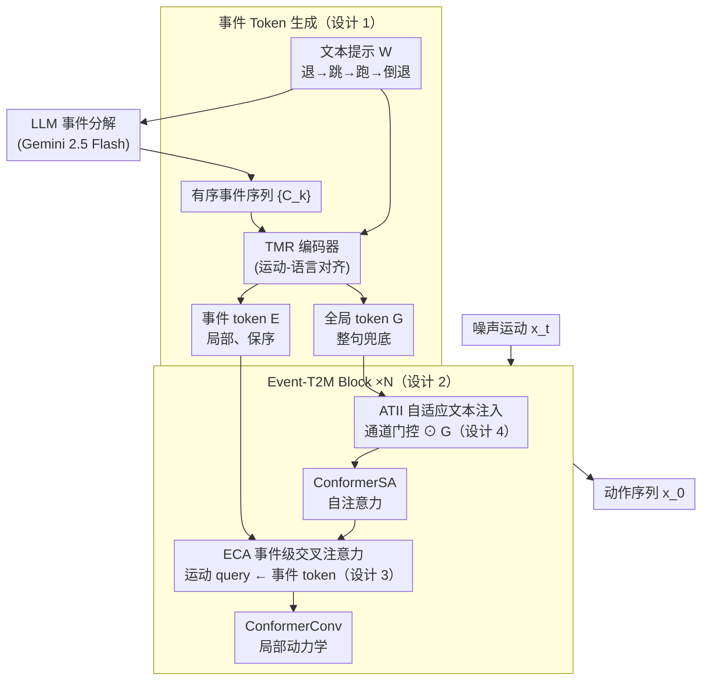

# Event-T2M: Event-level Conditioning for Complex Text-to-Motion Synthesis

**会议**: ICLR 2026  
**arXiv**: [2602.04292](https://arxiv.org/abs/2602.04292)  
**代码**: 有 (项目页面)  
**领域**: 图像生成  
**关键词**: 文本到动作生成, 事件级条件, 扩散模型, 组合动作, Conformer

## 一句话总结

提出 Event-T2M 框架，将文本提示分解为事件级别的原子动作，结合 TMR 编码器和事件级交叉注意力（ECA）模块注入 Conformer 扩散模型，显著提升多事件复杂动作生成的质量和语义对齐。

## 研究背景与动机

文本到动作（Text-to-Motion）生成领域虽然在 HumanML3D 和 KIT-ML 等基准上取得了显著进展（FID 已优化到小数点后两位），但这些基准主要由简单单动作描述组成，掩盖了一个关键问题：当面对复杂多动作提示（如"向前跑，然后停下，然后挥手"）时，现有系统往往会合并、跳过或重排动作。

核心问题在于：

**现有方法将整个提示压缩为单一嵌入**：大多数方法使用 CLIP 的 [EOS] token 作为全局表示，丢失了时序信息

**基准不区分简单与复杂提示**：无法评估模型在组合复杂度增加时的表现

**CLIP 预训练于图文对**：对动作的时序连续性和事件转换缺乏监督信号

## 方法详解

### 整体框架

Event-T2M 把"复杂多动作文本 → 动作"的生成重新拆到**事件粒度**来做。给定一句提示 $W$，先用 LLM（Gemini 2.5 Flash）把它切成**有序的事件序列** $\{C_k\}_{k=1}^K$（如"向后退、向上跳、向前跑、再倒退"切成四个事件）；再用运动感知的 TMR 编码器把每个事件单独编码成一枚**事件 token**（堆叠成 $E$，保住先后顺序），同时把整句编成一枚**全局 token** $G$ 备用。生成端是一个 Conformer 风格的扩散去噪器，由 $N$ 个相同的 **Event-T2M Block** 堆叠而成；每个块里靠 **ECA（事件级交叉注意力）** 让运动逐帧去对齐有序事件 token、靠 **ATII（自适应文本注入）** 在局部事件描述含糊时用全局语义兜底，最终从噪声逐步去噪出与各事件逐段对齐的动作序列。

**事件的形式化定义**：事件是文本提示中最小的、语义自包含的动作或状态变化，其执行可以在时间上被隔离并映射到一段连续运动片段——这是整套方法的出发点，也是把"压成一个嵌入"换成"一串有序 token"的依据。

### 关键设计

**1. 事件 Token 生成：把每个原子事件单独编码，保住提示里的时序结构**

既然旧方法把整句话压成一个嵌入会丢掉事件顺序，这里干脆反过来——分解出的每个事件 $C_k$ 都各自过一遍 TMR 编码器，得到一枚专属的事件 token：

$$E_k = f_{\text{TMR}}(C_k), \quad E_k \in \mathbb{R}^{D_y}$$

把 $K$ 个事件 token 堆起来就是 $E \in \mathbb{R}^{K \times D_y}$，一句提示里"先退、再跳、后跑"的先后关系于是被显式保留成了序列。与此同时还单独编码一枚全局文本 token $G = f_{\text{TMR}}(W)$，当某个局部事件描述本身模糊、单独的事件 token 不够用时，由它兜住整句话的整体语义。关键在于编码器选的是 TMR 而非 CLIP：TMR 经过运动-语言对齐训练，对动作的时序连续性有监督信号，这正是 CLIP 图文预训练缺的那一块。

**2. Event-T2M Block 架构：在 Conformer 块里专门腾出一步做事件注入**

去噪器由 $N$ 个相同的块堆叠而成，每个块按固定顺序走 8 步更新。它本质上是在标准 Conformer 块的"自注意力—卷积—FFN"骨架上，把原本的自注意力位置替换/补上了事件交叉注意力（第 5 步 ECA 即本文新增的核心），其余步骤负责局部建模、全局时序依赖和全局文本注入：

| 步骤 | 模块 | 作用 |
|------|------|------|
| (1) | LIMM | 局部信息建模（深度可分离卷积） |
| (2) | ATII | 自适应文本信息注入（通道级门控） |
| (3) | FFN | 前馈网络（0.5 残差权重） |
| (4) | ConformerSA | 自注意力（全局时序依赖） |
| (5) | **ECA** | **事件级交叉注意力（核心）** |
| (6) | ConformerConv | 深度可分离卷积（局部动力学） |
| (7) | FFN | 前馈网络（0.5 残差权重） |
| (8) | LIMM | 局部信息建模 |

其中两个 FFN 各取 0.5 残差权重、夹在注意力与卷积两侧，是遵循 Macaron 风格架构的直觉。

**3. 事件级交叉注意力（ECA）：让运动 token 主动去"查询"对应的那个事件**

这是整套方法最核心的一步。它把 Conformer 块里的标准自注意力换成一个运动到文本的交叉注意力：query 来自当前的运动 token $x_t^{\text{ctx}}$，而 key/value 来自上面那串事件 token $E$——

$$Q_m = x_t^{\text{ctx}} W^Q, \quad K_e = E W^K, \quad V_e = E W^V$$

$$A^{(h)} = \text{softmax}\left(\frac{Q_m^{(h)} (K_e^{(h)})^\top}{\sqrt{d_h}}\right)$$

这样每一帧运动都能在生成时自行决定"我现在该对齐到哪个事件"，从而避免把多个动作合并或漏掉某一段。为了不让这个新模块在训练初期就扰乱已有的扩散动力学，输出再乘一个可学习缩放因子 $\gamma$ 并初始化为接近零：$\text{ECA}(x_t, E) = \gamma \cdot \text{Dropout}(Z)$，让模型从"几乎不注入"出发、再慢慢学会用事件信息，保证收敛稳定。

**4. ATII 自适应文本注入：用全局语义在事件线索不足时兜底**

ECA 注入的是细粒度的事件信息，但有些场景里局部事件描述太含糊，光靠事件 token 撑不起来，这时就需要全局语义补位。ATII 把全局文本嵌入 $G$ 通过一个通道级门控融进运动状态：先把运动序列做 $S$ 倍下采样得到 $m'_j$，再用 sigmoid 门控逐通道决定 $G$ 里哪些维度该放行——

$$\hat{g}_j = \text{Sigmoid}(W_c[m'_j \oplus G]) \odot G$$

门控让全局语义不是无差别地灌入，而是按当前运动状态自适应过滤，和 ECA 的局部事件注入形成"全局兜底 + 局部精修"的互补。

### 损失函数 / 训练策略

采用标准条件去噪扩散目标函数，训练去噪器 $\varphi_\theta$ 从噪声运动 $x_t$ 恢复干净运动 $x_0$：

$$\mathcal{L}(\theta) = \mathbb{E}_{x_0, t, \epsilon}\left[\|x_0 - \varphi_\theta(x_t, t, G, E)\|_2^2\right]$$

- 训练时以概率 $\tau$ 随机丢弃文本条件，实现 Classifier-Free Guidance (CFG)
- 推理时采用 10 步 DDPM 进行高效生成
- 0.5 残差权重用于 FFN，遵循 Macaron 风格架构的直觉

## 实验关键数据

### 主实验

**表1：HumanML3D 标准基准**

| 方法 | R-Prec Top-1↑ | R-Prec Top-3↑ | FID↓ | MM-Dist↓ |
|------|--------------|--------------|------|----------|
| MoMask | 0.521 | 0.807 | 0.045 | 2.958 |
| MoGenTS | 0.529 | 0.812 | 0.033 | 2.867 |
| **Event-T2M** | **0.562** | **0.842** | 0.056 | **2.711** |

**表3：HumanML3D-E 事件分层基准（≥4 事件）**

| 方法 | R-Prec Top-1↑ | FID↓ | MM-Dist↓ |
|------|--------------|------|----------|
| MoMask | 0.441 | 0.418 | 3.205 |
| MoGenTS | 0.420 | 0.423 | 3.241 |
| **Event-T2M** | **0.466** | 0.265 | **3.063** |

Event-T2M 在 R-Precision Top-1 上高出 MoGenTS 约 4.6 个百分点（≥4 事件），展示出在复杂组合场景中的优势。

### 消融实验

**文本编码器对比（TMR vs CLIP）**：事件级条件下，TMR 编码器在所有事件复杂度上均优于 CLIP。

**条件方式对比**：事件级条件（Event-level）vs 逐 token 条件（Token-level）：

| 条件方式 | R-Prec Top-1↑ (≥2事件) | FID↓ |
|---------|----------------------|------|
| Token-level | 0.521 | 0.082 |
| **Event-level** | **0.536** | 0.079 |

事件级编码在所有复杂度条件下均优于逐 token 编码。

### 关键发现

1. **事件复杂度增加时优势放大**：随着事件数从 ≥1 到 ≥4 增加，基线方法性能急剧下降，而 Event-T2M 保持稳健
2. **效率优势**：在 ≥4 事件条件下，Event-T2M 以较小的模型规模实现高精度
3. **人类评估验证**：事件定义的合理性、HumanML3D-E 的可靠性以及生成质量均获得人类评估者的高度认可

## 亮点与洞察

1. **事件的形式化定义**具有普适性——将复杂提示分解为最小语义自包含单元的思路可推广到其他条件生成任务
2. **TMR 替代 CLIP**：用运动语言对齐的 TMR 编码器替代通用 CLIP，为特定领域的条件生成提供了范式参考
3. **HumanML3D-E 基准**：首个按事件数量分层的评估基准，填补了组合复杂度评估的空白
4. **可学习缩放因子 $\gamma$**：在 ECA 中初始化接近零确保训练稳定性，是一个实用的工程技巧

## 局限与展望

1. LLM 事件分解依赖外部模型（Gemini 2.5 Flash），增加了推理依赖和延迟
2. 事件之间的过渡质量（transition quality）未被显式建模
3. 仅在 HumanML3D/KIT-ML 上验证，缺少更大规模数据集上的泛化实验
4. 事件数量增大时 FID 仍有一定上升空间
5. 可探索端到端的事件分解与生成联合优化

## 相关工作与启发

- **GraphMotion**：用语义图增强文本表示，但评估有限
- **AttT2M**：body-part 注意力 + 全局-局部运动文本注意力
- **MMM**：掩码运动建模，联合编码文本和运动
- **Light-T2M**：ATII 模块的灵感来源
- 启发：事件级分解的思路可迁移到文本到视频、文本到舞蹈等任务

## 评分

- 新颖性：⭐⭐⭐⭐ — 事件级条件化是一个简洁且有效的新视角
- 技术贡献：⭐⭐⭐⭐ — ECA + TMR + 事件分层基准三位一体
- 实验充分度：⭐⭐⭐⭐ — 标准基准 + 分层基准 + 消融 + 人类评估
- 写作质量：⭐⭐⭐⭐ — 结构清晰，动机明确
- 总体推荐：⭐⭐⭐⭐ — 值得关注的工作，尤其对多动作生成场景有实际价值

<!-- RELATED:START -->

## 相关论文

- [\[CVPR 2026\] EventGait: Towards Robust Gait Recognition with Event Streams](../../CVPR2026/human_understanding/eventgait_towards_robust_gait_recognition_with_event_streams.md)
- [\[ECCV 2024\] FreeMotion: A Unified Framework for Number-free Text-to-Motion Synthesis](../../ECCV2024/human_understanding/freemotion_a_unified_framework_for_number-free_text-to-motion_synthesis.md)
- [\[ECCV 2024\] Event-based Head Pose Estimation: Benchmark and Method](../../ECCV2024/human_understanding/event-based_head_pose_estimation_benchmark_and_method.md)
- [\[CVPR 2026\] ParTY: Part-Guidance for Expressive Text-to-Motion Synthesis](../../CVPR2026/human_understanding/party_part-guidance_for_expressive_text-to-motion_synthesis.md)
- [\[CVPR 2026\] E-3DPSM: A State Machine for Event-Based Egocentric 3D Human Pose Estimation](../../CVPR2026/human_understanding/e-3dpsm_a_state_machine_for_event-based_egocentric_3d_human_pose_estimation.md)

<!-- RELATED:END -->
