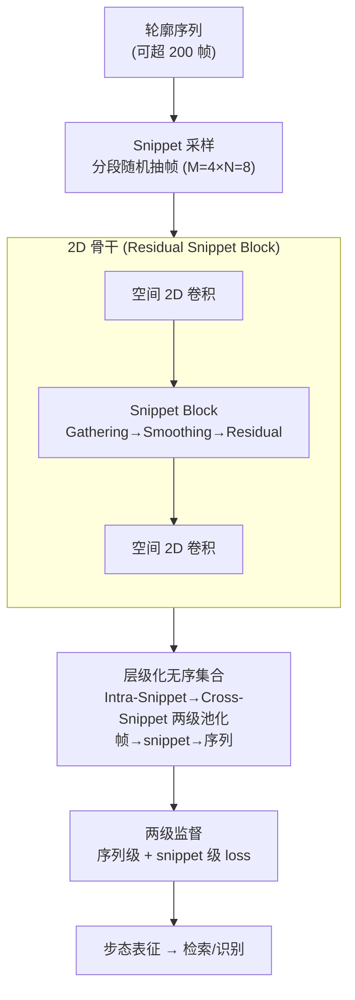

# GaitSnippet: Gait Recognition Beyond Unordered Sets and Ordered Sequences

**会议**: ICLR2026  
**arXiv**: [2508.07782](https://arxiv.org/abs/2508.07782)  
**代码**: 待确认  
**领域**: 人体理解  
**关键词**: gait recognition, snippet paradigm, temporal modeling, silhouette, 2D convolution  

## 一句话总结

提出 Snippet 范式：将步态轮廓序列组织为若干"片段"（snippet），每个 snippet 由一个连续区间内随机抽取的帧构成，兼顾短程时序上下文与长程时序依赖，在 Gait3D 上以 2D 卷积骨干达到 77.5% Rank-1，超越所有 3D 卷积方法。

## 研究背景与动机

步态识别以轮廓（silhouette）序列为输入，当前主流建模范式有两种：

**无序集合（Unordered Set）**：以 GaitSet 为代表，将所有帧视为无序集合用 2D 卷积独立提取特征，再通过 Set Pooling 聚合。优点是高效且对帧顺序扰动鲁棒，但每帧独立处理，**丢失了相邻帧之间的短程时序上下文**。

**有序序列（Ordered Sequence）**：以 GaitGL、DeepGaitV2-3D 为代表，用 3D/P3D 卷积联合建模时空特征。虽然能捕获局部时序，但训练时通常只采样约 30 帧连续段，**难以建模长程时序依赖**（真实场景序列可超过 200 帧）。

**核心问题**：能否找到一种新范式，同时获得短程时序感知和长程时序覆盖？

作者从人类认知中获得启发——识别一个人往往只需观察几个关键动作（甚至不需要完整步态周期），因此提出将步态视为**个体化动作的组合**，每个动作用一个 snippet 表示。

## 方法详解

### 整体框架

GaitSnippet 想在"无序集合"和"有序序列"之间走出第三条路：既保留集合范式对长序列的覆盖能力，又补回序列范式才有的短程时序上下文。做法是把一段轮廓序列切成若干等长 segment，每个 segment 里随机抽几帧拼成一个 snippet（代表一个局部动作），然后让特征沿着"帧 → snippet → 序列"两次聚合上来——snippet 内部用一个轻量时序模块注入局部上下文，snippet 之间再用集合池化拼成最终的序列级步态表征。整条 pipeline 仍然跑在纯 2D 卷积骨干上，时序建模全靠 snippet 结构本身完成。

### 关键设计

**1. Snippet 采样：用"分段随机抽帧"同时拿到短程上下文和长程覆盖**

序列范式只采约 30 帧连续段，看不到长程；集合范式逐帧独立，丢了短程。Snippet 采样把序列切成 $K$ 个等长 segment（长度 $L=16$，约一个步态周期），训练时随机挑 $M=4$ 个 segment，每个 segment 内再随机抽 $N=8$ 帧组成一个 snippet，总采样帧数 $S = M \times N = 32$。这样既让每个 snippet 内的帧相互邻近、保留局部动作的时序连续性，又让被采的 segment 散落在整条长序列上、覆盖了远程依赖。第一个 segment 的长度 $L_1$ 在 $\{1,\ldots,L\}$ 里随机取，进一步增加采样多样性、起到正则作用。推理时改为用全部帧——每个 segment 内的所有帧构成一个 snippet（即 $M=K,\,N=L$），第一段长度固定为 $L$ 以保证预测稳定。

**2. 片段内建模（Snippet Block）：把局部时序上下文逐层注入帧级特征**

光有 snippet 的采样还不够，得在网络内部真正用上 snippet 内的时序关系。Snippet Block 分三步：先 **Gathering**，把一个 snippet 内的帧当作无序集合，用非参数化的 Temporal Max Pooling 聚合成 snippet 级表征；再 **Smoothing**，对聚合结果施加一个 $1\times1$ 卷积，平滑噪声并缩小帧级与 snippet 级特征之间的语义差距；最后 **Residual**，通过残差连接把这份 snippet 级上下文加回到每个帧级特征上。把这个 block 插进标准 2D 残差块的两个空间卷积层之间，就得到 **Residual Snippet Block**，作为骨干网络的基本构件。灵感来自 P3D——让帧级特征在逐层卷积的过程中持续感知所在 snippet 的局部时序上下文，而不是等到最后才一次性做时序聚合。骨干本身基于 DeepGaitV2-2D（ResNet 风格的 2D 卷积），把标准残差块整体换成 Residual Snippet Block，并用 Horizontal Pyramid Mapping 提取多粒度局部表征。

**3. 片段间建模（层级化无序集合）：两级集合池化拼出序列表征，却不丢时序**

骨干输出端先对帧级特征做一次 Intra-Snippet Gathering 得到每个 snippet 的表征，再把所有 snippet 视为无序集合、第二次用 Temporal Max Pooling 聚合成序列级表征，整体形成"帧 → snippet → 序列"的层级化无序集合结构。关键在于：虽然两层都用了集合池化、看似又回到了排列不变的集合范式，但 snippet 内部已经过 Snippet Block 的时序建模，局部时序信息早已融进帧级特征里——因此整条 pipeline 在帧粒度上**不是**排列不变的，长程靠集合池化覆盖、短程靠 Snippet Block 保住，两者各司其职。

### 损失函数 / 训练策略

Snippet 范式天然产出两级表征（序列级 + snippet 级），作者顺势给 snippet 级特征加了一条独立监督分支。序列级用 Triplet Loss $\mathcal{L}_{tp}$ 加 Cross-Entropy Loss $\mathcal{L}_{ce}$（配合 BNNeck）；snippet 级则在 snippet 粒度上构建正负对，得到对应的 $\mathcal{L}_{tp}^{\star}$ 与 $\mathcal{L}_{ce}^{\star}$。总损失为

$$\mathcal{L}_{all} = \mathcal{L}_{tp} + \mathcal{L}_{ce} + \alpha\,(\mathcal{L}_{tp}^{\star} + \mathcal{L}_{ce}^{\star}),\quad \alpha=0.75.$$

这条 snippet 级分支只在训练时启用，推理阶段直接丢弃，因此不带来任何额外推理开销。

## 实验关键数据

### 主实验（真实场景数据集）

| 方法 | 类型 | 骨干 | Gait3D R1 | Gait3D mAP | GREW R1 | GREW R5 |
|------|------|------|-----------|------------|---------|---------|
| GaitSet | Set | 2D | 36.7 | 30.0 | 48.4 | 63.6 |
| GaitBase | Set | 2D | 64.6 | 55.3 | 60.1 | 75.5 |
| DeepGaitV2-2D | Set | 2D | 68.2 | 60.4 | 68.6 | 82.0 |
| DeepGaitV2-3D | Seq | 3D | 72.8 | 63.9 | 79.4 | 88.9 |
| VPNet | Seq | 3D | 75.4 | — | 80.0 | 89.4 |
| SwinGait-3D | Seq | Swin3D | 75.0 | 67.2 | 79.3 | 88.9 |
| **GaitSnippet** | **Snippet** | **2D** | **77.5** | **69.4** | **81.7** | **90.9** |

核心发现：

- GaitSnippet 用 2D 卷积骨干**全面超越**所有 3D 卷积方法
- 相比同骨干的 DeepGaitV2-2D：Gait3D R1 提升 **+9.3%**，mAP 提升 **+9.0%**
- 在 CCPG（换装场景）上 AVG 达 95.1%，CCGR-MINI R1 达 42.4%，均为最佳

### 消融实验（Gait3D）

**Snippet Sampling 的效果**：

- 仅将 DeepGaitV2-2D 的采样策略从 Set 换为 Snippet：R1 从 68.2% 升至 69.5%（+1.3%），说明 snippet 采样本身即有正则化效果
- 最优超参：$L=16, M=4, N=8$

**Snippet Block 各组件**：

- 去掉 Gathering：R1 降至 73.3%（无法做 snippet 级监督）
- 去掉 Smoothing：R1 降至 74.8%（噪声/语义差距增大）
- 去掉 Residual：R1 降至 72.5%（丢失帧级细粒度信息，影响最大）

**Snippet-Level Supervision**：

- $\alpha=0$（无 snippet 级监督）仍有竞争力表现，说明 Snippet Block 本身有效
- 加入 snippet 级监督（$\alpha=0.75$）进一步提升性能

## 优点与局限

**优点**：

- 提出了介于集合和序列之间的第三种范式，概念清晰且有认知科学支撑
- 仅用 2D 卷积骨干即超越所有 3D 方法，计算成本更低
- Snippet Block 设计简洁（非参数化 pooling + 1×1 conv + 残差），易于集成到现有架构
- 层级化监督（序列级 + snippet 级）充分利用了 snippet 范式的结构优势
- 在受控（CCPG）和无约束（Gait3D/GREW）场景均表现最优

**局限**：

- Snippet 长度 $L$ 固定为 16 帧，对步频差异较大的个体可能不够自适应
- Cross-Snippet Modeling 仅用 Max Pooling 聚合，未探索更复杂的 snippet 间关系建模（如 Transformer）
- 推理时需处理所有帧构成的全部 snippet，长序列下推理开销仍可能较高
- 仅在轮廓模态上验证，未扩展到骨架/RGB 等其他模态

## 评分

- 新颖性: ⭐⭐⭐⭐ 提出 snippet 新范式，概念贡献明确
- 实验充分度: ⭐⭐⭐⭐⭐ 四个数据集 + 详尽消融
- 价值: ⭐⭐⭐⭐ 2D 骨干超越 3D 方法，实用性强

<!-- RELATED:START -->

## 相关论文

- [\[CVPR 2026\] MMGait: Towards Multi-Modal Gait Recognition](../../CVPR2026/human_understanding/mmgait_multi_modal_gait_recognition.md)
- [\[CVPR 2026\] EventGait: Towards Robust Gait Recognition with Event Streams](../../CVPR2026/human_understanding/eventgait_towards_robust_gait_recognition_with_event_streams.md)
- [\[CVPR 2026\] HyperGait: Unleashing the Power of Parsing for Gait Recognition in the Wild via Hypergraph](../../CVPR2026/human_understanding/hypergait_unleashing_the_power_of_parsing_for_gait_recognition_in_the_wild_via_h.md)
- [\[CVPR 2026\] Text-guided Feature Disentanglement for Cross-modal Gait Recognition](../../CVPR2026/human_understanding/text-guided_feature_disentanglement_for_cross-modal_gait_recognition.md)
- [\[CVPR 2026\] Goldilocks Test Sets for Face Verification](../../CVPR2026/human_understanding/goldilocks_test_sets_for_face_verification.md)

<!-- RELATED:END -->
