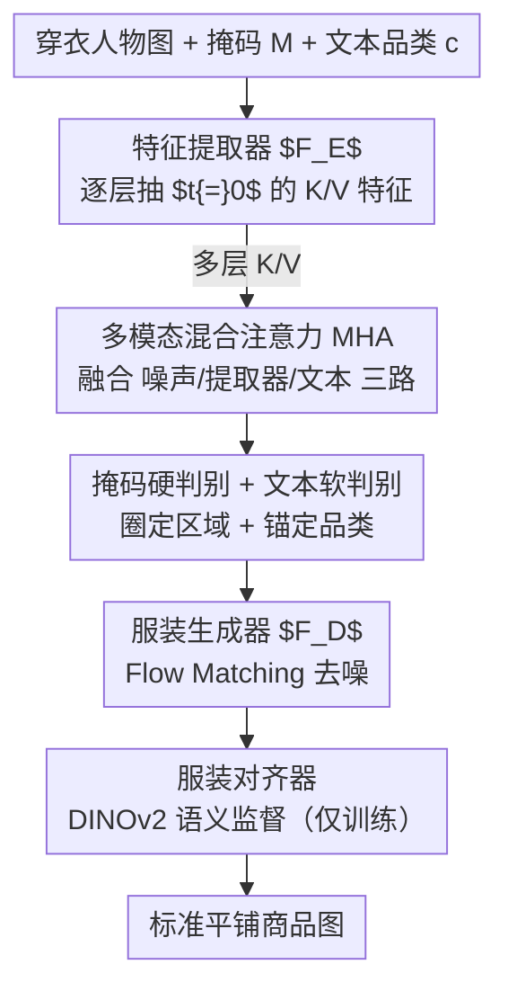

# Inverse Virtual Try-On: Generating Multi-Category Product-Style Images from Clothed Individuals

**会议**: ICLR 2026  
**arXiv**: [2505.21062](https://arxiv.org/abs/2505.21062)

**代码**: [项目页面](https://temu-vtoff-page.github.io/)

**领域**: 人体理解  
**关键词**: 虚拟脱衣, 服装提取, Dual-DiT, 多模态注意力, 服装对齐

## 一句话总结

提出TEMU-VTOFF——面向虚拟脱衣(VTOFF)任务的Dual-DiT架构，通过特征提取器+服装生成器分工协作，结合多模态混合注意力(MHA)融合图像/文本/掩码信息消解视觉歧义，并设计DINOv2驱动的服装对齐器保留高频细节，在VITON-HD和Dress Code多品类场景均达到SOTA。

## 研究背景与动机

**VTOFF任务定义**：虚拟脱衣(Virtual Try-Off)的目标是从穿衣人物照片恢复标准化平铺商品图像。与VTON(虚拟试穿)相反，VTOFF输出格式一致(平铺展示)，但输入信息受限(只有穿衣照)。

**商业价值**：时尚电商需要大量标准目录图(catalog images)用于检索/推荐，但人工拍摄成本高。VTOFF可将客户/模特穿衣照自动转为标准图，实现规模化。

**现有方法问题(1)——架构错配**：TryOffDiff、TryOffAnyone等简单反转VTON流程，未针对VTOFF任务特点设计专用架构，导致形状/领口/腰部结构性伪影。

**现有方法问题(2)——单模态瓶颈**：仅依赖单张图的视觉线索→遮挡/复杂姿态下歧义大。CLIP pooled vector过于粗糙($\mathbb{R}^{2048}$)，无法编码精细服装特征。

**现有方法问题(3)——品类限制**：TryOffDiff/TryOffAnyone仅支持上装单品类，MGT虽支持多品类但仍有纹理/颜色失真问题。

**技术趋势**：DiT+Flow Matching已在扩散模型中超越U-Net+DDPM。SD3证明DiT中文本-图像联合注意力(MMDiT)的有效性→为多模态条件化提供基础架构。

## 方法详解

### 整体框架

TEMU-VTOFF 把虚拟脱衣拆成两个同架构的 DiT 分工协作：特征提取器 $F_E$ 读穿衣人物图，逐层吐出富含服装结构信息的中间特征；服装生成器 $F_D$ 拿着这些特征做去噪，生成标准平铺商品图。二者通过一套多模态混合注意力把"图像特征、文本品类、掩码区域"三路信息融在同一注意力里，从而在遮挡和复杂姿态下消解视觉歧义；训练时再挂一个服装对齐器，用 DINOv2 语义监督把高频细节钉住。

### 关键设计

**1. 特征提取器 $F_E$：用整张特征图替代一个粗向量**

现有方法把穿衣照压成一个 CLIP pooled 向量 $e^v_{pool} \in \mathbb{R}^{2048}$ 喂给生成器，这种粗粒度编码丢掉了纹理、领口、走线等精细信息，是结构性伪影的根源。$F_E$ 改用一个完整的 DiT 来提特征：全局上把 CLIP pooled 向量经 AdaLN 注入做风格调制；局部上把噪声隐变量 $z_t$（16 通道）、二值掩码 $M$（1 通道）、以及掩码人物图的 VAE 编码 $x_M=\mathcal{E}(x_{model}\odot M)$（16 通道）沿通道拼成 $z'_t=[z_t, M, x_M]\in\mathbb{R}^{h\times w\times 33}$ 输入。关键细节是在 $t=0$（干净数据，而非各去噪步）时抽取各层键值对 $K^l_{extractor},V^l_{extractor}$，这样得到的是 $S\times d$ 维的展开特征而非单个 $\mathbb{R}^{2048}$ 向量，$L$ 层天然覆盖从粗到细的多粒度信息；又因为 $F_E$ 与 $F_D$ 同架构，两侧特征空间天然对齐，迁移时几乎无失真。

**2. 多模态混合注意力 MHA：把文本、隐变量、提取器特征塞进同一个注意力**

光有图像特征还不够——遮挡处的服装结构在视觉上根本不可见，需要文本品类来"补全"语义。MHA 把三路信息拼进 Q/K/V：$Q=[Q_{z_t},Q_{text}]$，$K=[K_{z_t},K_{extractor},K_{text}]$，$V=[V_{z_t},V_{extractor},V_{text}]$，其中文本嵌入由 $e_{text}=[\text{CLIP}(c),\text{T5}(c)]\in\mathbb{R}^{77\times 4096}$ 构成。这一拼接同时打通三种交互：$A_{text\leftrightarrow z_t}$ 保持预训练的语言-图像对齐，$A_{z_t\leftrightarrow extractor}$ 把穿衣照的细粒度特征迁移到生成的服装图上，$A_{text\leftrightarrow extractor}$ 则把文本语义锚定到提取器的结构特征——正是这条交互让"被遮住的衣袖该长什么样"有了语义指引。

**3. 掩码硬判别 + 文本软判别：用互补信号实现跨品类统一**

要让同一个模型既能脱上装又能脱下装，必须明确告诉它"目标是哪件衣服、属于什么品类"。这里掩码和文本扮演互补角色：掩码是硬判别器，精确圈定目标服装占据的像素区域，回答"哪些像素"；文本是软判别器，提供 "upper-body shirt"/"lower-body pants" 这类品类语义，回答"是什么品类"。条件注入也走两条路径——CLIP pooled 文本特征 $e_{pool}\in\mathbb{R}^{2048}$ 经 AdaLN 提供高层风格/外观，完整文本嵌入则经 MHA 提供局部语义。消融显示二者缺一不可：同时去掉掩码和文本 FID 从 5.74 升到 9.63，单去掩码升到 6.58，单去文本升到 7.75。

**4. 服装对齐器：在语义空间而非像素空间盯住高频细节**

扩散损失在噪声空间优化，对高频细节天生不敏感，容易把花纹/走线生成得模糊。服装对齐器用一个轻量 CNN 把 DiT 第 8 层特征下采样到 DINOv2 表示空间，用余弦相似度监督它向真实服装的语义特征靠拢：

$$\mathcal{L}_{align} = -\mathbb{E}_{z_g, \epsilon_t, t}\left[\frac{1}{N}\sum_{i=1}^{N}\cos(\tilde{h}_i^{DiT}, h_i^{enc})\right]$$

这等于在语义层面给高频细节加了一道额外监督，比在像素空间重建更鲁棒。对齐器只在训练时挂上，推理时直接丢弃，零额外计算开销。

### 损失函数 / 训练策略

训练分两阶段：先单独用扩散损失训练特征提取器 $F_E$，让它学会从穿衣照中抽取有用的服装结构特征；再训练服装生成器 $F_D$，同时优化扩散损失与对齐损失。最终目标为

$$\mathcal{L}_{total} = \mathcal{L}_{DiT} + \lambda \cdot \mathcal{L}_{align}$$

其中 $\mathcal{L}_{align}$ 仅作用于训练阶段，$\lambda$ 平衡去噪重建与语义对齐两项。

## 实验结果

### 表1：Dress Code数据集主实验

| 方法 | SSIM↑ | LPIPS↓ | DISTS↓ | FID↓ | KID↓ |
|------|-------|--------|--------|------|------|
| Any2AnyTryon | 77.56 | 35.17 | 25.17 | 12.32 | 3.65 |
| MGT | 77.77 | 35.37 | 27.28 | 13.47 | 5.28 |
| **TEMU-VTOFF** | **75.95** | **31.46** | **18.66** | **5.74** | **0.65** |

在FID上相比次优方法Any2AnyTryon降低53.4%（12.32→5.74），DISTS降低25.9%。

### 表2：VITON-HD数据集主实验

| 方法 | SSIM↑ | LPIPS↓ | DISTS↓ | FID↓ | KID↓ |
|------|-------|--------|--------|------|------|
| TryOffDiff | 75.53 | 39.56 | 25.53 | 17.49 | 5.30 |
| TryOffAnyone | 75.90 | 35.26 | 23.47 | 12.74 | 2.85 |
| One Model for All | — | 22.50 | 19.20 | 9.12 | 1.49 |
| **TEMU-VTOFF** | **77.21** | **28.44** | **18.04** | **8.71** | **1.11** |

### 表3：消融实验（Dress Code，部分关键结果）

| 配置 | DISTS↓ | FID↓ |
|------|--------|------|
| w/o 特征提取器 $F_E$ | 23.56 | 9.11 |
| w/o 服装对齐器 | 20.63 | 5.91 |
| w/o 文本和掩码 | 25.20 | 9.63 |
| w/o 文本调制 | 22.54 | 7.75 |
| w/o 精细掩码 | 20.87 | 6.58 |
| **完整TEMU-VTOFF** | **18.66** | **5.74** |

每个组件都有明确贡献。去除 $F_E$ 后FID从5.74升至9.11(+58.7%)，证明Dual-DiT设计的核心价值。

## 关键发现

- **MHA中text↔extractor交互**对解决遮挡歧义至关重要——文本为视觉不可见的结构特征提供语义锚点
- **掩码+文本联合效果远大于单独使用**：去除两者后FID从5.74→9.63；单独去掩码→6.58，单独去文本→7.75
- **跨数据集泛化**：Dress Code训→VITON-HD测，FID 20.39 vs MGT 23.11；反向迁移同样优势明显(FID 18.63 vs TryOffDiff 41.91)
- **下游增益**：用TEMU-VTOFF生成的合成服装图增强训练数据→CatVTON的FID在各品类均下降，验证了生成质量的实用性

## 亮点与洞察

- **VTOFF专用架构设计**：不是简单反转VTON管线，而是针对VTOFF"输入信息受限"(只有穿衣照)的特点，设计了特征提取←→生成分离的Dual-DiT
- **掩码=硬判别/文本=软判别的互补理论**：清晰的分析框架——掩码确定"哪些像素"，文本确定"什么品类"，两者缺一不可
- **DINOv2对齐的巧妙应用**：仅在训练时使用，推理零开销。不在像素空间重建→在语义空间对齐→更鲁棒的高频细节保留
- **实用性验证**：不仅评VTOFF本身，还证明生成的合成数据可提升下游VTON任务性能
- **跨数据集实验**设计合理，展示了真正的泛化能力而非数据集过拟合

## 局限性

- SSIM指标上并非最优(75.95 vs Any2AnyTryon 77.56)——像素对齐精度仍有提升空间
- Lower-body品类性能偏低（Dress Code中下装样本仅~9k vs 上装~15k vs 全身裙~29k）→数据不平衡问题
- 依赖文本描述作为输入条件→实际部署时需要额外的captioning模块
- 掩码提取质量直接影响结果→需要可靠的分割前端
- 推理速度受限于Dual-DiT的双重前向传播（虽然 $F_E$ 只跑一次）
- 仅在Fashion数据集上验证→更广泛物品品类(配饰/鞋包)的泛化性未知

## 相关工作对比

### vs TryOffDiff (Velioglu et al., 2024)
TryOffDiff是VTOFF任务的开创者，用SigLIP条件化的扩散模型恢复服装图。但它仅支持单品类(上装)，且简单复用VTON架构→结构性伪影。TEMU-VTOFF通过Dual-DiT+MHA从根本上重新设计了VTOFF流程，在VITON-HD上FID从17.49降至8.71(DISTS 25.53→18.04)，并首次实现多品类统一处理。

### vs MGT (Velioglu et al., 2025)
MGT通过类别嵌入扩展至多品类，但仍受限于粗粒度视觉编码。TEMU-VTOFF在Dress Code全集FID上大幅领先(5.74 vs 13.47)，在跨数据集测试中也优势明显(20.39 vs 23.11)。关键差异在于TEMU-VTOFF引入了文本+掩码的双模态条件化+专门的特征提取器，而非仅添加类别标签。

### vs One Model for All (Liu et al., 2025)
One Model for All统一VTON和VTOFF为单一框架，在LPIPS(22.50)和DISTS(19.20)上有竞争力。但TEMU-VTOFF作为VTOFF专用架构在FID(8.71 vs 9.12)和KID(1.11 vs 1.49)上仍更优，说明任务专用设计仍有价值。

## 评分

- **新颖性**: ⭐⭐⭐⭐ Dual-DiT分工+MHA三路交叉注意力+掩码/文本互补消歧→VTOFF专用架构设计思路清晰有原创性
- **实验充分度**: ⭐⭐⭐⭐⭐ 两数据集+6种指标+完整消融+跨数据集泛化+下游VTON增强实验→评估体系全面
- **写作质量**: ⭐⭐⭐⭐ 动机分析透彻(掩码硬/文本软判别器)，方法描述层次分明，实验对比公平
- **实用价值**: ⭐⭐⭐⭐ 对电商平台有直接应用价值，下游增益实验验证了实际可用性

<!-- RELATED:START -->

## 相关论文

- [\[CVPR 2026\] RefTon: Reference Person Shot Assist Virtual Try-on](../../CVPR2026/human_understanding/refton_reference_person_shot_assist_virtual_try-on.md)
- [\[CVPR 2026\] Mobile-VTON: High-Fidelity On-Device Virtual Try-On](../../CVPR2026/human_understanding/mobile_vton_ondevice_virtual_tryon.md)
- [\[CVPR 2026\] Reference-Free Image Quality Assessment for Virtual Try-On via Human Feedback](../../CVPR2026/human_understanding/reference-free_image_quality_assessment_for_virtual_try-on_via_human_feedback.md)
- [\[CVPR 2026\] MOFA-VTON: More Fashion Possibilities with Fine-Grained Adaptations in Virtual Try-On](../../CVPR2026/human_understanding/mofa-vton_more_fashion_possibilities_with_fine-grained_adaptations_in_virtual_tr.md)
- [\[ECCV 2024\] Wear-Any-Way: Manipulable Virtual Try-on via Sparse Correspondence Alignment](../../ECCV2024/human_understanding/wear-any-way_manipulable_virtual_try-on_via_sparse_correspondence_alignment.md)

<!-- RELATED:END -->
