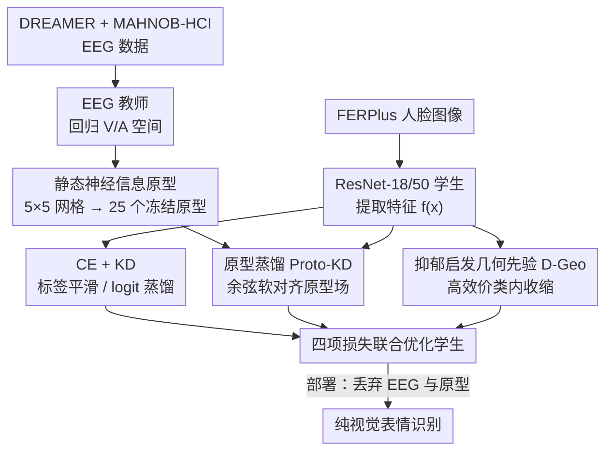

# NeuroGaze-Distill: Brain-informed Distillation and Depression-Inspired Geometric Priors for Robust Facial Emotion Recognition

**会议**: ICLR 2026  
**arXiv**: [2509.11916](https://arxiv.org/abs/2509.11916)  
**代码**: [GitHub](https://github.com/Lixeeone/NeuroGaze-Distill) (最小复现仓库)  
**领域**: 人体理解  
**关键词**: facial emotion recognition, knowledge distillation, EEG prototypes, depression-inspired prior, cross-dataset robustness

## 一句话总结

提出 NeuroGaze-Distill 跨模态蒸馏框架：从 EEG 脑电训练的教师模型中提取静态 Valence-Arousal 原型，通过 Proto-KD 和抑郁症启发的几何先验（D-Geo）注入纯视觉学生模型，无需 EEG-人脸配对数据，提升表情识别的跨数据集鲁棒性。

## 研究背景与动机

1. 基于像素的表情识别（FER）模型在域内表现良好，但跨数据集泛化能力很差——人口特征、采集条件、标注规范的差异导致严重的分布偏移
2. 人脸外观是情感的间接且有偏代理，但生理信号（如 EEG 脑电）编码了与外观解耦的情感动态
3. 大规模收集配对的 EEG-人脸数据不切实际，也不利于部署纯视觉系统
4. 核心创意：在连续 Valence-Arousal (V/A) 空间中学习静态的神经信息原型，蒸馏到纯图像学生模型
5. 灵感来自情感神经科学：抑郁相关研究观察到快感缺失（anhedonia）——高效价区域的情感响应减弱
6. 将此观察编码为轻量级几何正则项（D-Geo），软性塑造嵌入空间的几何结构

## 方法详解

### 整体框架

NeuroGaze-Distill 把 EEG 脑电里编码的情感结构，离线压缩成一组静态的 Valence-Arousal 原型，再当作"软标签锚点"蒸馏给一个纯视觉的表情识别学生。整套流程分两段：先在 DREAMER + MAHNOB-HCI 上训练一个回归 V/A 的 EEG 教师，把它验证集的特征聚成 25 个原型并冻结；再在 FERPlus 上训练 ResNet-18/50 学生，用 CE + KD + Proto-KD + D-Geo 四项联合优化。部署时 EEG 教师和原型都不参与，只跑视觉模型，因此从头到尾都不需要 EEG-人脸的配对数据。下图把这两段（离线造原型 / 在线训学生）以及三项贡献串起来看：

### 关键设计

**1. 静态神经信息原型：把昂贵的 EEG 信号压成可复用的几何锚点**

跨模态蒸馏最大的障碍是 EEG 与人脸难以配对采集，本文用"一次构建、永久冻结"的原型绕开了它。具体做法是把连续的 V/A 平面离散成 5×5 网格（中心点从 -0.8 均匀铺到 0.8），对教师倒数第二层特征先做 L2 归一化，再在落入每个 bin 的样本上取平均，得到该 bin 的原型 $p_k$；空 bin 用最近非空 bin 的均值回填，保证 25 个原型全部有效。网格分辨率是稳定性与覆盖度的折中——实验里换成更密的 7×7 会让多数 bin 样本过少，原型统计崩塌。由于原型在教师验证集上一次算好后就冻结复用，学生训练阶段没有任何额外的 EEG 前向开销。

**2. 原型蒸馏 Proto-KD：让视觉学生隐式继承 EEG 的情感空间结构**

有了静态原型，问题变成如何在没有配对监督的情况下把教师的几何结构传给学生。Proto-KD 走的是余弦相似度的软对齐：对学生特征 $f(x)$ 与每个原型计算 $s_k = \cos(f(x), p_k)$，用温度 $\tau=0.90$ 归一化成学生分布 $q^{stu} = \text{softmax}(s/\tau)$，再让它去逼近由原型自身导出的目标分布 $q^{pro}$，即最小化 $D_{KL}(q^{pro} \| q^{stu})$。这样学生不需要知道任何一张人脸对应的真实脑电，只要它在 V/A 原型场里落到与教师一致的"相对位置"，就等价于继承了 EEG 捕获的情感拓扑，从而在跨数据集上更稳。

**3. 抑郁启发的几何先验 D-Geo：用神经科学观察软塑嵌入形状**

最后一项把情感神经科学的观察转成正则项。抑郁相关研究发现高效价区域常出现快感缺失（anhedonia）——情感响应减弱、表征更集中，本文据此猜测"高效价类更紧凑"可能也利于视觉表情识别的鲁棒性。D-Geo 因此做两件事：对高效价类别（happiness、surprise）施加一个类内方差上界 cap，把这些簇往紧里收；同时在全局鼓励类间 margin，避免收缩牺牲可分性。为了不在训练早期就压垮特征的分离能力，它用余弦 ramp 从 epoch 20 到 60 缓慢激活，且权重很小。t-SNE 可视化证实 D-Geo 确实让高效价簇更紧凑，同时低效价类的边界依旧清晰。

### 损失函数 / 训练策略

四项损失联合优化，总目标为

$$\mathcal{L} = \underbrace{\mathcal{L}_{CE}}_{\text{标签平滑 0.055 + 类权重}} + \lambda_{kd} \underbrace{\mathcal{L}_{KD}}_{\text{MSE/KL, T=5.0}} + \lambda_{proto} \underbrace{D_{KL}(q^{pro} \| q^{stu})}_{\text{Proto-KD, } \tau=0.90} + \lambda_{geo} \underbrace{\mathcal{L}_{D\text{-}Geo}}_{\text{延迟激活}}$$

其中 $\mathcal{L}_{CE}$ 是带标签平滑（0.055）和类权重的交叉熵，$\mathcal{L}_{KD}$ 是温度 T=5.0 的 logit 蒸馏。训练用 AdamW，余弦学习率衰减，base LR $2 \times 10^{-4}$，weight decay 0.05，batch size 128，混合精度（AMP）配梯度裁剪 1.0。值得一提的是学生 EMA 被显式禁用——Mean-Teacher 风格在该任务上反而掉点。

## 实验关键数据

### 主实验

FERPlus 验证集消融（8-way）：

| 变体 | Acc (%) | Macro-F1 (%) | bACC (%) |
|------|---------|-------------|----------|
| B0: CE only | 78.22 | 51.29 | 49.77 |
| B1: +KD | 82.31 | 63.56 | 59.28 |
| B2: +KD+Proto | 81.48 | 64.21 | 60.30 |
| **B3: Full (+D-Geo)** | **83.06** | **64.74** | **59.90** |
| Full (T=1) | 83.66 | 65.39 | 61.32 |

跨数据集评估（A3_full, present-only）：

| 数据集 | Acc (%) | Macro-F1 (%) | bACC (%) |
|--------|---------|-------------|----------|
| FERPlus (valid) | 83.06 | 64.74 | 59.90 |
| AffectNet-mini | 76.30 | 75.60 | 75.77 |
| CK+ | 64.93 | 49.33 | 52.46 |

### 消融实验

组件贡献分析：

| 组件 | 关键效果 |
|------|---------|
| KD (B0→B1) | Macro-F1 大幅提升 (+12.27)，加速早期收敛 |
| Proto-KD (B1→B2) | 改善类平衡 bACC (+1.02)，稳定原型对齐 |
| D-Geo (B2→B3) | 保持 Macro-F1 最优，塑造高效价紧凑簇 |

超参敏感性：

| 参数 | 最优值 | 说明 |
|------|--------|------|
| $\lambda_{proto}$ | 0.12 | 0.10-0.15 范围内稳定 |
| D-Geo 激活 | epoch 20→60 | 从 epoch 0 开始会损害早期可分性 |
| V/A 网格大小 | 5×5 | 7×7 导致稀疏 bin 崩溃 |

### 关键发现

1. KD 是最大的单项提升因素（Macro-F1 +12.27），Proto-KD 和 D-Geo 提供互补的后期改进
2. Proto-KD 减少了 anger/sadness 混淆（AffectNet-mini 上），D-Geo 进一步提升高效价纯度
3. t-SNE 可视化显示 B0→B3 的逐步改进：类间 margin 增大、高效价簇变紧凑
4. 在 AffectNet-mini 上的 present-only Macro-F1（75.60%）明显优于 8-way 的 CK+（39.23%），说明标签集不匹配是跨数据集评估的关键问题
5. 学生 EMA（Mean-Teacher 风格）在此任务下反而降低性能，被禁用
6. 所有制品（原型银行、检查点、metrics JSON）都有 SHA-256 hash 验证，可复现性好

## 亮点与洞察

1. **跨模态知识蒸馏的创新路径**：EEG→V/A原型→视觉学生，巧妙规避了配对数据的需求
2. **抑郁症启发的几何先验 D-Geo** 是非常独特的正则化思路——将神经科学洞察编码为嵌入空间约束
3. **5×5 原型设计简洁有效**：一次构建、冻结复用，无额外推理开销
4. **present-only 评估协议**公正地处理了标签集不匹配问题，值得 FER 领域推广
5. 负责任研究声明详尽：明确 D-Geo 是非诊断性的、非临床用途的几何偏置，设计了复用 checklist

## 局限与展望

1. **FERPlus 验证集结果（83.06% Acc）在 FER 领域不算 SOTA**，更多是验证框架的通用性
2. D-Geo 的收益较小（Macro-F1 从 64.21 到 64.74），其效果可能受限于 D-Geo 的弱正则化权重
3. 教师网络的 EEG 数据量有限（DREAMER + MAHNOB-HCI），原型质量受限于 EEG 数据的规模和多样性
4. CK+ 上的 8-way 性能较低（Acc 55.86%），说明极端域迁移场景仍有挑战
5. 仅使用 ResNet-18/50 作为学生骨干，未探索更强的视觉架构（如 ViT、ConvNeXt）
6. "NeuroGaze" 中的 Gaze 部分在最终实验中被禁用，命名与实际方法略有脱节

## 相关工作与启发

- **知识蒸馏**（Hinton et al., 2015）：logit-based 软目标蒸馏的基础方法
- **原型学习**（Snell et al., 2017; Li et al., 2020）：原型代表类/区域结构，Proto-KD 将此扩展到 V/A 空间
- **EEG 情感识别**：大多为 EEG-only 或需要配对多模态训练，本文首次实现单向蒸馏（EEG→V/A→视觉）
- 启发：跨模态原型蒸馏思路可推广到其他"昂贵信号→廉价推理"场景（如 fMRI→行为预测）

## 评分

- **新颖性**: ⭐⭐⭐⭐ EEG→V/A原型蒸馏的理念新颖，D-Geo 灵感独特且具有跨学科视角
- **实验充分度**: ⭐⭐⭐ 消融充分但缺乏与 FER SOTA 方法的全面对比，数据规模有限
- **写作质量**: ⭐⭐⭐⭐ 算法伪代码清晰，负责任研究声明详尽专业，但部分描述冗余
- **价值**: ⭐⭐⭐ 框架理念有启发性，但实际 FER 性能提升有限；D-Geo 的实际收益需更多验证

<!-- RELATED:START -->

## 相关论文

- [\[AAAI 2026\] Facial-R1: Aligning Reasoning and Recognition for Facial Emotion Analysis](../../AAAI2026/human_understanding/facial-r1_aligning_reasoning_and_recognition_for_facial_emotion_analysis.md)
- [\[CVPR 2026\] Geometric Neural Distance Fields for Learning Human Motion Priors](../../CVPR2026/human_understanding/geometric_neural_distance_fields_for_learning_human_motion_priors.md)
- [\[CVPR 2026\] D³FER: Dual Channel and Dual Branch Network for Robust Facial Expression Recognition under Dual Challenges](../../CVPR2026/human_understanding/d3fer_dual_channel_and_dual_branch_network_for_robust_facial_expression_recognit.md)
- [\[ECCV 2024\] AdaDistill: Adaptive Knowledge Distillation for Deep Face Recognition](../../ECCV2024/human_understanding/adadistill_adaptive_knowledge_distillation_for_deep_face_rec.md)
- [\[CVPR 2026\] EventGait: Towards Robust Gait Recognition with Event Streams](../../CVPR2026/human_understanding/eventgait_towards_robust_gait_recognition_with_event_streams.md)

<!-- RELATED:END -->
