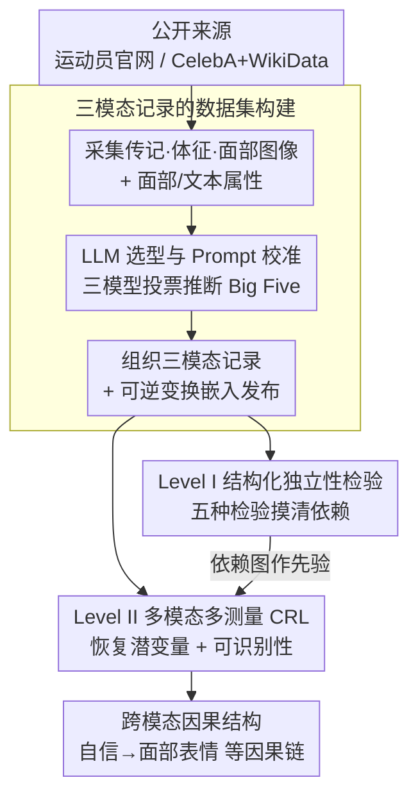

# PersonaX: Multimodal Datasets with LLM-Inferred Behavior Traits

**会议**: ICLR2026  
**arXiv**: [2509.11362](https://arxiv.org/abs/2509.11362)  
**代码**: [lokali/PersonaX](https://github.com/lokali/PersonaX)  
**领域**: 人体理解  
**关键词**: multimodal dataset, behavior traits, Big Five, causal representation learning, LLM, identifiability  

## 一句话总结
构建了 PersonaX 多模态数据集（含 LLM 推断的 Big Five 行为特质、面部嵌入和传记元数据），并提出两层分析框架：结构化独立性检验 + 非结构化因果表示学习（带可识别性理论保证），揭示跨模态因果结构。

## 背景与动机
- 理解人类行为特质（behavior traits）对人机交互、计算社会科学和个性化 AI 系统至关重要，但现有数据集很少同时提供行为描述符与面部属性、传记信息等互补模态
- 行为特质不同于心理学中的 personality（内在倾向），它是从公开信息中可观测到的外在行为模式，可伦理地大规模推断
- LLM 的进步使得基于 Big Five 框架的行为特质评估在精心设计的 prompt 下具有可靠性，但缺乏系统性的跨模态和因果分析资源
- 现有多模态数据集（如 YouTube-Vlogs、MuPTA、MDPE）通常缺少显式的文本特质描述或跨模态解释框架

## 核心问题
1. 如何构建大规模、多模态、隐私保护的行为特质数据集？
2. 行为特质与面部属性、传记特征之间存在怎样的统计依赖关系？
3. 如何从非结构化多模态数据中学习潜变量及其因果机制，并提供可识别性保证？

## 方法详解

### 整体框架
PersonaX 把工作拆成「先建数据、再做分析」两段。建数据这一段，它从公开来源采集两个互补数据集（运动员 AthlePersona 与名人 CelebPersona），用经过严格选型与 prompt 校准的 LLM 推断每个人的 Big Five 行为特质，把每条记录组织成「行为特质文本 + 面部嵌入 + 传记元数据」三件套，并只发布经过可逆变换的嵌入以保护隐私。做分析这一段用两层框架揭示跨模态关系——Level I 对结构化变量（特质分数、体征、地理等）做统计独立性检验摸清谁和谁真的相关，Level II 对非结构化的图像/文本嵌入做因果表示学习（CRL）恢复背后的潜变量及其因果结构，并配可识别性证明保证学到的潜变量是有语义的因果因子，最终输出像「自信 → 面部表情」这样的跨模态因果链。

### 关键设计

**1. 三模态记录的数据集构建：让行为特质有可观测的多模态依托并安全发布**

行为特质要能被大规模分析，前提是把它和面部、传记等可观测信号绑在同一条记录上，同时又不能泄露真实个人的身份。AthlePersona 从 NBA、NFL、NHL、ATP、PGA、英超、德甲七大联赛官网采集 4181 名男性职业运动员的传记（姓名、出生日期、国籍）、体征（身高、体重）和面部图像，并把国籍地理编码为经纬度坐标；CelebPersona 基于 CelebA，把 9444 位公众人物链接到 WikiData 实体补全传记，并从原始 40 个属性中只保留 10 个反映稳定外貌的属性（如 Big Nose、High Cheekbones），剔除会短期变化的属性（如 Heavy Makeup）以保证特征稳定。每条记录最终整合三个组件：LLM 推断的行为特质文本描述与 Big Five 分数、面部图像及属性标注、结构化传记元数据。为兼顾「可分析」与「隐私安全」，数据集不释放任何原始图像或文本——面部图像转为 1024 维 ImageBind 嵌入、文本转为 3584 维 gte-Qwen2 嵌入，两者再各自经过一层可逆变换混淆，分类变量则转为索引；可逆变换保证下游分析所需的统计结构和因果关系不被破坏，而原始内容无法还原。

**2. LLM 选型与 Prompt 校准：把主观的特质评估做成可复现的标注流程**

行为特质评估本身是主观的，用 LLM 推断 Big Five 的可靠性又高度依赖模型和 prompt，因此作者把它当成需要量化筛选的标注环节，而非随手调一个模型。他们系统评估了十个 SOTA LLM，从生成时间、缺失率、犹豫率、隐私保护、输出格式、上下文一致性、事实准确性等维度打分，ChatGPT-4o 综合得分最高（OS$=0.96$），Gemini2.5-Pro 与 Llama-4 紧随其后。在输出格式上对比了数字/文本输出与 3 级/5 级评分量表等变体，发现 3 级数字量表的评分变异性最小、最稳定。最终用 ChatGPT-4o-Latest、Gemini-2.5-Pro、Llama-4-Maverick 三个模型共同生成特质标注，以多模型投票降低单一模型的主观偏差，让标注可复现、可比对。

**3. Level I 结构化独立性检验：用统计手段先摸清哪些变量真的相关**

进到分析阶段，对结构化变量（特质分数、性别、职业、体征、地理等）先做依赖性筛查，避免后续因果分析建立在虚假相关上。Big Five 特质分数先去除取值 "0"（表示信息不足）的样本再取中位数聚合，然后并行应用五种独立性检验互相印证：连续变量用非参数的 KCI、RCIT、HSIC，离散变量用 Chi-square、G-square，统一在 $p<0.05$ 显著性水平下判定两个变量是否依赖。多检验交叉验证降低了单一方法误判的风险，得到的依赖图为 Level II 的因果分析提供先验。

**4. Level II 多模态多测量 CRL：从嵌入里恢复潜变量与跨模态因果链**

非结构化的图像/文本嵌入无法直接做统计检验，需要先学出背后的潜变量才能谈因果。作者设观测 $\mathbf{x} = [\mathbf{x}_1, \dots, \mathbf{x}_M]$ 为 $M$ 个模态，对应因果相关的潜变量 $\mathbf{z} = [\mathbf{z}_1, \dots, \mathbf{z}_M]$，再引入跨模态共享潜变量 $\mathbf{s}$ 解释模态间的关联。数据生成过程写成潜变量间的因果关系 $z_{m,i} = g_{z_{m,i}}(\text{Pa}(z_{m,i}), \mathbf{s}, \epsilon_{m,i})$ 和模态生成函数 $\mathbf{x}_m = g_{\mathbf{x}_m}(\mathbf{z}_m, \boldsymbol{\eta}_m)$。关键在于他们证明：在四个温和假设下，这套多模态多测量设定是可识别的——对于相同观测 $\mathbf{x}$，每个估计潜变量分量 $\hat{z}_{m,i}$ 都等价于真实 $z_{m,i}$ 至一个可逆映射，这意味着学到的潜变量不是任意纠缠的表示，而是真实有语义的因果因子，从而支撑后续画出「自信 → 面部表情」这类跨模态因果链。

### 损失函数 / 训练策略
CRL 网络的训练目标由三项加权组合：重建损失 $\mathcal{L}_{\text{Recon}}$ 用 MSE 重建各模态观测以保证潜变量保留足够信息；独立性约束 $\mathcal{L}_{\text{Ind}}$ 用 KL 散度把潜变量分布对齐到各向同性高斯先验以鼓励解耦；稀疏正则 $\mathcal{L}_{\text{Sp}}$ 用 L1 范数约束可学习的邻接矩阵（通过 normalizing flows 实现）以得到稀疏、可解释的因果图。总损失为 $\mathcal{L} = \alpha_{\text{Recon}} \mathcal{L}_{\text{Recon}} + \alpha_{\text{Ind}} \mathcal{L}_{\text{Ind}} + \alpha_{\text{Sp}} \mathcal{L}_{\text{Sp}}$，三个权重共同平衡重建保真、潜变量解耦与因果稀疏。

## 实验关键数据

### 合成实验（Colored MNIST + Fashion MNIST）

| 方法 | R² | MCC |
|------|-----|-----|
| BetaVAE | 较低 | 较低 |
| MCL | 较低 | 较低 |
| MMCRL | 0.90 | 0.85 |
| **PersonaX（本文）** | **0.96** | **0.92** |

### 独立性检验发现
- **CelebPersona**：性别和职业与几乎所有特质分数有强依赖关系；面部特征（如尖鼻、高颧弓）与特质分数显著关联
- **AthlePersona**：出生年份和联赛归属是更强的依赖源；身高体重呈现一致但中等的关联
- 两个数据集中地理变量（经纬度）均表现出可比的中等依赖性

### 因果图分析（AthlePersona）
从真实数据中学到的因果图显示：
- 共享因子 $S_1$（mindset）和 $S_2$（culture）之间存在双向关系
- 跨模态因果链路：自信（$Z_{2,1}$）→ 面部表情（$Z_{1,4}$）；情绪稳定性（$Z_{2,3}$）→ 仪容（$Z_{1,2}$）
- 图像潜变量的顺序路径：肤色 → 吸引力 → 面部表情

## 亮点
- **首个将 LLM 推断行为特质与面部嵌入、传记元数据统一的大规模多模态数据集**，填补了现有资源的空白
- **两层分析框架设计精巧**：结构化层用统计检验揭示依赖关系，非结构化层用 CRL 学习因果机制，互为补充
- 提出的 CRL 方法在**多模态多测量设定下有新的可识别性理论保证**，扩展了已有理论
- LLM 选择过程系统严谨，评估了十个模型的八个维度指标
- 隐私保护措施到位：不释放原始数据，仅释放嵌入+可逆变换

## 局限与展望
- **群体偏差**：AthlePersona 仅含男性运动员，CelebPersona 偏向富裕高知名度个体，不具普遍代表性
- **缺乏时序稳定性**：行为特质是动态的，但数据从静态公开信息推断，没有纵向追踪
- **LLM 推断的可靠性**：尽管多模型投票提高了鲁棒性，LLM 对行为特质的评估仍然是主观的
- 未来可扩展更多数据源、纳入女性运动员和更多元化群体
- 因果图中潜变量的语义解释依赖独立性检验结果的后验引导，非完全自动化

## 与相关工作的对比

| 数据集 | 模态 | 行为特质 | 特质框架 | 因果分析 |
|--------|------|----------|----------|----------|
| SALSA | 视频+传感器 | 间接 | 无 | 无 |
| YouTube-Vlogs | 视频+音频 | 印象评分 | Big Five | 无 |
| MuPTA | 视频+音频+生理 | 有 | Big Five | 无 |
| MDPE | 多模态 | 人格+情感 | Big Five | 无 |
| **PersonaX** | **图像嵌入+文本嵌入+传记** | **LLM推断** | **Big Five** | **有（CRL+可识别性）** |

PersonaX 的独特之处在于：(1) 规模最大（9444+4181），(2) 唯一提供显式 LLM 推断的行为特质文本，(3) 唯一包含因果表示学习分析且有理论保证。

## 启发与关联
- 展示了 LLM 作为大规模行为评估工具的可行性与标准化方法，可推广到其他社会科学场景
- 多模态多测量 CRL 框架可应用于任何具有多视角多实例数据的场景（如医学影像的多次扫描）
- 隐私保护方案（嵌入+可逆变换）为敏感数据发布提供了实用范式
- 独立性检验揭示了名人和运动员的行为特质受不同信息通道影响的系统性差异，对个性化 AI 设计有启示

## 评分
- 新颖性: ⭐⭐⭐⭐ — 多模态行为特质数据集+CRL 新理论的组合具有原创性
- 实验充分度: ⭐⭐⭐⭐ — 合成+真实数据双重验证，独立性检验全面
- 写作质量: ⭐⭐⭐⭐ — 结构清晰，两层分析框架层次分明
- 价值: ⭐⭐⭐⭐ — 数据集和方法对多模态因果推理社区有长期价值

<!-- RELATED:START -->

## 相关论文

- [\[CVPR 2026\] Multi-level Causal LLM-based Text-to-Motion Generation with Human Alignment (MoTiGA)](../../CVPR2026/human_understanding/multi-level_causal_llm-based_text-to-motion_generation_with_human_alignment.md)
- [\[ECCV 2024\] Facial Affective Behavior Analysis with Instruction Tuning](../../ECCV2024/human_understanding/facial_affective_behavior_analysis_with_instruction_tuning.md)
- [\[CVPR 2026\] LaMoGen: Language to Motion Generation Through LLM-Guided Symbolic Inference](../../CVPR2026/human_understanding/lamogen_language_to_motion_generation_through_llm-guided_symbolic_inference.md)
- [\[ICML 2026\] Efficient, Validation-Free Intrinsic Quality Estimation for Large-Scale Face Recognition Datasets](../../ICML2026/human_understanding/efficient_validation-free_intrinsic_quality_estimation_for_large-scale_face_reco.md)
- [\[CVPR 2026\] MimicTalker: A Multimodal Interactive and Memory-Enhanced Framework for Real-Time Dyadic 3D Head Generation](../../CVPR2026/human_understanding/mimictalker_a_multimodal_interactive_and_memory-enhanced_framework_for_real-time.md)

<!-- RELATED:END -->
