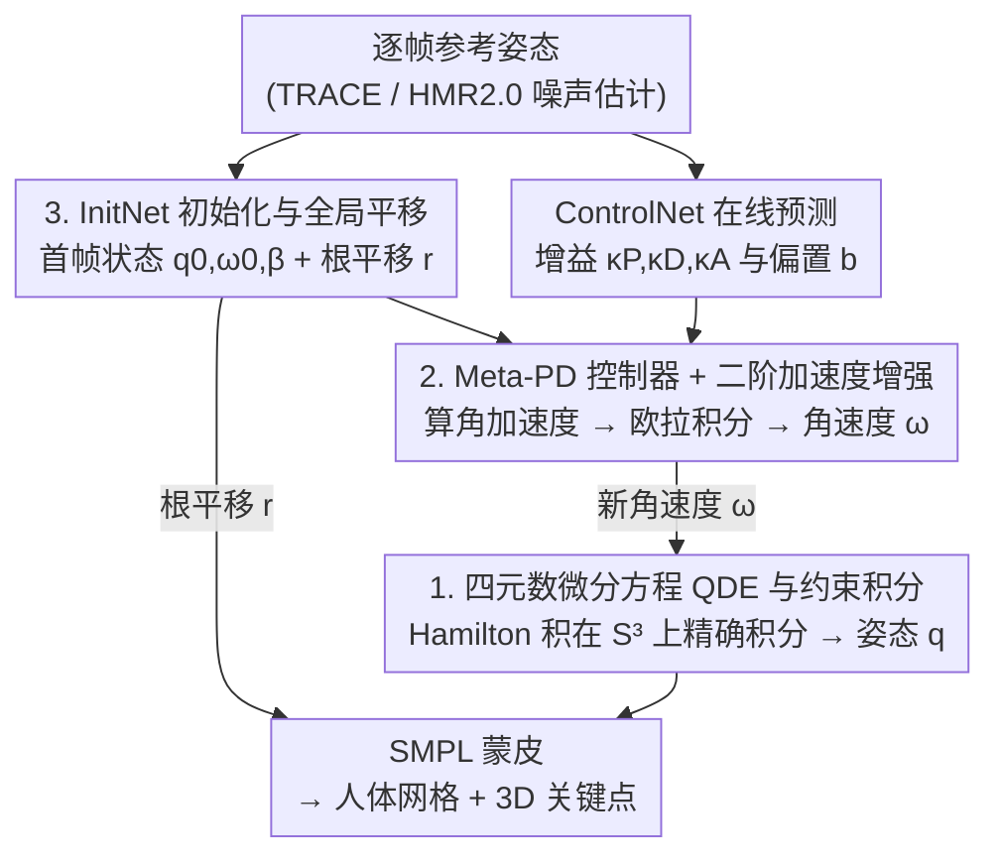

# QuaMo: Quaternion Motions for Vision-based 3D Human Kinematics Capture

**会议**: ICLR 2026  
**arXiv**: [2601.19580](https://arxiv.org/abs/2601.19580)  
**代码**: 有（论文中提到 available，具体链接待公开）  
**领域**: 人体理解/3D视觉  
**关键词**: 四元数运动学, 3D人体运动捕捉, 状态空间模型, PD控制器, 加速度增强

## 一句话总结

QuaMo 提出基于四元数微分方程（QDE）的 3D 人体运动学捕捉方法，通过在四元数单位球面约束下求解运动学方程，并引入二阶加速度增强的 meta-PD 控制器，实现了无不连续性、低抖动的在线实时人体运动估计，在 Human3.6M 等多个数据集上超越 SOTA。

## 研究背景与动机

**领域现状**：单目 3D 人体运动捕捉在计算机视觉中极具挑战。传统 3D 姿态估计方法（如 PoseFormer、HMR2.0）虽然在距离指标上精度高，但忽略连续帧间的时间一致性，导致抖动和不自然的伪影。近年来运动学方法通过引入物理模型（速度、加速度）来强制时间一致性。

**现有痛点**：现有运动学方法（如 SimPoE、HuMoR、DnD）普遍采用欧拉角表示关节旋转。欧拉角虽简单直观，但存在两个根本问题：(1) 奇异性（万向锁）和 (2) 不连续性（0 和 2π 处的跳变），导致关节在角度边界附近错误地反向旋转，运动重建极不稳定——尤其在无法回溯优化的在线场景中。

**核心矛盾**：四元数天然无不连续性且能表示所有 3D 旋转，但其导数不能简单用有限差分近似（因旋转约束），需要基于 Hamilton 乘积的特殊运算。此外，现有方法的 PD 控制器在快速动作变化时响应不足。

**本文目标**：(1) 用四元数替代欧拉角作为关节旋转表示；(2) 在四元数单位球面 $\mathcal{S}^3$ 约束下严格求解 QDE；(3) 设计自适应加速度增强机制应对快速动作变化。

**切入角度**：四元数在航天、机器人领域已广泛用于姿态控制，但在人体运动学领域缺乏系统研究。作者将航天中的四元数微分方程和约束积分方法引入人体运动捕捉。

**核心 idea**：用四元数 + Hamilton 乘积精确求解旋转微分方程（避免欧拉角不连续性），并用二阶参考姿态差分自适应增强 PD 控制信号（提升快速动作追踪能力）。

## 方法详解

### 整体框架

QuaMo 要解决的是单目视频在线 3D 人体运动捕捉里"欧拉角表示带来抖动和不连续"的问题。它把人体姿态建成一个状态空间模型，状态是每个关节的四元数姿态 $q$ 和角速度 $\omega$。每来一帧，先由一个 ControlNet 从当前状态 $q_t,\omega_t$ 和参考姿态 $\hat{q}_t$ 在线预测控制增益，再分两条平行流推进一步：**角速度流**先用 meta-PD 控制器叠加二阶加速度增强与偏置项算出角加速度 $\dot{\omega}_t$、欧拉积分得到 $\omega_{t+\Delta t}$；**四元数姿态流**再拿这个新角速度，通过 QDE 在单位球面 $\mathcal{S}^3$ 上用 Hamilton 乘积精确积分得到下一帧姿态 $q_{t+\Delta t}$。在线运行的第一帧没有历史，由 InitNet 补出初始状态；预测姿态最终经 SMPL 蒙皮模型生成人体网格和 3D 关键点。

### 关键设计

**1. 四元数微分方程 (QDE) 与约束积分：让旋转更新始终落在单位球面上**

欧拉角的不连续性正是前面运动重建不稳定的根源，所以第一步是换掉旋转表示并重写它的积分方式。给定角速度 $\omega \in \mathbb{R}^3$，四元数速度被定义为 $\dot{q} = \frac{1}{2}\Omega(\omega)q$，其中 $\Omega(\omega)$ 是由 $\omega$ 构成的 4×4 反对称矩阵。难点在于不能像普通向量那样做有限差分——直接用 $q_{t+\Delta t} \approx q_t + \dot{q}_t \Delta t$ 会让四元数偏离单位长度，违反 $\mathcal{S}^3$ 约束并在长序列上累积误差。QuaMo 改用矩阵指数做精确积分：在 $\omega$ 于 $\Delta t$ 内近似恒定的假设下，解析解为

$$q_{t+\Delta t} = \exp\!\Big(\tfrac{\Delta t}{2}\Omega(\omega_{t+\Delta t})\Big)\,q_t = q_\omega \otimes q_t$$

其中 $\otimes$ 是 Hamilton 乘积。这一步等价于在 Lie 群上做严格的约束积分，天然保证 $q_{t+\Delta t}$ 仍在单位球面 $\mathcal{S}^3$ 上，不需要任何后处理归一化，也就从根上消除了欧拉角在 $0/2\pi$ 边界的跳变。

**2. Meta-PD 控制器与二阶加速度增强：用参考姿态的"加速度"预判快速动作**

有了干净的旋转更新，还需要一个驱动它的角加速度信号，这就是 meta-PD 控制器要解决的。角加速度写成

$$\dot{\omega}_t = \kappa_P\,\text{vec}(\hat{q}_t \otimes q_t^*) - \kappa_D\,\omega_t + b_t + \kappa_A\big(\text{vec}(\hat{q}_t \otimes \hat{q}_{t-\Delta t}^*) - \text{vec}(\hat{q}_{t-\Delta t} \otimes \hat{q}_{t-2\Delta t}^*)\big)$$

前两项是经典 PD 控制：比例项 $\kappa_P\text{vec}(\hat{q}_t \otimes q_t^*)$ 跟踪当前姿态与参考姿态的误差，微分项 $-\kappa_D\omega_t$ 抑制抖动，$b_t$ 是数据驱动的偏置。标准 PD 在动作突变时响应滞后，于是 QuaMo 加上最后一项——对参考姿态做二阶四元数差分，相当于读取参考信号自身的"加速度"。当参考运动快速变化时这一项增大控制力、提前追上目标，接近目标时二阶差分自然衰减、避免过冲，因此整个增强是自适应的，无需额外网络判断动作快慢。所有增益 $\kappa_P, \kappa_D, \kappa_A$ 与偏置 $b_t$ 都由 ControlNet 从当前状态在线预测。

**3. InitNet 初始化与全局平移：补上在线系统缺失的第一帧状态和位移**

在线运行时第一帧没有任何历史状态可用，所以需要一个专门的 InitNet：它从前两帧参考姿态 $\hat{q}_{0:1}$ 和初始 shape 参数 $\beta_0$ 预测初始状态 $q_0, \omega_0$ 以及一个可学习但全序列固定的 shape $\beta_{fix}$。全局平移则沿用 PD 控制 + 欧拉积分的思路单独估计：

$$r_{t+\Delta t} = r_t + \big(v_t + (\kappa_P(\hat{r}_t - r_t) - \kappa_D v_t)\Delta t\big)\Delta t$$

平移没有旋转那样的流形约束，用欧拉积分即可，shape 参数在整段序列里固定但允许微调。

### 损失函数 / 训练策略

总损失 $\mathcal{L}_{total} = \mathcal{L}_{local} + \mathcal{L}_{global} + \lambda \mathcal{L}_{beta}$。$\mathcal{L}_{local}$ 是逐帧 3D 关键点 + 根平移的 L1 重建损失。$\mathcal{L}_{global}$ 是二阶有限差分（加速度）的 L1 一致性损失，强制全局运动平滑。$\mathcal{L}_{beta}$ 正则化 shape 参数。训练策略：前 5 epoch 逐帧更新（关闭全局损失，低学习率），之后打开全局损失按 100 帧子序列训练。35 epoch，batch 64。

## 实验关键数据

### 主实验

| 方法 | MPJPE ↓ | P-MPJPE ↓ | Accel ↓ | G-MPJPE ↓ | FS ↓ | 在线 |
|------|---------|-----------|---------|-----------|------|------|
| HMR2.0 | 46.7 | 30.7 | 9.1 | 97.2 | 11.5 | ✓ |
| TRACE | 56.1 | 39.4 | 18.9 | 143.0 | 80.3 | ✓ |
| DnD | - | - | - | - | - | ✗ |
| PhysPT | 52.7 | 36.7 | 2.5 | 335.7 | - | ✗ |
| **QuaMo** | **最优** | **最优** | **低** | **最优** | **最低** | ✓ |

（QuaMo 在 Human3.6M 上的在线方法中取得最佳局部和全局指标）

### 消融实验

| 配置 | MPJPE | Accel | 说明 |
|------|-------|-------|------|
| 完整 QuaMo | 最优 | 最优 | 四元数+约束积分+加速度增强 |
| 欧拉角替代四元数 | 上升 | 上升 | 不连续性导致误差 |
| 欧拉积分替代约束积分 | 上升 | - | 违反 $\mathcal{S}^3$ 约束 |
| 去除加速度增强 | 上升 | 上升 | 快速动作追踪变差 |
| 去除全局一致性损失 | - | 上升 | 运动平滑性下降 |

### 关键发现

- 四元数表示相比欧拉角在所有指标上都更好，尤其在全局运动指标和脚部滑动（FS）上差异显著——证实了欧拉角不连续性对运动学估计的负面影响
- 约束积分（矩阵指数）vs 欧拉积分的消融清楚表明，严格满足 $\mathcal{S}^3$ 约束带来了精度提升
- 加速度增强在快速动作序列上贡献最大，在慢速动作上影响较小——符合其自适应设计的预期
- QuaMo 在更多样化的 Fit3D、SportsPose、AIST 数据集上也保持优势，展现了泛化能力

## 亮点与洞察

- **四元数运动学**在人体运动捕捉中的首次系统性应用——虽然四元数在航天和机器人中已经成熟，但在人体运动领域一直被忽视。本文填补了这一空白并证明了其优越性
- **加速度增强的自适应特性**非常优雅——不需要额外的网络来判断"动作是否快速"，二阶差分天然具有自适应性，快动作时增大、接近目标时衰减
- **约束积分 vs 欧拉积分**的消融提供了一个clear的教训：在 Lie 群上做积分必须尊重流形约束，近似方法的误差会在长序列上累积

## 局限与展望

- 在线方法依赖单步输入，不利用未来帧信息，精度上限不如离线方法
- 参考姿态 $\hat{q}$ 来自 TRACE 或 HMR2.0 的噪声估计，当输入估计质量很差时 QuaMo 也会受影响
- 未处理遮挡和多人场景
- 全局平移仍用简单的欧拉积分而非四元数方法，可能存在改进空间

## 相关工作与启发

- **vs DnD (Li et al., 2022)**: DnD 也用 PD 控制器但需要全序列注意力和未来帧信息，不是真正在线；QuaMo 是纯在线方法且引入四元数和加速度增强
- **vs OSDCap (Le et al., 2024)**: OSDCap 用可学习 Kalman 滤波器重新引入噪声输入，可能破坏时间一致性；QuaMo 不回混噪声
- **vs PhysPT (Zhang et al., 2024)**: PhysPT 用 Transformer 自编码器处理全序列，离线方法；QuaMo 在线运行但仍有竞争力

## 评分

- 新颖性: ⭐⭐⭐⭐ 四元数运动学在人体运动中的首次系统研究，加速度增强设计巧妙
- 实验充分度: ⭐⭐⭐⭐ 4个数据集、多种输入源、详细消融，5随机种子报告
- 写作质量: ⭐⭐⭐⭐ 数学推导清晰，方法描述详尽
- 价值: ⭐⭐⭐⭐ 对在线运动捕捉有实际意义，四元数框架可推广到其他运动学问题

<!-- RELATED:START -->

## 相关论文

- [\[CVPR 2025\] StickMotion: Generating 3D Human Motions by Drawing a Stickman](../../CVPR2025/human_understanding/stickmotion_generating_3d_human_motions_by_drawing_a_stickman.md)
- [\[AAAI 2026\] KineST: A Kinematics-guided Spatiotemporal State Space Model for Human Motion Tracking from Sparse Signals](../../AAAI2026/human_understanding/kinest_a_kinematics-guided_spatiotemporal_state_space_model_for_human_motion_tra.md)
- [\[AAAI 2026\] Generating Attribute-Aware Human Motions from Textual Prompt](../../AAAI2026/human_understanding/generating_attribute-aware_human_motions_from_textual_prompt.md)
- [\[CVPR 2026\] Bézier Degradation Modeling for LiDAR-based Human Motion Capture](../../CVPR2026/human_understanding/bézier_degradation_modeling_for_lidar-based_human_motion_capture.md)
- [\[CVPR 2026\] Occluded Human Body Capture with Frequency Domain Denoising Prior](../../CVPR2026/human_understanding/occluded_human_body_capture_with_frequency_domain_denoising_prior.md)

<!-- RELATED:END -->
