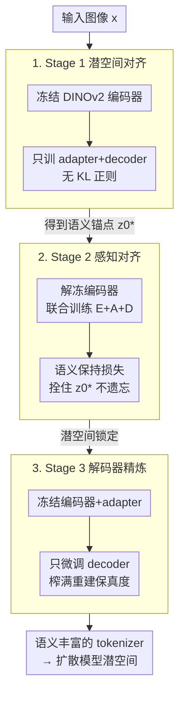

# AlignTok: Aligning Visual Foundation Encoders to Tokenizers for Diffusion Models

**会议**: ICLR 2026  
**arXiv**: [2509.25162](https://arxiv.org/abs/2509.25162)  
**代码**: [https://aligntok.github.io](https://aligntok.github.io)  
**领域**: 扩散模型  
**关键词**: visual tokenizer, latent diffusion, DINOv2, semantic alignment, image generation

## 一句话总结
提出 AlignTok，将预训练视觉基础编码器（如 DINOv2）对齐为扩散模型的连续 tokenizer，通过三阶段对齐策略（语义潜空间建立→感知细节补充→解码器精炼）构建语义丰富的潜空间，在 ImageNet 256×256 上 64 epochs 即达 gFID 1.90，比从头训练 VAE 收敛更快、生成质量更好。

## 研究背景与动机
**领域现状**：潜在扩散模型（LDM）依赖 VAE 作为 tokenizer 定义潜空间。标准 VAE 用重建损失 + 轻度 KL 正则化训练，潜空间主要由低级细节主导。

**现有痛点**：(1) VAE 编码器从头学语义是间接的（仅通过重建损失），潜空间结构不可预测；(2) 语义正则化方法（VA-VAE）虽在训练中加入与预训练编码器对齐的损失项，但编码器仍需从头学习语义结构。

**核心矛盾**：学语义本质上比学重建更难。从头训练时，编码器需要同时兼顾语义结构和重建细节，两个目标互相竞争。

**本文目标** 如何构建一个既有丰富语义（利于扩散）又有良好重建能力的 tokenizer？

**切入角度**：不从头学语义，直接用已有预训练编码器。挑战在于预训练编码器不具备重建能力——需要对齐而非正则化。

**核心 idea**：与其让编码器从头学语义（正则化），不如直接对齐一个已经有语义的预训练编码器（对齐）。

## 方法详解

### 整体框架
AlignTok 想解决的问题是：扩散模型需要一个语义丰富的潜空间，但 VAE 从头学语义既间接又不稳定。它的做法是直接复用一个已经具备语义的预训练编码器（DINOv2），通过三个阶段把它逐步"对齐"成一个能重建图像的 tokenizer。整条流程是：先冻住编码器、只训练后面的 adapter 和 decoder 把语义潜空间立起来；再解冻编码器、让它补回低级细节但用一条损失拴住语义不让它跑掉；最后锁死潜空间、单独打磨 decoder 把重建保真度拉满。三个阶段各自只解决一件事，避免语义、细节、重建三个目标同时挤在一起互相拆台。

### 关键设计

**1. Stage 1 — 潜空间对齐：先用冻结编码器把语义结构立起来**

第一阶段的目标是先拿到一个"语义正确"的潜空间，不急着追求重建质量。具体做法是冻结 DINOv2 编码器 $E_p$，输入图像 $x$ 先过编码器得到高维特征，再经 adapter $A$ 投影成低维潜码：$z_0 = A(E_p(x))$，其中特征从 1024 通道压到 32 通道，decoder $D$ 负责从 $z_0$ 重建图像。这一阶段只训练 $A$ 和 $D$，并且刻意不用 KL 正则化。冻住编码器保证了 DINOv2 原本的语义结构不会被重建梯度破坏，代价是重建质量有上限——因为冻结的编码器只关心语义、并不捕获纹理这类低级细节。这一步把"潜空间应该长什么样"先钉死，为后两阶段提供一个语义锚点。

**2. Stage 2 — 感知对齐：解冻编码器补细节，但用一条损失把语义拴住**

Stage 1 的潜空间语义好但重建差，第二阶段就解冻编码器 $E_p$，让它在保留语义的同时把低级细节也学进来。这里联合优化 $E_p, A, D$ 三者，关键是引入一条语义保持损失，约束当前潜码与 Stage 1 那个冻结模型产生的潜码 $z_0^*$ 保持一致：

$$\mathcal{L}_{sp} = L_{\ell_2}(z_0^*, z_0)$$

总损失把它和重建损失加权相加：$\mathcal{L} = \mathcal{L}_{rec} + w_{sp}\mathcal{L}_{sp}$。这条损失是整个方法成立的关键——如果不加（$w_{sp}=0$），编码器一解冻就会灾难性遗忘语义，linear probing accuracy 从 41% 直接暴跌到 9.5%，潜空间退化回普通 VAE。$w_{sp}=1$ 是实验找到的平衡点：太小拴不住语义，太大又压制了编码器学细节的自由度。值得注意的是这条损失要施加在 adapter 之后（即作用在 $z_0$ 上），若加在 adapter 之前、给 adapter 太多自由度，语义同样会丢失。

**3. Stage 3 — 解码器精炼：锁死潜空间，单独把重建拉满**

前两阶段里潜空间一直在变（Stage 1 训 adapter、Stage 2 动编码器），decoder 始终在追一个移动的目标，容易欠拟合。第三阶段把编码器和 adapter 都冻结，潜空间彻底固定下来，只微调 decoder。目标稳定后 decoder 可以专心优化重建，rFID 从 Stage 1+2 的 0.36 进一步降到 0.26。这一步不改变潜空间的语义，纯粹是榨干重建保真度的最后一道工序。

### 损失函数 / 训练策略
重建损失：L1 + 感知损失 + 对抗损失。语义保持损失：两阶段潜码的 L2 距离。不用 KL 正则化。默认用 DINOv2-L/14 作为基础编码器，下采样率 16，潜码通道 32。

## 实验关键数据

### 主实验（ImageNet 256×256）

| 方法 | rFID↓ | gFID↓ | IS↑ | Recall↑ |
|------|-------|-------|-----|---------|
| SD-VAE (从头) | 0.91 | 2.66 | - | - |
| VA-VAE (语义正则化) | 0.49 | 2.14 | - | - |
| **AlignTok** (对齐) | **0.26** | **1.90** | **260.6** | **0.599** |

### 消融实验

| 配置 | rFID | gFID | Linear Probing Acc |
|------|------|------|--------------------|
| 无语义保持损失 (w=0) | **0.33** | 3.05 | 9.5% |
| w=1 (最佳) | 0.36 | **2.19** | 35.1% |
| w=5 | 0.49 | 2.48 | 40.6% |
| 仅 Stage 1 | 1.63 | 3.00 | **41.5%** |
| Stage 1+2 | 0.36 | 2.19 | 35.1% |
| 完整 (Stage 1+2+3) | **0.26** | **2.17** | 35.1% |

### 关键发现
- DINOv2 优于 SigLIP2 和 MAE 作为基础编码器——DINOv2 的自监督特征更适合扩散建模
- 在 LAION 上 text-to-image 实验中，AlignTok 在相同训练步数下始终优于 FLUX VAE 和 VA-VAE
- 不用 KL 正则化反而更好——KL 会扭曲编码器的语义结构
- 语义保持损失应施加在 adapter 之后（而非之前），给 adapter 过多自由度会丢失语义
- LoRA 微调不够——Stage 2 需要完整微调才能平衡语义和重建

## 亮点与洞察
- **范式转变：对齐 vs 正则化**：不从头学语义，直接复用预训练视觉基础模型的语义能力——简洁高效。这一思路可推广到任何需要语义潜空间的生成模型
- **语义保持损失的简洁有效性**：仅一个 L2 损失就能防止灾难性遗忘，同时允许编码器学习感知细节
- **三阶段渐进对齐的设计哲学**：先语义→再感知→最后重建，每阶段解决一个问题，避免目标冲突

## 局限与展望
- 目前仅在 ImageNet 256×256 和 LAION 上验证，更高分辨率的效果需要确认
- DINOv2 的下采样率固定为 14×14，可能限制了更灵活的分辨率适配
- 与 RAE（直接用冻结编码器做高维潜空间）的结合尚未探索
- 三阶段训练增加了 pipeline 复杂度

## 相关工作与启发
- **vs VA-VAE（语义正则化）**: AlignTok 直接对齐预训练编码器而非从头学习加正则化，gFID 从 2.14 改善到 1.90
- **vs FLUX VAE**: 在 LAION text-to-image 上，AlignTok 收敛显著更快
- **vs RAE（冻结编码器）**: RAE 不微调但需要特殊的高维扩散技巧，AlignTok 微调后维度低（32ch）更标准
- **vs REPA-E（端到端）**: 两者互补——REPA-E 可以用 AlignTok 初始化其 tokenizer

## 评分
- 新颖性: ⭐⭐⭐⭐ 对齐而非正则化的范式很简洁
- 实验充分度: ⭐⭐⭐⭐⭐ 详细消融、多编码器对比、ImageNet+LAION、与并行工作的定位
- 写作质量: ⭐⭐⭐⭐⭐ 逻辑清晰，与并行工作的关系讨论到位
- 价值: ⭐⭐⭐⭐⭐ 为扩散模型 tokenizer 设计确立了新范式

<!-- RELATED:START -->

## 相关论文

- [\[CVPR 2026\] Vision Foundation Models Can Be Good Tokenizers for Latent Diffusion Models](../../CVPR2026/image_generation/vision_foundation_models_can_be_good_tokenizers_for_latent_diffusion_models.md)
- [\[ICLR 2026\] PCPO: Proportionate Credit Policy Optimization for Aligning Image Generation Models](pcpo_proportionate_credit_policy_optimization_for_aligning_image_generation_mode.md)
- [\[ICML 2026\] Compression as Adaptation: Implicit Visual Representation with Diffusion Foundation Models](../../ICML2026/image_generation/compression_as_adaptation_implicit_visual_representation_with_diffusion_foundati.md)
- [\[CVPR 2026\] VFM-VAE: Vision Foundation Models Can Be Good Tokenizers for Latent Diffusion Models](../../CVPR2026/image_generation/vfm-vae_vision_foundation_models_can_be_good_tokenizers_for_latent_diffusion_mod.md)
- [\[ICLR 2026\] Asynchronous Denoising Diffusion Models for Aligning Text-to-Image Generation](asynchronous_denoising_diffusion_models_for_aligning_text-to-image_generation.md)

<!-- RELATED:END -->
