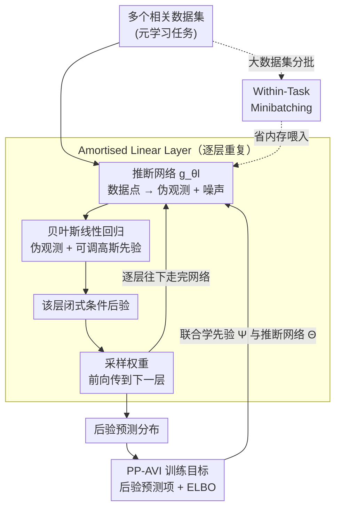

# Amortising Inference and Meta-Learning Priors in Neural Networks (BNNP)

**会议**: ICLR 2026  
**arXiv**: [2602.08782](https://arxiv.org/abs/2602.08782)  
**代码**: 有  
**领域**: 贝叶斯深度学习  
**关键词**: Bayesian neural network, neural process, meta-learning, amortised inference, prior learning

## 一句话总结
提出 BNNP（Bayesian Neural Network Process），一种将 BNN 权重作为隐变量、BNN 本身作为解码器的 neural process，通过逐层 amortised variational inference 在多数据集上联合学习 BNN 先验和推断网络，首次回答了"在良好先验下，近似推断方法还重要吗？"——答案是肯定的，没有免费午餐。

## 研究背景与动机
**领域现状**：BNN 理论优雅但先验选择是核心难题——权重缺乏可解释性，方便先验（各向同性高斯）将 BNN 退化为高斯过程，失去了层次表示学习能力。Neural process 通过元学习隐式先验但无法评估或采样。

**现有痛点**：(1) 不知道什么是 BNN 的"好先验"；(2) 即使有好先验，现有的近似推断方法（MFVI, HMC 等）是否足够好不清楚；(3) Neural process 不能做 within-task minibatching（大数据集内存爆炸）。

**核心矛盾**：在合理先验下研究 BNN 行为 → 需要先有好先验 → 好先验需要从数据中学 → 学先验需要好的推断方法 → 形成循环。

**本文目标** 同时解决先验学习和 amortised inference：从多个相关数据集中元学习 BNN 先验，同时获得高质量的逐数据集后验。

**切入角度**：将 BNN 推断重新表述为 neural process——隐变量是权重，解码器就是这些权重参数化的网络本身。逐层条件后验通过贝叶斯线性回归闭式求解。

**核心 idea**：BNN 权重 = neural process 的隐变量，BNN 本身 = 解码器，从多任务数据中联合学习先验和 amortised 推断。

## 方法详解

### 整体框架
BNNP 把贝叶斯神经网络的推断重新写成一个 neural process：隐变量就是网络各层的权重，解码器就是这些权重参数化的网络本身。具体来说，对 BNN 的每一层，一个推断网络把数据点映射成该层的"伪似然"参数（伪观测值 + 噪声水平），再与该层的高斯先验做一次闭式贝叶斯线性回归，得到这一层的条件后验。推断时从第一层采样权重、前向传到下一层、再算下一层后验，逐层往下走完整个网络。先验参数和推断网络参数则在多个相关数据集上联合优化——这样既学到了 BNN 的先验，又得到了能一次前向就出后验的 amortised 推断器。

### 关键设计

**1. Amortised Linear Layer：让中间层的后验有闭式解**

BNN 的核心困难是中间层权重既没有可解释含义、后验又无法精确求。这一组件把问题转化成层内的贝叶斯线性回归：推断网络 $g_{\theta_l}$ 把每个数据点 $(x_n, y_n)$ 映射成一组伪观测值 $y_n^l$ 和对应的噪声水平 $\sigma_{n,d}^l$，相当于为该层"伪造"出一批带噪声的回归目标。有了这些伪目标，再配上高斯先验 $p_{\psi_l}(W^l)$，该层的条件后验 $q(W^l \mid W^{1:l-1}, \mathcal{D})$ 就有了闭式解。这样做的好处是：层内是精确推断（闭式后验逼近 BNN 的全后验），而推断本身被 amortise 掉了——推断网络一次前向传播就给出后验，不用每个数据集再跑迭代优化。

**2. PP-AVI 训练目标：同时把先验和推断器学好**

光有 amortised 层还不够，先验参数 $\Psi$ 和推断网络参数 $\Theta$ 得一起学。PP-AVI（posterior-predictive amortised VI）用两项相加的目标来拉这两件事：

$$\mathcal{L}_{PP\text{-}AVI} = \log q(Y_t \mid \mathcal{D}_c, X_t) + \mathcal{L}_{ELBO}(\mathcal{D}_c)$$

第一项是后验预测密度，负责把预测质量做高、顺带驱动先验往"能解释多任务数据"的方向学；第二项是 ELBO，负责把近似推断本身做准。两项分工明确，避免了只优化预测、推断却退化的情况。论文用 Proposition 1 证明：在数据集数量趋于无穷的极限下，这个目标能同时满足三个 desiderata（好先验、好后验、好预测）。

**3. Within-Task Minibatching：大数据集也能分批推断**

现有 neural process 几乎都得一次性吃下整个 context set，数据集一大内存就爆。BNNP 借助 sequential Bayesian inference 绕开这点：把一个数据集切成若干小批，逐批更新各层后验——上一批算出的后验，正好当作下一批的先验接着更新。因为贝叶斯更新满足可加性，分批跑完的预测结果与一次性全批处理完全一致，所以这是"省内存但不掉精度"的能力，也是它相对其他 neural process 的独特之处。

**4. 可调先验灵活度：小元数据集下防先验过拟合**

当用来元学习的相关数据集很少时，把所有权重的先验都放开来学容易过拟合。BNNP 允许只学一部分权重的先验、把其余权重的先验固定住。由于推断网络参数和先验参数是解耦的，可以独立控制先验的自由度，从而在元数据集规模和先验表达力之间找到平衡——实验中这种部分可训练先验在小元数据集设置下反而优于全可训练的 neural process。

### 损失函数 / 训练策略
训练用 PP-AVI 目标（后验预测项 + ELBO 项）在多任务数据集上联合优化先验与推断网络，是标准的元学习范式；推断网络采用 LoRA 风格的参数化。

## 实验关键数据

### 近似后验质量（KL 散度 ↓）

| 方法 | KL(q || p(W|D)) |
|------|----------------|
| MFVI | 高（尤其低噪声） |
| FCVI | 很高 |
| GIVI | 中 |
| **BNNP (amortised)** | **最低** |
| **BNNP (per-task)** | **最低** |

### 先验学习能力

| 数据生成过程 | 先验样本质量 |
|------------|-----------|
| 锯齿函数 | 几乎无法区分真实 vs 学到的先验 |
| Heaviside 函数 | 多模态先验被成功学到 |
| MNIST 像素回归 | 可辨认数字，支持超分辨率 |
| ERA5 降水 | 真实世界先验有效 |

### 关键发现
- **好先验 ≠ 免费午餐**：即使在学到的先验下，不同近似推断方法的性能差异仍然很大。HMC 在好先验下仍然最好，说明近似推断质量始终重要
- Gaussian 先验足以产生高度复杂的函数先验（包括多模态的 Heaviside）——先验设计没有想象中那么难
- BNNP 的部分可训练先验在小元数据集设置中优于全可训练 neural process——防止先验过拟合
- Within-task minibatching 使 BNNP 可以处理大数据集——这是其他 neural process 的新能力

## 亮点与洞察
- **"BNN 权重即 neural process 隐变量"的统一视角**：将两个不同领域（BDL + probabilistic meta-learning）优雅地连接起来
- **首次在实证上回答了 BDL 的基本问题**：好先验是否消除了对好推断方法的需求？答案是否——这对 BDL 社区有重要指导意义
- **Gaussian 先验的出人意料的灵活性**：简单的 Gaussian 权重先验在适当学习后可以产生极其丰富的函数先验——推翻了需要复杂先验结构的假设

## 局限与展望
- 推断复杂度随网络宽度不利地增长——目前主要验证在小型 BNN 上
- 需要多个相关数据集来学习先验——单数据集场景仍未解决
- BNAM（注意力版本）破坏了一致性（不再是合法的随机过程）——理论不完备
- 实验主要在 1D/2D 回归任务上，更高维的复杂任务需要验证

## 相关工作与启发
- **vs Neural Process 家族**: BNNP 的隐变量是解码器权重本身（而非抽象表示），这使得先验可以显式评估和采样
- **vs MFVI / HMC**: BNNP 提供的逐层 amortised 推断质量接近 HMC，远优于 MFVI
- **vs 函数空间先验 (Cinquin et al.)**: 函数空间先验通常退化为 GP，BNNP 的权重空间先验保持了 BNN 的层次表示能力

## 评分
- 新颖性: ⭐⭐⭐⭐⭐ 将 BNN 重塑为 neural process 的统一框架非常新颖和深刻
- 实验充分度: ⭐⭐⭐⭐⭐ 4 个研究问题、合成+真实数据、与多种 VI 方法对比
- 写作质量: ⭐⭐⭐⭐⭐ 理论推导严谨，叙事引人入胜（"没有免费午餐"的核心信息）
- 价值: ⭐⭐⭐⭐⭐ 对 BDL 领域的基础性贡献——提供了研究 BNN 行为的新工具

<!-- RELATED:START -->

## 相关论文

- [\[ICLR 2026\] NeuralOS: Towards Simulating Operating Systems via Neural Generative Models](neuralos_towards_simulating_operating_systems_via_neural_generative_models.md)
- [\[CVPR 2026\] PhyCo: Learning Controllable Physical Priors for Generative Motion](../../CVPR2026/image_generation/phyco_learning_controllable_physical_priors_for_generative_motion.md)
- [\[ICML 2025\] ContinualFlow: Learning and Unlearning with Neural Flow Matching](../../ICML2025/image_generation/continualflow_learning_and_unlearning_with_neural_flow_matching.md)
- [\[ICLR 2026\] DragFlow: Unleashing DiT Priors with Region Based Supervision for Drag Editing](dragflow_unleashing_dit_priors_with_region_based_supervision_for_drag_editing.md)
- [\[ICLR 2026\] Sample-Efficient Evidence Estimation of Score-Based Priors for Model Selection](sample-efficient_evidence_estimation_of_score_based_priors_for_model_selection.md)

<!-- RELATED:END -->
