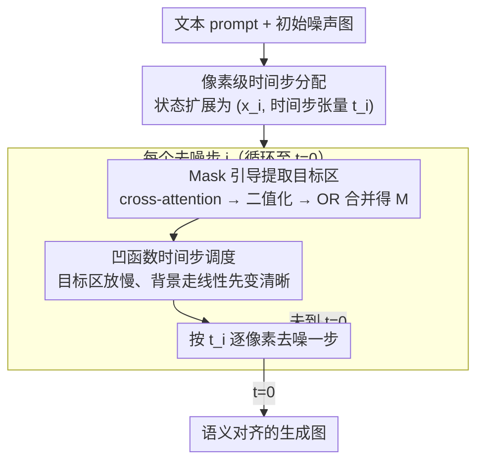

# Asynchronous Denoising Diffusion Models for Aligning Text-to-Image Generation

**会议**: ICLR 2026  
**arXiv**: [2510.04504](https://arxiv.org/abs/2510.04504)  
**代码**: [https://github.com/hu-zijing/AsynDM](https://github.com/hu-zijing/AsynDM)  
**领域**: 扩散模型 / 文图对齐  
**关键词**: 异步去噪, 像素级时间步, 文图对齐, cross-attention mask, 即插即用

## 一句话总结
AsynDM 通过为不同像素分配不同的时间步调度（prompt 相关区域去噪更慢），使其能利用更清晰的上下文参考，从而在不需要微调的情况下显著提升文图生成的语义对齐。

## 研究背景与动机
**领域现状**：扩散模型在文图生成中取得了优异的多样性和保真度，但文图对齐（alignment）仍是显著痛点——生成的图像经常在文字、颜色、数量等方面与 prompt 不一致

**现有痛点**：
   - 现有方法要么需要微调（RL-based alignment），要么在推理时修改 CFG 或中间噪声图像
   - 这些方法都没有触及同步去噪这一根本机制

**核心矛盾**：同步去噪中所有像素按相同时间步演进，prompt 相关区域只能参考同等噪声水平的其他区域作为上下文——但这些参考区域本身也是模糊的，无法提供清晰的语义引导

**本文目标**：让 prompt 相关区域（如目标对象）在去噪过程中获得更清晰的上下文参考，以改善最终图像与 prompt 的语义对齐

**切入角度**：观察到图像中不同区域对去噪精细度的需求不同——背景约束少可以快速去噪，而 prompt 相关对象需要更精细的渐进式去噪

**核心 idea**：让 prompt 无关区域先变清晰作为更好的上下文参考，prompt 相关区域慢慢去噪以更好地聚焦 prompt 语义

## 方法详解

### 整体框架
扩散模型生成的图像常和 prompt 对不上（文字、数量、颜色出错），AsynDM 把根因归到「同步去噪」——所有像素按同一个标量时间步 $t$ 一起变清晰，于是 prompt 相关的目标区域只能参考到同样模糊的邻域，拿不到可靠的语义引导。它的解法是让不同像素**异步**去噪：先把标量时间步扩展成空间张量，使每个像素能走各自的噪声水平；随后在去噪循环的每一步，先用 cross-attention 圈出当前的 prompt 相关区域，再给这块区域配一条「先慢后快」的凹函数调度、其余背景走普通线性调度。这样背景早早变清晰、成为目标区域的清晰上下文参考，目标区域则慢慢精修以更好地聚焦 prompt 语义。整个方法 plug-and-play、无需任何微调，只改预训练扩散模型的推理过程，兼容 DDPM/DDIM 等采样器与 UNet/DiT 架构。

### 关键设计

**1. 像素级时间步分配：把标量时间步 $t$ 拆成空间张量，让每个像素各走各的噪声水平**

同步去噪的根源在于一个标量 $t$ 同时控制全图，要打破它就得先证明扩散模型允许逐像素的时间步。本文的观察是：时间步信息是在注意力模块之外、以 pixel-wise 的方式嵌入特征的，并不直接参与注意力计算——这意味着不同像素天然可以挂上不同的时间步，无需改动网络结构。据此把 DDPM 的转移分布扩展为 $p_\theta(\mathbf{x}_{i+1}|\mathbf{x}_i, \mathbf{c}) = \mathcal{N}(\mathbf{x}_{i+1} | \mu_\theta(\mathbf{x}_i, \mathbf{t}_i, \mathbf{c}), \sigma_i^2 \mathbf{I})$，其中时间步从标量 $t$ 变成张量 $\mathbf{t}_i \in \mathbb{R}^{h \times w}$，相应的 $\alpha_{\mathbf{t}_i}$、$\beta_{\mathbf{t}_i}$ 都改为逐元素索引。关键是这一扩展并没有破坏马尔科夫性质：只要把状态从原来的 $\mathbf{x}_t$ 重新定义为 $(\mathbf{x}_i, \mathbf{t}_i)$，整个过程仍是一条合法的马尔科夫链，于是后续的异步调度才有理论落脚点。

**2. Mask 引导的目标区域提取：用 cross-attention map 在每一步动态圈出 prompt 相关区域**

有了逐像素时间步，接下来要决定哪些像素属于需要放慢的「目标区域」，而这件事随去噪推进在变化，所以 mask 必须每步重算。做法是借用扩散模型本就有的 cross-attention map：对 prompt 里每个目标 token $o$ 取其注意力图 $A^o$，以该图均值为阈值二值化，再把所有目标 token 的二值 mask 做 OR 合并，得到当前步的目标区域

$$M = \bigvee_{o \in \mathcal{O}_\mathbf{c}} \mathbf{1}[A^o > A^o_{\text{mean}}].$$

之所以直接用 cross-attention 而不是额外训一个分割模型，是因为它天然编码了图像区域与文本 token 的对应关系，且零成本可得；随着去噪推进、图像逐渐成形，这张 mask 也会从早期粗糙的大致定位，收敛到越来越精确地贴合物体形状，正好与下一步凹函数「后期才精修目标」的节奏吻合。

**3. 凹函数时间步调度：让 prompt 无关区域先去噪干净，给目标区域当清晰参考**

知道了目标区域在哪，最后一步是给「谁快谁慢」配上具体轨迹。本文给 prompt 相关区域配一条凹函数轨迹 $f(i) = T - \frac{1}{T}i^2$，其余区域走普通的线性调度。凹函数的形状决定了目标区域在早期几乎原地不动（仍是高噪声），到后期才加速冲向 $t=0$；而背景按线性调度早早变清晰。这样在去噪的中间阶段就形成了想要的不对称：目标区域还很模糊，但它能参考到的背景已经相对清晰，从而拿到更可靠的上下文语义引导，而不是像同步去噪那样只能参考同样模糊的邻域。这条凹轨迹不是随手画的——Proposition 1 证明了夹在凹函数与线性函数之间区域里的任意一点，都能通过一条适当平移的凹函数最终到达 $t=0$，保证不管某个像素在哪一步被选为「目标」，都存在合法路径把它去噪到底，避免了复杂的状态管理。

### 损失函数 / 训练策略
- **无需训练**：AsynDM 直接在预训练扩散模型上使用，只修改推理过程
- 兼容 DDPM、DDIM 等多种采样器
- 时间步编码独立处理后以 per-pixel 方式注入

## 实验关键数据

### 主实验 — 4 个 prompt 集上的对齐性能（SD 2.1）

| 方法 | BERTScore↑ | CLIPScore↑ | ImageReward↑ | QwenScore↑ |
|------|-----------|-----------|-------------|-----------|
| DM (baseline) | 0.6353 | 0.3685 | 0.7543 | 4.94 |
| Z-Sampling | 0.6353 | 0.3708 | 0.8283 | 5.02 |
| SEG | 0.6309 | 0.3605 | 0.6493 | 4.76 |
| S-CFG | 0.6383 | 0.3716 | 0.8653 | 5.04 |
| CFG++ | 0.6249 | 0.3565 | 0.3284 | 4.45 |
| **AsynDM** | **0.6414** | **0.3750** | **0.9219** | **5.52** |

（以 Animal Activity 为例，其他 3 个集上趋势一致）

### 消融实验 — 调度函数对比

| 配置 | BERTScore | ImageReward |
|------|-----------|-------------|
| 线性调度（baseline DM）| 0.6353 | 0.7543 |
| 全局凹函数（DMconcave）| 0.6381 | 0.8544 |
| **异步（AsynDM）** | **0.6414** | **0.9219** |

### 关键发现
- **AsynDM 在所有 4 个 prompt 集、4 个指标上均为最优**，且是唯一不需要微调的方法
- **QwenScore 提升最显著**：Animal Activity 上 +0.58（从 4.94 到 5.52），说明 VLM 评测认为对齐改善很大
- **SEG 和 CFG++ 反而损害对齐**：说明简单修改 guidance 不一定有效
- **mask 质量随去噪推进而提升**：早期 mask 粗糙但足够定位大致区域，后期精确捕捉物体形状

## 亮点与洞察
- **重新思考同步去噪**：之前的工作几乎都默认所有像素同步去噪，本文首次指出这是对齐问题的根源之一并提出解决方案——视角新颖
- **plug-and-play 实用性强**：不需要训练、不需要额外模型、兼容 UNet 和 DiT 架构，易于部署
- **凹函数调度的数学优雅性**：Proposition 1 保证了任意时刻被选为目标的区域都能通过平移的凹函数最终到达 t=0，避免了复杂的状态管理

## 局限与展望
- 依赖 cross-attention map 的质量来提取 mask，如果 prompt 中的实体在 attention 中未被正确定位则无效
- 二次函数 $f(i) = T - i^2/T$ 是手选的，不同 prompt 可能需要不同的调度强度
- 额外的像素级时间步编码会增加一些计算开销（虽然论文说可忽略）
- 对 prompt 中隐含的抽象概念（如风格、情绪）可能不如对具体物体有效

## 相关工作与启发
- **vs Z-Sampling**：Z-Sampling 引入 zigzag 步骤改善对齐，但所有像素仍同步；AsynDM 从像素级分化入手
- **vs SEG/S-CFG/CFG++**：这些方法修改 guidance 策略，AsynDM 修改时间步调度——正交的改进方向，理论上可以组合
- **vs Attend-and-Excite**：A&E 需要优化中间 latent，AsynDM 只修改时间步编码，更轻量

## 评分
- 新颖性: ⭐⭐⭐⭐⭐ 像素级异步去噪是全新的视角，重新定义了扩散模型的 MDP 状态
- 实验充分度: ⭐⭐⭐⭐ 4 个 prompt 集 + 4 个指标 + 多个 baseline + 消融，但缺少人类评测
- 写作质量: ⭐⭐⭐⭐⭐ 动机阐述极清晰，图示直观，数学推导优雅
- 价值: ⭐⭐⭐⭐ 提升对齐性能显著且实用，但场景受限于具体物体的对齐

<!-- RELATED:START -->

## 相关论文

- [\[ICLR 2026\] PCPO: Proportionate Credit Policy Optimization for Aligning Image Generation Models](pcpo_proportionate_credit_policy_optimization_for_aligning_image_generation_mode.md)
- [\[ICLR 2026\] AlignTok: Aligning Visual Foundation Encoders to Tokenizers for Diffusion Models](aligntok_aligning_visual_foundation_encoders_to_tokenizers_for_diffusion_models.md)
- [\[NeurIPS 2025\] Aligning Text to Image in Diffusion Models is Easier Than You Think](../../NeurIPS2025/image_generation/aligning_text_to_image_in_diffusion_models_is_easier_than_you_think.md)
- [\[ICLR 2026\] Continual Unlearning for Text-to-Image Diffusion Models: A Regularization Perspective](continual_unlearning_for_text-to-image_diffusion_models_a_regularization_perspec.md)
- [\[CVPR 2026\] Texvent: Asynchronous Event Data Simulation via Text Prompt](../../CVPR2026/image_generation/texvent_asynchronous_event_data_simulation_via_text_prompt.md)

<!-- RELATED:END -->
