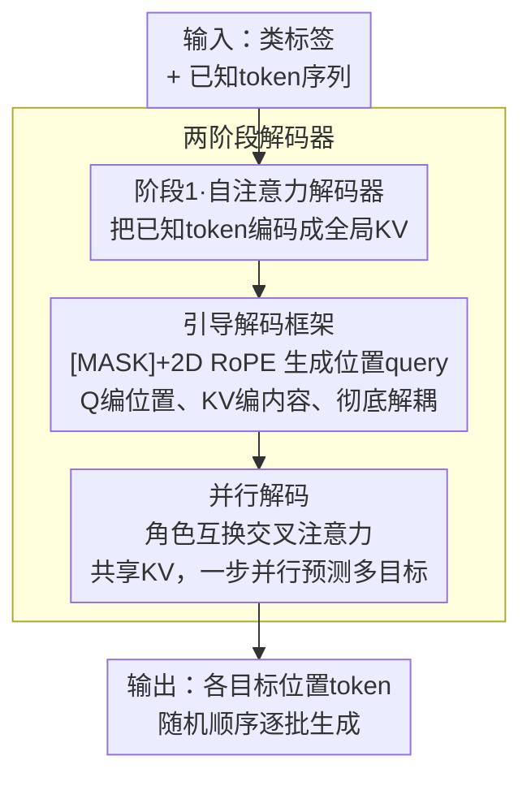

# Autoregressive Image Generation with Randomized Parallel Decoding

**会议**: ICLR 2026  
**arXiv**: [2503.10568](https://arxiv.org/abs/2503.10568)  
**代码**: [https://github.com/hp-l33/ARPG](https://github.com/hp-l33/ARPG)  
**领域**: Image Generation  
**关键词**: 自回归图像生成, 随机顺序建模, 并行解码, KV缓存, 可控生成

## 一句话总结
本文提出 ARPG，一种基于"引导解码"框架的视觉自回归模型，通过将位置引导（query）与内容表示（key-value）解耦，实现了完全随机顺序的训练与生成，并支持高效并行解码——在ImageNet-1K 256×256上以64步达到1.94 FID，吞吐量提升20倍以上，内存消耗降低75%以上。

## 研究背景与动机
自回归（AR）模型在大语言模型中取得了巨大成功，这一范式也被扩展到了视觉生成领域（如 VQGAN、LlamaGen 等）。然而，将 next-token prediction 应用于图像生成面临两个核心挑战：

**固定顺序的限制**: 图像是二维空间结构，但 AR 模型需要将其展平为一维序列（如光栅扫描顺序），这使得模型难以处理需要非因果依赖的零样本泛化任务（如图像修补 inpainting、扩展 outpainting）

**推理效率低下**: 逐 token 生成在高分辨率场景下效率很低，尤其是256×256图像需要生成数百个 token

现有的替代方案各有不足：MaskGIT 采用掩码建模实现随机顺序生成，但依赖双向注意力无法使用 KV 缓存；RandAR 通过位置指令 token 实现随机顺序，但将序列长度加倍导致巨大的计算和内存开销。

**核心 idea**: 将"预测目标的位置信息"作为 query 嵌入到注意力机制中，实现内容表示（KV）和位置引导（Q）的完全解耦，从而在保持因果性的同时支持随机顺序建模和并行解码。

## 方法详解

### 整体框架
ARPG 要解决的是「自回归图像生成只能沿固定光栅顺序逐 token 走、既做不了随机顺序的零样本任务、又慢」这一痛点。它的整体思路是把一次解码拆成两遍：第一遍用因果自注意力把已经生成的 token 编码成一组全局的 key-value（内容表示），第二遍用一批"知道自己该落在哪个位置"的 query 去交叉注意这些 key-value，一次性预测任意位置上的目标 token。输入是类标签加上图像 token 序列，输出是各目标位置的预测 token——整个过程既保留因果性，又摆脱了固定顺序的束缚，还能让多个目标共享同一份 KV 缓存并行预测。

### 关键设计

**1. 引导解码框架：把"目标在哪"从"上下文是什么"里解耦出来**

把 next-token prediction 搬到图像上最大的痛点，是模型只能沿一条预先排好的序列走，无法知道"下一个该预测的格子在哪"。ARPG 的出发点是三条观察：要打破顺序约束就必须给模型显式的位置引导；在掩码建模中未被掩码 token 对应的 query 拿不到损失梯度，意味着 query 完全可以与数据无关；而 [MASK] token 只携带位置、不贡献上下文，留在 key-value 里反而破坏因果性。顺着这三点，ARPG 重新定义了排列自回归的概率分布——每个 query $q_{\tau_i}$ 由数据无关的 [MASK] token 套上 2D RoPE 得到，只编码"目标在哪"，而 key-value 全部来自数据相关的已知 token，只编码"上下文是什么"。query 与 key-value 各司其职、彻底解耦，模型于是能在任意随机顺序下被位置 query 引导着去预测对应格子。

**2. 并行解码：用角色互换的交叉注意力消除目标间冲突**

既然每个待预测 token 只作为 query 出现、彼此之间不互为 key-value，它们就互不影响，天然可以同一步并行预测，并共享同一份 KV 缓存。这里的关键是 ARPG 把传统交叉注意力的角色对调过来——已知 token（条件）当 key-value，目标位置（输入）当 query——避免了多个生成目标挤在同一序列里相互争夺注意力造成的冲突。正是这一设计让 ARPG 能在 64 步里完成原本需要数百步的逐 token 生成，吞吐量相比 LlamaGen 提升 20 倍以上，内存占用降到 VAR 的四分之一以下。

**3. 两阶段解码器：在上下文编码与目标预测之间分工**

上面两个设计要落地，需要一个能同时承载"编码已知上下文"和"被位置 query 引导去预测"的骨架。ARPG 把解码器拆成两段：第一阶段是自注意力解码器，负责把输入 token 消化成全局上下文（即设计 1 里的 key-value）；第二阶段是交叉注意力解码器，用引导解码（设计 1）+ 并行解码（设计 2）去预测目标 token。两段的层数分配直接决定效率与质量的平衡：消融显示对称的 12+12 层最优（FID 2.44），偏向引导段的 6+18 或 0+24 虽然更快更省显存却让 FID 退到 3.5 甚至 4.57，而完全去掉引导段（24+0）模型退化为普通 AR，FID 直接飙到 90，随机顺序能力彻底丧失。这说明上下文编码与目标引导缺一不可。

### 损失函数 / 训练策略
训练采用标准 teacher-forcing，但在随机排列的序列上进行：每个 batch 内序列独立随机打乱、把类 token 放在起始，RoPE 频率沿 batch 维度扩展并同步打乱以保持位置对齐。优化器为 AdamW（β₁=0.99, β₂=0.95），初始学习率按 1e-4/256 的 batch size 线性缩放，训练 400 epoch（100 epoch warmup 后 cosine 退火至 1e-5），类嵌入以 0.1 概率 dropout 以支持 classifier-free guidance，tokenizer 沿用 LlamaGen 的 16× 下采样、16384 大小 codebook。

## 实验关键数据

### 主实验

| 模型 | 参数量 | 步数 | 吞吐量 | 内存 | FID↓ | IS↑ |
|------|--------|------|--------|------|------|-----|
| LlamaGen-XXL | 1.4B | 576 | 1.58 it/s | 26.22 GB | 2.62 | 244.1 |
| VAR-d24 | 1.0B | 10 | 48.90 it/s | 22.43 GB | 2.09 | 312.9 |
| RandAR-XXL | 1.4B | 88 | 10.46 it/s | 21.77 GB | 2.15 | 322.0 |
| RAR-XL | 955M | 256 | 8.00 it/s | 10.55 GB | 1.50 | 306.9 |
| **ARPG-L** | **320M** | **64** | **62.12 it/s** | **2.43 GB** | **2.44** | **287.1** |
| **ARPG-XL** | **719M** | **64** | **35.89 it/s** | **4.48 GB** | **2.10** | **331.0** |
| **ARPG-XXL** | **1.3B** | **64** | **25.39 it/s** | **7.31 GB** | **1.94** | **339.7** |

### 消融实验

| 配置 | 步数 | 吞吐量 | 内存 | FID |
|------|------|--------|------|-----|
| ARPG-L (12+12) 基线 | 64 | 62.12 it/s | 2.43 GB | 2.44 |
| Fewer Guided (18+6) | 64 | 50.72 it/s | 3.19 GB | 3.82 |
| More Guided (6+18) | 64 | 66.11 it/s | 1.67 GB | 3.51 |
| w/o Guided (24+0) | 256 | 11.70 it/s | 4.96 GB | 90 |
| Guided Only (0+24) | 64 | 72.26 it/s | 0.91 GB | 4.57 |
| w/o Shared KV | 64 | 48.02 it/s | 3.83 GB | 2.37 |
| Random order | 64 | 62.12 it/s | 2.43 GB | 2.44 |
| Raster order | 256 | - | - | 2.49 |

### 关键发现
- ARPG-XXL 在 64 步内达到 1.94 FID，吞吐量比 LlamaGen 高 20 倍以上
- 相比 VAR，ARPG 在相近吞吐量下将内存消耗降低超过 75%（7.31 GB vs 22.43 GB）
- 减少采样步数（如从 64 到 32）不会显著降低质量（ARPG-XXL: 32步 FID=2.08 vs 64步 FID=1.94）
- 随机顺序生成虽然建模困难更大（n! 种可能排列），但效果优于固定顺序
- 去除引导解码器后模型退化为普通 AR 模型（FID 飙升至 90），完全丧失随机顺序能力

## 亮点与洞察
- **理论清晰**: 从掩码建模与自回归建模的对比出发，通过三个严谨的洞察推导出方法设计，逻辑链条完整
- **效率与质量兼得**: 在保持竞争性生成质量的同时，大幅提升推理效率，这对实际部署非常有价值
- **零样本泛化能力**: 随机顺序建模使模型天然支持 inpainting、outpainting、分辨率扩展等任务，无需额外训练
- **可控生成扩展**: 仅需将 [MASK] query 替换为条件 token（如 canny 边缘、深度图），即可实现可控生成，并在 ControlVAR 和 ControlAR 上取得 SOTA
- **设计极简**: 不依赖 QK normalization、AdaLN、线性注意力等额外技术增强

## 局限与展望
- 由于计算资源限制，未扩展到文本到图像（text-to-image）生成
- 512×512 分辨率仅进行了 50 epoch 微调而非从头训练，未充分验证高分辨率性能
- 两阶段解码器增加了架构复杂度，但作者通过共享 KV 缓解了部分开销
- 随机顺序训练在相同收敛质量下可能需要更多训练 epoch
- 与扩散模型相比，FID 分数在最顶级水平仍有差距（如 DiT-XL/2 的 2.27 FID 已十分强劲）

## 相关工作与启发
- **因果序列建模**: VQGAN、LlamaGen 等采用光栅顺序的 AR 模型，效率受限于逐 token 生成
- **掩码序列建模**: MaskGIT 系列通过双向注意力实现并行生成，但无法使用 KV 缓存
- **RandAR**: 通过位置指令 token 实现随机顺序，但序列长度加倍带来显著开销
- **RAR**: 通过目标感知位置嵌入指定下一 token 位置，但仍最优于光栅顺序
- **启发**: 将注意力机制中 Q、K、V 的角色重新定义（Q 编码位置、KV 编码内容）是一种优雅的设计，可能启发其他序列建模任务

## 评分
- 新颖性: ⭐⭐⭐⭐⭐
- 实验充分度: ⭐⭐⭐⭐⭐
- 写作质量: ⭐⭐⭐⭐⭐
- 价值: ⭐⭐⭐⭐⭐

<!-- RELATED:START -->

## 相关论文

- [\[CVPR 2026\] Parallel Jacobi Decoding for Fast Autoregressive Image Generation](../../CVPR2026/image_generation/parallel_jacobi_decoding_for_fast_autoregressive_image_generation.md)
- [\[ICLR 2026\] Locality-aware Parallel Decoding for Efficient Autoregressive Image Generation](locality-aware_parallel_decoding_for_efficient_autoregressive_image_generation.md)
- [\[ICCV 2025\] Randomized Autoregressive Visual Generation](../../ICCV2025/image_generation/randomized_autoregressive_visual_generation.md)
- [\[ICLR 2026\] From Prediction to Perfection: Introducing Refinement to Autoregressive Image Generation](from_prediction_to_perfection_introducing_refinement_to_autoregressive_image_gen.md)
- [\[AAAI 2026\] Annealed Relaxation of Speculative Decoding for Faster Autoregressive Image Generation](../../AAAI2026/image_generation/annealed_relaxation_of_speculative_decoding_for_faster_autor.md)

<!-- RELATED:END -->
