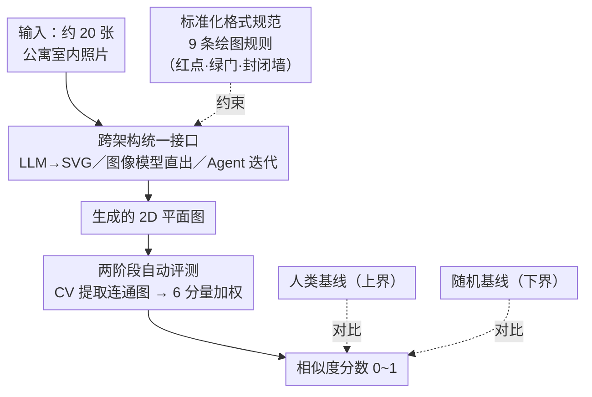

# Blueprint-Bench: Comparing Spatial Intelligence of LLMs, Agents and Image Models

**会议**: ICLR 2026  
**arXiv**: [2509.25229](https://arxiv.org/abs/2509.25229)  
**代码**: [GitHub](https://github.com/AndonLabs/Blueprint-Bench-generation)（含生成代码和数据集样本）  
**领域**: 图像生成  
**关键词**: 空间智能, 平面图生成, benchmark, LLM 评测, 图像生成模型评测, AI 安全

## 一句话总结

Blueprint-Bench 通过"从公寓室内照片生成 2D 平面图"的任务评测 AI 的空间推理能力：输入（照片）完全在训练分布内但任务（空间重建）在分布外。评测 GPT-5、Claude 4 Opus、Gemini 2.5 Pro、Grok-4 等 LLM，GPT-Image、NanoBanana 等图像生成模型，以及 Codex CLI、Claude Code 等 Agent 系统，结果显示绝大多数模型表现接近或低于随机基线，揭示当前 AI 在空间智能上的系统性盲区。

## 研究背景与动机

**领域现状**：LLM 持续展示超出训练范围的涌现能力；新一代图像生成模型（GPT-Image、NanoBanana/Gemini 2.5 Flash Image）开始展示推理能力（如解几何题）。然而，图像生成模型的"智能"缺乏数值化评测——GPT-Image 发布时甚至没有一个定量图表。

**现有痛点**：(1) LLM 评测集中于文本/代码/数学，缺少空间推理的系统化 benchmark；(2) ARC benchmark 的输入（网格模式）和任务都不在 LLM 训练分布内，无法区分"输入不理解"还是"任务做不了"；(3) 没有能跨架构（LLM vs 图像模型 vs Agent）横向对比智能的评测框架。

**核心矛盾**：公寓照片作为输入完全在现代多模态模型的训练分布内，但从照片推断平面图需要真正的空间推理——推断房间布局、理解连通性、保持一致尺度——这不是模型被训练去做的任务。这一"输入 in-distribution + 任务 out-of-distribution" 的设计允许精确定位空间推理能力的缺失。

**本文目标**：首个能跨模型架构（LLM / 图像生成 / Agent）横向比较空间智能的数值化 benchmark，同时为图像生成模型提供首个定量智能评测工具。

**切入角度**：设计一个模型无关的评测：任何能从图像序列生成图像的系统都可参与（LLM 生成 SVG→转图像；图像模型直接生成；Agent 在 Docker 中迭代编程生成）。

**核心 idea**：用一个输入在训练分布内但任务在分布外的 benchmark，首次数值化地揭示 AI 在空间推理上的系统性缺陷——大多数最强模型表现甚至不如随机基线。

## 方法详解

### 整体框架

Blueprint-Bench 把"空间智能"测试包装成一个统一接口：给定一套公寓的约 20 张室内照片，让任何能"看图出图"的系统画出这套公寓的 2D 平面图，再用一个全自动算法把生成图和真值平面图的相似度量化成 0~1 的分数。整条流水线分两段——**生成端**让三类异构系统（LLM、图像生成模型、Agent）在同一套绘图规范下各自产出平面图，**评测端**用一条确定性 CV 算法把图像还原成"房间-门"连通图、再做图相似度打分；人类与随机基线分别钉住分数的上界和下界。数据集为 50 套公寓的照片 + 标准化平面图真值，参与者包含 LLM（GPT-5 / Claude 4 Opus / Gemini 2.5 Pro / Grok-4 / GPT-4o / GPT-5-mini）、图像生成模型（GPT-Image / NanoBanana）和 Agent（Codex CLI / Claude Code）。

### 关键设计

**1. 跨架构统一接口：让 LLM、图像模型、Agent 在同一任务上公平比较**

三类参与者对同一任务有完全不同的"作答方式"，要横向对比就得先把它们收敛到"输入照片序列、输出平面图图像"这个统一接口上：LLM 生成 SVG 代码再渲染成图像，图像生成模型直接吃照片吐平面图，Agent 则被放进一个 Docker Linux 环境里、可以自由查看图片、写代码、运行、迭代修改。Agent 这一设定刻意模拟人类的工作流，用来回答一个关键问题——当单次推理不够强时，"反复看、反复改"的迭代能力能否补上空间推理的缺口。配套两条基线界定坐标系：随机基线让模型在不看任何照片时凭先验画一张"典型平面图"作为下界，人类基线则在与模型相同的条件下（只看照片、不实地走访）手绘平面图作为上界。

**2. 标准化格式规范：让任意系统的输出都能被机器稳定读懂**

接口统一了输入输出形态，但平面图本身仍可以画得千奇百怪，评分算法需要稳定地从中抽出"哪些房间、谁连着谁"。Blueprint-Bench 因此给所有参与者下达 9 条严格的绘图规则：墙壁用 3px 黑线、门用绿色短线覆盖在墙线上、每个房间中心用 10×10px 的红色圆点标记、纯白背景、每个房间必须完全封闭、禁止画家具/窗户/装饰等任何细节。这等于用"表达力"换"可读性"——在当前模型大多只能画到随机水平的现实下，一个稳健可复现的评分远比花哨的平面图更有价值，红点和封闭墙壁正是后续自动提取房间与连通关系的锚点。

**3. 两阶段自动评测：从图像到连通图再到分数**

有了规范化的平面图，评分先做几何提取再做图相似度比较。提取阶段是一条纯 CV 流水线：先用 HSV 颜色过滤定位红色圆心得到每个房间的位置，再二值化掩码排除黑墙与绿门，从每个红心做 flood-fill 分割出房间边界，沿墙扫描检测绿色门及其水平/垂直方向，最后按面积大小给房间排序分配 ID。把两张图都化为"房间为节点、门为边"的连通图后，评分阶段取 6 个分量的加权平均：边重叠 Jaccard（50%，衡量连通关系是否对）、度相关性（20%，每个房间门数分布是否匹配）、图密度匹配（10%）、房间数准确率（10%）、门数准确率（5%）、门方向分布（5%）。之所以基于连通图而非逐像素匹配，是因为像素对比会被微小平移虚假地重罚；团队也试过让 LLM 直接读平面图做提取，但发现 LLM 极不擅长理解平面图，频繁误判房间连通性和面积排序，只能退回到确定性的 CV 算法。

## 实验关键数据

### 主实验：各模型平均相似性分数（50 套公寓）

| 模型类型 | 模型名称 | 相对表现 | 关键特征 |
|---------|---------|---------|---------|
| 人类 | Human | **显著高于所有 AI 模型** | 所有平面图的房间连通性均正确 |
| LLM | GPT-5 | 统计显著 > 随机基线 | LLM 中最优 |
| LLM | Gemini 2.5 Pro | 统计显著 > 随机基线 | 与 GPT-5 接近 |
| LLM | GPT-5-mini | 统计显著 > 随机基线 | 小模型仍有效 |
| LLM | Grok-4 | 统计显著 > 随机基线 | 仅微弱优于基线 |
| LLM | Claude 4 Opus | ≈ 随机基线 | 未显著超出 |
| LLM | GPT-4o | **远低于**随机基线 | 严重的指令跟随失败 |
| 图像生成 | GPT-Image | ≈ 随机基线 | 指令遵循好但空间推理差 |
| 图像生成 | NanoBanana | **远低于**随机基线 | 始终包含家具等细节，指令遵循极差 |
| Agent | Codex CLI (GPT-5) | ≈ 随机基线 | 不利用迭代能力 |
| Agent | Claude Code (Claude 4 Opus) | ≈ 随机基线 | 有迭代行为但效果弱 |

注：论文以图表呈现分数，未给出精确数值。所有模型得分远低于人类。

### 评分权重构成分析

| 相似性分量 | 权重 | 衡量内容 |
|-----------|------|---------|
| 边重叠 Jaccard | 50% | 房间连通关系是否正确 |
| 度相关性 | 20% | 每个房间的门数分布是否匹配 |
| 图密度匹配 | 10% | 实际连接数 vs 可能连接数比率 |
| 房间数准确率 | 10% | 房间数量是否正确 |
| 门数准确率 | 5% | 门的总数是否正确 |
| 门方向分布 | 5% | 水平/垂直门的比例是否匹配 |

### 关键发现

- **空间智能是当前 AI 的显著盲区**：仅 4 个 LLM（GPT-5、Gemini 2.5 Pro、GPT-5-mini、Grok-4）统计显著超过随机基线，且超出幅度微弱——大多数最强模型处于随机水平或更差
- **人类遥遥领先**：所有人类绘制的平面图房间连通性都正确（AI 频繁出错），即使面积排序偶有误差，人类总分仍远超 AI。论文认为更宽松的评分标准下人类优势会更大
- **图像生成模型特别挣扎**：NanoBanana 持续违反规则（包含家具/窗户/装饰细节），GPT-Image 指令遵循较好但空间推理同样差
- **Agent 迭代改进出人意料地无效**：Codex CLI (GPT-5) 根本不利用迭代能力——直接查看所有图片→一次性写脚本→不查看输出直接提交。Claude Code 有迭代行为但效果不显著，最终仍声称"所有房间已正确封闭"——实际并非如此
- **GPT-4o 的反常表现**：作为较弱 LLM，其指令遵循失败（不标红点标记房间），导致评分远低于基线
- **GPT-Image vs 其底层 LLM**：GPT-Image 与 GPT-5 相比未展示更强空间智能（得分约为随机基线 vs 微弱超过基线），图像生成训练阶段可能未增加空间推理能力

## 亮点与洞察

- **"输入 in-distribution + 任务 OOD" 的评测范式**：区别于 ARC（输入和任务都 OOD），Blueprint-Bench 用日常照片（模型见过大量类似数据）作为输入，精确定位"空间推理"这一特定能力缺陷——模型不是看不懂图片，而是无法从图片推断空间结构
- **跨架构横向对比的首创性**：第一个能在同一任务上数值化比较 LLM、图像生成模型和 Agent 的 benchmark——填补了图像生成模型智能评测的空白
- **Agent 迭代的失败揭示**：Claude Code 的迭代过程表明当前 Agent 虽然有"自我审视"能力但仍无法有效自我纠错——声称"all rooms properly enclosed" 但实际输出不正确
- **AI 安全视角**：空间智能虽本身无害，但是危险应用的前提（如军事机器人、自主导航）。Blueprint-Bench 作为追踪空间智能涌现的监测工具有安全预警价值

## 局限与展望

- **评分基于面积排序的 ID 分配**：房间未按类型（卧室/厨房等）标注，面积排序错误会级联影响连通性评分——对人类和部分 AI 带来不公平的假阳性惩罚
- **不考虑房间形状**：仅比较连通图和面积排序，完全忽略房间的几何形状。曾尝试用墙壁采样点的双向最近邻距离衡量形状，但发现对微小误差惩罚过于剧烈且不可预测
- **数据集仅 50 套公寓**：规模有限，可能不足以支撑统计显著性分析
- **格式规则限制表达空间**：9 条严格规则使不擅长指令遵循的模型被不公平惩罚——Blueprint-Bench 应测空间智能而非指令遵循
- **未评测专用空间 AI 系统**：如 NeRF-based 室内重建方法不在评测范围——但这不是论文目标（目标是评测通用模型的空间智能）
- 论文中结果以图表呈现但未提供精确数值，限制了定量比较的可复现性

## 相关工作与启发

- **vs ARC**：ARC 的输入（网格模式）和任务（变换规则推断）都 OOD，Blueprint-Bench 仅任务 OOD——能更精准定位空间推理能力，而非一般化的"OOD 推理能力"
- **vs 专用建筑 AI（LayoutGPT、PosterLLaVA）**：这些工作追求最优平面图系统；Blueprint-Bench 不追求 SOTA 而是度量通用模型的空间智能——评测视角完全不同
- **vs 图像生成 benchmark（FID/IS/GenEval）**：现有 benchmark 关注美学和语义一致性；Blueprint-Bench 关注空间推理准确性——填补了图像模型智能评测的空白
- **启发**：随着图像生成模型越来越"智能"（如解数学题），benchmark 需要测量的是推理能力而非生成质量——Blueprint-Bench 开辟了这一方向

## 评分

- 新颖性: ⭐⭐⭐⭐⭐ 首个跨架构空间智能 benchmark，"输入 ID + 任务 OOD" 的评测范式设计巧妙，填补图像模型智能评测空白
- 实验充分度: ⭐⭐⭐⭐ 覆盖 LLM/图像模型/Agent 三类架构 + 人类和随机基线，但数据集仅 50 套且结果未给精确数值
- 写作质量: ⭐⭐⭐⭐ 动机清晰，评测方法描述详尽，Agent 行为分析有趣
- 价值: ⭐⭐⭐⭐ 揭示了空间智能的重要盲区，对 AI 安全评估有参考意义，可持续追踪新模型表现

<!-- RELATED:START -->

## 相关论文

- [\[ICLR 2026\] Everything in Its Place: Benchmarking Spatial Intelligence of Text-to-Image Models](everything_in_its_place_benchmarking_spatial_intelligence_of_text-to-image_model.md)
- [\[CVPR 2026\] Exploring Spatial Intelligence from a Generative Perspective](../../CVPR2026/image_generation/exploring_spatial_intelligence_from_a_generative_perspective.md)
- [\[CVPR 2026\] MICON-Bench: Benchmarking and Enhancing Multi-Image Context Image Generation in Unified Multimodal Models](../../CVPR2026/image_generation/micon-bench_benchmarking_and_enhancing_multi-image_context_image_generation_in_u.md)
- [\[CVPR 2026\] Omni IIE Bench: Benchmarking the Practical Capabilities of Image Editing Models](../../CVPR2026/image_generation/omni_iie_bench_benchmarking_the_practical_capabilities_of_image_editing_models.md)
- [\[ICLR 2026\] MVAR: Visual Autoregressive Modeling with Scale and Spatial Markovian Conditioning](mvar_visual_autoregressive_modeling_with_scale_and_spatial_markovian_conditionin.md)

<!-- RELATED:END -->
