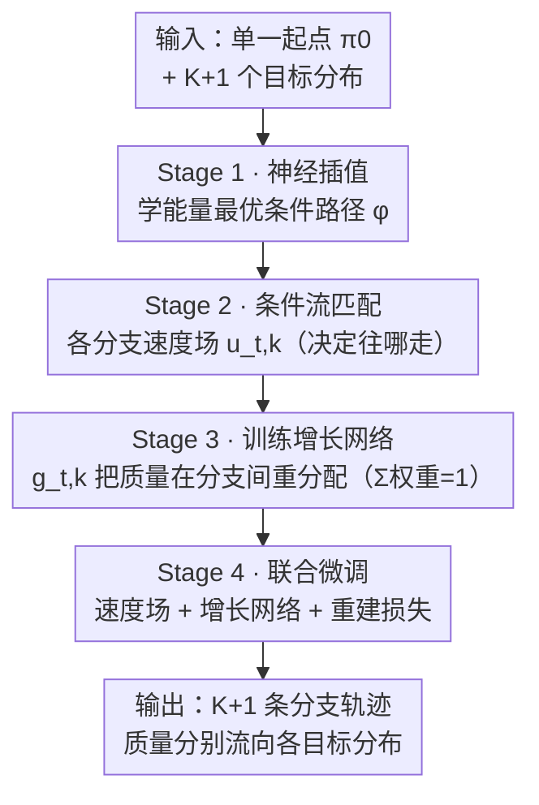

# Branched Schrödinger Bridge Matching

**会议**: ICLR 2026  
**arXiv**: [2506.09007](https://arxiv.org/abs/2506.09007)  
**代码**: [HuggingFace](https://huggingface.co/ChatterjeeLab/BranchSBM)  
**领域**: 图像生成 / 生成模型理论  
**关键词**: Schrödinger Bridge, 分支轨迹, 流匹配, 细胞命运分化, 最优传输

## 一句话总结
提出 BranchSBM 框架，通过参数化多个时间依赖的速度场和增长过程，将 Schrödinger Bridge Matching 扩展到分支场景，能够建模从单一初始分布到多个目标分布的分叉动态轨迹，在 LiDAR 表面导航和单细胞扰动建模等任务上显著优于单分支方法。

## 研究背景与动机
预测初始分布和目标分布之间的中间轨迹是生成模型中的核心问题。现有方法如 Flow Matching 和 Schrödinger Bridge Matching（SBM）能够有效学习两个分布之间的映射，但它们模型化的是**单一随机路径**，本质上只能处理单模态的转换。

**核心矛盾**：许多真实系统中存在**分支动态**——即从一个共同起源状态分叉演化到多个不同的终态分布。例如：
- **细胞命运分化**：均质的祖细胞群体在发育过程中分化为不同的细胞类型
- **药物扰动响应**：同一细胞系在药物处理后可能产生多种不同的表型结果
- **路径规划**：从一个起点到不同目的地的多路径导航

现有的单路径 SBM 方法无法建模这种分支行为。当目标分布是多模态的时，单分支方法要么发生模式坍缩（只到达最低能量的模态），要么生成的轨迹不能准确地到达各个终态。

**本文切入角度**：将 SBM 推广到分支场景——学习一组分支的 Schrödinger 桥，每个分支有独立的漂移场和增长率，共同描述群体级别从单一起点到多个终点的分叉动态。

## 方法详解

### 整体框架
BranchSBM 要学的是「一个起点分叉到多个终点」的轨迹：给定初始分布 $\pi_0$ 和 $K+1$ 个目标分布 $\{\pi_{1,k}\}_{k=0}^{K}$，单分支 SBM 只能拟合一条路径、面对多模态终态会坍缩。它的核心做法是为每个分支 $k$ 配一套独立的速度网络 $u_{t,k}^\theta$（决定这条分支往哪走）和增长网络 $g_{t,k}^\phi$（决定有多少质量流到这条分支），再用分阶段训练把二者解耦学出，最终得到一族从同一起点出发、质量随时间在分支间重分配、分别流向各目标分布的分支轨迹。整个 pipeline 把「分支该往哪走」和「质量怎么分」拆成两套网络、四个阶段逐级学出，如下图所示。

### 关键设计

**1. 非平衡条件随机最优控制（Unbalanced CondSOC）：让质量能在分支间流动**

标准 SBM 假设质量守恒——初始的每一份质量都一一对应地走到终态，这正是它处理不了分支的根本原因：一个统一的群体没法在守恒约束下「分裂」成多个目标。BranchSBM 在标准 GSB 问题上引入一个时间依赖的权重 $w_t(X_t)$，它由增长率 $g_t(X_t)$ 驱动，使得主分支的质量可以随时间转移到次要分支，从而把「分叉」这件事变成可建模的连续过程。**Proposition 1** 进一步证明，这个 Unbalanced GSB 问题可以通过条件化端点对来高效求解，把一个群体级的优化问题拆成可采样的条件子问题。

**2. 分支广义 Schrödinger 桥问题：把多分支写成多个非平衡子问题之和**

有了 Unbalanced CondSOC 这块积木，BranchSBM 把整个分支 GSB 问题形式化为多个 Unbalanced GSB 问题之和：主分支（$k=0$）初始权重为 1，$K$ 个次要分支初始权重为 0，整个过程满足质量守恒约束 $\sum_{k=0}^{K} w_{t,k} = 1$ 对所有时间 $t$ 成立——即任意时刻所有分支的质量加起来恒为 1，质量只在分支间挪动而不凭空增减。**Proposition 2** 证明了这个分支 CondSOC 问题可以分解为独立的分支子问题，于是每个分支可以分别训练，避免了直接求解高维耦合问题。

**3. 四阶段训练策略：把漂移学习和增长学习解耦，逐步逼近最优**

由于直接联合优化漂移场和增长率很困难，BranchSBM 把训练拆成四步逐级推进。Stage 1 是神经插值优化：训练插值网络 $\varphi_{t,\eta}(\mathbf{x}_0, \mathbf{x}_{1,k})$，在状态代价 $V_t(X_t)$ 下学能量最优的条件路径，用轨迹损失 $\mathcal{L}_{\text{traj}}$ 最小化路径的动能和势能。Stage 2 是条件流匹配：训练每个分支的漂移网络 $u_{t,k}^\theta$ 去匹配 Stage 1 学到的条件速度场，用标准 CFM 损失 $\mathcal{L}_{\text{flow}}$。Stage 3 固定漂移网络、单独训练增长网络 $g_{t,k}^\phi$，优化一个综合损失：分支能量损失 $\mathcal{L}_{\text{energy}}$ 优化分支间的能量分配，权重匹配损失 $\mathcal{L}_{\text{match}}$ 确保终态权重匹配目标分布的比例，质量守恒损失 $\mathcal{L}_{\text{mass}}$ 强制所有分支权重之和守恒。Stage 4 再解冻所有参数联合微调漂移和增长网络，并加入重建损失 $\mathcal{L}_{\text{recons}}$ 收尾。先单独把漂移学准、再单独把质量分配学准、最后联合打磨，避开了一上来就联合优化的不稳定。

**4. 理论保证：从最优性到质量单向流动的完整证明链**

BranchSBM 给上述设计配了一组定理来兜底。**Proposition 3** 证明 Stage 1+2 训练得到的就是 GSB 问题的最优漂移，说明前两阶段的解耦不损失最优性；**Proposition 4** 通过变分法的直接方法证明了最优增长函数的存在性；**Lemma 2** 则证明次要分支的最优增长率是非减的——也就是质量只会从主分支流出、不会回流，这与「群体从单一起点逐步分化、不可逆」的直觉一致。

### 损失函数 / 训练策略
- Stage 1 使用 Adam 优化器，lr=1e-4
- Stage 2-4 使用 AdamW 优化器，lr=1e-3，weight decay=1e-5
- 每个阶段最多训练 100 epochs
- 模型架构：3层MLP + SELU激活函数
- 增长网络的次要分支输出额外通过 softplus 确保非负性
- 状态代价使用数据依赖的 LAND 度量（低维）或 RBF 度量（高维）

## 实验关键数据

### 主实验

| 数据集 | 指标 | BranchSBM | 单分支SBM | 说明 |
|--------|------|-----------|-----------|------|
| LiDAR 表面导航 | $\mathcal{W}_1$ / $\mathcal{W}_2$ | **显著更低** | 高 | 分支路径绕山两侧 |
| 小鼠造血分化(t₁) | $\mathcal{W}_1$ / $\mathcal{W}_2$ | **显著更低** | 高 | 中间时间点准确预测 |
| 小鼠造血分化(t₂) | $\mathcal{W}_1$ / $\mathcal{W}_2$ | **显著更低** | 高 | 终态两个细胞命运准确还原 |
| Clonidine扰动(50PC) | MMD / $\mathcal{W}_1$ / $\mathcal{W}_2$ | **最优** | 只达cluster0 | 单分支无法到达所有终态 |
| Clonidine扰动(100PC) | MMD | 优于50PC单分支 | - | 高维扩展性验证 |
| Clonidine扰动(150PC) | MMD | 优于50PC单分支 | - | 维度可扩展 |
| Trametinib扰动(3分支) | MMD / $\mathcal{W}_1$ / $\mathcal{W}_2$ | **最优** | 仅达cluster0 | 验证3分支能力 |

### 消融实验

| 配置 | 关键指标 | 说明 |
|------|---------|------|
| Stage 3 only (固定漂移) | $\mathcal{L}_{\text{energy}}$ 较高 | 增长网络独立训练 |
| Stage 3+4 (联合训练) | $\mathcal{L}_{\text{energy}}$ 更低 | 联合优化进一步降低能量 |
| $\mathcal{L}_{\text{match}}$ | → 0 | 终态权重准确匹配 |
| $\mathcal{L}_{\text{mass}}$ | → 0 | 质量守恒得到满足 |

### 关键发现
- **单分支SBM发生模式坍缩**：面对多模态目标时，单分支方法只能到达能量最低的模态，完全忽略其他终态
- **分支时间可自动学习**：在 LiDAR 实验中，模型自动在山脊边缘发起分支——表明框架能从数据中学习最优分支时刻
- **高维可扩展**：在单细胞扰动实验中，从50到150个主成分维度，BranchSBM 都能有效工作
- **质量转移动态合理**：权重曲线显示质量从主分支平滑地转移到次要分支，符合生物学直觉
- **三分支同样有效**：Trametinib 实验验证了框架可扩展到两个以上的分支

## 亮点与洞察
- **问题定义新颖且重要**：首次形式化定义并求解了分支 Schrödinger 桥问题，填补了生成模型理论的空白
- **理论扎实**：提出了完整的理论框架（Propositions 1-4），包括存在性、唯一性和构造性证明
- **四阶段训练设计精巧**：通过分阶段解耦漂移学习和增长学习，避免了联合优化的困难
- **应用场景明确**：细胞命运分化和扰动响应是计算生物学的核心问题，本文提供了原理性的解决方案
- **与 Flow Matching 和 OT 的深刻联系**：当增长率为零时退化为标准 GSBM，理论上统一了多种方法

## 局限与展望
- **分支数需要预先指定**：需要先通过聚类确定 $K$，无法自动发现分支结构
- **配对需要 OT**：端点配对依赖最优传输计划，对大规模数据的计算开销可能较大
- **仅在低到中维（2-150D）验证**：全基因组级别（数万维）的可扩展性未验证
- **MLP 架构简单**：更复杂的架构（如 Transformer、GNN）可能带来性能提升
- **中间时间点数据利用有限**：目前主要使用端点数据训练，如果有中间快照数据应该能进一步提升
- **生物学验证不够深入**：没有与其他计算生物学方法（如 CellOT、PRESCIENT）进行全面比较

## 相关工作与启发
- **Schrödinger Bridge**：Schrödinger (1931) 的经典问题，近年来在生成模型中重新焕发生机（De Bortoli et al., 2021; Shi et al., 2023）
- **Flow Matching**：Lipman et al. (2023) 的条件流匹配为 BranchSBM 的 Stage 2 提供了理论基础
- **Generalized SBM**：Liu et al. (2023) 引入了状态代价，BranchSBM 在此基础上增加了分支机制
- **非平衡最优传输**：Chizat et al. (2018)、Pariset et al. (2023) 研究了质量不守恒的传输问题
- **单细胞轨迹推断**：Schiebinger et al. (2019)、Bunne et al. (2023) 使用 OT 方法建模细胞状态转换
- **启发**：是否可以引入注意力机制让模型自动学习分支结构？是否可以处理分支合并（而不仅仅是分叉）的场景？

## 评分
- 新颖性: ⭐⭐⭐⭐⭐
- 实验充分度: ⭐⭐⭐⭐
- 写作质量: ⭐⭐⭐⭐⭐
- 价值: ⭐⭐⭐⭐

<!-- RELATED:START -->

## 相关论文

- [\[NeurIPS 2025\] Schrödinger Bridge Matching for Tree-Structured Costs and Entropic Wasserstein Barycentres](../../NeurIPS2025/image_generation/schrödinger_bridge_matching_for_tree-structured_costs_and_entropic_wasserstein_b.md)
- [\[NeurIPS 2025\] Dynamic Diffusion Schrödinger Bridge in Astrophysical Observational Inversions](../../NeurIPS2025/image_generation/dynamic_diffusion_schrödinger_bridge_in_astrophysical_observational_inversions.md)
- [\[NeurIPS 2025\] Grasp2Grasp: Vision-Based Dexterous Grasp Translation via Schrödinger Bridges](../../NeurIPS2025/image_generation/grasp2grasp_vision-based_dexterous_grasp_translation_via_schrödinger_bridges.md)
- [\[ICML 2026\] Geometry-based Schrödinger Bridges for Trustworthy Multimodal Fusion](../../ICML2026/image_generation/geometry-based_schrödinger_bridges_for_trustworthy_multimodal_fusion.md)
- [\[ICLR 2026\] Discrete Adjoint Matching](discrete_adjoint_matching.md)

<!-- RELATED:END -->
