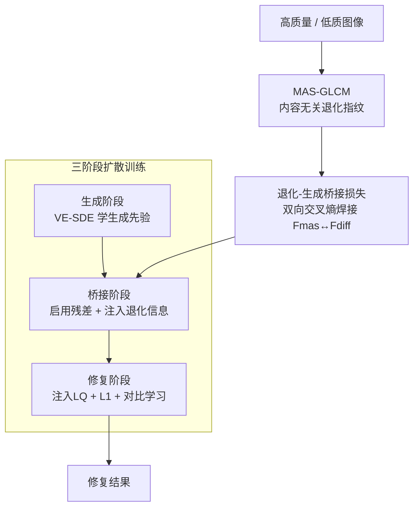

# Bridging Degradation Discrimination and Generation for Universal Image Restoration

**会议**: ICLR 2026  
**arXiv**: [2602.00579](https://arxiv.org/abs/2602.00579)  
**代码**: 无  
**领域**: 图像生成  
**关键词**: 通用图像修复, GLCM退化表征, 扩散模型, 三阶段训练, all-in-one restoration  

## 一句话总结
BDG 通过多角度多尺度灰度共生矩阵（MAS-GLCM）进行细粒度退化判别，并设计三阶段扩散训练（生成→桥接→修复）将退化判别能力与生成先验无缝融合，在 all-in-one 修复和真实世界超分辨率任务上取得显著的保真度提升。

## 研究背景与动机
**领域现状**：通用图像修复要求单一模型处理多种退化类型，需要同时具备退化判别和条件生成两种能力

**现有痛点**：
   - **退化判别路线**（AirNet、PromptIR 等）：引入额外判别网络识别退化类型，但使用 L1/L2 损失导致输出过于平滑，真实场景效果差
   - **生成先验路线**（StableSR、DiffBIR 等）：利用预训练扩散模型的生成能力恢复丰富纹理，但 all-in-one 场景中容易把轻度退化误判为严重退化，生成与原图不一致的细节

**核心矛盾**：退化判别和生成先验是两种独立发展的能力，缺乏统一框架将二者有机融合

**本文目标**：在保持扩散模型生成先验的同时，为其注入细粒度退化判别能力，使其能根据退化程度自适应调整输出

**切入角度**：提出新的退化表征（MAS-GLCM）+ 三阶段扩散训练策略，将判别信息逐步桥接到生成过程中

**核心 idea**：用灰度共生矩阵做内容无关的退化表征，通过三阶段训练将其与扩散模型特征对齐，实现判别与生成的统一

## 方法详解

### 整体框架
BDG 要解决的核心难题是：通用修复模型既需要扩散模型那种能"无中生有"出丰富纹理的生成先验，又需要一双能分辨退化类型和轻重的"眼睛"，而这两种能力此前各自为政、硬拼会互相打架。BDG 的整体思路是先用一个内容无关的退化指纹（MAS-GLCM）把"退化看成什么样"量化出来，再用同一条反向扩散更新公式、靠开关三个系数把训练切成生成→桥接→修复三个前后衔接的阶段，让模型从"只会生成"平滑过渡到"看着退化做修复"。其中桥接阶段是关键枢纽——它用一组双向对齐损失把退化指纹"焊"进扩散模型的中间特征，于是判别信息被注入了生成过程，而不是另起一个判别网络贴在外面。

### 关键设计

**1. 多角度多尺度灰度共生矩阵 MAS-GLCM：造一个只看退化、不看内容的退化指纹**

通用修复的麻烦在于：模型既要认出退化类型，又不能被图像本身的语义内容干扰。Sobel、Laplace、频率谱这些常见的退化线索都和内容耦合——同样是模糊，建筑照片和人脸照片提取出的特征差异很大，模型很难据此判断退化等级。BDG 改用灰度共生矩阵（GLCM），它统计的是特定距离和方向上一对像素的灰度共现频率，这套统计量只描述纹理的"颗粒感"，天然丢弃了图像讲了什么内容。为了不被单一方向和单一尺度的局部性误导，作者在多个角度 $\Theta$ 和多个尺度 $L$ 上各算一遍 GLCM 再取平均：

$$M_{mas} = \frac{1}{n \times m} \sum_{i,j} M_{L_i \cdot \sin(\Theta_j),\, L_i \cdot \cos(\Theta_j)}$$

这样得到的退化指纹既稳定又判别力强：用最简单的 KNN 在退化类型上就能到 97.13% 准确率（频率谱只有 65.80%），在更细的退化等级上达到 74.17%（频率谱仅 30.83%）——正是这种"内容无关"让它能区分轻度和重度退化，而这恰恰是生成型方法最容易栽跟头的地方。

**2. 三阶段扩散训练：用一个统一公式的参数开关，把模型从纯生成平滑地推进到判别式修复**

判别能力和生成先验是两套独立发展的本事，硬拼在一起会互相打架。BDG 的巧思是把整个训练写成同一条反向更新公式，靠开关三个系数来切换模型当前在学什么：

$$x_{t-1} = x_t - \alpha_t x_{res}^\theta - \frac{\beta_t^2}{\bar{\beta}_t} \epsilon^\theta + \delta_t x_{lq}$$

**生成阶段**令 $\alpha_t \equiv 0,\ \delta_t \equiv 0$，公式退化成标准的 VE-SDE 去噪，模型只在高质量图像上把生成先验学扎实。**桥接阶段**放开残差项（$\delta_t \equiv 0$，但启用 $\alpha_t x_{res}$），残差本身就携带退化信息，模型开始接触退化条件；同时把 MAS-GLCM 特征 $F_{mas}$ 和扩散模型的中间特征 $F_{diff}$ 通过双向交叉熵对齐，并挂一个 MLP 做退化分类，确保 $F_{mas}$ 在对齐过程中不丢失判别力。**修复阶段**再启用 $\delta_t x_{lq}$ 直接注入低质图像增强保真度，并把退化分类从离散类别换成全负样本对比学习，以适应真实世界退化无法被干净分类的情况。三个阶段一脉相承、缺一不可：消融显示如果跳过桥接直接从生成跳到修复，保真度会显著下降，因为判别信息没被对齐进生成过程。

**3. 退化-生成桥接损失：用双向交叉熵把退化指纹焊进扩散特征**

桥接阶段要做的事，是让扩散模型的中间特征"看得见"MAS-GLCM 提取的退化信息。作者用一个对称的双向对齐损失实现：既要从 GLCM 特征预测得到扩散特征（m2d），也要反过来从扩散特征预测 GLCM 特征（d2m），两个方向的交叉熵取平均：

$$\mathcal{L}_{bridge} = \frac{1}{2}\big[\text{H}(y^{m2d}, p^{m2d}) + \text{H}(y^{d2m}, p^{d2m})\big]$$

双向而非单向，是为了让两组特征互相约束、对齐得更紧。它和生成损失、退化分类损失一起组成总目标，桥接相关项用较小的权重 $\lambda = 0.1$ 平衡，避免对齐压垮原有的生成能力：

$$\mathcal{L}_{bdg} = \mathcal{L}_{gen} + \lambda\,(\mathcal{L}_{bridge} + \mathcal{L}_{deg\text{-}cls})$$

### 损失函数 / 训练策略
- 生成阶段：标准去噪损失（噪声预测+残差预测）
- 桥接阶段：去噪 + 特征对齐 + 退化分类
- 修复阶段：L1 保真损失 + 特征对齐桥接损失 + 全负样本对比学习
- 真实世界退化用 Real-ESRGAN 的多步退化链模拟，定义 8 个中间状态作为"退化顺序"伪标签

## 实验关键数据

### 主实验 — All-in-One 修复

| 方法 | 路线 | 保真度 (PSNR↑) | 感知质量 (LPIPS↓) |
|------|------|-------------|---------------|
| PromptIR | 判别型 | 高 | 差（过平滑）|
| DiffBIR | 生成型 | 低（不一致）| 好 |
| **BDG** | **判别+生成统一** | **显著提升** | **保持** |

### 消融实验 — MAS-GLCM 退化分类能力

| 退化表征 | 类型分类 Acc (%) | 等级分类 Acc (%) |
|---------|---------------|---------------|
| LQ 图像 | 51.44 | 20.00 |
| Sobel (梯度) | 40.80 | 23.33 |
| Laplace (梯度) | 83.05 | 20.83 |
| Fourier (频率) | 65.80 | 30.83 |
| **MAS-GLCM** | **97.13** | **74.17** |

### 关键发现
- **MAS-GLCM 远优于现有退化表征**：在细粒度退化等级分类上领先 Fourier 43 个百分点
- **三阶段训练缺一不可**：去掉桥接阶段直接从生成到修复，保真度显著下降
- **生成先验被成功保留**：修复结果的纹理丰富度接近纯生成模型，但保真度大幅提升
- **不改变模型架构**：BDG 通过训练策略和损失设计实现改进，无需修改网络结构

## 亮点与洞察
- **MAS-GLCM 的内容无关性**是最大亮点：GLCM 的计算方式天然排除内容信息，只保留纹理统计特性——这使得退化判别不受图像语义干扰
- **三阶段过渡设计的优雅**：生成→桥接→修复，通过逐步引入扩散公式中的参数来控制模型能力的演进——从纯生成到条件生成再到修复
- **将退化分类重构为对比学习**：桥接阶段用离散类别标签，修复阶段用全负对比——适应真实世界退化无法明确分类的现实

## 局限与展望
- MAS-GLCM 的角度和尺度参数需要手动选择
- 三阶段训练增加了训练复杂度
- 真实世界退化的"顺序分类"是近似的伪标签，不完全反映真实退化
- 未在视频修复等时序场景验证

## 相关工作与启发
- **vs PromptIR/AirNet**：这些方法用额外网络判别退化但输出过平滑；BDG 在扩散模型内部完成判别
- **vs DiffBIR/StableSR**：这些方法利用生成先验但缺乏退化感知，all-in-one 场景保真度差；BDG 通过 MAS-GLCM 桥接解决
- **vs DiffUIR**：DiffUIR 只预测残差丢失了生成先验；BDG 同时预测噪声和残差保留生成先验

## 评分
- 新颖性: ⭐⭐⭐⭐ MAS-GLCM 退化表征有新意，三阶段训练设计有深度
- 实验充分度: ⭐⭐⭐⭐ 退化分类验证 + all-in-one + 真实超分，但缺少与更多基线的定量对比
- 写作质量: ⭐⭐⭐⭐ 方法推导清晰，但符号较多需要仔细跟踪
- 价值: ⭐⭐⭐⭐ 统一判别和生成的思路对图像修复领域有实际指导意义

<!-- RELATED:START -->

## 相关论文

- [\[CVPR 2026\] Face2Scene: Using Facial Degradation as an Oracle for Diffusion-Based Scene Restoration](../../CVPR2026/image_generation/face2scene_using_facial_degradation_as_an_oracle_for_diffusion-based_scene_resto.md)
- [\[CVPR 2025\] GenDeg: Diffusion-based Degradation Synthesis for Generalizable All-In-One Image Restoration](../../CVPR2025/image_generation/gendeg_diffusion-based_degradation_synthesis_for_generalizable_all-in-one_image_.md)
- [\[CVPR 2025\] V-Bridge: Bridging Video Generative Priors to Versatile Few-shot Image Restoration](../../CVPR2025/image_generation/v-bridge_bridging_video_generative_priors_to_versatile_few-shot_image_restoratio.md)
- [\[ICLR 2026\] JointDiff: Bridging Continuous and Discrete in Multi-Agent Trajectory Generation](jointdiff_bridging_continuous_and_discrete_in_multi-agent_trajectory_generation.md)
- [\[ICLR 2026\] LVTINO: LAtent Video consisTency INverse sOlver for High Definition Video Restoration](lvtino_latent_video_consistency_inverse_solver_for_high_definition_video_restora.md)

<!-- RELATED:END -->
