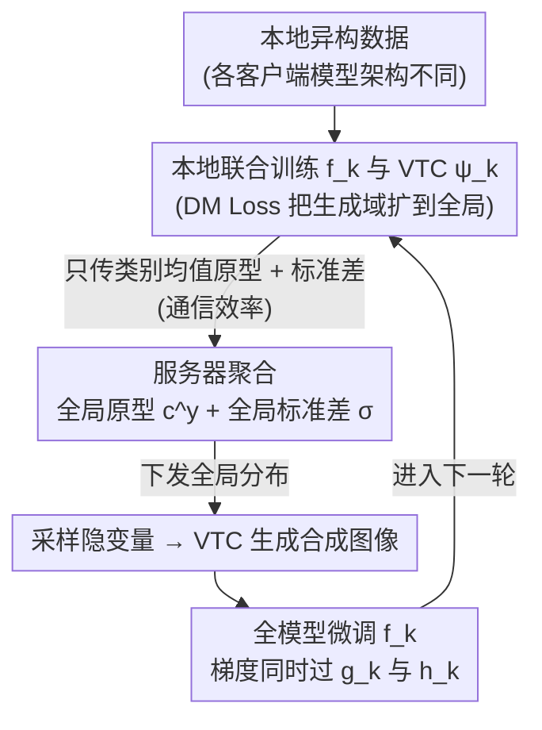

# Bridging Generalization Gap of Heterogeneous Federated Clients Using Generative Models

**会议**: ICLR 2026  
**arXiv**: [2508.01669](https://arxiv.org/abs/2508.01669)  
**代码**: 无  
**领域**: 联邦学习 / 生成模型  
**关键词**: 模型异构联邦学习, 变分转置卷积, 合成数据微调, 特征分布对齐, 通信效率  

## 一句话总结
FedVTC 提出在模型异构联邦学习中，各客户端通过变分转置卷积网络（VTC）从聚合的特征分布统计量中生成合成数据来微调本地模型，无需公共数据集即可显著提升泛化能力，同时降低通信和内存开销。

## 研究背景与动机
**领域现状**：联邦学习中数据异质性导致本地模型泛化能力差。传统方法通过正则化或权重调整来改善，但都假设客户端模型架构相同

**现有痛点**：
   - 知识蒸馏方法需要公共数据集，实际中通常不可用
   - 在特征空间做知识蒸馏只能去偏分类头，无法改善特征提取器
   - 原型共享方法只正则化特征提取器而忽略分类头
   - 代理模型方法通信和内存开销大

**核心矛盾**：模型异构意味着无法共享参数进行聚合，但客户端仍需从全局信息中获益以提升泛化

**本文目标**：在不依赖公共数据集、不共享模型参数的前提下，同时去偏特征提取器和分类头

**切入角度**：客户端只共享特征分布的统计量（均值+协方差），用它们指导生成合成数据来微调完整模型

**核心 idea**：用变分转置卷积从全局特征分布中生成合成图像，对本地模型做全模型微调，同时去偏特征提取器和分类头

## 方法详解

### 整体框架
FedVTC 要解决的是模型异构联邦学习里「不能共享参数、又没有公共数据集」的两难：客户端架构各不相同，无法直接聚合权重，但本地模型又因为数据偏斜而泛化很差。它的破局点是让客户端只交换**特征分布的统计量**，再各自在本地用一个小生成器把全局知识「画」成合成图像，用这些图像微调整个模型。

具体地，每个客户端 $k$ 持有本地模型 $f_k = h_k \circ g_k$（$g_k$ 特征提取器、$h_k$ 分类头）和一个变分转置卷积生成器 $\psi_k$。一轮流程是：先在本地数据上联合训练 $f_k$ 和 $\psi_k$；然后只向服务器上传每个类别的均值原型 $\mathbf{c}_k^y$ 和标准差 $\boldsymbol{\sigma}_k$；服务器把各客户端的统计量聚合成全局原型 $\mathbf{c}^y$ 和全局标准差 $\boldsymbol{\sigma}$ 下发；客户端从这个全局分布里采样隐变量，喂给 $\psi_k$ 生成合成图像；最后用这批带全局信息的合成图像对 $f_k$ 做全模型微调。整个回路里跨客户端流动的只有几个统计向量，原始数据和模型参数都没出过本地。

### 关键设计

**1. 变分转置卷积网络 VTC：把全局特征分布"画"成图像**

模型异构的核心障碍是参数无法对齐，于是 FedVTC 干脆不传参数，而是把"全局知识"具象成可微调的图像。VTC 就是这个具象化的工具——它结构上像 VAE 的解码器，但用转置卷积逐层上采样把低维隐变量还原成图像。输入用重参数化技巧构造 $\mathbf{v} = \mathbf{z} + \boldsymbol{\sigma}_k \odot \boldsymbol{\epsilon}$（$\mathbf{z}$ 取自类别原型、$\boldsymbol{\epsilon}$ 为高斯噪声），输出合成图像 $\mathbf{x}' = \psi_k(\mathbf{v})$。训练时最大化 ELBO，即重建损失加 KL 散度，KL 项负责把本地特征分布往全局原型上拉齐。这样一来，从全局分布采样、由 VTC 生成的图像就天然携带了别的客户端贡献的统计信息。

**2. 分布匹配正则化 DM Loss：让 VTC 离开本地分布也不"翻车"**

VTC 是在本地训练的，只见过本地的特征分布；可推理时却要用**全局分布**采样的隐变量来生成，二者一旦错位，生成质量就会塌。DM Loss（Distribution Matching 损失）就是补这个缺口：它额外约束 VTC 在面对全局分布而非仅本地分布的输入隐变量时也能产出高质量样本，相当于提前把生成器的工作域从"本地"扩到"全局"。消融里去掉这一项后合成数据在全局采样下明显退化，印证了它是保证跨域鲁棒性的关键。

**3. 全模型微调策略：一次同时去偏特征提取器和分类头**

以往方法各偏一半——特征空间蒸馏只能纠正分类头，原型共享只能纠正特征提取器。FedVTC 选择在**图像层面**做文章：合成数据要走完 $f_k$ 的整条前向传播，于是反向传播的梯度同时流过 $g_k$ 和 $h_k$，两个组件被一并去偏。这正是它选择"生成图像"而不是"生成特征"的原因——只有完整的图像样本才能驱动整个模型的端到端微调，把两类偏差统一在一次更新里解决。

**4. 通信效率：只传几个统计向量**

代理模型类方法要传输超参数化的生成器、参数共享类方法要传整套权重，开销都很大。FedVTC 每轮在客户端与服务器之间只交换特征分布统计量：类别均值原型 $\mathbf{c}_k^y \in \mathbb{R}^p$ 和标准差 $\boldsymbol{\sigma}_k \in \mathbb{R}^p$。这两个 $p$ 维向量的体量远小于模型参数或完整生成模型，因此即便客户端众多、轮次很多，通信总量也能压得很低。

### 损失函数 / 训练策略
- VTC 训练损失：$\mathcal{L}_e = \mathcal{L}_{rc} + D_{KL} + \mathcal{L}_{DM}$
- 重建损失：$\mathcal{L}_{rc} = \|\mathbf{x}' - \mathbf{x}\|_2^2$
- KL 散度：对齐局部特征分布到全局原型
- 本地模型微调：合成数据上的交叉熵损失
- VTC 和本地模型交替训练，避免额外内存消耗

## 实验关键数据

### 主实验 — 模型异构 FL 泛化准确率

| 方法 | MNIST | CIFAR-10 | CIFAR-100 | Tiny-ImageNet |
|------|-------|----------|-----------|---------------|
| FedGH (表示共享) | 中等 | 中等 | 低 | 低 |
| FedKD (知识蒸馏) | 需公共数据 | 需公共数据 | 需公共数据 | 需公共数据 |
| **FedVTC** | **最高** | **最高** | **最高** | **最高** |

### 消融实验

| 配置 | 泛化准确率 |
|------|----------|
| FedVTC (完整) | 最优 |
| w/o DM Loss | 下降（VTC 对全局分布采样不鲁棒）|
| w/o 全模型微调（只微调分类头）| 显著下降 |
| w/o KL 对齐 | 显著下降 |

### 关键发现
- **全模型微调 vs 部分对齐**：用合成数据微调整个模型比仅对齐特征空间或分类头效果好很多
- **DM Loss 至关重要**：没有 DM Loss，VTC 生成的合成数据质量在全局分布采样下严重退化
- **通信效率**：FedVTC 的通信量远低于需要传输模型参数或代理模型的方法
- **在大规模数据集（Tiny-ImageNet）上优势更明显**：说明方法的可扩展性好

## 亮点与洞察
- **合成数据作为知识传递媒介**：不传模型参数、不传原始数据，而是通过共享分布统计量+本地生成合成数据来间接传递全局知识——巧妙地在隐私保护和知识共享间取得平衡
- **统一去偏两个组件**：之前的方法要么只去偏特征提取器要么只去偏分类头，FedVTC 通过图像级操作自然统一
- **轻量设计**：VTC 是简单的转置卷积网络，与本地模型交替训练，不需要额外 GPU 内存

## 局限与展望
- VTC 生成的图像质量可能较低（简单转置卷积 vs 扩散模型等更强的生成器）
- 假设每个类别的特征分布为高斯，真实分布可能更复杂
- 特征维度 $p$ 较高时，协方差估计可能不准确
- 未考虑隐私攻击——特征均值和协方差是否可以被用来推断原始数据？

## 相关工作与启发
- **vs FedGH/FedTGP**：只共享原型正则化特征提取器，忽略分类头；FedVTC 通过合成数据同时去偏两者
- **vs FedZKD/FedGen**：在特征空间做知识蒸馏，只去偏分类头；FedVTC 在图像空间操作
- **vs FedMAN**：传输超参数化代理模型，通信开销大；FedVTC 只传统计量

## 评分
- 新颖性: ⭐⭐⭐⭐ VTC 作为联邦学习中的合成数据生成器是新颖的组合
- 实验充分度: ⭐⭐⭐⭐ 4 个数据集 + 多个异构基线 + 消融，较为充分
- 写作质量: ⭐⭐⭐⭐ 逻辑清晰，对比清楚
- 价值: ⭐⭐⭐⭐ 解决了模型异构 FL 的实际痛点，通信效率高

<!-- RELATED:START -->

## 相关论文

- [\[ICLR 2026\] Generalization of Diffusion Models Arises with a Balanced Representation Space](generalization_of_diffusion_models_arises_with_a_balanced_representation_space.md)
- [\[ICCV 2025\] FedDifRC: Unlocking the Potential of Text-to-Image Diffusion Models in Heterogeneous Federated Learning](../../ICCV2025/image_generation/feddifrc_unlocking_the_potential_of_text-to-image_diffusion_models_in_heterogene.md)
- [\[CVPR 2026\] Temporal Equilibrium MeanFlow: Bridging the Scale Gap for One-Step Generation](../../CVPR2026/image_generation/temporal_equilibrium_meanflow_bridging_the_scale_gap_for_one-step_generation.md)
- [\[CVPR 2026\] Heterogeneous Decentralized Diffusion Models](../../CVPR2026/image_generation/heterogeneous_decentralized_diffusion_models.md)
- [\[ICML 2026\] SpatialReward: Bridging the Perception Gap in Online RL for Image Editing via Explicit Spatial Reasoning](../../ICML2026/image_generation/spatialreward_bridging_the_perception_gap_in_online_rl_for_image_editing_via_exp.md)

<!-- RELATED:END -->
