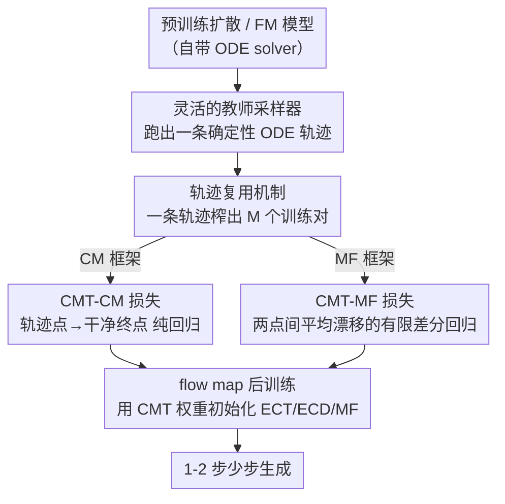

# CMT: Mid-Training for Efficient Learning of Consistency, Mean Flow, and Flow Map Models

**会议**: ICLR 2026  
**arXiv**: [2509.24526](https://arxiv.org/abs/2509.24526)  
**代码**: [https://github.com/sony/cmt](https://github.com/sony/cmt)  
**领域**: 扩散模型 / 少步生成  
**关键词**: flow map, consistency model, mid-training, few-step generation, diffusion distillation

## 一句话总结
提出 Consistency Mid-Training (CMT)，在预训练扩散模型和 flow map 后训练之间插入一个轻量级中间训练阶段，通过让模型学习将 ODE 轨迹上的任意点映射回干净样本来获得轨迹对齐的初始化，从而大幅降低训练成本（最多 98%）并达到 SOTA 两步生成质量。

## 研究背景与动机

**领域现状**：扩散模型生成质量高但推理慢（需要多步 ODE 求解）。Flow map 模型（如 Consistency Models、Mean Flow）通过学习 PF-ODE 的解映射来实现少步（1-2 步）生成，是当前加速扩散模型的主流方向。

**现有痛点**：Flow map 模型训练不稳定、对超参数敏感、计算成本高昂。核心原因是缺乏真实的回归目标——当前方法依赖 stop-gradient 的伪目标，这些目标随训练动态漂移，导致优化信号有偏且不稳定。

**核心矛盾**：从预训练扩散模型初始化虽然有帮助，但扩散模型学的是无穷小步长的去噪，而 flow map 需要学习大跨度的轨迹跳跃。这种"微分 vs 积分"的 mismatch 使得扩散初始化脆弱，仍然需要大量启发式技巧（时间采样、损失权重调度等），训练仍然缓慢且不稳定。

**本文目标** (a) 如何为 flow map 模型提供一个轨迹对齐的高质量初始化？(b) 如何避免 stop-gradient 带来的伪目标偏差？(c) 如何大幅降低 flow map 训练成本？

**切入角度**：受 LLM 领域 mid-training 概念启发，在预训练和后训练之间插入一个中间阶段。利用预训练模型的 ODE solver 生成参考轨迹，这些轨迹提供了确定性的、无 stop-gradient 的回归目标。

**核心 idea**：用预训练模型的 ODE 轨迹作为固定监督信号，通过简单回归让模型学会"沿着轨迹跳到终点"，从而为 flow map 后训练提供轨迹感知的初始化。

## 方法详解

### 整体框架

CMT 要解决的是 flow map 模型（少步生成器）训练又慢又不稳的老问题，思路是在「预训练扩散模型」和「flow map 后训练」之间插一个轻量的中间训练阶段。整条流水线分三段走：先拿一个预训练好的扩散 / flow matching 模型当**教师**，用它的 ODE solver 跑出一批确定性轨迹；再把这些轨迹当成**固定的回归目标**，让模型学会「从轨迹上任意点跳回干净终点」——这一步就是 CMT 本身；最后用 CMT 训出的权重去**初始化** flow map 模型（ECT/ECD/MF），照原样后训练即可。关键在于：教师轨迹是确定且现成的监督，省去了 flow map 训练里 stop-gradient 伪目标带来的漂移；而轨迹对齐的初始化又让后训练既快又稳，1-2 步就能生成高质量图像。

### 关键设计

**1. 灵活的教师采样器：谁能生成 ODE 轨迹谁就能当教师**

CMT 唯一要教师做的事，是产出一条 ODE 轨迹，所以教师既不必是预训练扩散模型、也不必很强。从先验 $p_{\text{prior}}$ 采样起点 $\mathbf{x}_T$，用任意能解 PF-ODE 的求解器（论文用 DPM-Solver++ 16 步，或一个 MF 教师 8 步）就能跑出离散轨迹 $\{\hat{\mathbf{x}}_{t_i}\}_{i=0}^M$，其中 $\hat{\mathbf{x}}_{t_i} \approx \Psi_{T \to t_i}(\mathbf{x}_T)$ 近似真实流映射。论文在 ImageNet 256 上把这点推到极限：用质量很差的小模型 MF-B/4（8 步 FID 才 13.44）当教师生成轨迹，照样能训出大得多的 MF-XL/2。这说明 CMT 的中间训练是架构无关的——落地上可以先快速训一个小模型，再用它的粗糙轨迹去引导、加速大模型的训练。

**2. 轨迹复用机制：一次 solver 调用榨出 $M$ 个训练对**

教师跑一条 $M$ 步轨迹时会留下一整串中间状态 $\{\hat{\mathbf{x}}_{t_i}\}$，若只拿端点用就浪费了。CMT 把每个中间点 $\hat{\mathbf{x}}_{t_i}$ 都和终点 $\hat{\mathbf{x}}_{t_0}$ 配成一个训练样本，于是一次 solver 调用就产出 $M$ 个训练对，喂给下面的回归损失。相比只用端点的 Slow CMT，这种复用让数据效率高约 3 倍，同样的 GPU 时间能喂进更多有效监督——这也是 CMT 训练成本远低于同类方法的直接原因之一。注意每个起点 $\mathbf{x}_T$ 只确定唯一一条轨迹，但 $\mathbf{x}_T$ 可以无限多采，所以不会过拟合到固定监督上。

**3. CMT-CM 损失：把 consistency 训练变成对 ODE 终点的纯回归**

Flow map 训练之所以不稳，根子在于它用 stop-gradient 的伪目标自己监督自己，目标随训练漂移。拿到上面那些轨迹训练对后，CMT 把目标换成一个**固定且确定**的东西：轨迹终点 $\hat{\mathbf{x}}_{t_0}$ 就是现成的「干净样本」，让模型把轨迹上任意中间点 $\hat{\mathbf{x}}_{t_i}$ 直接映射回它即可。损失写成

$$\mathcal{L}_{\text{CMT-CM}}(\theta) = \mathbb{E}_i \mathbb{E}_{\mathbf{x}_T \sim p_{\text{prior}}} \big[d\big(\mathbf{f}_\theta(\hat{\mathbf{x}}_{t_i}, t_i),\ \hat{\mathbf{x}}_{t_0}\big)\big],$$

其中 $d$ 取 LPIPS 或 $\ell_2$ 距离。由于 solver 生成点近似真实流映射，这其实是 oracle consistency 损失的离散近似，整个目标退化成标准回归问题——**不需要 stop-gradient、不需要自定义时间采样、也不需要损失权重调度**，这正是它把 CM 类后训练初始化得又快又稳的原因。

**4. CMT-MF 损失：把 mean flow 目标简化成轨迹点的有限差分回归**

Mean Flow 学的不是直接映射回终点，而是两点之间的平均漂移，训练目标更复杂。CMT 同样用已跑好的轨迹来构造监督——任取轨迹上两点 $t_i > t_j$，它们之间的平均漂移用有限差分近似，让模型 $\mathbf{h}_\theta$ 去回归它：

$$\mathcal{L}_{\text{CMT-MF}}(\theta) = \mathbb{E}_{i>j} \mathbb{E}_{\mathbf{x}_T} \Big[\big\|\mathbf{h}_\theta(\hat{\mathbf{x}}_{t_i}, t_i, t_j) - \tfrac{\hat{\mathbf{x}}_{t_i} - \hat{\mathbf{x}}_{t_j}}{t_i - t_j}\big\|_2^2\Big].$$

当 $t_j = 0$ 时它正好退化为 CMT-CM，所以 CMT-MF 是更一般的形式、CM 只是其特例（框架图里两个损失因此并列在 MF / CM 两条分支上）。和原版 MF 相比，这里既不用 stop-gradient，也不用 Jacobian-向量积（JVP），而 JVP 正是 MF 训练里最昂贵的一块，省掉它直接把计算成本压下来。

### 损失函数 / 训练策略

- CM 类实验用 LPIPS 感知损失（像素空间）或 ELatentLPIPS（潜空间）
- MF 类实验用 $\ell_2$ 损失
- ODE solver 统一用 DPM-Solver++ 16 步或 MF 教师 8 步
- 后训练可以去掉大量 ad-hoc 技巧（$\Delta t$ annealing、loss reweighting、自定义时间采样、EMA 变体、非线性学习率调度等）

## 实验关键数据

### 主实验

| 数据集 | 指标 | CMT (本文) | 之前 SOTA | 提升 |
|--------|------|-----------|-----------|------|
| CIFAR-10 32×32 | 2-step FID | **1.97** | 1.98 (IMM) | -0.01 |
| ImageNet 64×64 | 2-step FID | **1.32** (w/ ECD) | 1.25 (AYF) | +0.07 |
| ImageNet 64×64 | 2-step FID | **1.48** (w/ ECT) | 1.48 (sCT) | 持平但 98% 少训练 |
| ImageNet 512×512 | 2-step FID | **1.84** | 1.87 (AYF) | -0.03 |
| ImageNet 256×256 | 1-step FID | **3.34** | 3.43 (MF) | -0.09 |
| AFHQv2 64×64 | 2-step FID | **2.34** | 2.61 (ECT) | -0.27 |
| FFHQ 64×64 | 2-step FID | **2.75** | 4.02 (iCT) | -1.27 |

### 消融实验

| 配置 | 1-step FID | 2-step FID | 说明 |
|------|-----------|-----------|------|
| Full model (CMT) | **2.74** | **1.97** | 完整模型 |
| Vanilla ECT (51.2M) | 3.54 | 2.12 | 无 mid-training |
| CMT_short (1.28M mid + 49.92M post) | 3.42 | 2.11 | 短 mid-training |
| CMT_long (25.6M mid + 25.6M post) | 3.30 | 2.04 | 长 mid-training |
| KD 初始化 | 3.54 | 2.19 | 知识蒸馏初始化，不如 CMT |
| Slow CMT | 2.75 | 1.98 | 只用端点，质量相近但慢 3× |

### 关键发现
- CMT mid-training 越长效果越好，说明轨迹对齐的初始化至关重要
- 即使用质量较差的小模型做教师（MF-B/4, 8-step FID=13.44），CMT 仍然有效——将 MF-XL/2 训练时间减半，且 FID 更优
- 理论证明 CMT 初始化的梯度偏差为 $\mathcal{O}(\varepsilon + \Delta t^2)$，远小于扩散初始化和随机初始化
- 在 MS-COCO T2I 任务上也有效，减少 47% 训练时间

## 亮点与洞察
- **Mid-training 概念的跨领域迁移**：将 LLM 中的 mid-training 思想引入视觉生成领域，用极其简洁的方式解决了 flow map 训练不稳定的老问题。巧妙在于找到了一个天然存在且易于获取的固定回归目标——ODE 轨迹。
- **化繁为简的工程价值**：CMT 让后训练可以去掉几乎所有 ad-hoc 技巧（$\Delta t$ annealing、自定义时间采样、损失权重调度），大幅降低调参难度。这是工程上的重大简化。
- **弱教师也能用**：证明了 mid-training 的教师不需要很强，一个小模型就够用。这个发现可以迁移到其他蒸馏/初始化场景——先快速训练一个小模型提供粗略轨迹，再用它引导大模型。

## 局限与展望
- 仍然需要预训练扩散模型作为基础，无法完全从零开始
- 中间训练阶段的 ODE solver 步数（16 步）是固定的，未探索步数对最终质量的影响
- 在 T2I 任务上 1-step FID 仍然较大（15.12），可能受数据集限制
- 理论分析主要基于简化假设（均匀权重、$\ell_2$ 距离），实际使用感知损失时的理论保证未充分讨论
- 可以探索在 video generation 等更复杂的生成任务上是否同样有效

## 相关工作与启发
- **vs ECT/ECD**: CMT 以它们为后训练方法，通过增加 mid-training 阶段在相同或更低成本下显著提升性能。本质区别在于 CMT 提供了更好的初始化。
- **vs sCT/sCD**: 性能相当但 CMT 训练成本低 93-98%，因为不需要昂贵的 JVP 计算。
- **vs Knowledge Distillation**: KD 只学端点映射，而 CMT 利用中间轨迹信息，数据效率更高。
- **vs Mean Flow**: CMT 可以用 MF 小模型做教师，且初始化后 MF 训练加速 50%。

## 评分
- 新颖性: ⭐⭐⭐⭐ mid-training 概念在视觉生成中首次系统性提出，但核心技术（轨迹回归）相对简单
- 实验充分度: ⭐⭐⭐⭐⭐ 覆盖多种数据集、多种分辨率、像素和潜空间、CM 和 MF 两个框架、T2I 任务，消融全面
- 写作质量: ⭐⭐⭐⭐⭐ 统一了 CM/CTM/MF 的视角，理论分析清晰，实验组织有条理
- 价值: ⭐⭐⭐⭐⭐ 实际训练成本降低 90%+ 同时达到 SOTA，工程价值极高

<!-- RELATED:START -->

## 相关论文

- [\[ICLR 2026\] RMFlow: Refined Mean Flow by a Noise-Injection Step for Multimodal Generation](rmflow_refined_mean_flow_by_a_noise-injection_step_for_multimodal_generation.md)
- [\[ICLR 2026\] SSCP: Flow-Based Single-Step Completion for Efficient and Expressive Policy Learning](flow-based_single-step_completion_for_efficient_and_expressive_policy_learning.md)
- [\[CVPR 2026\] Functional Mean Flow in Hilbert Space](../../CVPR2026/image_generation/functional_mean_flow_in_hilbert_space.md)
- [\[ICLR 2026\] GLASS Flows: Efficient Inference for Reward Alignment of Flow and Diffusion Models](glass_flows_reward_alignment_diffusion.md)
- [\[ICLR 2026\] Flow Matching with Injected Noise for Offline-to-Online Reinforcement Learning](flow_matching_with_injected_noise_for_offline-to-online_reinforcement_learning.md)

<!-- RELATED:END -->
