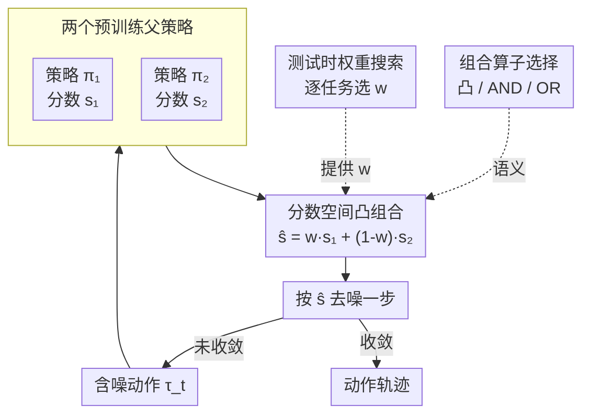

# Compose Your Policies! Improving Diffusion-based or Flow-based Robot Policies via Test-time Distribution-level Composition

**会议**: ICLR 2026  
**arXiv**: [2510.01068](https://arxiv.org/abs/2510.01068)  
**代码**: [https://sagecao1125.github.io/GPC-Site/](https://sagecao1125.github.io/GPC-Site/)  
**领域**: 图像生成  
**关键词**: 策略组合, 扩散策略, 分布级组合, 测试时搜索, 机器人操控

## 一句话总结
提出 General Policy Composition (GPC)，在测试时通过凸组合多个预训练扩散/Flow 策略的分布分数（score），无需额外训练即可产生超越任何单一父策略的更强策略，理论证明凸组合可改善单步分数误差且通过 Grönwall 界传播到全程轨迹。

## 研究背景与动机

**领域现状**：扩散策略（Diffusion Policy）已成为机器人学习中的强大策略参数化方法，能表示复杂的多模态动作分布。但其进步受限于大规模交互数据集的获取成本。

**现有痛点**：(a) 扩大模型容量需要更多数据；(b) 监督微调需要昂贵的数据收集；(c) 强化学习需要奖励工程和大量在线交互；(d) 现有策略组合方法（如 PoCo）使用固定权重，未探索任务依赖的权重搜索。

**核心矛盾**：单个策略的性能受限于其训练数据和模型容量，但组合多个策略需要理论保证——朴素平均不一定更好。

**本文目标** 在不额外训练的前提下，通过组合现有策略获得更强的策略。

**切入角度**：类比组合生成模型——在扩散模型中，多个分数函数的凸组合等价于概率密度函数的乘积，采样会偏向共识区域。

**核心 idea**：凸组合多个扩散策略的分数函数+测试时权重搜索=无训练的策略增强。

## 方法详解

### 整体框架
GPC 要解决的问题是：手头已经有几个各有所长的预训练扩散/Flow 策略，能不能在不再训练、不收集新数据的前提下，把它们拼成一个比谁都强的策略。它的答案是把"组合"放到**分数空间**里、放到**推理时**做。给定两个预训练策略 $\pi_1, \pi_2$，在去噪采样的每一步都各自算出分数估计 $s_1, s_2$，按权重凸组合成 $\hat{s}_{\text{comp}} = w_1 s_1 + w_2 s_2$，再用这个合成分数走一步去噪；如此逐步迭代直到得到干净的动作轨迹。其中权重 $w$ 不是固定常数，而是对每个任务在 $\{0.0, 0.1, \dots, 1.0\}$ 上搜出来的最优值。因为组合只发生在分数层面，两个父策略哪怕架构、视觉模态、去噪方式都不同（VA+VLA、RGB+点云、diffusion+flow-matching）也能混着组。

### 关键设计

**1. 凸分数组合的理论保证：先从数学上回答"为什么混合会比单一更好"**

GPC 不满足于经验上的"组合好像有用"，而是先把它证明出来。Proposition 4.1 考虑两个带有不同偏差和噪声的分数估计器，证明它们凸组合后的均方误差 $Q(w)$ 是权重 $w$ 的凸二次函数——既然是凸二次，最小值点必然落在内部而严格优于任一端点（即只用其中一个模型），除非两个估计器的误差完全一致。直观上，不同模型的偏差方向通常不同，按合适比例混合时偏差能相互抵消。但单步分数更好不等于整条轨迹更好，于是 Proposition 4.2 接着用 Grönwall 界证明：单步上的这点改进会沿采样过程逐步传播、不被放大破坏，最终改善的是完整动作轨迹的质量。这两条命题构成 GPC 的核心论据，把"组合比单一强"从观察上升为保证。

**2. 通用策略组合框架（GPC）：把组合统一到分数空间，从而吃下异构策略**

有了理论支撑，剩下的问题是怎么对任意两个策略做组合。GPC 把 classifier-free guidance（CFG）推广成多策略版本：

$$\hat{\epsilon}(\tau_t, t, \mathbf{c}) = \epsilon_\theta(\tau_t, t) + \sum_i w_i\big(\epsilon_\theta(\tau_t, t, \mathbf{c}_i) - \epsilon_\theta(\tau_t, t)\big)$$

也就是说，每个去噪步骤把各父策略的分数估计凸组合成 $\hat{s}_{\text{comp}} = w_1 s_1 + w_2 s_2$ 再去噪。关键在于组合发生在分数空间，而不是动作或网络层面——只要能从一个策略里提取出分数函数，哪怕它去噪步数不同、噪声调度不同、甚至是 flow-matching 而非 diffusion，都能先统一到分数空间再相加。正因如此，GPC 不要求父策略在架构、输入模态或训练数据上保持一致，可以把 VA 和 VLA、RGB 和点云输入混着组合。

**3. 测试时权重搜索：最优混合比例是任务依赖的，所以逐任务搜**

权重 $w$ 不是拍脑袋定的常数。GPC 在 $w \in \{0.0, 0.1, \dots, 1.0\}$ 上以 0.1 步长枚举这 11 个值，用验证数据上的表现挑出最优的那个。这一步揭示的事实是：即便是同样的两个父策略，不同任务也需要不同的组合比例（实测最优 $w$ 在 0.2~0.8 间大幅波动），固定权重无法通用——这正是它相对 PoCo 等固定权重方法的关键改进。代价是每个任务要额外评估 11 个权重点，但相比训练成本几乎可忽略。

**4. 替代组合算子（AND / OR）：凸组合之外，按任务需求换不同的概率语义**

凸组合是默认选择，但论文还给出两种语义不同的组合算子供按需替换。AND 组合对应分布乘积，分数直接相加 $\nabla \log p(\tau) = \nabla \log p_1(\tau) + \nabla \log p_2(\tau)$，效果是只在两个策略都认可的区域采样，适合对精度要求高的任务；OR 组合对应分布混合 $p(\tau) \propto w_1 p_1(\tau) + w_2 p_2(\tau)$，保留两个策略各自的多模态性，适合需要动作多样性的任务。三者各有适用场景，给了部署时一个可调的旋钮。

### 损失函数 / 训练策略

**零训练**。GPC 完全在推理时工作，不修改任何预训练模型的参数。唯一的搜索开销是对 11 个权重值的评估。

## 实验关键数据

### 主实验

Robomimic（6 个任务）、PushT、RoboTwin 基准：

| 设置 | 方法 | 平均成功率 |
|------|------|----------|
| DP alone | 单策略 | baseline |
| DP3 alone | 单策略 | baseline |
| **GPC (DP + DP3)** | 凸组合 | **超越两者** |

- GPC 在多数任务上超越两个父策略中较好的那个
- 真实机器人实验同样验证了一致的性能提升

### 消融实验

| 分析维度 | 关键发现 |
|---------|---------|
| 凸组合 vs AND vs OR | 凸组合通常最优；AND 在需要高精度的任务好；OR 在多模态任务好 |
| 最优权重分析 | 不同任务的最优 $w$ 差异大（0.2~0.8），验证了任务依赖性 |
| 异构组合（VA+VLA） | 可以组合完全不同架构的策略，甚至不同视觉输入 |
| 搜索粒度 | 0.1 步长已足够，更细粒度收益递减 |

### 关键发现
- 组合策略确实可以超越任何单一父策略——这是最令人惊讶的核心发现
- 最优权重高度任务依赖：固定权重无法通用
- 凸分数组合将采样导向两个策略的"共识"高密度区域，自然减少了单一策略的边缘错误
- 即使一个父策略在某任务上完全失败，组合后仍可能成功

## 亮点与洞察
- **1+1>2 的理论保证**：凸组合改善分数误差的证明（Proposition 4.1）简洁而有力——关键洞察是不同模型的偏差方向通常不同，混合可以相互抵消
- **零训练成本**：完全在推理时工作，可以即插即用地增强任何现有策略，这在实际部署中极有价值
- **异构组合的灵活性**：可以组合 VA 和 VLA、RGB 和点云输入、diffusion 和 flow-matching——只要能提取分数函数就能组合
- **与 CFG 的统一视角**：将 GPC 解释为多策略版的 classifier-free guidance，提供了清晰的概率解释

## 局限与展望
- 测试时搜索需要每个任务单独调优权重——在大量任务时搜索成本不可忽视
- 理论保证假设两个分数估计器有不同偏差，但如果两个模型在相同数据上训练，偏差可能高度相关
- 仅验证了两个策略的组合，N>2 时权重空间指数增长
- 未讨论组合后策略的安全性保证——共识区域不一定是安全的
- 实验以成功率为主指标，缺乏对组合策略动作质量（如平滑度、效率）的分析

## 相关工作与启发
- **vs PoCo (Wang et al., 2024c)**: PoCo 做约束/任务/模态级组合但使用固定权重。GPC 引入测试时搜索找任务最优权重，且对组合机制有更深入的理论分析
- **vs 模型集成**: 传统集成平均预测，GPC 在分数/分布层面组合——前者平均行为，后者聚焦共识
- **迁移思路**: 分数组合的理论和方法可直接迁移到图像/视频生成中的模型组合（如多风格扩散模型的组合生成）

## 评分
- 新颖性: ⭐⭐⭐⭐ 理论保证优雅，但组合思路在生成模型领域不算全新
- 实验充分度: ⭐⭐⭐⭐⭐ 仿真+真机，多基准多策略类型，消融全面
- 写作质量: ⭐⭐⭐⭐⭐ 理论动机→方法→实验的逻辑链非常清晰
- 价值: ⭐⭐⭐⭐ 实用性极高的"免费午餐"方法，可直接应用于现有机器人系统

<!-- RELATED:START -->

## 相关论文

- [\[ICLR 2026\] Improving Discrete Diffusion Unmasking Policies Beyond Explicit Reference Policies (UPO)](improving_discrete_diffusion_unmasking_policies_beyond_explicit_reference_polici.md)
- [\[NeurIPS 2025\] Failure Prediction at Runtime for Generative Robot Policies](../../NeurIPS2025/image_generation/failure_prediction_at_runtime_for_generative_robot_policies.md)
- [\[NeurIPS 2025\] Real-Time Execution of Action Chunking Flow Policies](../../NeurIPS2025/image_generation/real-time_execution_of_action_chunking_flow_policies.md)
- [\[ICLR 2026\] Steer Away From Mode Collisions: Improving Composition In Diffusion Models](steer_away_from_mode_collisions_improving_composition_in_diffusion_models.md)
- [\[ICLR 2026\] Test-Time Iterative Error Correction for Efficient Diffusion Models](test-time_iterative_error_correction_for_efficient_diffusion_models.md)

<!-- RELATED:END -->
