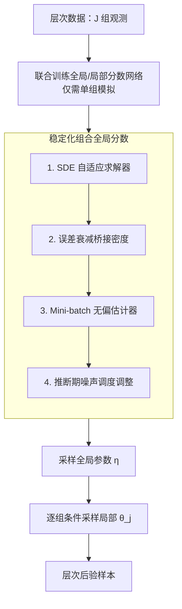

# Compositional amortized inference for large-scale hierarchical Bayesian models

**会议**: ICLR2026  
**arXiv**: [2505.14429](https://arxiv.org/abs/2505.14429)  
**代码**: 待确认  
**领域**: 图像生成  
**关键词**: amortized Bayesian inference, hierarchical model, compositional score matching, diffusion model, scalability

## 一句话总结
将组合分数匹配（CSM）扩展到层次贝叶斯模型，通过新的误差衰减估计器和 mini-batch 策略解决大量数据组下的数值不稳定问题，首次实现超过 75 万参数（25 万+ 数据组）的大规模层次模型的摊销推断，并在荧光寿命成像的真实科学应用中验证有效性。

## 研究背景与动机

**领域现状**：摊销贝叶斯推断（ABI）用神经网络学习通用后验函数，训练后对新数据零延迟采样。但扩展到层次模型是主要障碍——层次模型的训练需要为每个 batch 模拟完整的"数据集套数据集"，计算成本巨大。

**现有痛点**：(a) 直接 ABI 需要模拟 $J$ 组数据（$J$ 可达数十万），每个 batch 需要上万次模拟；(b) 现有 CSM 方法在组数 $J > 100$ 时数值不稳定——组合分数累加导致误差复合化，采样发散；(c) MCMC（如 NUTS）对大规模层次模型也不可行。

**核心矛盾**：CSM 的分治策略让训练只需单组数据模拟（高效），但推断时需要组合 $J$ 个分数估计（$J$ 大时数值爆炸）。数据组越多→分数累加项越多→近似误差复合越严重。

**本文目标** 让 CSM 在数十万组数据规模下保持数值稳定，实现大规模层次模型的摊销推断。

**切入角度**：引入误差衰减桥接密度——在高噪声区间降低组合分数的影响力，在低噪声区间恢复完整累加，同时用 mini-batch 估计器解决内存问题。

**核心 idea**：通过时变衰减函数 $d(t)$ 调制组合分数在扩散轨迹中的累积速度——高噪声时衰减（防发散）、低噪声时恢复（保正确性）。

## 方法详解

### 整体框架
这篇论文要解决的是：摊销贝叶斯推断（ABI）很难扩展到**层次模型**——层次模型把"数据集套数据集"组织起来，直接训练要为每个 batch 模拟数十万组数据，成本爆炸。组合分数匹配（CSM）的思路是分治：训练时只对**单组数据**学分数、推断时再把 $J$ 组的分数组合起来，于是训练成本不随组数 $J$ 增长；但代价是推断要累加 $J$ 个分数估计，$J$ 一大数值就发散。本文整条 pipeline 就是围绕"让这个组合在数十万组规模下不发散"展开。

具体地，模型分两层：每组各有局部参数 $\boldsymbol{\theta}_j$，所有组共享全局参数 $\boldsymbol{\eta}$。训练阶段联合学两个分数网络——局部分数 $s^{\text{local}}(\boldsymbol{\theta}_{t,j}, \boldsymbol{\eta}, \mathbf{Y}_j)$ 和全局分数 $s^{\text{global}}(\boldsymbol{\eta}_t, \mathbf{Y}_j)$，二者都只需单组模拟。推断阶段先用一个**稳定化的组合全局分数**（由下面 4 个设计协同得到）走反向 SDE 采样出全局 $\boldsymbol{\eta}$，再以 $\boldsymbol{\eta}$ 为条件逐组采样局部 $\boldsymbol{\theta}_j$，最终得到整个层次后验的样本。

### 关键设计

**1. SDE 采样器替代 Langevin 采样：把固定步长换成能自适应的求解器**

原始 CSM 用退火 Langevin 采样组合分数，问题是它步数多、对步长敏感，一旦高噪声区步长偏大就发散。本文改写反向 SDE 公式并交给自适应步长求解器：求解器会在高噪声区自动把步长缩小、在低噪声区放大，相当于把"哪里该走慢、哪里能走快"的判断交给数值器自己处理。这一步不仅减少了人工调参，还为下一个设计埋下伏笔——它暴露出误差到底集中在轨迹的哪一段。

**2. 误差衰减桥接密度：在高噪声区主动压低组合分数的影响力**

正是从自适应求解器的行为里观察到：高噪声区需要极小步长，说明分数误差在高噪声区最严重——而组合 $J$ 个分数时这些误差会被累加放大，$J$ 一大就爆炸。解法是在桥接密度里引入一个时变衰减函数 $d(t)$ 调制组合分数：

$$p_t(\boldsymbol{\eta}_t | \mathbf{Y}_{1:J}) \propto p(\boldsymbol{\eta}_t)^{(1-J)(1-t)d(t)} \prod_j p_t(\boldsymbol{\eta}_t | \mathbf{Y}_j)^{d(t)}$$

约束设计是关键：$d(0)=1$ 保证低噪声（采样末端）时恢复真实后验、不引入偏差；$d(1) \leq 1$ 让高噪声（采样起点）时组合分数的贡献被压低、防止发散。具体调度用指数衰减 $d(t) = \exp(-\ln(1/d_1) \cdot t)$，其中 $d_1$ 是可调超参数，控制高噪声端衰减多深。这样数值稳定性与最终采样的正确性兼得。

**3. Mini-batch 组合分数估计器：用随机子集顶替全量累加，但保持无偏**

当 $J > 10000$ 时，把全部 $J$ 组的分数都累加起来在内存和计算上都不可行。这里用随机抽 $M$ 组的子集来估计组合分数：

$$\hat{s}(\boldsymbol{\eta}_t) = (1-J)(1-t)\nabla \log p(\boldsymbol{\eta}_t) + \frac{J}{M}\sum_{i=1}^M s(\boldsymbol{\eta}_t, \mathbf{Y}_{j_i})$$

前缀的 $J/M$ 是关键——它把子集求和重新缩放回全量尺度，使整体成为无偏估计器（Proposition 3.1 给出证明）。Mini-batch 本身会引入方差，但和上面的误差衰减组合后，高噪声区被压低的同时方差也被一并控制住，二者是互补的。

**4. 噪声调度调整：推断时少在高噪声区停留**

既然高噪声区是误差累积最严重的区间，那就在推断阶段换一套与训练不同的噪声调度，专门压缩这段。做法是增大 cosine 调度的 shift 参数 $s$，减少落在高噪声区的采样步数，让采样轨迹尽快越过最危险的区段。这是和衰减函数协同的第二道防线——衰减压低高噪声区的影响力，调度则缩短在那里的逗留时间。

### 损失函数 / 训练策略
联合训练全局和局部分数模型（Eq. 11），使用去噪分数匹配 + likelihood weighting。训练时只需模拟单组数据→simulation 效率极高。

## 实验关键数据

### 主实验（不同方法的收敛性）

| 方法 | N=10 | N=100 | N=10K | N=100K |
|------|------|-------|-------|--------|
| Annealed Langevin | ✓ | ✗ | ✗ | ✗ |
| Euler-Maruyama | ✓ | ✗ | ✗ | ✗ |
| Probability ODE | ✓ | ✓ | ✗ | ✗ |
| GAUSS | ✓ | ✓ | ✗ | ✗ |
| **Ours (damping)** | **✓** | **✓** | **✓** | **✓** |

### 消融实验（层次 AR 模型）

| 配置 | 全局参数 RMSE | 局部参数 RMSE | 说明 |
|------|-------------|-------------|------|
| 直接 ABI（小规模） | 最优 | 最优 | 需要完整模拟 |
| CSM（无衰减） | 发散 | - | $J > 100$ 失败 |
| CSM + 衰减 | 接近直接 ABI | 接近直接 ABI | 模拟效率 <<1 次完整模拟 |

### 关键发现
- **现有 CSM 方法全部在 $N > 100$ 时失败**：Langevin、Euler-Maruyama、ODE、GAUSS 无一能处理超过 10K 数据点
- **误差衰减是解锁大规模的关键**：有衰减后 100K 数据点也能稳定收敛
- **真实应用验证**：荧光寿命成像中 $J > 250,000$ 组、$> 750,000$ 参数——首次实现如此规模的摊销层次推断
- **训练效率极高**：不需要模拟完整层次数据集，只需单组模拟→训练成本不随 $J$ 增长

## 亮点与洞察
- **分治思想的贝叶斯推断实例**：训练时分解为单组→推断时组合——避免了"数据集套数据集"的模拟爆炸
- **时变衰减的优雅设计**：$d(0)=1, d(1)\leq 1$ 确保低噪声时后验正确、高噪声时数值稳定——无偏性+稳定性的精妙平衡
- **Mini-batch 无偏性**：随机子集估计的无偏性证明简洁，与衰减组合后方差可控
- **首次突破 CSM 的规模瓶颈**：从 100 数据点 → 100,000 数据点，三个数量级的突破

## 局限与展望
- **衰减参数 $d_1$ 需要调整**：虽然可在推断时调，但最优值依赖问题规模。自适应 $d_1$ 选择是改进方向
- **分数网络对每组独立训练**：不同组之间的信息共享有限。层间信息传递可能进一步提高效率
- **仅验证了两层层次模型**：更深的层次结构（3 层+）需要递归组合，稳定性未验证
- **mini-batch 引入方差**：虽然无偏但方差随 $J/M$ 增大。自适应 mini-batch 大小可能有帮助

## 相关工作与启发
- **vs Geffner et al. (2023) CSM**：原始 CSM 用退火 Langevin 采样，$N > 10$ 就失败。本文用 SDE + 衰减突破到 $100K+$
- **vs Linhart et al. (GAUSS)**：用二阶高斯近似，限制在 100 观测点。本文通过衰减 + mini-batch 实现三个数量级的扩展
- **vs 直接 ABI（Habermann/Heinrich）**：直接 ABI 需要完整层次模拟。本文只需单组模拟，在大 $J$ 下计算优势巨大

## 评分
- 新颖性: ⭐⭐⭐⭐ 误差衰减桥接密度 + mini-batch 组合估计器的设计新颖且有理论支撑
- 实验充分度: ⭐⭐⭐⭐ 从高斯玩具→层次 AR→真实荧光成像三层验证，但缺少与更多基线的对比
- 写作质量: ⭐⭐⭐⭐ 数学推导严谨，从不稳定性分析→解决方案的叙事清晰
- 价值: ⭐⭐⭐⭐⭐ 首次使层次贝叶斯的摊销推断扩展到实际科学应用规模（75 万参数）

<!-- RELATED:START -->

## 相关论文

- [\[AAAI 2026\] HierarchicalPrune: Position-Aware Compression for Large-Scale Diffusion Models](../../AAAI2026/image_generation/hierarchicalprune_position-aware_compression_for_large-scale_diffusion_models.md)
- [\[CVPR 2026\] HiCoGen: Hierarchical Compositional Text-to-Image Generation in Diffusion Models via Reinforcement Learning](../../CVPR2026/image_generation/hicogen_hierarchical_compositional_text-to-image_generation_in_diffusion_models_.md)
- [\[ICLR 2026\] Large Scale Diffusion Distillation via Score-Regularized Continuous-Time Consistency](large_scale_diffusion_distillation_via_score-regularized_continuous-time_consist.md)
- [\[NeurIPS 2025\] Large-Scale Training Data Attribution for Music Generative Models via Unlearning](../../NeurIPS2025/image_generation/large-scale_training_data_attribution_for_music_generative_models_via_unlearning.md)
- [\[CVPR 2026\] 4KLSDB: A Large-Scale Dataset for 4K Image Restoration and Generation](../../CVPR2026/image_generation/4klsdb_a_large-scale_dataset_for_4k_image_restoration_and_generation.md)

<!-- RELATED:END -->
