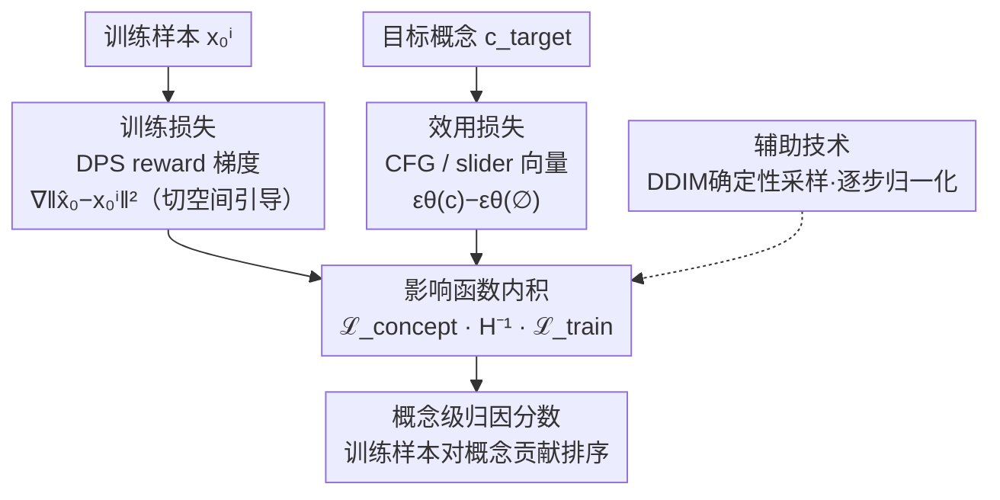

# Concept-TRAK: Understanding how diffusion models learn concepts through concept-level attribution

**会议**: ICLR2026  
**arXiv**: [2507.06547](https://arxiv.org/abs/2507.06547)  
**代码**: 待确认  
**领域**: 图像生成  
**关键词**: 扩散模型, 数据归因, concept attribution, 影响函数, copyright

## 一句话总结
提出 Concept-TRAK，通过设计概念特异的训练损失（DPS reward）和效用损失（CFG guidance），将影响函数从全图归因扩展到概念级归因，在合成、CelebA-HQ 和 AbC benchmark 上大幅超越 TRAK/D-TRAK/DAS 等方法，特别是在 OOD 组合新概念场景下优势显著。

## 研究背景与动机

**领域现状**：数据归因方法（TRAK、D-TRAK、DAS）通过影响函数估计训练样本对生成图像的贡献，用于版权检测、数据估值和模型调试。但现有方法都在全图级别归因——找到影响整张生成图像的训练样本。

**现有痛点**：实际需求是概念级归因——例如生成"铅笔画风格的皮卡丘"时，版权方（任天堂）关心的是"皮卡丘"这个概念的训练来源，不关心"铅笔画"风格。全图归因倾向于返回风格相似但概念无关的图像。

**核心矛盾**：影响函数的效用损失（utility loss）和训练损失（training loss）都基于标准去噪目标——捕获的是整体重建质量的方向，不是概念特异方向。需要新的损失函数设计来隔离概念特异的影响。

**本文目标** 定义并实现概念级数据归因——量化每个训练样本对扩散模型学习特定概念（风格、物体、属性）能力的贡献。

**切入角度**：几何动机——概念相关方向是扩散模型潜空间数据流形的切向量。reward optimization 的梯度 $\nabla_{x_t} R(x_t)$ 作为概念特异的引导方向，精确指向切空间中的概念增强区域。

**核心 idea**：用 DPS reward 梯度作为训练损失（捕获训练样本的影响方向）+ CFG guidance 作为效用损失（捕获目标概念方向），二者在影响函数框架下的内积度量训练数据对概念学习的贡献。

## 方法详解

### 整体框架
Concept-TRAK 想回答的是"哪些训练样本教会了模型某个**概念**"，而不是传统数据归因问的"哪些训练样本影响了这**整张图**"。它完全套用 TRAK 的影响函数框架——训练样本 $x_0^i$ 对目标概念 $c_{\text{target}}$ 的影响写成两个梯度通过 Hessian 逆相连的内积：

$$\mathcal{I}(x_0^i, c_{\text{target}}) = \nabla_\theta \mathcal{L}_{\text{concept}}^\top \mathbf{H}^{-1} \nabla_\theta \mathcal{L}_{\text{train}}.$$

框架没变，变的是两端的损失。TRAK 系列方法在这两端都用标准去噪目标，梯度方向编码的是"整体重建质量"；而要做概念归因，必须让训练损失 $\mathcal{L}_{\text{train}}$ 的梯度只指向"某个训练样本特有的影响方向"，让效用损失 $\mathcal{L}_{\text{concept}}$ 的梯度只指向"目标概念方向"。论文的核心工作就是把这两个损失重新设计成 reward 驱动的形式，使两端的梯度都落在数据流形的切空间里。整体看是一个**双路汇合**结构：训练样本一路、目标概念一路，各自走 reward 梯度得到切空间方向，最后在影响函数里求内积得到概念级归因分数，辅助技术则负责让这条管线稳定可复现。

### 关键设计

**1. 训练损失：用 DPS reward 梯度替代去噪信号，隔离单个样本的影响方向**

标准去噪损失捕获的是重建整张图的方向，对"某个训练样本特有贡献"并不敏感。这里改用扩散后验采样（DPS）的视角：定义 reward $R_{\text{train}}(x_t) = \log p(x_0^i | \hat{x}_0)$，其中 $\hat{x}_0 = \mathbb{E}[x_0|x_t]$ 是后验均值。在高斯假设下，该 reward 的梯度化简为 $\nabla_{x_t} \|\hat{x}_0 - x_0^i\|^2$，DPS 理论保证这个梯度作用在数据流形的切空间上——也就是说它给出的是"把生成往 $x_0^i$ 这个样本拉"的切向引导，而非全局重建方向。把这个引导项叠加到去噪预测上、再以 stop-gradient 形式回归，得到最终训练损失：

$$\mathcal{L}_{\text{train}} = \mathbb{E}_{x_t}\big[\|\text{sg}[\epsilon_\theta(x_t;c) + \lambda_t \nabla_{x_t}\|\hat{x}_0 - x_0^i\|^2] - \epsilon_\theta(x_t;c)\|^2\big].$$

相比标准 DSM 损失提供的"重建驱动"信号，这个切空间引导向量对概念归因更稳定、噪声更小。

**2. 效用损失：把目标概念的 reward 梯度化简成 CFG 向量**

归因的另一端要回答"模型生成目标概念 $c_{\text{target}}$ 的能力有多强"，于是定义概念 reward $R_{\text{concept}}(x_t) = \log p(c_{\text{target}} | x_t)$。关键观察是：当 $c_{\text{target}}$ 本身能作为条件喂给模型时，这个 reward 的梯度恰好化简为 classifier-free guidance 向量 $\epsilon_\theta(x_t; c_{\text{target}}) - \epsilon_\theta(x_t)$。对那些嵌在复合条件里、无法单独拎出来的概念，则改用 concept slider guidance $\epsilon_\theta(x_t; c) - \epsilon_\theta(x_t; c_{-})$，其中 $c_{-}$ 是把目标概念抠掉后的条件，两者之差正好分离出该概念的方向。这一步之所以成立，是因为 CFG 向量已被证明在数据流形切空间中编码概念信息——它和训练损失端用的切空间引导落在同一几何框架里，所以两端的内积才有"概念级影响"的含义，而不只是过去那种"引导生成"的用法。

**3. 辅助技术：确定性采样、双粒度归因与逐步归一化**

三个工程细节让上述损失真正可用。其一，用 **DDIM 反演做确定性采样**，消除前向扩散的随机性，使每次查询的梯度可复现、更稳定。其二，区分**全局与局部归因**：全局归因检查某概念在所有生成中的训练来源，局部归因则只看某一张特定生成图里这个概念的来源，对应不同的审计粒度。其三，**逐时间步梯度归一化**——把每个时间步的梯度归一化为单位范数，避免少数时间步因梯度幅值大而主导归因分数，顺带让方法对超参数 $\beta, \sigma_{\text{data}}$ 不敏感。

### 损失函数 / 训练策略
无需训练——Concept-TRAK 是 training-free 的归因方法。只需在 TRAK 框架下为训练集预计算投影梯度，查询时再用上面概念特异损失的梯度即可。

## 实验关键数据

### 主实验（概念级归因 Precision@10）

| 方法 | Synthetic ID | Synthetic OOD | CelebA ID | CelebA OOD |
|------|-------------|---------------|-----------|------------|
| TRAK | 0.80 | 0.45 | - | - |
| D-TRAK | 1.00 | 0.50 | - | - |
| DAS | 1.00 | 0.50 | 0.96 | 0.67 |
| **Concept-TRAK** | **1.00** | **0.85** | **0.92** | **0.97** |

### 消融实验（AbC Benchmark, T2I 模型）

| 配置 | AbC 指标 | 说明 |
|------|---------|------|
| TRAK（全图归因） | 低 | 返回风格相似图像 |
| D-TRAK | 中等 | 仍然全图级别 |
| Unlearning-based | 中等 | 高计算成本 |
| **Concept-TRAK** | **最优** | 精准概念归因 |

### 关键发现
- **OOD 场景是核心区分点**：ID 场景中全图归因恰好也能找到概念（因为存在视觉相似的训练样本），但 OOD 场景中模型组合了从未共现的概念→全图归因失败，Concept-TRAK 仍能正确归因
- **CelebA OOD 中 Concept-TRAK 0.97 vs DAS 0.67**：30 分的差距说明概念级损失设计至关重要
- **CFG 向量作为效用损失的有效性**：证实了 CFG 向量确实编码概念特异方向，不仅可用于引导生成，还可用于归因
- **DPS reward 比 DSM 更稳定**：切空间引导 vs 全局重建——前者对概念归因的噪声更小

## 亮点与洞察
- **定义了新任务：概念级数据归因**：从全图归因到概念归因是质的飞跃——直接对应版权检测、安全审计等实际需求。这个问题定义本身是贡献
- **reward optimization 的归因视角**：DPS/CFG 的 reward 梯度不仅可以引导采样，还可以精确刻画概念影响方向——为扩散模型的可解释性打开新窗口
- **几何框架优雅**：切空间→reward梯度→概念方向的推导链条，将影响函数、扩散模型几何、reward optimization 三个领域连接起来
- **OOD 评估设计巧妙**：故意排除特定概念组合→强制模型组合→测试归因是否能分离各概念——这比简单的 ID 测试更有说服力

## 局限与展望
- **概念必须可作为条件输入**：当概念不能表达为文本条件（如抽象风格、构图规则）时，需要更通用的概念表达。论文在附录中讨论了视觉概念的扩展但未充分验证
- **计算成本**：需要为训练集预计算所有样本的投影梯度——对百万级训练集（如 LAION）仍然昂贵
- **只验证了小规模模型**：Synthetic 和 CelebA 上的模型较小。Stable Diffusion / DALL-E 级别的验证只在 AbC benchmark 上有限进行
- **改进方向**：(a) 图像 token 级别的概念定位（不仅知道哪些训练样本贡献概念，还知道贡献了图像的哪个区域）；(b) 结合 concept erasing 做精准概念卸载

## 相关工作与启发
- **vs TRAK/D-TRAK/DAS**：它们都是全图归因，用标准去噪损失或其变体。Concept-TRAK 的核心创新是设计概念特异的训练/效用损失函数
- **vs Unlearning-based 归因**：通过删掉训练数据 retrain 评估影响——最准确但最昂贵。Concept-TRAK 用影响函数近似，效率高几个数量级
- **vs Concept Sliders**：Concept Sliders 操控 CFG 向量编辑概念，Concept-TRAK 用同样的 CFG 向量做概念归因——两个方向的统一

## 评分
- 新颖性: ⭐⭐⭐⭐⭐ 定义新任务（概念级归因）+ 几何动机下的 reward-based 损失设计 = 双重创新
- 实验充分度: ⭐⭐⭐⭐ 合成+CelebA+AbC 三层评估，OOD 设计巧妙，但缺少大规模 T2I 模型系统验证
- 写作质量: ⭐⭐⭐⭐⭐ 从问题定义→几何动机→reward 推导→实证验证的叙事线极为流畅
- 价值: ⭐⭐⭐⭐⭐ 对 AI 版权保护和模型透明度有直接且紧迫的应用价值

<!-- RELATED:START -->

## 相关论文

- [\[AAAI 2026\] Mass Concept Erasure in Diffusion Models with Concept Hierarchy](../../AAAI2026/image_generation/mass_concept_erasure_in_diffusion_models_with_concept_hierarchy.md)
- [\[ICLR 2026\] Localized Concept Erasure in Text-to-Image Diffusion Models via High-Level Representation Misdirection](localized_concept_erasure_in_text-to-image_diffusion_models_via_high-level_repre.md)
- [\[CVPR 2026\] Erasing Thousands of Concepts: Towards Scalable and Practical Concept Erasure for Text-to-Image Diffusion Models](../../CVPR2026/image_generation/erasing_thousands_of_concepts_towards_scalable_and_practical_concept_erasure_for.md)
- [\[CVPR 2026\] Beyond Text Prompts: Precise Concept Erasure through Text–Image Collaboration](../../CVPR2026/image_generation/beyond_text_prompts_precise_concept_erasure_through_text-image_collaboration.md)
- [\[ICCV 2025\] Erasing More Than Intended? How Concept Erasure Degrades the Generation of Non-Target Concepts](../../ICCV2025/image_generation/erasing_more_than_intended_how_concept_erasure_degrades_the_generation_of_non-ta.md)

<!-- RELATED:END -->
