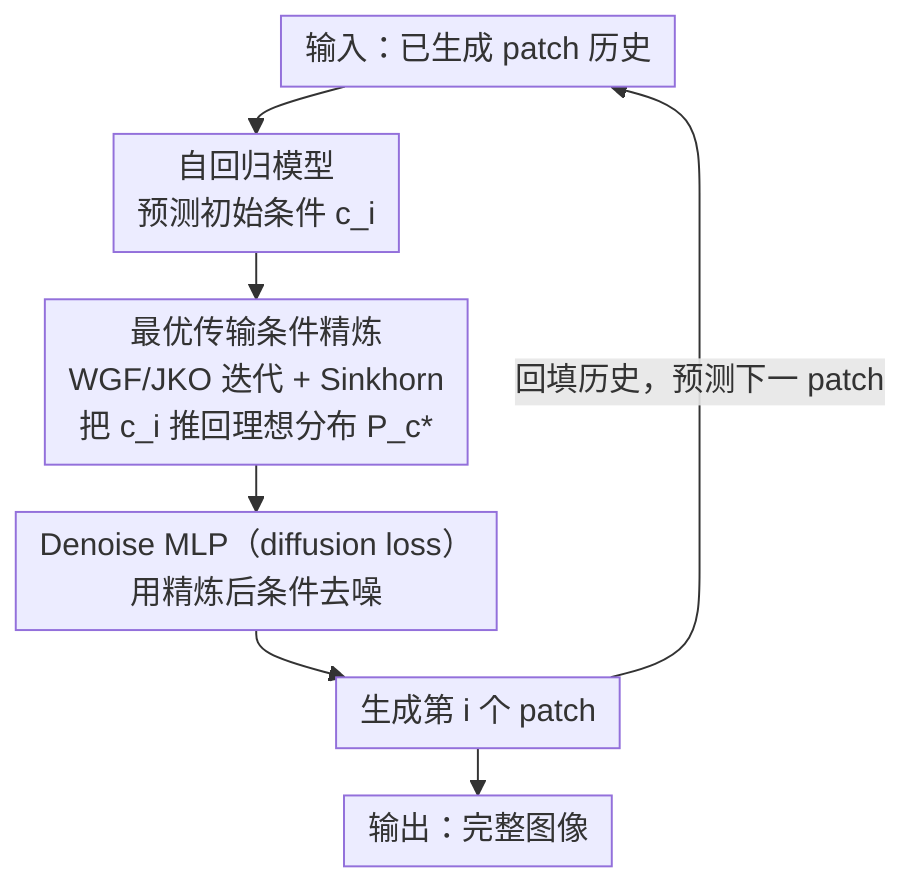

# Condition Errors Refinement in Autoregressive Image Generation with Diffusion Loss

**会议**: ICLR 2026  
**arXiv**: [2602.07022](https://arxiv.org/abs/2602.07022)  
**代码**: 无  
**领域**: 扩散模型 / 自回归图像生成  
**关键词**: autoregressive generation, diffusion loss, condition refinement, optimal transport, Wasserstein gradient flow

## 一句话总结
理论分析了自回归扩散损失模型相比条件扩散模型在条件误差修正上的优势（梯度范数指数衰减），并提出基于最优传输（Wasserstein Gradient Flow）的条件精炼方法来解决自回归过程中的"条件不一致性"问题，在 ImageNet 上达到 FID 1.31（基于 MAR）。

## 研究背景与动机

**领域现状**：自回归图像生成近年发展迅速，MAR 等方法用 diffusion loss 替代 VQ tokenization，在图像生成质量上接近甚至超越扩散模型。但自回归 + diffusion loss 与标准条件扩散模型的理论差异尚未被充分研究。

**现有痛点**：自回归条件生成虽然逐步构建上下文，但每一步的条件 $c_i$ 除了包含对当前 patch 有用的信息外，还会累积无关的、来自前序 patch 的冗余信息（"条件不一致性"）。这些冗余信息会扰动去噪过程的条件得分 $\nabla_{x_t} \log p(x_t|c_i)$，降低生成质量。

**核心矛盾**：自回归方法通过上下文积累来捕获依赖关系，但上下文中不可避免地混入了与当前 patch 生成无关的噪声信息。如何在保留有用依赖的同时去除冗余？

**本文目标** (a) 理论上刻画自回归 diffusion loss 相比条件扩散的优势在哪 (b) 分析条件不一致性的形成机制 (c) 提出有理论保证的条件精炼方法

**切入角度**：从条件得分匹配的理论分析出发，证明自回归过程本身就有条件精炼效果（梯度范数指数衰减），再用最优传输理论进一步修正残余的条件不一致性。

**核心 idea**：自回归条件生成天然具有条件误差衰减特性，但仍有条件不一致性问题，用 Wasserstein Gradient Flow 做条件精炼可以保证收敛到理想条件分布。

## 方法详解

### 整体框架

这是一篇"理论先行、再落地一个模块"的论文。它要解决的问题是：MAR 这类「自回归 + diffusion loss」的图像生成器，每一步用前序 patch 攒出来的条件 $c_i$ 里，除了对当前 patch 有用的信息，还混着一堆与当前生成无关的冗余——论文称之为"条件不一致性"，它会扰动去噪的条件得分、拉低图像质量。

论文先在理论上回答两件事：(1) 为什么自回归 diffusion loss 本身就比全局条件扩散更抗这种冗余（**条件误差衰减**，条件梯度范数随 patch 序号指数衰减）；(2) 但衰减到不了零，残余冗余从哪来、怎么分解（**条件不一致性**）。这两步分析锁定了"残余冗余"这个靶子，再据此往运行时管线里插入唯一的新模块——**最优传输条件精炼**：在自回归预测出初始条件后、送进去噪器之前，用 Wasserstein 梯度流把条件分布推回理想分布，把残余冗余抹掉，然后照常逐 patch 去噪、回填历史。整条生成管线如下（理论分析是它的依据，框架图只画运行时结构）：

理论上的两块分析（误差衰减、不一致性分解）不是管线里的处理节点，而是支撑"为什么要做最优传输精炼"的依据，因此不画进图里；图中真正新增的贡献节点只有一个：**最优传输条件精炼**。

### 关键设计

**1. 条件误差衰减分析：先证明"自回归本身就在做条件精炼"**

这一块回答的是"为什么自回归 + diffusion loss 会优于全局条件扩散"。论文在标准的马尔可夫性和高斯噪声假设下定义条件误差项 $\epsilon_c$，用它量化"加上条件"对得分函数的扰动有多大。第一个结论（Theorem 1）是条件得分匹配损失构成无条件得分匹配损失的上界，意味着条件化只会让得分估计更难、不会更容易。真正关键的是第二个结论（Theorem 2）：随着自回归一步步往后走，条件梯度的范数会指数衰减，

$$\|\nabla_{x_t} \log p_t(x_t|c_i)\| \leq M\beta^i + m,\quad \beta \in (0,1)$$

其中 $i$ 是 patch 的序号。也就是说越往后生成，前序条件对当前去噪的影响越小，最终收敛到一个与序号无关的平稳值 $m$。这正好说明逐 patch 生成天然带有"条件精炼"效果——每一步都在把无关的历史信息按指数速率淡出，这是 MAR 这类方法即便没有全局注意力也能生成高质量图像的根本原因。

**2. 条件不一致性分解：找出残余的冗余信息从哪来**

指数衰减虽好，但 $\beta^i$ 永远到不了零，残余的冗余始终存在。Lemma 6 把这个"条件不一致性"形式化：每个条件 $c_i$ 可以分解成理想条件 $c_i^* = \pi_{\mathcal{I}_i^*}(c_i)$ 和冗余分量 $\eta_i = c_i - c_i^*$，前者是把 $c_i$ 投影到"对当前 patch 最小充分"的信息子空间后剩下的有用部分，后者就是与当前生成无关的噪声。论文进一步指出冗余的能量 $\mathbb{E}[\|\eta_i\|_2^2]$ 由两部分构成：一部分是前序条件里的冗余顺着自回归链传播过来，另一部分是这一步新注入的噪声。这个分解揭示了自回归条件精炼"有效但不完美"——冗余会持续累积，所以光靠自回归本身不够，还需要一个额外的修正手段，这就把靶子交给了下面的最优传输精炼。

**3. 最优传输条件精炼：用 Wasserstein 梯度流把条件推回理想分布，再用 Sinkhorn 算得动**

这是管线里唯一新增的运行时模块，专门对付上面残余的 $\eta_i$。论文把"精炼条件"建模成 Wasserstein 空间上的梯度流优化（Proposition 2 + Theorem 3），目标是最小化能量泛函

$$\mathcal{F}(P_c) = W_2^2(P_c, P_{c^*}) + \lambda \, \mathbb{E}_{c \sim P_c}\big[\|c - \mathcal{T}^{-1}(x)\|^2\big]$$

第一项用 2-Wasserstein 距离把当前条件分布 $P_c$ 往理想分布 $P_{c^*}$ 推，第二项是逆过程正则化，用来抵消信息累积。这里选最优传输而不是 KL 散度是有讲究的：OT 衡量的是把一个分布"搬运"成另一个分布的代价，即使两个分布支撑集几乎不重叠也能给出有意义的梯度，而 KL 在这种情况下会发散。优化通过 JKO 迭代离散化，并且有指数收敛保证 $W_2(P_c^{(k)}, P_{c^*}) \leq \rho^k W_2(P_c^{(0)}, P_{c^*})$（$\rho<1$），即每迭代一步距理想分布的距离都按比例缩小。

但直接求解 Wasserstein 距离对应的最优传输是 NP-hard 的，没法塞进每步生成里，所以论文给它加上熵正则化、改写成

$$\inf_\gamma \, \mathbb{E}_{(c,c')}[\|c - c'\|^2] + \epsilon \, \text{KL}(\gamma|\pi)$$

再用 Sinkhorn 迭代求解：熵正则化让目标变成严格凸、可用矩阵缩放快速收敛，整体复杂度降到 $O(n^2)$，这才让 WGF 精炼在实际的逐 patch 生成中真正算得动。

### 损失函数 / 训练策略

- 基础框架用 MAR 的 diffusion loss（cosine 噪声调度，1000 步）
- 学习率 $1 \times 10^{-5}$，400 epochs，batch size 2048
- 100 epoch 线性学习率预热
- EMA 动量 0.9999
- VAE 用 LDM 的 KL-16

## 实验关键数据

### 主实验

| 方法 | FID ↓ | IS ↑ | Precision ↑ | Recall ↑ |
|------|-------|------|-------------|----------|
| MAR (943M) | 1.55 | 303.7 | 0.81 | 0.62 |
| De-MAR | 1.47 | 305.8 | 0.83 | 0.62 |
| RAR | 1.50 | 306.9 | 0.80 | 0.62 |
| **Ours (MAR)** | **1.31** | **324.2** | 0.81 | **0.63** |
| Ours (AR) | 1.52 | 317.6 | 0.82 | 0.60 |
| Baseline (CDM) | 3.26 | 259.6 | 0.81 | 0.58 |
| Baseline (AR) | 2.02 | 282.6 | 0.80 | 0.59 |

### 消融实验（可扩展性）

| 模型大小 | MAR FID | Ours FID | MAR IS | Ours IS |
|---------|---------|----------|--------|---------|
| 208M | 2.31 | **1.96** | 281.7 | **290.5** |
| 479M | 1.78 | **1.59** | 296.0 | **301.5** |
| 943M | 1.55 | **1.31** | 303.7 | **324.2** |

**ImageNet 512×512:**

| 方法 | FID ↓ | IS ↑ |
|------|-------|------|
| MAR | 1.73 | 279.9 |
| **Ours** | **1.58** | **302.3** |

### 关键发现
- OT 条件精炼在所有模型大小上都一致提升性能，且模型越大提升越明显（208M: -0.35 FID → 943M: -0.24 FID，但绝对值更优）
- 去噪过程分析显示本方法在后期去噪阶段 SNR 更高、噪声强度更低，说明条件精炼确实在起作用
- 自回归基线（AR）本身就显著优于条件扩散基线（CDM），验证了理论分析（3.26 → 2.02）
- 高分辨率 512×512 上同样有效

## 亮点与洞察
- **理论与实践结合好**：不是拍脑袋设计方法，而是先理论分析自回归 diffusion loss 的优势（条件梯度指数衰减），再识别残余问题（条件不一致性），最后用 OT 理论解决。分析—发现—解决的逻辑链清晰。
- **Wasserstein Gradient Flow 做条件精炼**是一个有趣的视角，可以迁移到任何需要"修正条件分布"的场景，比如条件生成中的 guidance 优化、prompt engineering 的形式化等。
- **自回归天然做条件精炼**的发现本身就有价值——解释了为什么 MAR 等方法虽然没有全局注意力也能生成高质量图像。

## 局限与展望
- OT 精炼模块增加了推理开销（Sinkhorn 迭代），但论文没有报告推理速度对比
- 理论分析基于大量简化假设（高斯分布、小方差、有界二阶导等），实际深度网络是否严格满足存疑
- 只在 ImageNet 上验证，缺乏文本到图像等更复杂任务的实验
- 理想条件分布 $P_{c^*}$ 在实际中如何获取/近似未充分讨论
- 与 De-MAR、RAR 的对比不够充分（如参数量、训练成本是否一致）

## 相关工作与启发
- **vs MAR**: 直接在 MAR 基础上加 OT 条件精炼，FID 从 1.55 降到 1.31，IS 从 303.7 升到 324.2。说明 MAR 的条件确实有改进空间。
- **vs 条件扩散模型 (CDM)**: 理论和实验都说明自回归 diffusion loss 优于全局条件扩散（FID 2.02 vs 3.26）。
- **vs RAR/De-MAR**: 都是改进自回归图像生成的方法，本文从条件精炼角度切入，与它们互补。

## 评分
- 新颖性: ⭐⭐⭐⭐ 理论分析视角新颖，OT 条件精炼有创意，但方法本身（Sinkhorn + JKO）是已有工具的组合
- 实验充分度: ⭐⭐⭐ 主实验充分但缺少推理速度、训练成本、T2I 等实验
- 写作质量: ⭐⭐⭐⭐ 理论推导严谨清晰，但符号较多，阅读门槛高
- 价值: ⭐⭐⭐⭐ 对自回归图像生成的理论理解有贡献，OT 精炼方法实用且可迁移

<!-- RELATED:START -->

## 相关论文

- [\[ICLR 2026\] From Prediction to Perfection: Introducing Refinement to Autoregressive Image Generation](from_prediction_to_perfection_introducing_refinement_to_autoregressive_image_gen.md)
- [\[ICLR 2026\] Autoregressive Image Generation with Randomized Parallel Decoding](autoregressive_image_generation_with_randomized_parallel_decoding.md)
- [\[ICLR 2026\] Visual Autoregressive Modeling for Instruction-Guided Image Editing](visual_autoregressive_modeling_for_instruction-guided_image_editing.md)
- [\[ICLR 2026\] Bridging Degradation Discrimination and Generation for Universal Image Restoration](bridging_degradation_discrimination_and_generation_for_universal_image_restorati.md)
- [\[ICLR 2026\] SSG: Scaled Spatial Guidance for Multi-Scale Visual Autoregressive Generation](ssg_scaled_spatial_guidance_for_multi-scale_visual_autoregressive_generation.md)

<!-- RELATED:END -->
