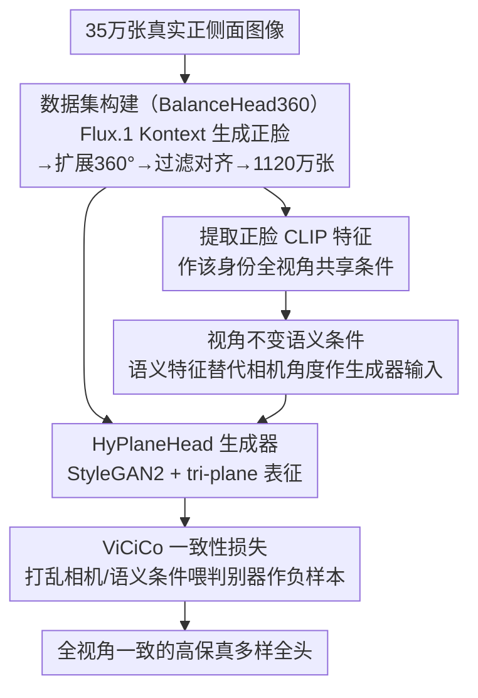

# Condition Matters in Full-head 3D GANs

**会议**: ICLR2026  
**arXiv**: [2602.07198](https://arxiv.org/abs/2602.07198)  
**代码**: [https://lhyfst.github.io/balancehead/](https://lhyfst.github.io/balancehead/)  
**领域**: 其他  
**关键词**: 3D-aware GAN, full-head generation, semantic conditioning, view conditioning, synthetic data

## 一句话总结
发现全头 3D GAN 中视角条件导致严重方向偏差（条件视角生成质量远优于其他视角），提出用视角不变的语义特征（正脸 CLIP 特征）替代视角作为条件，配合 Flux.1 Kontext 合成的 1120 万张 360° 平衡数据集，首次实现全视角一致的高保真多样全头生成。

## 研究背景与动机

**领域现状**：3D-aware GAN（EG3D、PanoHead、SphereHead、HyPlaneHead）使用 tri-plane 表征生成 3D 头部。它们继承了 EG3D 的视角条件策略——以相机角度作为生成器条件。

**现有痛点**：(a) **方向偏差**——视角条件导致生成器在条件视角上质量远优于其他视角，全局不一致（图 2d-i）；(b) 推理时被迫固定正脸条件以确保正面质量→牺牲了背部多样性；(c) **数据不平衡**——野外采集的数据在不同视角间质量/数量/多样性分布极不均匀；(d) 完全去掉条件会导致 mode collapse，训练不可行。

**核心矛盾**：全头 GAN 需要条件来稳定训练（无条件会崩溃），但视角条件引入了方向偏差。需要一种视角不变的条件机制。

**本文目标** 设计视角不变的条件策略 + 构建视角平衡的数据集，使全头 GAN 在所有视角上都能高质量生成。

**切入角度**：用正脸的 CLIP 图像特征作为共享语义条件——同一人的所有视角共享同一条件，解耦生成能力与视角方向。

**核心 idea**：将 3D-aware GAN 从"视角条件"转向"语义条件"——用正面 CLIP 特征替代相机角度作为生成器输入，消除方向偏差。

## 方法详解

### 整体框架
这篇论文要解决全头 3D GAN 里一个被忽视的病根：用相机视角当生成器条件，会让模型只在"条件视角"上学得好、其他视角质量崩。整套方案分两步走。第一步是把训练数据换掉——构建 BalanceHead360 数据集，用 Flux.1 Kontext 把正面真实图像扩展成 360° 全视角合成图（共 1120 万张），同时给每个人提取一个正脸 CLIP 特征，作为这个人所有视角共享的统一条件标签。第二步是把条件机制换掉——在 HyPlaneHead 架构上训练一个语义条件 3D-aware GAN，用这个视角无关的正脸语义特征替代相机角度作生成器输入，再叠加一个 ViCiCo 一致性损失，最终让所有朝向的生成质量都被拉齐。

### 关键设计

**1. BalanceHead360 数据集构建：用 2D 生成模型造一套视角均匀的千万级数据**

野外采集的头部数据天然在各视角间分布不均——正脸又多又清晰，背面又少又糊，这本身就是方向偏差的另一半成因。本文索性用合成数据保证视角均匀。流程是：从约 35 万张真实正侧面图像出发，先经 HyperIQA 做质量筛选，用 Flux.1 Kontext 生成规整正脸，再用 Flux.1 Kontext 配不同视角 prompt 把正脸扩展成多视角图像，随后用 Qwen2.5-VL 过滤伪影、VGGHeads 估计姿态、ArcFace 做身份匹配，最终得到 1120 万张 360° 全头图像。同一身份的正脸只算一次 CLIP 图像特征，作为这个人全部多视角图共享的条件标签——数据和条件因此都在各视角上分布均匀。值得一提的是，2D 生成模型并不保证严格的 3D 一致性，但实测发现 3D-aware GAN 靠对抗训练加 tri-plane 表征能自然过滤掉这些不一致的 2D 伪影——所以"2D 数据不够 3D 一致"在这里不构成障碍。

**2. 视角不变语义条件：用正脸 CLIP 特征锚定，把生成能力和视角朝向解耦**

方向偏差的根源在于条件里带了视角信息：相机角度一旦进生成器，模型就会把"画得好"和"某个朝向"绑死。本文把生成器的条件输入从相机角度换成上一步提取的正脸 CLIP 特征——一个人 360° 所有视角的生成都用同一个特征当条件。条件里完全不含朝向信息，于是生成能力和视角被彻底解耦，模型再没有理由偏袒某个角度。选正脸而不是别的视角，是因为正脸携带最全面的语义信息——面部特征、发型、服装都看得最清楚，是最稳的"身份锚点"。这里有个关键取舍：你没法从单张图里把视角信息抹掉（不同视角本就包含不同的视觉内容），但你可以把所有视角统一锚定到同一个参考视角的语义上，绕开了"去视角"这个不可能完成的任务。

**3. ViCiCo 损失（View-image and Condition-image Consistency）：防多面孔伪影、逼输出贴住语义条件**

光换条件还不够，生成器可能学到几个少数模式就停滞，或冒出多张脸拼一起的伪影。ViCiCo 的做法是在判别器侧造负样本：随机打乱相机标签和/或语义条件，把这些"错配"的图像-条件对当作假样本喂给判别器，

$$\mathcal{L}_{\text{ViCiCo}} = \log\bigl(1 - D((I^+, I, I^m), (r_{\text{cam}}', c_{\text{sem}}'))\bigr)$$

其中 $r_{\text{cam}}'$、$c_{\text{sem}}'$ 是被打乱后的相机标签与语义条件。判别器学会识破错配，反过来就逼着生成器让输出严格遵循真实的语义分布，而不是学几个模式就收手——这也是后面"数据越大效果越好"的机制来源。

### 损失函数 / 训练策略
整体基于 HyPlaneHead（StyleGAN2 backbone + hybrid plane 表征）搭建。训练用 8 × H20 GPU、batch=32，跑 10 天，共处理 3200 万张图像。

## 实验关键数据

### 主实验（FID 评估）

| 条件方式 | ViCiCo | FID-view ↓ | FID-random ↓ | FID-front ↓ |
|---------|--------|-----------|-------------|------------|
| 视角条件 | ✗ | 9.67 | 13.82 | 8.42 |
| 视角+语义条件 | ✗ | 8.63 | 46.24 | 5.90 |
| 语义条件 | ✗ | - | 4.45 | 4.11 |
| **语义条件** | **✓** | **-** | **3.67** | **3.51** |

### 消融实验

| 配置 | 结果 | 说明 |
|------|------|------|
| 无条件 | 训练崩溃 | 早期 mode collapse |
| 训练中途去条件 | ~1000k 图像后崩溃 | 条件是必需的 |
| 语义条件 + ViCiCo | FID-random 3.67 | 全视角一致、最优 |

### 关键发现
- **方向偏差严重**：视角条件下 FID-random (13.82) 远高于 FID-view (9.67)，非条件视角质量显著下降
- **语义条件彻底消除偏差**：FID-random 从 13.82 降到 3.67——所有视角生成质量一致
- **2D 合成数据训练 3D-aware GAN 有效**：Flux.1 Kontext 多视角数据不严格 3D 一致，但 GAN 天然鲁棒
- **FID-front 也改善**：8.42 → 3.51，语义条件+更大数据量带来全面提升

## 亮点与洞察
- **"条件决定了生成空间的结构"**：改变条件方式就能根本改变 GAN 学到的 3D 空间——被忽视但极其重要的设计选择
- **2D 生成模型 × 3D-aware GAN 的协同**：利用 2D 模型强大生成能力生产训练数据，3D GAN 自然过滤 2D 不一致——"不一致容忍"的新范式
- **语义条件促进持续学习**：对抗训练容易停滞，语义条件迫使生成器跟随数据分布→规模越大效果越好
- **1120 万张合成数据**：400 × A10 GPU 运行 26 天——突破了全头数据瓶颈

## 局限与展望
- **依赖 Flux.1 Kontext**：数据质量受限于 2D 生成模型能力和偏差
- **仅用 CLIP 特征**：可能丢失细粒度信息，DINOv2 或多模态编码可能更好
- **训练成本极高**：复现困难
- **未探索动态表情**：扩展到说话头/表情生成是重要方向

## 相关工作与启发
- **vs PanoHead/SphereHead/HyPlaneHead**：都用视角条件，继承了方向偏差。本文首次系统分析并解决
- **vs SOAP**：SOAP 收集 24k 3D 模型渲染——身份有限。本文用 35 万身份扩展到千万级
- **vs 3DGH**：分别建模头部和头发减少前后差异，本文从根源解决

## 评分
- 新颖性: ⭐⭐⭐⭐⭐ insight 简单但深刻，范式级设计改变
- 实验充分度: ⭐⭐⭐⭐⭐ 1120 万数据集、3 种 FID 指标、详尽消融
- 写作质量: ⭐⭐⭐⭐⭐ 方向偏差可视化极有说服力
- 价值: ⭐⭐⭐⭐⭐ 对 3D 头部生成有范式级影响

<!-- RELATED:START -->

## 相关论文

- [\[ICML 2026\] Scalable GANs with Transformers](../../ICML2026/image_generation/scalable_gans_with_transformers.md)
- [\[ICLR 2026\] Factuality Matters: When Image Generation and Editing Meet Structured Visuals](factuality_matters_when_image_generation_and_editing_meet_structured_visuals.md)
- [\[ICLR 2026\] PI-Light: Physics-Inspired Diffusion for Full-Image Relighting](pi-light_physics-inspired_diffusion_for_full-image_relighting.md)
- [\[ECCV 2024\] Distilling Diffusion Models into Conditional GANs](../../ECCV2024/image_generation/distilling_diffusion_models_into_conditional_gans.md)
- [\[ICLR 2026\] Condition Errors Refinement in Autoregressive Image Generation with Diffusion Loss](condition_errors_refinement_in_autoregressive_image_generation_with_diffusion_lo.md)

<!-- RELATED:END -->
