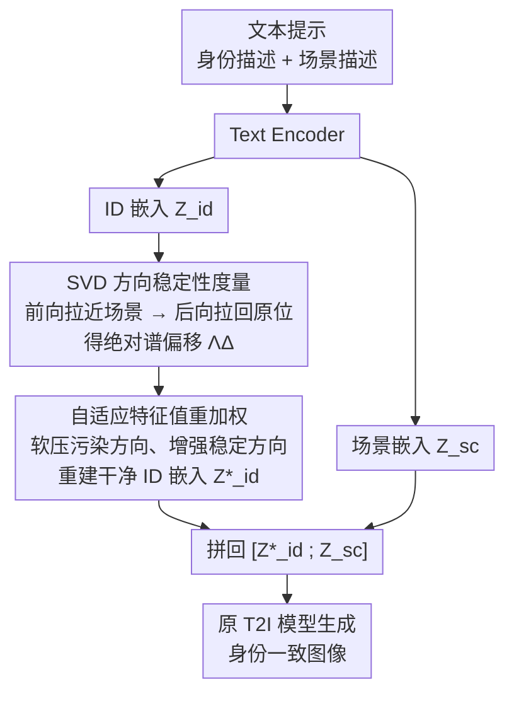

# Consistent Text-to-Image Generation via Scene De-Contextualization

**会议**: ICLR 2026  
**arXiv**: [2510.14553](https://arxiv.org/abs/2510.14553)  
**代码**: [https://github.com/tntek/SDeC](https://github.com/tntek/SDeC)  
**领域**: 扩散模型 / 一致性生成  
**关键词**: consistent T2I, identity preservation, scene contextualization, SVD, training-free, prompt embedding

## 一句话总结
揭示 T2I 模型中 ID 偏移的根本原因是"场景上下文化"（scene contextualization，场景 token 对 ID token 注入上下文信息），并提出 training-free 的 Scene De-Contextualization (SDeC) 方法，通过 SVD 特征值的方向稳定性分析识别并抑制 prompt embedding 中潜在的场景-ID 关联，实现逐场景的身份一致性生成。

## 研究背景与动机

**领域现状**：一致性 T2I 生成要求同一主体在不同场景下保持身份一致。现有方法（ConsiStory、1P1S 等）通常需要事先知道所有目标场景，或者需要训练/微调模型。

**现有痛点**：(a) 假设所有目标场景预先可用在实际中不现实（电影/游戏制作中场景是迭代确定的）；(b) 训练类方法需要重新训练模型，效率低；(c) ID 偏移的根本原因一直未被系统研究。

**核心矛盾**：T2I 模型在大规模自然图像上训练，自然学到了主体与场景的关联先验（如牛通常在草地而非海中），导致不同场景提示下模型改变主体的外观特征。注意力机制使场景 token 的信息不可避免地注入到 ID token 中。

**本文目标** (a) 理论解释 ID 偏移的来源 (b) 提出无需训练、无需知道所有场景的 per-scene 解决方案

**切入角度**：从注意力机制出发，证明场景上下文化（scene-to-ID 信息泄露）几乎是不可避免的（需要 $W_V$ 恰好块对角才能避免——零测集事件），然后在 prompt embedding 空间通过 SVD 分析来识别和抑制这种关联。

**核心 idea**：scene contextualization 是 ID 偏移的根源且几乎不可避免，但可以在 prompt embedding 层面通过 SVD 方向稳定性分析来反向解耦。

## 方法详解

### 整体框架

这篇论文要解决的是「同一主体换到不同场景后会变样」（ID 偏移）的问题，而且要在两个苛刻约束下做到：不训练模型、也不预先知道所有目标场景（每次只来一个场景）。SDeC 的思路是：先从理论上说清 ID 偏移的根源是「场景上下文化」（场景 token 通过注意力把信息泄露进 ID token），并证明它几乎不可避免；既然源头改不了，就退一步在 **prompt embedding** 上做"逆操作"——把 ID 描述对应的文本嵌入里被场景"污染"的成分识别出来、压下去，再喂回原 T2I 模型。

整条 pipeline 是：文本提示经 text encoder 编码成 ID 嵌入 $\mathcal{Z}_{\text{id}}^o$ 与场景嵌入 $\mathcal{Z}_{\text{sc}}^k$；只对 $\mathcal{Z}_{\text{id}}^o$ 动手，先用一次"前向-后向"特征值优化度量它每个 SVD 方向受场景影响的强弱，再据此自适应重加权特征值、重建出干净的 ID 嵌入 $\mathcal{Z}_{\text{id}}^*$；最后把它与原场景嵌入拼回 $[\mathcal{Z}_{\text{id}}^*; \mathcal{Z}_{\text{sc}}^k]$ 送进 T2I 出图。因为只处理当前这一个场景的 prompt，所以天然满足 per-scene、不需要预知其他场景。

> 注：上图是 SDeC 的实际处理流程（关键设计 2、3）。关键设计 1 是支撑整条路线的理论分析——它解释了「为什么必须在 embedding 上做后处理」，本身不是 pipeline 里的一个数据节点。

### 关键设计

**1. 场景上下文化理论：先证明 ID 偏移几乎注定要发生**

SDeC 的出发点是把"主体在换场景时为什么会变样"这件事讲清楚。作者把交叉注意力的输出拆成 ID 项 $T_{\text{id}}$ 和场景项 $T_{\text{sc}}$ 两部分，场景项不为零（即场景信息泄露进了 ID token）需要两个条件同时成立：(A) 场景注意力权重非零 $\alpha_{\text{sc}} \neq 0$；(B) $\Pi_{\text{id}} \circ W_V|_{\mathcal{H}_{\text{sc}}} \neq 0$，也就是值投影矩阵 $W_V$ 不是关于 ID 子空间和场景子空间的块对角矩阵。Theorem 1 与 Corollary 1 指出，要让 $T_{\text{sc}}=0$，$W_V$ 必须恰好块对角——这在参数连续取值的真实模型里是一个零测集事件，几乎永远不成立。换句话说，场景对 ID 的污染不是某个 backbone 的 bug，而是注意力机制本身的结构性后果。这个结论直接决定了方法路线：既然没法从源头避免，那就只能在 prompt embedding 上做后处理去除，这正是 SDeC 要干的事。

**2. SVD 方向稳定性度量：用前向-后向优化找出被场景"污染"的方向**

知道了污染不可避免，下一步是定位它藏在哪。理论上"被污染的方向"就是 ID 子空间与场景子空间的共享投影 $P_\cap$，但直接构造它在高维下数值不稳定，于是作者改用一次"前向-后向"（forward-and-backward）的特征值优化来软估计。先对原始 ID 嵌入做 SVD 得到 $\mathcal{Z}_{\text{id}}^o = U_{\text{id}}^o \Lambda_{\text{id}}^o V_{\text{id}}^{o\top}$，固定左右奇异向量、只让对角特征值 $\Lambda_{\text{id}}$ 可学；前向阶段把重建结果拉近场景嵌入 $\mathcal{Z}_{\text{sc}}^k$（暴露出哪些方向和场景对齐），后向阶段再把它拉回原位 $\mathcal{Z}_{\text{id}}^o$（找回那些同时承载身份信息、不该删的方向）。两阶段由权重 $\beta$ 在迭代到 $M$ 步后切换：

$$\Lambda^* = \min_{\Lambda_{\text{id}}} \|U_{\text{id}}^o \Lambda_{\text{id}} V_{\text{id}}^{o\top} - \mathcal{Z}_{\text{sc}}^k\|_2 + \beta \|U_{\text{id}}^o \Lambda_{\text{id}} V_{\text{id}}^{o\top} - \mathcal{Z}_{\text{id}}^o\|_2$$

优化收敛后，用**绝对谱偏移**度量每个方向受场景影响的强度：$\Lambda_\Delta = |\Lambda^* - \Lambda_{\text{id}}^o| = \mathrm{diag}(v_1,\dots,v_r)$，其中 $v_i = |\lambda_i^* - \lambda_i^o|$。某方向偏移量越大，说明它越容易随场景摆动，越可能属于场景-ID 关联子空间；偏移近乎为零的方向则是抗污染的稳健方向。这样就把"哪些分量受场景影响"量化成了每个 SVD 方向上一个可比较的分数，避开了直接求 $P_\cap$ 的数值病态。

**3. 自适应特征值重加权：软压污染方向、保住 ID 信息再重建**

最后一步是用上一步的偏移分数改写嵌入。作者不做"硬切"——直接丢掉若干方向风险很大，因为有些方向虽然和场景轻微关联，却同时携带重要身份信息，删了就伤 ID。取而代之的是**鲁棒子空间滤波**：把偏移量 $\Lambda_\Delta$ 归一化后映射成一个权重矩阵，相对增强稳健方向、相对压低污染方向，再用重加权后的特征值重建出干净的 ID 嵌入：

$$\mathcal{Z}_{\text{id}}^* = U_{\text{id}}^o (\Lambda_\omega \Lambda_{\text{id}}^o) V_{\text{id}}^{o\top}, \quad \Lambda_\omega = 1 + \Omega\left(\frac{\Lambda_\Delta - \Delta_{\min}}{\Delta_{\max} - \Delta_{\min}}\right)$$

超参 $\Omega \ge 1$ 控制加权强度，权重落在 $[1, 1+\Omega]$——注意它对所有方向都 $\ge 1$，是用**相对放大稳健方向**来等效地压抑污染方向，从而无阈值地软选择、避免误删共享子空间里的身份信息。重建后把 $\mathcal{Z}_{\text{id}}^*$ 与原场景嵌入拼成 $[\mathcal{Z}_{\text{id}}^*; \mathcal{Z}_{\text{sc}}^k]$ 喂回 T2I。整个过程只动 prompt embedding、不碰模型参数。

### 损失函数 / 训练策略

- **无需训练**：SDeC 完全在推理时操作 prompt embedding，不修改模型参数
- 兼容多种 T2I backbone：SDXL、SD3、Flux、PlayGround-v2.5 等
- 可与 ConsiStory 等注意力适配器方法互补使用

## 实验关键数据

### 主实验（基于 SDXL）

| 方法 | DreamSim-F ↓ | CLIP-I ↑ | DreamSim-B ↑ | CLIP-T ↑ | 类型 |
|------|-------------|---------|-------------|---------|------|
| SDXL Baseline | 0.2778 | 0.8558 | 0.3861 | 0.8865 | — |
| ConsiStory | 0.2729 | 0.8604 | **0.4207** | **0.8942** | 免训练 |
| 1P1S | **0.2238** | **0.8798** | 0.2955 | 0.8883 | 免训练 |
| **SDeC** | 0.2589 | 0.8655 | 0.3675 | 0.8946 | 免训练 |
| **SDeC+ConsiStory** | 0.2542 | 0.8744 | 0.4155 | 0.8967 | 免训练 |

用户研究胜率：SDeC **42.67%** vs 1P1S 15% vs ConsiStory 20.83%

### 消融实验

| 方法变体 | DreamSim-F ↓ | CLIP-I ↑ | CLIP-T ↑ |
|---------|-------------|---------|---------|
| **SDeC (完整)** | **0.2589** | **0.8655** | **0.8946** |
| w/o soft-estimation | 0.2646 | 0.8603 | 0.8912 |
| w/o abs-excursion | 0.2631 | 0.8627 | 0.8893 |

### 关键发现
- 1P1S 在 ID 指标上最好，但场景多样性最差（DreamSim-B 仅 0.2955），存在严重的场景间干扰。SDeC 在 ID 一致性和场景多样性间取得最佳平衡
- SDeC 与 ConsiStory 互补性好——前者处理 prompt embedding，后者处理注意力，组合效果显著
- 训练类方法（BLIP-Diffusion、PhotoMaker）在 ID 一致性上反而不如免训练方法
- SDeC 计算开销极低（POT 0.61s），对推理时间和显存几乎无额外负担
- 软估计 $P_\cap$ 和绝对偏移量两个设计都有正贡献

## 亮点与洞察
- **理论深度扎实**：不仅定性说明 ID 偏移的原因，还从注意力机制推导出场景上下文化的"不可避免性"（零测集论证）和强度上界。这种"先证明问题不可避免，再提出解决方案"的逻辑很有说服力。
- **Training-free + per-scene**：不需要训练、不需要事先知道所有场景——这两个约束的同时满足使得方法在实际工程中非常实用。可以迁移到任何需要在条件生成中"解耦条件信号"的场景。
- **SVD 方向稳定性分析**思路新颖——通过观察特征值在"施加扰动"前后的变化来识别被"污染"的方向，这是一个通用的技巧，可以迁移到其他需要信号解耦的领域。

## 局限与展望
- 1P1S 在 ID 纯粹性上仍然更好（CLIP-I 0.8798 vs 0.8655），说明 SDeC 的去上下文化不够彻底
- 仅在 text-only prompt 設定下验证，缺少 image-conditioned（如 IP-Adapter）场景的测试
- 理论分析聚焦第一个注意力层，多层累积效应未被量化
- 方向稳定性度量的前向-后向优化增加了额外 0.61s 延迟
- 方法依赖 SVD 分解，对 token 数量极多的长 prompt 可能效率下降

## 相关工作与启发
- **vs 1P1S**: 1P1S 需要所有场景做 prompt restructuring + IPCA 适配器。SDeC 去掉这些依赖后仍然在综合指标上更优。二者处理问题的层次不同：1P1S 重构 prompt 结构，SDeC 编辑 prompt embedding。
- **vs ConsiStory**: 处理注意力层的自注意力一致性，与 SDeC 的 embedding 层操作互补。
- **vs DreamBooth/PhotoMaker**: 训练类方法从参考图像学习 ID，SDeC 从 prompt 文本出发，无需参考图像。

## 评分
- 新颖性: ⭐⭐⭐⭐⭐ 首次理论化 scene contextualization 并证明其不可避免性，SVD 稳定性分析思路新颖
- 实验充分度: ⭐⭐⭐⭐ 多 backbone（SDXL/SD3/Flux）、用户研究、消融齐全，缺 image-conditioned 实验
- 写作质量: ⭐⭐⭐⭐⭐ 理论-洞察-方法-实验的逻辑链清晰流畅
- 价值: ⭐⭐⭐⭐ training-free per-scene 方案具有很强的实用价值，理论贡献也很有启发

<!-- RELATED:START -->

## 相关论文

- [\[AAAI 2026\] Infinite-Story: A Training-Free Consistent Text-to-Image Generation](../../AAAI2026/image_generation/infinite-story_a_training-free_consistent_text-to-image_gene.md)
- [\[ICLR 2026\] Generate Any Scene: Scene Graph Driven Data Synthesis for Visual Generation Training](generate_any_scene_scene_graph_driven_data_synthesis_for_visual_generation_train.md)
- [\[CVPR 2026\] StyleTextGen: Style-Conditioned Multilingual Scene Text Generation](../../CVPR2026/image_generation/styletextgen_style-conditioned_multilingual_scene_text_generation.md)
- [\[ICLR 2026\] Directional Textual Inversion for Personalized Text-to-Image Generation](directional_textual_inversion_for_personalized_text-to-image_generation.md)
- [\[CVPR 2025\] RoomPainter: View-Integrated Diffusion for Consistent Indoor Scene Texturing](../../CVPR2025/image_generation/roompainter_view-integrated_diffusion_for_consistent_indoor_scene_texturing.md)

<!-- RELATED:END -->
