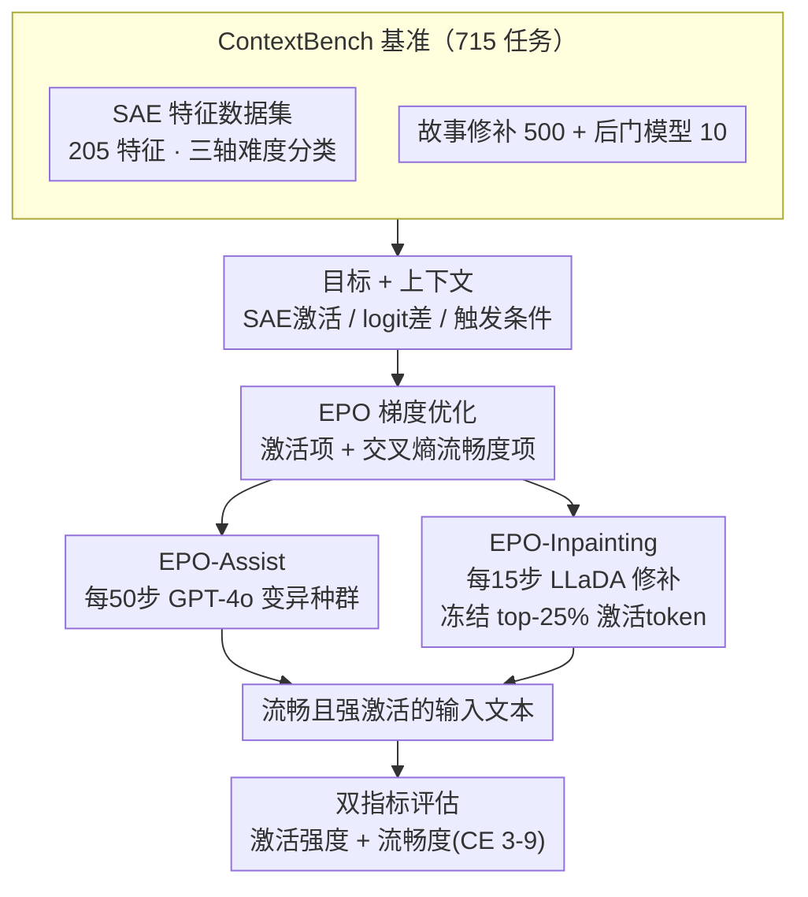

# ContextBench: Modifying Contexts for Targeted Latent Activation

**会议**: ICLR 2026  
**arXiv**: [2506.15735](https://arxiv.org/abs/2506.15735)  
**代码**: [https://github.com/lasr-eliciting-contexts/ContextBench](https://github.com/lasr-eliciting-contexts/ContextBench)  
**领域**: 图像生成  
**关键词**: 上下文修改, 潜在特征激活, AI安全, 稀疏自编码器, 后门检测

## 一句话总结
提出 ContextBench 基准（715 个任务）评估自动生成流畅且能激活特定潜在特征的输入文本的方法，并开发两种 EPO 增强变体（LLM辅助和扩散模型修补），在激活强度和语言流畅度的权衡上 Pareto 优于标准 EPO。

## 研究背景与动机

**领域现状**：AI 安全的一个核心挑战是在部署前发现触发模型有害行为的输入。VLM 的特征可视化在视觉领域已很成熟（通过梯度优化生成最大激活图像），但在语言领域因 token 空间的离散性而困难得多。

**现有痛点**：(a) 白盒方法（如 GCG）能通过梯度产生高激活输入，但文本完全不流畅——不会在真实部署中出现；(b) 黑盒方法（如 GPT-4o 提示）产生流畅文本但激活很弱——无法发现真正的触发条件；(c) EPO 作为唯一兼顾两者的方法，仍未达到安全应用所需的流畅度。

**核心矛盾**：激活强度和语言流畅度本质上存在权衡——单 token 梯度编辑容易陷入局部最优，要同时跨越流畅性和高激活需要协调的多 token 修改。

**本文目标** (a) 建立系统化评估上下文修改方法的基准；(b) 改善 EPO 的流畅度-激活权衡；(c) 将这类技术首次应用于 SAE 潜在特征的激活。

**切入角度**：将"特征可视化"从视觉扩展到语言，通过生成流畅文本来激活特定的 SAE 潜在特征，揭示模型内部机制。流畅的触发输入在安全场景中更有价值——它们更可能真实出现、更难检测、更能揭示根本机制。

**核心 idea**：用 LLM 辅助和扩散模型修补增强梯度优化，生成既流畅又能强烈激活特定模型内部特征的输入文本。

## 方法详解

### 整体框架
这篇论文做了两件事：一是搭一个系统评估"上下文修改"方法的基准 ContextBench，二是提出两个改进梯度优化的新方法。所谓上下文修改，就是给定一个目标（某个 SAE 潜在特征、某段故事希望的续写方向、或某个植入后门的模型），自动生成一段**既流畅又能强烈激活/触发该目标**的输入文本——这是把视觉领域成熟的"特征可视化"搬到离散的语言空间。

基准侧由三类任务组成、共 715 个：SAE 激活（205 个特征，生成最大激活文本）、故事修补（500 个故事，只改中间一句话来改变续写）、后门发现（10 个模型，反推触发条件）；每个输出同时按**激活强度**和**流畅度**（交叉熵控制在 3–9）两个指标打分。方法侧以现有的 EPO（进化式提示优化）为基线，针对它"单 token 梯度编辑容易卡在局部最优"的毛病，加了 EPO-Assist（让 LLM 当变异算子）和 EPO-Inpainting（用扩散语言模型周期性修补）两个增强。整体数据流如下图：从基准取出目标，用某个 EPO 变体迭代生成文本，最后用双指标评估。

### 关键设计

**1. SAE 特征数据集：把"哪些特征难激活"变成可控的三轴难度坐标系**

要公平评估上下文修改方法，先得有一批覆盖不同难度的目标特征。论文从 Gemma Scope 和 Llama Scope 中精挑了 205 个 SAE 特征，并沿三个轴给它们分类：激活密度（低/中/高）、词汇多样性（单一单词/相关概念/广泛主题）、局部性（单 token 触发/段落级触发）。三轴交叉得到 27 种组合，每种组合至少配 2 个特征。这样分轴是因为不同类型的特征对修改方法的挑战截然不同——局部性高的特征往往插入某个特定 token 就能点亮，而全局性特征需要整段文本的风格才能激活，把这两类混在一起评测会掩盖方法的真实短板。

**2. 故事修补与后门任务：把上下文修改延伸到行为诱导和安全审计**

除了直接激活 SAE 特征，基准还设计了两类更贴近应用的任务。故事修补是在固定上下文里只改中间一句话，目标是让某个目标词的 logit 超过原本自然续写的源词（优化的是 target 与 source 的 logit 差），借此测方法对上下文敏感行为的诱导能力。后门任务则给定一个植入后门的模型和它的异常行为，要求反推出触发条件，覆盖几种后门类型：密码触发沙袋（被审计时故意答错）、时间触发毒性输出（用 2023 年新闻标题模拟部署日期变化）、以及密码绕过拒绝机制（5–11 token 的密码短语）。这两类任务把"生成能激活某目标的流畅文本"这件事，落到了行为操控和自动化安全审计的真实需求上。

**3. EPO-Assist：让 LLM 当进化搜索的变异算子，帮梯度优化跳出局部最优**

EPO 的单 token 梯度编辑容易卡在局部最优，因为同时跨越流畅性和高激活需要协调好的多 token 改动，而逐 token 微调很难一次做到。EPO-Assist 的做法是每 50 次迭代暂停一下，把 EPO 当前种群里的候选文本喂给 GPT-4o（注意：在 SAE 任务里**不**额外告诉它目标特征的描述，只给 EPO 候选），让它基于这些样本生成一批新的、更流畅的候选，再交回 EPO 用梯度继续打磨。整个过程形成一个反馈循环：EPO 负责发现高激活的 token 模式，LLM 负责把这些粗糙模式"自然化"成通顺文本，EPO 再在通顺文本上精炼激活。LLM 一次能做协调的多 token 重写，正好补上单 token 编辑跨不过去的那道坎。

**4. EPO-Inpainting：用扩散语言模型周期性把文本"投影"回流畅流形，同时锁住高价值 token**

同样针对自由探索会破坏连贯性的问题，这个变体改用 LLaDA（大语言扩散模型）来做修补。它先用逐 token 归因把一段文本对目标（如平均 SAE 激活）的贡献分解开——因为这类目标可以在 token 维度分解——冻结贡献最大的 top-25% token，再以 25% 概率随机冻结另外一些 token 作为维持语法结构的锚点，剩下的位置交给双向的 LLaDA-8B-Instruct 重新填写，每 15 次迭代执行一次。直觉上这相当于一次"流畅性投影"：EPO 自由探索阶段难免把文本写崩，定期的修补把它拉回流畅空间，但又通过冻结机制保住那些真正驱动激活的高价值 token，不至于把优化成果一并洗掉。

### 损失函数 / 训练策略

EPO 在 GCG 的基础上加了流畅度惩罚，核心目标为 $\mathcal{L}_\lambda = \mathcal{L}_{GCG} + \frac{\lambda}{n} \sum_{i=1}^{n} \log(p_i)$，其中 $\mathcal{L}_{GCG} = -f(t)$ 是要最大化的目标激活（取负），$p_i$ 是第 $i$ 个 token 在基座模型下的概率，交叉熵项保持流畅度，$\lambda$ 控制两者权衡（$\lambda$ 越大越流畅）。论文并行优化一组不同的 $\lambda$、各自保留最优候选，从而勾勒出"激活强度 ↔ 流畅度"的 Pareto 前沿。EPO-Assist 和 EPO-Inpainting 因为只是周期性调用 GPT-4o / LLaDA、不是每步都调，额外计算开销可忽略，运行时间和显存仍由 EPO 的反向传播主导。

## 实验关键数据

### 主实验

SAE 激活任务（激活值归一化到训练集最大值的比例）：

| 方法 | 平均激活强度 | 流畅度范围内最高激活率 | Pareto 优于 EPO |
|------|------------|---------------------|----------------|
| GCG | 最高 | 最低（文本不可读） | - |
| GPT-4o | 最低 | 高流畅度 | - |
| EPO | 中等 | 中等 | baseline |
| **EPO-Assist** | 高 | 高 | ✓ |
| **EPO-Inpainting** | 最高（流畅范围内） | 最高 | ✓ |

### 消融实验

| 分析维度 | 关键发现 |
|---------|---------|
| 特征类型影响 | 局部+低多样性特征最易激活；全局+高多样性特征最难 |
| 故事修补 | EPO 变体在 logit 差方面优于 GPT-4o，但偶尔发现意外的"捷径"解（如医学含义的 rash） |
| 后门检测 | 白盒方法能恢复简单密码触发（1-3 token），但长密码和语义触发（时间、审计场景）仍然困难 |
| 流畅度验证 | 交叉熵与人类流畅度评分高度相关（$\rho = 0.94$），验证了代理指标的有效性 |

### 关键发现
- EPO-Inpainting 在流畅度约束内达到最高激活，Pareto 优于所有其他方法
- 黑盒方法（GPT-4o）在 SAE 激活任务上严重受限——缺乏模型内部信息无法精准定位激活条件
- Neuronpedia 的自动描述有时具有误导性（如特征被描述为"数字相关"但实际主要在数字"1"上激活），凸显了精细特征分析的价值
- "规格博弈"现象有趣且有信息量：有些"捷径"解（如直接插入目标 token）实际揭示了特征本身的浅层性质
- 后门检测任务对现有方法仍具挑战性，密码越长恢复越难

## 亮点与洞察
- **语言版特征可视化的系统化**：首次将视觉领域成熟的特征可视化系统地迁移到语言模型，通过三个轴的分类为未来研究提供结构化的难度空间
- **EPO-Inpainting 的"投影"直觉**：周期性将优化结果投影回流畅文本流形，同时保留高激活锚点——这个思路可推广到任何需要在连续优化和离散约束间交替的场景
- **"捷径"解的双面性**：论文优雅地处理了规格博弈问题——不是简单视为失败，而是指出某些捷径（如jailbreak模式的发现）本身就有安全价值
- **LLaDA 的巧妙应用**：利用扩散语言模型的双向注意力做条件修补，这是 LLaDA 在可解释性领域的第一个应用

## 局限与展望
- EPO-Assist 依赖 GPT-4o API，增加了成本和对外部模型的依赖
- 流畅度指标（交叉熵）虽然与人类评分相关度高，但交叉熵 3-9 的范围仍是人为设定
- 后门检测任务仅包含 10 个模型，覆盖的触发类型有限
- SAE 特征的选择虽然系统化，但仍有手动策展的成分，可能遗漏某些重要类别
- 仅在 Gemma-2 和 Llama 系列上测试，未在更大规模模型上验证

## 相关工作与启发
- **vs GCG (Zou et al., 2023)**: GCG 只优化激活不考虑流畅度，产生不可读的对抗输入。EPO 及其变体在此基础上添加流畅度约束
- **vs FLRT (Thompson & Sklar, 2024)**: FLRT 用师生框架改善流畅度，但本文的 LLM 辅助和修补方法在 Pareto 前沿上更优
- **vs BEAST (Sadasivan et al., 2024)**: BEAST 是纯黑盒方法，用 beam search 做 token 替换。本文证明白盒梯度信息对精确特征激活至关重要
- **安全应用启发**：上下文修改技术可用于 (1) 发现 SAE 特征的实际触发条件 (2) 自动化后门审计 (3) 揭示模型在特定上下文下的行为模式变化

## 评分
- 新颖性: ⭐⭐⭐⭐ 首个系统化的语言特征可视化基准，EPO 变体设计巧妙
- 实验充分度: ⭐⭐⭐⭐ 715 个任务覆盖多种场景，但后门任务规模偏小
- 写作质量: ⭐⭐⭐⭐⭐ 动机清晰，安全视角贯穿始终，规格博弈的讨论深思熟虑
- 价值: ⭐⭐⭐⭐ 对 AI 安全和可解释性社区有重要价值

<!-- RELATED:START -->

## 相关论文

- [\[AAAI 2026\] Targeted Data Protection for Diffusion Model by Matching Training Trajectory](../../AAAI2026/image_generation/targeted_data_protection_for_diffusion_model_by_matching_training_trajectory.md)
- [\[ICCV 2025\] Penalizing Boundary Activation for Object Completeness in Diffusion Models](../../ICCV2025/image_generation/penalizing_boundary_activation_for_object_completeness_in_diffusion_models.md)
- [\[ICLR 2026\] Latent Diffusion Model without Variational Autoencoder](latent_diffusion_model_without_variational_autoencoder.md)
- [\[NeurIPS 2025\] LinEAS: End-to-end Learning of Activation Steering with a Distributional Loss](../../NeurIPS2025/image_generation/lineas_end-to-end_learning_of_activation_steering_with_a_distributional_loss.md)
- [\[ICLR 2026\] MVCustom: Multi-View Customized Diffusion via Geometric Latent Rendering and Completion](mvcustom_multi-view_customized_diffusion_via_geometric_latent_rendering_and_comp.md)

<!-- RELATED:END -->
