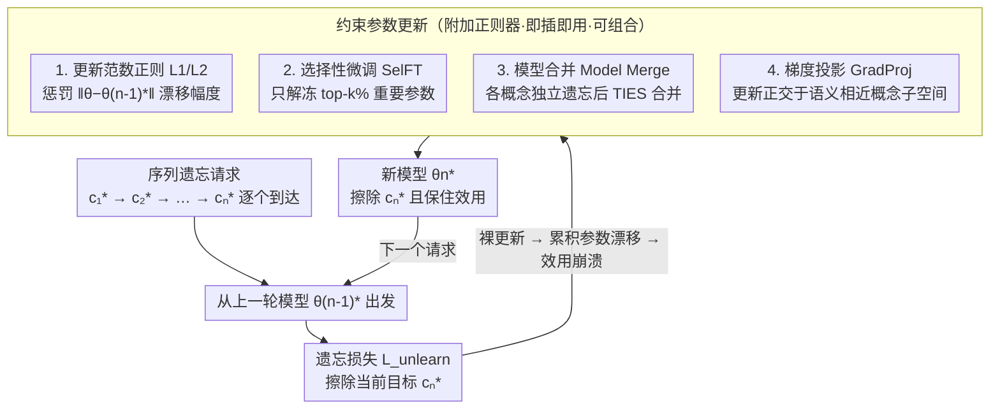

# Continual Unlearning for Text-to-Image Diffusion Models: A Regularization Perspective

**会议**: ICLR 2026  
**arXiv**: [2511.07970](https://arxiv.org/abs/2511.07970)  
**代码**: [https://justinhylee135.github.io/CUIG_Project_Page/](https://justinhylee135.github.io/CUIG_Project_Page/)  
**领域**: 扩散模型 / 机器遗忘  
**关键词**: continual unlearning, diffusion models, regularization, gradient projection, concept erasure

## 一句话总结
首次系统研究 T2I 扩散模型的持续遗忘（continual unlearning）问题，发现现有遗忘方法在序列请求下因累积参数漂移导致"效用崩溃"，提出一组附加正则化策略（L1/L2 范数、选择性微调、模型合并）和语义感知的梯度投影方法来缓解该问题。

## 研究背景与动机

**领域现状**：机器遗忘（machine unlearning）旨在从预训练模型中移除特定概念（如版权内容、有害风格），避免从头重训。现有方法（ConAbl、SculpMem 等）在同时遗忘多个概念时表现良好。

**现有痛点**：现实中遗忘请求是**序列到达**的（今天删除暴力内容，明天删除某画家风格），而非一次性给出。现有方法在序列遗忘场景下仅经过几个请求就出现"效用崩溃"——模型不仅忘了目标概念，连无关概念也无法生成。

**核心矛盾**：每次遗忘操作都会推动参数偏离预训练权重，序列操作导致累积参数漂移远大于同时遗忘。预训练权重编码了模型的生成能力，偏离过远就意味着能力丧失。

**本文目标** (a) 定义并基准化持续遗忘问题 (b) 诊断效用崩溃的根因 (c) 提出兼容现有遗忘方法的附加正则化策略 (d) 解决语义域内概念保留的难题

**切入角度**：借鉴持续学习（continual learning）中的正则化和梯度投影思想来约束参数更新，关键洞察是需要**语义感知**——与遗忘目标语义相近的概念更容易被误伤。

**核心 idea**：持续遗忘的效用崩溃本质是累积参数漂移，通过正则化约束漂移 + 梯度投影保护语义相近概念可以有效缓解。

## 方法详解

### 整体框架

这篇论文要解决的是「遗忘请求一个接一个到来」时模型逐渐失能的问题。每当一个新的遗忘目标 $c_n^*$ 到达，系统从上一轮已经遗忘过的模型 $\theta_{n-1}^*$ 出发，用遗忘损失 $\mathcal{L}_{\text{unlearn}}$ 继续更新，得到新模型 $\theta_n^*$。理想的 $\theta_n^*$ 要同时满足三件事：有效擦除当前目标 $c_n^*$、让之前擦除的 $c_1^*,...,c_{n-1}^*$ 保持不可生成、以及不伤害任何无关概念的生成能力。

作者的核心观察是「效用崩溃」来自累积参数漂移——每次遗忘都把权重推离编码了生成能力的预训练权重，序列叠加后漂移远大于一次性同时遗忘。因此所有方法的共同思路都是**约束参数更新、把模型拉回预训练权重附近**，区别只在用什么手段约束。下面四种策略都以附加项的形式挂在 $\mathcal{L}_{\text{unlearn}}$ 上，与具体用哪个遗忘算法（ConAbl / SculpMem）正交，可以即插即用。

### 关键设计

**1. 更新范数正则化（L1/L2）：直接惩罚漂移幅度**

针对累积漂移这个根因，最直接的做法就是在遗忘损失上加一个把参数往 $\theta_{n-1}^*$ 拉的惩罚项：$\mathcal{L}_{\text{unlearn}}(\theta, \{c_n^*\}) + \lambda \|\theta - \theta_{n-1}^*\|_p^p$。其中 L1 范数鼓励稀疏更新（只动少数权重），L2 范数则防止任何单个权重一次跳得太远。这是约束漂移最朴素的方式，不需要任何关于任务的额外信息，简单且对跨域保留改善明显。

**2. 选择性微调（SelFT）：只动该动的那批参数**

L1 正则虽然稀疏，但它的稀疏是各向同性的——不区分哪些参数对当前遗忘任务真正重要。SelFT 换一个角度：先用一阶 Taylor 近似估计每个参数对遗忘损失的重要性 $|\nabla_{\theta[d]} \mathcal{L}_{\text{unlearn}} \cdot \theta_{n-1}^*[d]|$，只解冻其中最重要的 top-k% 参数、冻结其余全部。这样更新天然被限制在与任务相关的子集里，相比 L1 的盲目稀疏更有针对性，也就更不容易误伤无关概念。

**3. 模型合并（Model Merge）：先各自遗忘，再合到一起**

序列遗忘的麻烦在于漂移会累积，那干脆不让它累积——对每一个概念都**独立地从预训练权重出发**单独遗忘一次，于是每个独立模型都只偏离预训练权重一小步、仍落在同一个损失盆地内。最后用 TIES-Merging 把这些独立遗忘的模型合并成一个。因为每份都贴近预训练权重，合并后的模型既聚合了所有遗忘效果、又整体保持在预训练权重附近，从而保住了效用。代价是要为每个概念各跑一次遗忘。

**4. 梯度投影（GradProj）：语义感知，保护相近概念**

前三种是通用正则化，能搞定跨域保留（遗忘某个画风时不伤物体生成），但**域内保留**极难——遗忘一种风格时往往把其他风格也带崩。原因在于遗忘主要靠修改 cross-attention 的 $W_K, W_V$ 实现，而线性投影会保持邻域结构，所以为擦除 $c^*$ 去改 $W_K, W_V$ 时，会不可避免地扰动那些语义相近的概念 $c$；实验里保留准确率与 text embedding 相似度呈强负相关，正是这个机制的证据。GradProj 的做法是先按 text embedding 余弦相似度挑出 top-K 个最相近的概念，再把 $W_K, W_V$ 的遗忘梯度中**落在这些概念嵌入方向上的分量去掉**，让更新发生在与相近概念正交的子空间里。这样擦除目标的同时，相近概念的 key/value 不再被牵连，域内保留（RA-I）因此显著提升。

### 损失函数 / 训练策略

- 基于 ConAbl 或 SculpMem 的遗忘损失
- 正则化附加在遗忘损失上，与具体遗忘方法正交兼容
- GradProj 选择 top-K=5 个语义相近概念

## 实验关键数据

### 主实验（ConAbl + 12 步序列遗忘）

| 方法 | UA ↑ | RA-I ↑ | RA-C ↑ | 说明 |
|------|------|--------|--------|------|
| Sequential (无正则) | ~95% | ~20% | ~30% | 效用崩溃 |
| Simultaneous (非序列) | ~90% | ~70% | ~85% | 好但开销大 |
| + L2 正则 | ~92% | ~40% | ~75% | 跨域改善大 |
| + SelFT | ~93% | ~35% | ~70% | 跨域改善 |
| + Model Merge | ~90% | ~50% | **~85%** | 总体最强 |
| + GradProj | ~90% | **~60%** | ~70% | 域内保留最优 |
| + Merge + GradProj | ~88% | **~65%** | **~85%** | 互补效果最佳 |

### 消融实验

| 分析 | 关键发现 |
|------|---------|
| 参数漂移 vs 保留 | 序列漂移远大于同时遗忘的漂移，与保留准确率强相关 |
| 语义相似度 vs RA-I | 强负相关（r ≈ -0.8），越相似的概念越难保留 |
| $W_K, W_V$ 变化 vs 相似度 | 强正相关，语义相近概念的 key/value 被严重扰动 |
| GradProj K 值 | K=5 即可覆盖最关键的语义邻居 |

### 关键发现
- 序列遗忘仅 3-4 步后RA就崩溃到 <50%，12 步后模型几乎无法生成任何有意义的图像
- 同时遗忘和独立遗忘的参数漂移量级相仿且远小于序列遗忘
- Model Merge 总体保留最强因为每个模型都独立靠近预训练权重
- GradProj 对域内保留（RA-I）提升最显著，因为它精确地保护了语义相近概念
- 各正则化方法互补，可以组合使用

## 亮点与洞察
- **问题定义清晰有价值**：首次将持续遗忘在 T2I 扩散模型中基准化，问题动机明确（实际遗忘请求都是序列到达的），benchmark 设计合理（基于 UnlearnCanvas 的标准化评估）。
- **根因分析深入**：不仅发现了效用崩溃，还通过参数漂移分析和 Taylor 展开给出了理论解释——保留损失的变化以 $\|\theta^* - \theta^\dagger\|$ 为界。
- **梯度投影的语义感知**思路可迁移——在任何需要"修改模型某个能力而不影响相近能力"的场景中都适用，如多任务学习、模型编辑等。
- **附加正则化不修改遗忘方法本身**，具有通用性，可以即插即用地与任何遗忘算法组合。

## 局限与展望
- Model Merge 虽然效果好但需要为每个概念独立遗忘，开销不比同时遗忘低多少
- GradProj 需要知道哪些概念与目标语义相近，实际中如何自动发现这些概念未充分讨论
- 仅在 UnlearnCanvas 的 fine-tuned SD 上验证，未在 SDXL 等更大模型和实际遗忘场景上测试
- 正则化无法完全解决域内保留（RA-I 仍然显著低于 RA-C），说明问题尚未完全解决
- 遗忘有效性（UA）和保留（RA）之间的 trade-off 是否有理论极限？

## 相关工作与启发
- **vs ConAbl**: 直接升级——ConAbl + Model Merge + GradProj 组合在持续设置下大幅改善保留。
- **vs SculpMem**: 同样受益于这些正则化策略，说明方法具有通用性。
- **vs 持续学习**: 借鉴了 EWC、梯度投影等思想，但指出关键差异——遗忘中需要保留的概念已经被模型学过，干扰风险更大。

## 评分
- 新颖性: ⭐⭐⭐⭐ 问题设置新（持续遗忘 for T2I），方法主要是已有技术的组合与适配，但梯度投影的语义感知版本有创意
- 实验充分度: ⭐⭐⭐⭐ 12 步序列、风格/物体两种设定、多种基线方法、消融和分析全面
- 写作质量: ⭐⭐⭐⭐⭐ 问题-诊断-方案的逻辑链非常清晰，理论分析与实验相互验证
- 价值: ⭐⭐⭐⭐⭐ 定义了一个重要的新问题方向，具有直接的社会/法律意义

<!-- RELATED:START -->

## 相关论文

- [\[ICCV 2025\] Holistic Unlearning Benchmark: A Multi-Faceted Evaluation for Text-to-Image Diffusion Model Unlearning](../../ICCV2025/image_generation/holistic_unlearning_benchmark_a_multi-faceted_evaluation_for_text-to-image_diffu.md)
- [\[ICCV 2025\] Joint Diffusion Models in Continual Learning](../../ICCV2025/image_generation/joint_diffusion_models_in_continual_learning.md)
- [\[ICLR 2026\] The Spacetime of Diffusion Models: An Information Geometry Perspective](the_spacetime_of_diffusion_models_an_information_geometry_perspective.md)
- [\[CVPR 2026\] TINA: Text-Free Inversion Attack for Unlearned Text-to-Image Diffusion Models](../../CVPR2026/image_generation/tina_text-free_inversion_attack_for_unlearned_text-to-image_diffusion_models.md)
- [\[NeurIPS 2025\] Moment- and Power-Spectrum-Based Gaussianity Regularization for Text-to-Image Models](../../NeurIPS2025/image_generation/moment-_and_power-spectrum-based_gaussianity_regularization_for_text-to-image_mo.md)

<!-- RELATED:END -->
