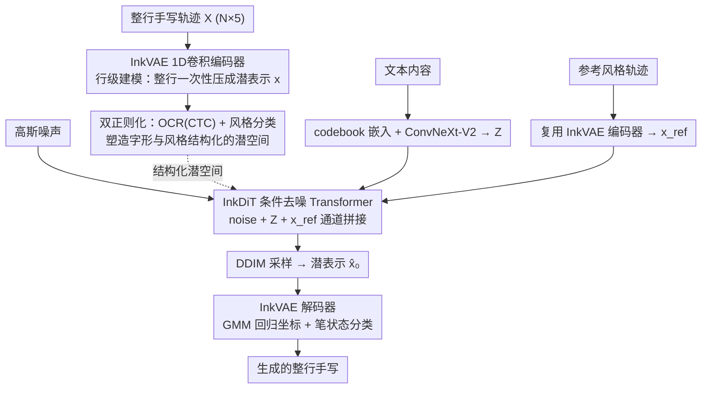

# DiffInk: Glyph- and Style-Aware Latent Diffusion Transformer for Text to Online Handwriting Generation

**会议**: ICLR 2026  
**arXiv**: [2509.23624](https://arxiv.org/abs/2509.23624)  
**代码**: [https://github.com/awei669/DiffInk](https://github.com/awei669/DiffInk)  
**领域**: 扩散模型 / 手写生成  
**关键词**: online handwriting generation, latent diffusion transformer, VAE regularization, glyph-style disentanglement, Chinese handwriting  

## 一句话总结
提出 DiffInk，首个面向全行手写生成的潜在扩散 Transformer 框架，包含 InkVAE（通过 OCR + 风格分类双正则化学习结构化潜空间）和 InkDiT（在潜空间中做条件去噪生成），在中文手写生成上大幅超越 SOTA（AR 94.38% vs 91.48%），速度提升 800×。

## 研究背景与动机

**领域现状**：文本到在线手写生成（TOHG）主要聚焦在字符级或词级生成。OLHWG（ICLR'25）是最新 SOTA，先生成单字再用外部布局模块拼接成行。

**现有痛点**：(a) 字符级方法在拼接成行时缺乏整体结构建模，导致边界不自然；(b) 布局模块引入额外误差，解耦布局和字符忽略了相邻字符的结构依赖；(c) OLHWG 每秒仅生成 0.07 个字符，效率极低。

**核心矛盾**：字符级建模 vs 行级连贯性的鸿沟。真实手写中相邻字符在形态、间距、笔画连接上紧密相关，逐字生成+拼接无法捕捉这些关系。

**本文目标** 直接建模整行手写生成，实现端到端的行级生成，同时保证字形准确性和风格一致性。

**切入角度**：先用 VAE 将全行手写序列压缩到紧凑潜空间，再在潜空间中用 DiT 做条件生成。关键创新是 VAE 潜空间的双正则化——让潜空间不仅能重建，还要有语义结构。

**核心 idea**：VAE 重建好≠潜空间结构好，通过 OCR + 风格分类双正则化让潜空间具有字形/风格的语义结构，这才是扩散模型生成的关键。

## 方法详解

### 整体框架

DiffInk 把"文本→整行手写"拆成两段串起来：先用一个预训练好的变分自编码器 InkVAE 把整行手写轨迹压进一个紧凑潜空间，再让扩散 Transformer InkDiT 在这个潜空间里做条件去噪生成。InkVAE 用 1D 卷积编码器把整行序列 $X \in \mathbb{R}^{N \times 5}$（每个点是坐标加笔状态）一次性压成潜表示 $x \in \mathbb{R}^{l \times d}$，并在潜空间上额外挂 OCR 与风格两路监督，把潜空间塑造得"既能重建、又有字形/风格的语义结构"。InkDiT 则以文本内容 $Z$ 和参考风格 $x_{\text{ref}}$ 为条件，从高斯噪声出发去噪出干净潜表示 $\hat{x}_0$；推理时用 DDIM 采样得到潜表示，再交给 InkVAE 解码器（GMM 回归坐标 + 笔状态分类）还原成可见的整行手写轨迹。整套设计的关键不在扩散模型本身，而在于让 InkVAE 的潜空间结构化——下游生成的稳定性几乎全押在这上面。

### 关键设计

**1. 行级建模：直接对整行轨迹建模，从根上消掉"逐字生成再拼接"的伪影**

以往方法（如 OLHWG）先逐字生成再靠外部布局模块拼成一行，问题是字间间距、连笔、整体布局这些结构依赖被人为切断了，拼接处自然不连贯。DiffInk 干脆不拆字：用 1D 卷积编码器把整行序列压成潜表示，解码端用高斯混合模型（GMM）回归坐标、再对笔状态做分类。因为整行从头到尾在一个潜表示里被一起建模，相邻字符的形态和间距关系被天然保留，这也是它风格一致性得分能从 44.74 一路涨到 77.38 的原因。这套"行级压缩—潜空间生成"的范式同时也带来 800× 的提速，因为不再需要逐字扩散加布局预测。

**2. InkVAE 双正则化：让潜空间不只是能重建，还要有字形和风格的语义结构**

这一步直击全文的核心痛点——"VAE 重建好不等于潜空间好"。一个普通 VAE 把手写压缩后能近乎完美还原（重建 AR 97.59%），但它的潜空间是松散的：扩散模型在生成时引入一点小扰动，就可能让字写错或风格跑偏。DiffInk 的做法是在标准 VAE 目标之外，直接在潜空间上再挂两个监督约束，总损失写成

$$\mathcal{L}_{\text{VAE}} = \lambda_{\text{rec}} \mathcal{L}_{\text{rec}} + \lambda_{\text{kl}} \mathcal{L}_{\text{kl}} + \lambda_{\text{ocr}} \mathcal{L}_{\text{ocr}} + \lambda_{\text{sty}} \mathcal{L}_{\text{sty}}$$

其中 OCR 约束由一个 Transformer 识别头加 CTC 损失实现，逼着潜表示保留可被读出的字形信息；风格约束由 LSTM 加注意力池化再接分类损失实现，逼着潜表示编码出书写风格。两者都直接作用在潜空间上，效果是让相同字符的潜向量聚到一起、相同风格的潜向量聚到一起。潜空间一旦有了这种结构，扩散模型在其中采样就稳得多——这也是后面消融里生成 AR 从 74.77% 跳到 94.38% 的根源。

**3. InkDiT 条件设计：把文本内容和参考风格两路条件干净地注入扩散模型**

要可控生成，模型得同时知道"写什么字"和"用谁的风格写"。文本内容这一路先经过可学习的 codebook 嵌入，再过一个 ConvNeXt-V2 内容编码器得到 $Z$；这里选大核深度卷积是有意为之——它视野广，能跨越变长文本捕捉长程依赖，缓解整行文本和手写轨迹之间的对齐难题。风格这一路则直接复用 InkVAE 的编码器，把参考轨迹编码成 $x_{\text{ref}}$，省掉了再单独训一个风格编码器的开销。最后把噪声、内容、风格三者沿通道维度拼起来送进 DiT，让去噪过程同时受这两路条件牵引。

### 损失函数 / 训练策略

- InkVAE: 100 epochs, batch 128, lr $5 \times 10^{-4}$
- InkDiT: 200k steps, batch 256, lr $7.5 \times 10^{-5}$
- 扩散目标：预测干净潜表示 $x_0$（而非噪声），带 mask 的 MSE 损失

## 实验关键数据

### 主实验（CASIA-OLHWDB 2.0-2.2，中文手写）

| 方法 | 输出级别 | AR% ↑ | CR% ↑ | Style ↑ | DTW ↓ | 速度 (char/s) ↑ |
|------|---------|-------|-------|---------|-------|----------------|
| OLHWG (ICLR'25) | 字+布局 | 91.48 | 91.71 | 44.74 | 1.326 | 0.07 |
| SDT (CVPR'23) | 字级 | 82.53 | 83.00 | 50.51 | 1.270 | 3.35 |
| **DiffInk (Ours)** | **行级** | **94.38** | **94.58** | **77.38** | **1.049** | **58.47** |

### 消融实验（InkVAE 正则化对 InkDiT 的影响）

| 配置 | VAE AR% | DiT AR% | DiT Style ↑ |
|------|---------|---------|-------------|
| $\mathcal{L}_{\text{rec+kl}}$ only | 97.59 | 74.77 | 60.68 |
| + $\mathcal{L}_{\text{ocr}}$ | 97.60 | 82.09 | 66.07 |
| + $\mathcal{L}_{\text{sty}}$ | 97.59 | 79.64 | 68.99 |
| + both (InkVAE) | **97.65** | **94.38** | **77.38** |

### 关键发现
- **VAE 重建性能几乎不受正则化影响**（AR 97.59→97.65），但扩散生成性能从 74.77% 暴涨到 94.38%——证明潜空间结构而非重建质量才是生成的关键
- 双正则化的效果远超单项之和（82.09 + 79.64 的效果不如 94.38），说明字形和风格的联合解耦有协同效应
- 行级建模速度比 OLHWG 快 800×（58.47 vs 0.07 char/s），因为直接生成整行避免了逐字扩散+布局预测
- 风格一致性得分从 44.74 提升至 77.38（+32.64），说明行级建模比拼接方式更好地保持风格连贯

## 亮点与洞察
- **"VAE 重建好≠潜空间好"** 是一个深刻洞察。可以解释为什么很多 VAE-based 潜在扩散模型效果不好——潜空间虽然可以精确重建，但缺乏语义结构导致扩散过程中的小扰动产生不可控的语义变化。这个洞察可以迁移到图像/视频/3D 等其他领域的潜在扩散模型中。
- **轻量级潜空间正则化**（只需两个小分类器）就能大幅改善下游生成质量，成本极低但收益巨大。这是一个通用的设计原则。
- **行级建模 vs 字级拼接**的对比说明了端到端方法在捕捉全局依赖上的天然优势。

## 局限与展望
- 仅在中文手写上验证，缺少英文/阿拉伯文等其他文字系统的实验
- 需要已知声明的字符集合（codebook），对开放词汇/罕见字的泛化能力未测试
- 参考风格仍需要同作者的手写样本，zero-shot（从描述生成风格）不支持
- DTW 指标的绝对值（1.049）还有改进空间
- 生成速度虽然比 OLHWG 快 800×，但比自回归方法（WLU 25 char/s）只快约 2×

## 相关工作与启发
- **vs OLHWG**: DiffInk 直接行级生成，避免布局模块的额外误差。所有指标大幅领先，尤其速度提升 800×。
- **vs SDT**: SDT 用双分支对比学习做内容/风格解耦，DiffInk 改在潜空间做正则化，更简洁且效果更好。
- **vs 图像领域 LDM**: DiffInk 证明了在序列数据（手写轨迹）上 latent diffusion 同样有效，且潜空间正则化的重要性可能被忽视。

## 评分
- 新颖性: ⭐⭐⭐⭐ 首个行级手写潜在扩散框架，潜空间正则化的洞察有价值
- 实验充分度: ⭐⭐⭐⭐ 消融全面，但仅一个数据集（中文）
- 写作质量: ⭐⭐⭐⭐⭐ 图表清晰，动机-方法-实验逻辑通顺
- 价值: ⭐⭐⭐⭐ 对手写生成领域有重要推进，潜空间正则化思路有通用意义

<!-- RELATED:START -->

## 相关论文

- [\[AAAI 2026\] ProCache: Constraint-Aware Feature Caching with Selective Computation for Diffusion Transformer Acceleration](../../AAAI2026/image_generation/procache_constraint-aware_feature_caching_with_selective_computation_for_diffusi.md)
- [\[CVPR 2026\] Rethinking Glyph Spatial Information in Font Generation](../../CVPR2026/image_generation/rethinking_glyph_spatial_information_in_font_generation.md)
- [\[CVPR 2025\] SALAD: Skeleton-aware Latent Diffusion for Text-driven Motion Generation and Editing](../../CVPR2025/image_generation/salad_skeleton-aware_latent_diffusion_for_text-driven_motion_generation_and_edit.md)
- [\[ICLR 2026\] DiffusionNFT: Online Diffusion Reinforcement with Forward Process](diffusionnft_online_diffusion_reinforcement_with_forward_process.md)
- [\[CVPR 2026\] StyleTextGen: Style-Conditioned Multilingual Scene Text Generation](../../CVPR2026/image_generation/styletextgen_style-conditioned_multilingual_scene_text_generation.md)

<!-- RELATED:END -->
