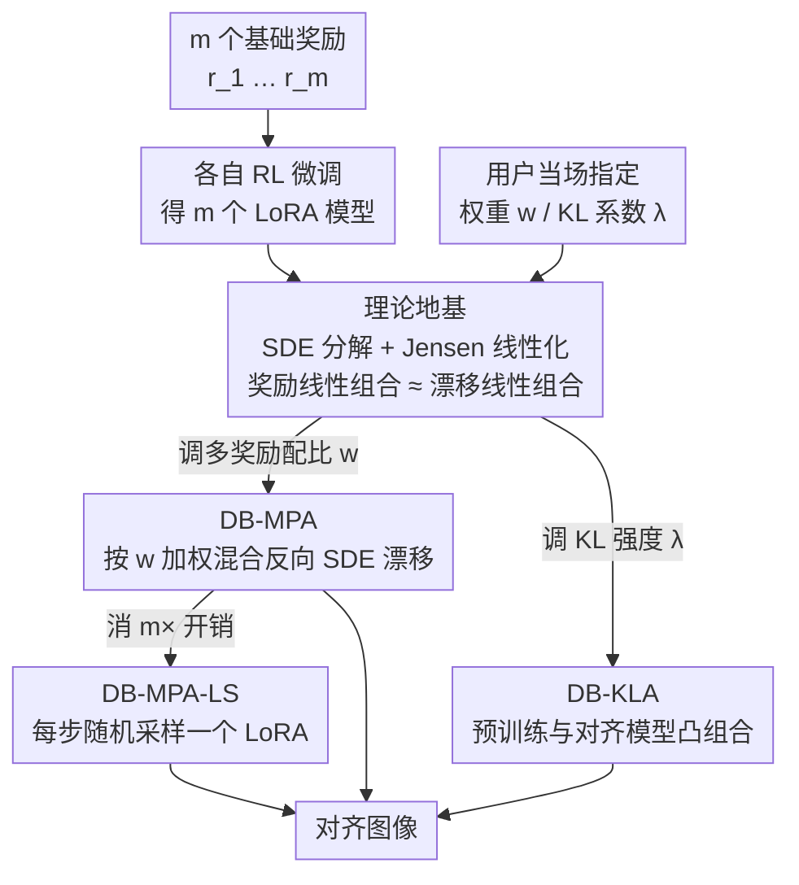

# Diffusion Blend: Inference-Time Multi-Preference Alignment for Diffusion Models

**会议**: ICLR 2026  
**arXiv**: [2505.18547](https://arxiv.org/abs/2505.18547)  
**代码**: 有（GitHub）  
**领域**: 扩散模型 / 多目标对齐  
**关键词**: multi-preference alignment, inference-time, backward SDE blending, KL regularization control, Pareto-optimal  

## 一句话总结
提出 Diffusion Blend，通过在推理时混合多个奖励微调模型的反向扩散过程来实现多偏好对齐：DB-MPA 支持任意奖励线性组合、DB-KLA 支持动态 KL 正则化控制、DB-MPA-LS 通过随机 LoRA 采样消除推理开销，理论上证明了混合近似的误差界并在实验中接近 MORL oracle 上界。

## 研究背景与动机

**领域现状**：RL 微调扩散模型通常固定单一奖励函数和 KL 正则化权重 $\alpha$。微调完成后，模型锁定在特定的 $(r, \alpha)$ 配置上，无法适应不同用户偏好。

**现有痛点**：(a) 用户可能要求不同的美学/语义一致性/人类偏好权衡，需要为每个偏好组合都微调一个模型（开销巨大）；(b) KL 正则化太弱导致 reward hacking，太强导致对齐不足，最优值需要 grid search；(c) Rewarded Soup（权重空间线性组合）过于粗糙，guidance 方法需要可微奖励且计算量大。

**核心矛盾**：部署后偏好的灵活性 vs 微调的固定性。如何在不重新训练的情况下在推理时适应任意偏好组合？

**本文目标** 给定 $m$ 个基础奖励函数各自微调的模型，在推理时按用户指定权重 $w$ 生成 $r(w) = \sum w_i r_i$ 对齐的图像，且支持动态调整 KL 强度。

**切入角度**：从扩散模型的反向 SDE 角度出发，证明对齐模型的漂移项 $f^{(r,\alpha)}$ 可以表示为预训练漂移 + 控制项，通过 Jensen gap 近似将控制项线性化，从而实现反向 SDE 的线性混合。

**核心 idea**：奖励对齐的扩散模型的反向 SDE 漂移项可以线性组合近似任意奖励线性组合的对齐效果。

## 方法详解

### 整体框架

这篇论文要解决的是：RL 微调会把扩散模型锁死在一个固定的「奖励 + KL 权重」配置上，部署后想换偏好组合或调对齐强度，就得重新微调一遍。Diffusion Blend 的思路是把「适配偏好」从训练期挪到推理期——离线只为每个基础奖励 $r_i$ 各自 RL 微调出一个 LoRA 模型（共 $m$ 个），线上则在每一步去噪时，按用户当场给的权重把这些模型的反向扩散过程「混」起来，无需任何额外微调。

之所以能这么混，靠的是一条理论地基：奖励对齐只改动了反向 SDE 漂移里的一个控制项，而这个控制项对奖励近似线性，于是「奖励的线性组合」恰好对应「漂移的线性组合」。在这个地基上，论文派生出三个推理算法——DB-MPA 让用户用权重 $w$ 调多奖励配比、DB-KLA 让用户用 $\lambda$ 调 KL 正则化强度、DB-MPA-LS 把 DB-MPA 的 $m\times$ 推理开销降回 $1\times$。

### 关键设计

**1. 理论地基：把「对齐」从漂移里剥出来，再线性化成可叠加的控制项**

要在推理时混合多个对齐模型，前提是先搞清楚「对齐」到底改了反向扩散的什么，并让这些改动变得可以线性叠加——论文用两步证明把这件事坐实。第一步是 SDE 分解（Proposition 1）：任意一个用奖励 $r$、KL 权重 $\alpha$ 微调出的模型，其反向 SDE 漂移都能干净地拆成预训练漂移加一个控制项，$f^{(r,\alpha)}(x_t, t) = f^{\text{pre}}(x_t, t) - \beta(t)\, u^{(r,\alpha)}(x_t, t)$，其中 $f^{\text{pre}}$ 在所有对齐模型间共享，控制项 $u^{(r,\alpha)} = \nabla_{x_t} \log \mathbb{E}_{x_0 \sim p_{0|t}^{\text{pre}}}[\exp(r(x_0)/\alpha)]$ 才是奖励施加的全部「拉力」——于是混合多偏好被归约成「怎么组合这些控制项」。

第二步是把控制项线性化。$\log \mathbb{E}[\exp(\cdot)]$ 是非线性的，没法直接对奖励做叠加；论文交换 log-exp 与期望的顺序，用 $\bar{u}^{(r,\alpha)} = \nabla_x \mathbb{E}[r(x_0)/\alpha]$ 近似 $u^{(r,\alpha)}$（即 Jensen gap 近似，DPS、RGG 等扩散引导方法里早已广泛使用，误差随 $t \to 0$ 趋于 0）。一旦控制项变成对奖励的线性算子，期望的线性性立刻生效：对线性奖励 $r(w) = \sum w_i r_i$，就有

$$f^{(r(w),\alpha)} \approx \sum_i w_i\, f^{(r_i, \alpha)}.$$

也就是说，想要 $r(w)$ 对齐的生成效果，只需把各单奖励模型的漂移按 $w$ 加权相加——这正是后面三个算法共同的地基。

**2. DB-MPA：推理时按用户权重直接混合反向 SDE**

有了上面的线性化，多奖励配比就落地成一个极简的推理改动：用户给定权重 $w$，每一步去噪不用单一模型，而是把 $m$ 个奖励微调模型的噪声预测按权重加权，$\hat{\epsilon}_t = \sum_i w_i\, \epsilon_{\theta_i^{\text{rl}}}(x_t, t)$，再照常更新。整个过程不重新训练、不要求奖励可微、也不需推理时搜索，用户拖一下滑块改 $w$ 就能实时滑动 aesthetics 与 alignment 之间的权衡。代价是每步要前向 $m$ 个模型，开销 $m\times$——这正是设计 4 要消除的瓶颈。

**3. DB-KLA：把 KL 正则化强度也变成推理时可调的旋钮**

同一套分解还能用来调 KL 强度，而不只是调奖励配比。论文把目标 KL 权重从 $\alpha$ 缩放到 $\alpha/\lambda$，并近似为预训练模型与对齐模型的凸组合 $f^{(r, \alpha/\lambda)} \approx (1-\lambda) f^{\text{pre}} + \lambda f^{(r,\alpha)}$。$\lambda$ 越大越偏向对齐（但可能 reward hacking），越小越保守、越保留预训练画质。这样原本需要 grid search 才能定下来的 KL 权重，现在变成推理时一个连续可调的标量，省掉了为找最优 $\alpha$ 反复微调的成本。

**4. DB-MPA-LS：用随机 LoRA 采样消掉 $m\times$ 开销**

DB-MPA 每步评估全部 $m$ 个模型是它最大的实用瓶颈。论文的巧解是：每个去噪步不再把所有模型都算一遍取加权平均，而是把权重 $w$ 当成概率分布，随机采样一个 LoRA adapter（两个奖励用 Bernoulli、多个用 Categorical）来出这一步。Proposition 2 证明，这条逐步随机采样的 SDE 与原来的加权混合 SDE 拥有相同的边际分布——根源在于扩散过程本身的噪声注入，使得「逐步随机选模型」的统计效果等价于「每步加权平均」。于是推理开销从 $m\times$ 降回 $1\times$，几乎不损质量。值得注意的是，这个等价性是扩散模型独有的（LLM 在离散 token 空间里没有这种连续随机性可用），而且它对 DB-KLA 不成立——后者的凸组合系数可能为负，无法当概率采样。

### 损失函数 / 训练策略

- 用 DPOK（policy gradient）对 SD v1.5 做 RL 微调，每个基础奖励独立训练一个 rank-4 的 LoRA，AdamW、学习率 $1\times10^{-5}$
- 推理时无需任何训练，只改去噪步的噪声预测（加权混合或随机采样 LoRA）

## 实验关键数据

### 主实验（SD v1.5, ImageReward + VILA/PickScore）

DB-MPA 在 Pareto 前沿上全面优于 Rewarded Soup (RS)、CoDe、RGG，接近 MORL oracle 上界。

关键数值特征：DB-MPA 在 $w=0.5$ 时两个奖励都接近各自独立微调模型的 85-90% 性能水平，而 RS 只达到 60-70%。

### 消融实验

| 方法 | 推理开销 | 性能 (vs MORL) |
|------|---------|--------------|
| DB-MPA | $m \times$ | ~95% of MORL |
| DB-MPA-LS | $1 \times$ | ~90% of MORL |
| RS | $1 \times$ | ~70% of MORL |
| RGG | $1 \times$ (+ gradient) | ~60% of MORL |
| CoDe | $N \times$ (search) | ~65% of MORL |

DB-KLA 可以平滑控制 KL：$\lambda > 1$ 增强对齐但可能过拟合，$\lambda < 1$ 保守但保留预训练质量。

### 关键发现
- DB-MPA 在 Pareto 前沿上显著优于 RS（权重空间混合），说明**反向 SDE 混合优于参数空间混合**
- DB-MPA-LS 随机 LoRA 采样近似几乎不损失性能（~5% 差距），但推理开销降至 1×
- DB-KLA 提供了比重新微调更灵活的 KL 控制方式
- Jensen gap 近似在 JPEG compressibility（与 aesthetics 对抗的奖励）上也有效

## 亮点与洞察
- **SDE 混合 vs 参数混合** 的对比清晰有力——Rewarded Soup 在参数空间线性化，DB-MPA 在 SDE 漂移空间线性化，后者更有理论基础且性能更好。核心原因是 SDE 漂移的线性化近似误差有界（Lemma 1），而参数空间的线性化没有类似保证。
- **Proposition 2 (随机 LoRA 采样等价性)** 是一个优雅的理论结果——利用 SDE 的噪声注入使得逐步随机选择等价于加权平均。这在 LLM 中不可能做到（离散 token 空间），是扩散模型独有的优势。
- 推理时灵活性极高：用户可以用滑动条实时调整 aesthetics vs alignment 的 trade-off。

## 局限与展望
- Jensen gap 近似在 $\alpha$ 很小时误差增大（Lemma 1 的 $L_{t,2}$ 项），无法处理极端对齐需求
- 主要在 SD v1.5 上验证，SDXL 仅做了单 prompt 的小规模可行性实验，更大模型（如 Flux）未测试
- DB-MPA 的推理开销为 $m \times$，奖励函数多时不实用（但 DB-MPA-LS 可缓解）
- 线性奖励组合假设限制了表达能力，非线性偏好关系无法处理
- 没有与 DAV/DenseGRPO 等最新对齐方法的对比

## 相关工作与启发
- **vs Rewarded Soup**: 参数空间线性化 vs SDE 漂移线性化。DB-MPA 理论更严谨且性能更好。
- **vs Guidance (RGG/CoDe)**: 不需要可微奖励，不需要推理时搜索，且性能更优。
- **vs LLM DeRa**: 灵感来源相同（混合对齐和基础模型），但针对扩散模型做了 SDE 理论分析和随机 LoRA 采样创新。

## 评分
- 新颖性: ⭐⭐⭐⭐⭐ SDE 混合的理论框架新颖，随机 LoRA 采样等价性是优雅的贡献
- 实验充分度: ⭐⭐⭐⭐ 多种奖励组合、Pareto 分析、KL 控制实验全面，但仅 SD v1.5
- 写作质量: ⭐⭐⭐⭐⭐ 理论推导清晰，图表直观，动机-理论-算法-实验逻辑紧凑
- 价值: ⭐⭐⭐⭐⭐ 为扩散模型的多偏好部署提供了实用且理论扎实的解决方案

<!-- RELATED:START -->

## 相关论文

- [\[ICLR 2026\] RNE: plug-and-play diffusion inference-time control and energy-based training](rne_plug-and-play_diffusion_inference-time_control_and_energy-based_training.md)
- [\[ICLR 2026\] GLASS Flows: Efficient Inference for Reward Alignment of Flow and Diffusion Models](glass_flows_reward_alignment_diffusion.md)
- [\[ICLR 2026\] Unsupervised Conformal Inference: Bootstrapping and Alignment to Control LLM Uncertainty](unsupervised_conformal_inference_bootstrapping_and_alignment_to_control_llm_unce.md)
- [\[AAAI 2026\] Multi-Metric Preference Alignment for Generative Speech Restoration](../../AAAI2026/image_generation/multi-metric_preference_alignment_for_generative_speech_restoration.md)
- [\[ICLR 2026\] Test-Time Iterative Error Correction for Efficient Diffusion Models](test-time_iterative_error_correction_for_efficient_diffusion_models.md)

<!-- RELATED:END -->
