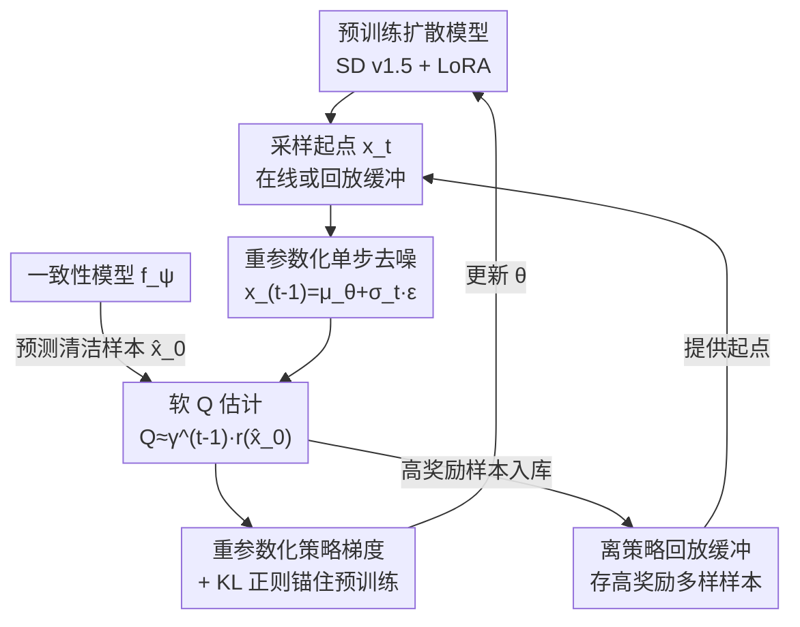

# Diffusion Fine-Tuning via Reparameterized Policy Gradient of the Soft Q-Function

**会议**: ICLR 2026  
**arXiv**: [2512.04559](https://arxiv.org/abs/2512.04559)  
**代码**: [https://github.com/Shin-woocheol/SQDF](https://github.com/Shin-woocheol/SQDF)  
**领域**: 图像生成  
**关键词**: 扩散模型微调, KL正则化强化学习, 软Q函数, 奖励过优化, 文生图对齐

## 一句话总结

提出 SQDF（Soft Q-based Diffusion Finetuning），通过无需训练的可微软 Q 函数估计和重参数化策略梯度，在 KL 正则化 RL 框架下微调扩散模型，配合折扣因子、一致性模型和离策略回放缓冲三个创新组件，在优化目标奖励的同时有效缓解奖励过优化问题，保持样本的自然性和多样性。

## 研究背景与动机

扩散模型在高质量样本生成方面已成为主流范式，但实际应用中需要与下游目标（如美学质量、文本-图像对齐、人类偏好）进行对齐。现有微调方法面临严重的奖励过优化（reward over-optimization）问题，具体表现为：

**语义坍塌（Semantic Collapse）**: 高奖励样本逐渐失去与原始提示的语义对齐，变成无法辨认的抽象纹理

**多样性坍塌（Diversity Collapse）**: 生成结果趋于高度相似的模式

现有方法的局限：
- **RL 方法（DDPO）**: 不利用奖励梯度，优化效率低，且快速多样性坍塌
- **直接反传方法（DRaFT, ReFL）**: 虽然利用了奖励梯度，但容易过优化
- **KL 正则化方法**: 需要训练额外的值函数网络——在扩散 MDP 中训练值函数极不稳定；或依赖高方差的蒙特卡洛梯度估计

核心矛盾：如何在利用强大的奖励梯度信号的同时，通过 KL 正则化避免过优化？

核心 idea：将扩散过程建模为 MDP，利用 Tweedie 公式的后验均值近似提供一个免训练的、可微的软 Q 函数估计，从而直接通过重参数化策略梯度更新模型。

## 方法详解

### 整体框架

SQDF 把扩散逆过程看成一个有限时域 MDP：状态 $s_t = (x_{T-t}, T-t)$，动作 $a_t = x_{T-t-1}$，策略就是单步去噪分布 $\pi_\theta(a_t|s_t) = p_\theta(x_{T-t-1}|x_{T-t})$，只在终态 $x_0$ 拿到稀疏奖励 $r(x_0)$，优化目标是 KL 正则化的期望奖励。整个方法的关键不是去训练一个值函数，而是借 Tweedie 公式把软 Q 函数近似成"对当前去噪结果做一步奖励评估"，于是奖励梯度可以直接通过重参数化回传到模型参数上——这条"采样起点 → 重参数化去噪 → 预测清洁样本 → 软 Q 评分 → 策略梯度更新"的回路就是 SQDF 的主干。在此骨架之外，折扣因子、一致性模型、离策略回放缓冲三个组件分别从信用分配、Q 估计精度和多样性三个角度把框架补完整。

### 关键设计

**1. 免训练软 Q 函数 + 重参数化策略梯度：把不稳定的值函数训练和高方差 REINFORCE 一起换掉**

KL 正则化 RL 的常规做法是显式训练一个值函数网络，但在扩散 MDP 里这件事出了名的不稳定；而不训练值函数、改用 DDPO 那种 REINFORCE 估计又方差太高、优化效率低。SQDF 的核心洞察是递归展开软 Bellman 方程后，对中间状态套用单步后验均值近似（Tweedie 公式），软 Q 函数可以直接坍缩成 $Q_{\text{soft}}^*(x_t, x_{t-1}) \approx r(\hat{x}_0(x_{t-1}))$——先从 $x_{t-1}$ 预测清洁样本 $\hat{x}_0$，再丢给奖励模型评一次分。这一步既绕开了值函数训练，又因为整条路径只是对参数化奖励模型做一步前向传播而保持可微，奖励梯度天然可取。

有了这个可微的 Q 近似，更新就能用低方差的重参数化梯度替掉 REINFORCE。SQDF 借重参数化技巧 $x_{t-1} = \mu_\theta(x_t, t) + \sigma_t \epsilon$ 把噪声从采样里抽离出来，于是策略梯度写成

$$\nabla_\theta \mathcal{L} = \mathbb{E}_{x_t, \epsilon}\big[-\nabla_{x_{t-1}} r(\hat{x}_0) \cdot \nabla_\theta \mu_\theta + \alpha \nabla_\theta D_{KL}\big]$$

第一项是直接穿过奖励模型的低方差梯度信号，效率远高于 REINFORCE；第二项的 KL 散度把微调后的分布锚在预训练分布附近，正是缓解过优化、保住自然性的关键。免训练 Q 近似和重参数化梯度是同一个机制的两面——前者让奖励可微、后者把这份可微低方差地用起来——所以放在一起讲。

**2. 折扣因子 γ：让早期高噪声步别抢功劳**

先前方法隐式取 $\gamma=1$，对所有去噪步一视同仁，但早期高噪声步对最终样本的实际影响很小，平均用力反而误导了信用分配。SQDF 引入 $\gamma<1$ 以指数衰减方式降权早期步骤，作者进一步推导出折扣 MDP 下 Q 近似变为 $Q^* \approx \gamma^{t-1} r(\hat{x}_0)$，且其上下界在一阶近似下一致，说明这个降权是有理论支撑而非临时补丁。实验里 $\gamma$ 也成了优化速度与样本质量之间一个干净的旋钮：$\gamma=1$ 奖励冲得最高但对齐和多样性崩，$\gamma=0.9$ 取得平衡，$\gamma=0.85$ 优化更慢但多样性最好。

**3. 一致性模型改善 Q 估计：补上 Tweedie 在高噪声处的失准**

软 Q 近似全押在 $\hat{x}_0$ 的预测质量上，而 Tweedie 公式在高噪声级别的后验均值估计非常不准（Figure 2-b）。SQDF 用一致性模型 $f_\psi$ 替掉 Tweedie 来预测 $\hat{x}_0$：一致性模型是通过蒸馏概率流 ODE 的积分结果训练的，能在所有时间步给出均匀准确的清洁样本估计（Figure 2-c），从而把 Q 函数近似的质量整体抬上去。相比之下用 4-step DDIM 去预测会让训练不稳定，一致性模型才是这里稳定的来源。

**4. 离策略回放缓冲：用历史高奖励样本守住多样性**

SQDF 的损失天然支持离策略更新——因为采样起点 $x_t$ 并不要求来自当前策略。利用这一点，SQDF 维护一个回放缓冲，把稀有的高奖励且多样的样本存下来反复重用，从而改善模式覆盖、在奖励和多样性之间做权衡。这种离策略能力是相对 DDPO/DRaFT 必须用在策略样本的结构性优势。

### 损失函数 / 训练策略

把三个组件合进目标，最终 SQDF 损失为：

$$\mathcal{L}_{\text{SQDF}} = \mathbb{E}_{x_t \sim \mathcal{D}, x_{t-1} \sim p_\theta}[-\gamma^{t-1} r(f_\psi(x_{t-1})) + \alpha D_{KL}(p_\theta \| p')]$$

实现上采样用 DDPM 50 步，基座是 Stable Diffusion v1.5 上的 LoRA 微调，一致性模型用 LCM-LoRA。小规模实验取 $\gamma=0.9$、$\alpha=2$、lr=$1\times10^{-3}$、LoRA rank=4、batch=64、训练 2000 步；大规模实验取 $\gamma=0.93$、$\alpha=0.05$、lr=$5\times10^{-4}$、LoRA rank=32、batch=258、训练 500 步。

## 实验关键数据

### 主实验

**文生图微调（Stable Diffusion v1.5，优化美学分数 / HPS）:**

从 Figure 3 和 Figure 4 的定性与定量结果：
- ReFL 和 DRaFT 虽然获得高美学分数，但对齐分数（ImageReward, HPS）和多样性（LPIPS, DreamSim）急剧下降
- DDPO 无法达到可比的美学分数且多样性快速坍塌
- **SQDF 在等效奖励水平下始终保持最高的对齐度和多样性**

**KL 正则化基线对比（Figure 4 Pareto 曲线）:**
SQDF 在几乎所有指标对上占据 Pareto 最优。通过调节 $\alpha$，SQDF 能在更高奖励和更好多样性之间灵活权衡。

**在线黑盒优化（Table 1）:**

| 方法 | 目标(美学↑) | ImageReward↑ | HPS↑ | LPIPS-Div↑ | DreamSim-Div↑ |
|------|-----------|-------------|------|-----------|--------------|
| PPO+KL | 6.63 | -1.35 | 0.24 | 0.47 | 0.44 |
| SEIKO-Bootstrap | 7.80 | -1.69 | 0.23 | 0.36 | 0.24 |
| SEIKO-UCB | 7.49 | -1.08 | 0.24 | 0.40 | 0.32 |
| **SQDF-Bootstrap** | **7.87** | **1.14** | — | — | — |

SQDF 在所有评价指标上碾压式领先，尤其在 ImageReward 上从负分提升到正分，说明其在黑盒优化场景下对不准确奖励代理的鲁棒性。

### 消融实验

| 配置 | 美学分数 | DreamSim-Div | LPIPS-Div |
|------|---------|-------------|-----------|
| SQDF (完整) | 7.87 | 0.58 | 0.56 |
| w/o 一致性模型 | 7.10 | 0.62 | 0.59 |
| w/o 回放缓冲 | 8.06 | 0.56 | 0.55 |

| 折扣因子 | 效果 |
|---------|-----|
| $\gamma=1$ | 美学分数更高但对齐和多样性严重下降 |
| $\gamma=0.9$ | 平衡优化速度和样本质量 |
| $\gamma=0.85$ | 优化更慢但多样性最好 |

### 关键发现

- 一致性模型是加速收敛的关键——去除后目标奖励从 7.87 下降到 7.10
- 回放缓冲主要保护多样性，去除后奖励反而略高（8.06）但多样性下降
- $\gamma$ 控制优化速度与样本质量之间的明确权衡
- SQDF 在 SDXL (2.6B) 上同样有效，相对改善幅度与 SD 1.5 高度一致

## 亮点与洞察

- "免训练 Q 函数"的思路极其精巧——利用 Tweedie 公式将难以训练的值函数问题转化为简单的奖励评估
- 折扣因子 $\gamma$ 的引入虽然简单，但理论推导（上下界一阶近似一致）和实验验证都很充分
- 一致性模型作为 Tweedie 公式的升级替代方案，比多步 DDIM 更稳定（4-step DDIM 导致训练不稳定）
- 离策略更新的可行性是 SQDF 相对于 DDPO/DRaFT 的结构性优势——后者必须使用在策略样本
- 实验设计全面：不仅比较基线，还与 KL 增强版基线对比 Pareto 曲线，证明优势来自框架本身而非单纯的正则化

## 局限与展望

- 一步 Q 函数近似在数学上是粗糙的——尤其在 r/α 较大时对数矩生成函数的一阶近似可能不够
- 对一致性模型质量有依赖——若 LCM-LoRA 本身不准确，Q 函数估计也会偏差
- 目前仅在 Stable Diffusion 系列上验证，未测试流匹配（flow matching）等新架构
- 回放缓冲的管理策略（优先级采样）可能需要针对不同任务调优
- 计算成本分析不充分——每步 62s（美学）/401s（HPS）的开销需要进一步优化

## 相关工作与启发

- DDPO (Black et al., 2023): 不利用梯度的 PPO 方法，效率低但思路简单
- DRaFT/ReFL: 直接反传梯度，高效但严重过优化
- SEIKO (Uehara et al., 2024): KL 正则化直接反传，但依赖截断反传通过去噪链
- 本文的"免训练 Q 函数 + 重参数化"框架可能泛化到其他需要 RL 微调的生成模型（如语言模型 RLHF、蛋白质设计等）
- 一致性模型在此处的使用激发了"用蒸馏模型辅助 Q 值估计"的更广泛思路

## 评分

- 新颖性: ⭐⭐⭐⭐⭐ — 免训练可微 Q 函数估计 + 三个互补组件的设计非常巧妙
- 实验充分度: ⭐⭐⭐⭐⭐ — 两种任务设置、全面的消融、Pareto 曲线对比、SDXL 扩展
- 写作质量: ⭐⭐⭐⭐ — 方法部分结构清晰，但一些推导放在附录中增加了阅读难度
- 价值: ⭐⭐⭐⭐⭐ — 为扩散模型对齐提供了原则性的解决方案，代码开源，方法可推广

<!-- RELATED:START -->

## 相关论文

- [\[CVPR 2026\] Reward Sharpness-Aware Fine-Tuning for Diffusion Models](../../CVPR2026/image_generation/reward_sharpness-aware_fine-tuning_for_diffusion_models.md)
- [\[ICML 2026\] DGS-Net: Distillation-Guided Gradient Surgery for CLIP Fine-Tuning in AI-Generated Image Detection](../../ICML2026/image_generation/dgs-net_distillation-guided_gradient_surgery_for_clip_fine-tuning_in_ai-generate.md)
- [\[CVPR 2025\] Personalized Preference Fine-tuning of Diffusion Models](../../CVPR2025/image_generation/personalized_preference_fine-tuning_of_diffusion_models.md)
- [\[ICLR 2026\] Direct Reward Fine-Tuning on Poses for Single Image to 3D Human in the Wild](direct_reward_fine-tuning_on_poses_for_single_image_to_3d_human_in_the_wild.md)
- [\[ECCV 2024\] Memory-Efficient Fine-Tuning for Quantized Diffusion Model](../../ECCV2024/image_generation/memory-efficient_fine-tuning_for_quantized_diffusion_model.md)

<!-- RELATED:END -->
