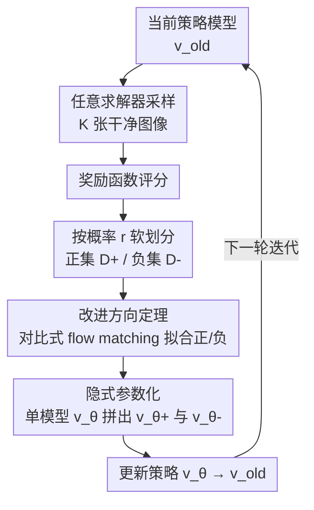

# DiffusionNFT: Online Diffusion Reinforcement with Forward Process

**会议**: ICLR 2026 Oral  
**arXiv**: [2509.16117](https://arxiv.org/abs/2509.16117)  
**代码**: [https://research.nvidia.com/labs/dir/DiffusionNFT](https://research.nvidia.com/labs/dir/DiffusionNFT)  
**领域**: 扩散模型 / 强化学习对齐  
**关键词**: online RL, forward process, negative-aware finetuning, flow matching, CFG-free  

## 一句话总结
提出 DiffusionNFT，一种全新的扩散模型在线 RL 范式：不在反向采样过程上做策略优化（如 GRPO），而是在前向过程上通过 flow matching 目标对正样本和负样本做对比式训练，定义隐式的策略改进方向，比 FlowGRPO 快 3-25×，且无需 CFG。

## 研究背景与动机

**领域现状**：FlowGRPO/DanceGRPO 将反向采样离散化为 MDP，使用 SDE 采样器 + GRPO 实现扩散模型的在线 RL 对齐，取得了显著效果。

**现有痛点**：GRPO 式方法有三大根本性限制：(a) **前向不一致**——只优化反向过程，模型可能退化为级联高斯；(b) **求解器限制**——只能用一阶 SDE 采样器，无法使用更高效的 ODE/高阶求解器；(c) **CFG 复杂性**——需要同时优化有条件和无条件模型，效率低且工程复杂。

**核心矛盾**：反向过程 RL 需要似然估计，但扩散模型的似然不可精确计算。离散化近似引入系统性偏差。

**本文目标** 能否在**前向过程**（flow matching 目标）上做 RL，完全避开似然估计、求解器限制和 CFG 依赖？

**切入角度**：一个扩散策略有唯一的前向过程但多个反向过程（不同求解器）。在前向过程上优化更本质——直接用正/负样本对比定义策略改进方向，嵌入 flow matching 的监督学习框架中。

**核心 idea**：把 RL 信号转化为前向过程中正负样本的对比式 flow matching 目标，用隐式参数化将 reinforcement guidance 直接整合进单一策略模型。

## 方法详解

### 整体框架

DiffusionNFT 想解决的是：现有扩散 RL（FlowGRPO/DanceGRPO 等）都在**反向采样过程**上做策略梯度，因此被似然估计、SDE 求解器限制、CFG 三件事一起拖累。它换了个根本视角——一个扩散策略的前向过程是唯一确定的、反向过程却随求解器而变，所以在**前向过程**上做 RL 更本质。整体是一个迭代回环：用当前模型采一批图、按奖励把它们软划分成正集 $\mathcal{D}^+$ 和负集 $\mathcal{D}^-$，再在前向过程上用一个对比式 flow matching 目标同时"向正样本靠拢、从负样本退开"，更新模型后进入下一轮；全程只需保存干净图像，不存采样轨迹。

### 关键设计

**1. 改进方向定理：用一个等式把"靠近正样本"和"远离负样本"绑成同一个方向**

要在前向过程上做 RL，第一步得回答正样本、负样本和旧策略这三者的速度场之间是什么关系。定理 3.1 证明它们的差异方向成比例：

$$\Delta := \alpha(\mathbf{x}_t)[\mathbf{v}^+(\mathbf{x}_t) - \mathbf{v}^{\text{old}}(\mathbf{x}_t)] = [1-\alpha(\mathbf{x}_t)][\mathbf{v}^{\text{old}}(\mathbf{x}_t) - \mathbf{v}^-(\mathbf{x}_t)]$$

其中 $\alpha(\mathbf{x}_t)$ 是与正策略密度比相关的标量。意义在于：它把"朝正策略 $\mathbf{v}^+$ 靠拢"和"从负策略 $\mathbf{v}^-$ 退开"刻画成同一个方向 $\Delta$，于是不必分别估计两个策略的似然——而似然估计正是反向 RL 绕不开、又只能近似的难点——只要抓住这一个改进方向就够。它在形式上和 CFG 的 guidance 项几乎一样，但方向完全来自 RL 原理，而非人为设定的条件/无条件之差。

**2. 隐式参数化：让一个模型同时学正负两支**

有了改进方向，怎么把它落进一个可训练的 flow matching 损失？定理 3.2 给出同时吃正负数据的目标：

$$\mathcal{L}(\theta) = \mathbb{E}\big[r \,\|\mathbf{v}_\theta^+ - \mathbf{v}\|^2 + (1-r)\,\|\mathbf{v}_\theta^- - \mathbf{v}\|^2\big]$$

关键在于正负两支并不是两个独立网络，而是同一个 $\mathbf{v}_\theta$ 经隐式参数化拼出来：正策略 $\mathbf{v}_\theta^+ = (1-\beta)\mathbf{v}^{\text{old}} + \beta \mathbf{v}_\theta$、负策略 $\mathbf{v}_\theta^- = (1+\beta)\mathbf{v}^{\text{old}} - \beta \mathbf{v}_\theta$。这样只需训练一个模型 $\mathbf{v}_\theta$，却等价于让它同时向正策略靠拢、从负策略退开。代入求最优解得 $\mathbf{v}_{\theta^*} = \mathbf{v}^{\text{old}} + \frac{2}{\beta}\Delta$——reinforcement guidance 被自动整合进策略本身，推理时不再需要额外的 guidance 模型，这也正是它能甩掉 CFG 的根因。

**3. 前向过程优化带来的三个连带优势：前向一致、求解器自由、CFG-free**

把 RL 放到前向过程上不只是换个损失，还顺带卸掉了反向 RL 的三个包袱。其一，**前向一致**：GRPO 式方法只优化反向采样过程、不管前向-反向是否自洽，模型可能退化成级联高斯；而扩散策略的前向过程唯一确定，在它上面用标准 flow matching 训练天然保证模型仍对应一个有效的前向过程。其二，**求解器自由**：反向 RL 把采样离散成 MDP，被锁死在一阶 SDE 采样器上，DiffusionNFT 的训练目标与采样过程解耦，采数据时可用任意 ODE/高阶求解器，而且只保存干净图像、无需存储采样轨迹。其三，**CFG-free**：定理 3.1 的 $\Delta$ 在形式上等价于一个 guidance 项，相当于 RL 自己学到了引导方向并经设计 2 吸收进单一策略，于是不必像 GRPO 那样同时维护有条件/无条件双模型。

### 损失函数 / 训练策略

- 基于 SD3.5-Medium，rectified flow 参数化
- 每轮采样 $K$ 图像，按奖励分正负
- $\beta$ 控制 guidance 强度（类似 CFG 强度）
- 支持多奖励模型联合训练

## 实验关键数据

### 主实验（SD3.5-Medium, 单奖励 Head-to-Head vs FlowGRPO）

| 任务 | DiffusionNFT | FlowGRPO | 效率提升 |
|------|-------------|----------|---------|
| GenEval | 0.98 (1k steps) | 0.95 (5k steps) | **25×** |
| PickScore | 更高 | — | 3-5× |
| Aesthetic | 更高 | — | 3× |
| OCR | 更高 | — | 5× |

**多奖励联合训练（SD3.5-Medium → SD3.5-Medium-NFT）**:
- GenEval: 0.63 → **0.98** (w/o CFG)
- DPG-Bench: 81.65 → **92.82**
- T2I-CompBench: 0.54 → **0.75**
- HPS v2.1: 29.95 → **32.52**

### 消融实验

| 配置 | 效果 |
|------|-----|
| 只训练正样本（RFT） | 快速坍缩 |
| DiffusionNFT（完整） | 稳定提升 |
| 增大 $\beta$ | 更激进但可能过拟合 |
| 不同求解器（ODE/高阶） | 都兼容，性能无降 |

### 关键发现
- **负样本至关重要**：只在正样本上训练（RFT）会导致模式坍缩，加入负样本后稳定
- DiffusionNFT 完全无 CFG 但从极低起点（GenEval 0.24 w/o CFG）快速提升到 0.98，超过 FlowGRPO + CFG 的 0.95
- 可以用任意求解器（ODE/高阶），且不需要存储采样轨迹，训练效率显著更高
- 对域外奖励也有泛化提升

## 亮点与洞察
- **前向 vs 反向 RL** 的视角转换是核心贡献。扩散模型的前向过程唯一确定而反向过程依赖求解器选择，在前向过程上做 RL 更本质且避开了似然估计的困难。
- **隐式参数化** 技巧极为巧妙——通过 $\mathbf{v}_\theta^+ = (1-\beta)\mathbf{v}^{\text{old}} + \beta \mathbf{v}_\theta$，只需训练一个模型就等价于同时做"向好靠拢+离坏远走"。这比显式训练 guidance 模型高效得多。
- **NFT vs GRPO** 的类比类似 LLM 中的 DPO vs PPO——将 RL 转化为监督学习框架，工程实现更简单。

## 局限与展望
- $\beta$ 的选择需要调优，过大导致过拟合奖励
- 正负样本划分基于采样概率而非硬阈值，可能引入噪声
- 仅在 SD3.5-Medium 上验证，未在其他架构（SDXL/Flux/DiT）上测试
- 理论分析假设无限数据和模型容量，实际中近似误差未量化
- 多奖励联合训练的奖励权重设置未被系统研究

## 相关工作与启发
- **vs FlowGRPO**: 根本性不同——前向 RL vs 反向 RL。DiffusionNFT 快 3-25×，无需 SDE 采样器和 CFG。
- **vs DPO/DRaFT**: DiffusionNFT 是在线的（on-policy 采样），避免了离线方法的分布偏移问题。
- **vs LLM NFT (Chen et al., 2025c)**: 将 NFT 范式从语言模型引入扩散模型，利用 flow matching 的特性进行适配。

## 评分
- 新颖性: ⭐⭐⭐⭐⭐ 前向过程 RL 是全新范式，隐式参数化优雅地统一了正负数据训练
- 实验充分度: ⭐⭐⭐⭐⭐ 与 FlowGRPO 的 head-to-head 对比清晰，多奖励联合训练全面
- 写作质量: ⭐⭐⭐⭐⭐ 理论推导严谨清晰，与 CFG 的类比直觉化，图表设计优秀
- 价值: ⭐⭐⭐⭐⭐ 解决了扩散 RL 的多个根本性问题（求解器限制、CFG 依赖、效率），有望成为新标准

<!-- RELATED:START -->

## 相关论文

- [\[ICLR 2026\] Flow Matching with Injected Noise for Offline-to-Online Reinforcement Learning](flow_matching_with_injected_noise_for_offline-to-online_reinforcement_learning.md)
- [\[CVPR 2026\] OARS: Process-Aware Online Alignment for Generative Real-World Image Super-Resolution](../../CVPR2026/image_generation/oars_process-aware_online_alignment_for_generative_real-world_image_super-resolu.md)
- [\[AAAI 2026\] ORVIT: Near-Optimal Online Distributionally Robust Reinforcement Learning](../../AAAI2026/image_generation/orvit_near-optimal_online_distributionally_robust_reinforcement_learning.md)
- [\[ICLR 2026\] EditScore: Unlocking Online RL for Image Editing via High-Fidelity Reward Modeling](editscore_unlocking_online_rl_for_image_editing_via_high-fidelity_reward_modelin.md)
- [\[ICML 2025\] Sample Complexity of Distributionally Robust Off-Dynamics Reinforcement Learning with Online Interaction](../../ICML2025/image_generation/sample_complexity_of_distributionally_robust_off-dynamics_reinforcement_learning.md)

<!-- RELATED:END -->
