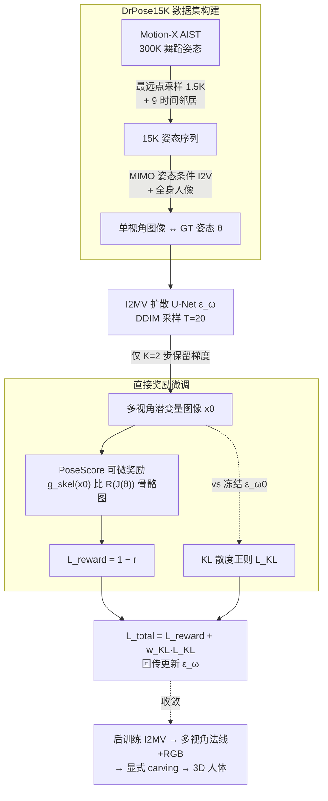

# Direct Reward Fine-Tuning on Poses for Single Image to 3D Human in the Wild

**会议**: ICLR 2026  
**arXiv**: [2603.02619](https://arxiv.org/abs/2603.02619)  
**代码**: [项目页](https://seunguk-do.github.io/drpose)  
**领域**: 图像生成  
**关键词**: single-view 3D human reconstruction, multi-view diffusion, direct reward fine-tuning, pose alignment, PoseScore  

## 一句话总结
提出 DrPose，通过直接奖励微调最大化 PoseScore（多视角潜变量图像与 GT 3D 姿态的骨骼一致性）+ KL 正则化防止 reward hacking，结合 DrPose15K 数据集（从 Motion-X 运动数据集采样 15K 多样姿态 + MIMO 视频生成器合成单视角图像），使多视角扩散模型在动态/杂技等困难姿态场景下的 3D 人体重建质量显著提升。

## 研究背景与动机

**领域现状**：基于多视角扩散模型的单视角 3D 人体重建已成主流范式（PSHuman、Era3D 等），流程为"输入单图 → 多视角扩散生成 → 显式/隐式 3D 重建"。扩散模型的强先验使其在遮挡区域的纹理细节上远优于早期 PIFu 系方法。

**现有痛点**：当输入图像包含动态或高难度姿态（如街舞、杂技、极限运动）时，多视角扩散模型生成的图像中人体姿态严重不自然。根本原因是可用的 3D 人体训练数据集（THuman2.1 仅 2445 姿态、CustomHumans 仅 647 姿态）规模小且姿态分布窄，缺乏极端姿态覆盖。

**核心矛盾**：3D 人体扫描数据集的采集成本极高（多视角设备 + 受试者招募 + 隐私问题），难以大规模扩展；但人体运动捕捉数据（如 Motion-X 的 AIST 子集）则拥有丰富多样的 3D 姿态序列。两类数据存在模态 gap——运动数据只有姿态参数，没有对应的多视角图像。

**本文切入角度**：不依赖昂贵的 3D 人体资产，而是用运动数据集提供姿态监督信号，通过直接奖励微调对齐多视角扩散模型。关键是设计一个可微的 PoseScore 奖励函数，量化生成的多视角潜变量图像与 GT 3D 姿态的一致性。

**核心 idea**：用运动数据集的姿态监督 + 可微奖励微调，让多视角扩散模型"学会"在困难姿态下也能生成姿态准确的多视角图像。

## 方法详解

### 整体框架

DrPose 要解决的是：当输入图像里的人体处于街舞、杂技这类极端姿态时，多视角扩散模型生成的人体姿态严重失真，而问题的根源在于 3D 人体扫描数据太少、姿态分布太窄。它的思路是绕开昂贵的 3D 资产，转而从丰富的运动捕捉数据里借姿态监督。整条流水线分三块串起来：先用 Motion-X 的舞蹈姿态 + 视频生成器 MIMO 合成出一批姿态多样的单视角图像（DrPose15K 数据集）；再用一个可微的奖励函数 PoseScore 衡量扩散模型生成的多视角图像和 GT 3D 姿态对不对得上，通过直接奖励微调把模型往姿态准确的方向拉（KL 正则同时兜住画质）；最后把后训练好的多视角扩散模型接上显式 carving（SMPL-X 初始化 → 可微 remeshing → 外观融合）完成 3D 重建。真正属于 DrPose 创新的是中间这套"数据 + 可微奖励 + 微调"的后训练机制，重建管线沿用 PSHuman 现成方案。

### 关键设计

**1. DrPose15K 数据集构建：用运动数据 + 视频生成器补齐缺失的多样姿态**

奖励微调需要大量"姿态多样的单视角图像 + GT 3D 姿态"配对，但现成的 3D 扫描集姿态太单一（THuman2.1 仅 2445、CustomHumans 仅 647 个姿态）。DrPose 转而从 Motion-X 的 AIST 子集（300K 舞蹈姿态）里用最远点采样挑出 1.5K 个尽量分散的姿态，每个再取 9 个时间邻居凑成姿态序列（这是 MIMO 的输入格式），共 15K 姿态；然后用姿态条件的 I2V 模型 MIMO 把全身人像按这些姿态序列动画化，生成对应的单视角图像。最终 DrPose15K 的 SMPL-X 关节位置标准差比 THuman2.1 大 1.73 倍，姿态多样性显著更高，正好补上了极端姿态这块短板。

**2. PoseScore 可微奖励函数：把"姿态对不对"变成可回传梯度的 2D 骨骼图比较**

有了多样姿态的数据还不够，得有个信号告诉模型"生成的姿态准不准"。直接在 3D 空间对齐生成结果和 GT 姿态既复杂又难求导，DrPose 改成在 2D 骨骼图像空间里比。一路是生成结果：用预训练 U-Net $g_{\text{skel}}$ 把多视角潜变量图像 $\mathbf{x}_0$ 转成预测骨骼图 $\hat{I}_{\text{skel}}$；另一路是监督信号：用渲染函数 $\mathcal{R}$ 把 GT 3D 关节 $J(\theta)$ 投影到各个视角得到 GT 骨骼图 $I_{\text{skel}}$。奖励就是两者的负距离

$$r(\mathbf{x}_0, \theta) = -\mathbb{E}(\|\hat{I}_{\text{skel}} - I_{\text{skel}}\|) = -\mathbb{E}(\|g_{\text{skel}}(\mathbf{x}_0) - \mathcal{R}(J(\theta))\|)$$

其中距离用 BCE + LPIPS 估计。关键在于骨骼图被设计成 23 通道图像（每个关节占一个通道），这样既精确保留了姿态的结构信息，又全程可微——梯度能从奖励一路回传到扩散模型参数，这是后面整套奖励微调能跑起来的前提。

**3. 直接奖励微调（基于 DRTune）：用稀疏梯度的方式把奖励信号灌回 U-Net**

有了可微奖励，微调本身走 DRTune 路线：从噪声 $x_T \sim \mathcal{N}(0, \mathbf{I})$ 出发，经 DDIM 采样（$T=20$ 步）生成多视角潜变量图像 $\mathbf{x}_0$，再计算 $\mathcal{L}_{\text{reward}} = 1 - r(\mathbf{x}_0, \theta)$ 并反向传播。问题是生成的是 6 视角 768×768 图像，若 20 步全保留梯度显存根本扛不住，所以只对采样出的 $K=2$ 个去噪步保留梯度、其余步阻断输入梯度（stop_grad）。这种稀疏采样训练步 + 梯度停止是让奖励微调在这个规模下可行的必要效率折中，也让优化集中在早期去噪步上。

**4. KL 散度正则化：防止模型为刷高 PoseScore 而牺牲画质（reward hacking）**

只优化奖励容易让模型钻空子——姿态分数上去了图像质量却塌了。DrPose 在中间去噪步 $t \in t_{\text{train}}$ 处约束可训练模型 $\epsilon_\omega$ 不要偏离冻结的初始模型 $\epsilon_{\omega_0}$ 太远，用两者预测噪声的 MSE 当正则项

$$\mathcal{L}_{\text{KL}} = \mathbb{E}(\|\hat{\epsilon} - \hat{\epsilon}_0\|)$$

这样在拉高姿态准确性的同时，把原模型的图像质量稳住。总目标是 $\mathcal{L}_{\text{reward}} + w_{\text{KL}} \cdot \mathcal{L}_{\text{KL}}$ 联合最小化。

### 损失函数 / 训练策略

- 总损失：$\mathcal{L}_{\text{total}} = \mathcal{L}_{\text{reward}} + w_{\text{KL}} \cdot \mathcal{L}_{\text{KL}}$
- DDIM 采样 $T=20$ 步，训练步 $K=2$，最大早停时间步 $m=8$
- $w_{\text{KL}} = 0.01$
- 基础模型：PSHuman（768×768，6 视角法线图 + RGB）
- 单卡 NVIDIA H200，batch size 2 + 梯度累积 2 步，训练 18K 迭代
- PoseScore 中的 $g_{\text{skel}}$ 在 THuman2.1 + CustomHumans（约 3K 扫描）上预训练

## 实验关键数据

### 主实验（几何质量，Table 1）

| 方法 | THuman2.1 CD↓ | CustomHumans CD↓ | MixamoRP CD↓ |
|------|--------------|-----------------|-------------|
| ECON | 101.65 | 126.14 | 166.54 |
| SiTH | 63.30 | 71.94 | 158.27 |
| PSHuman | 52.96 | 52.22 | 137.28 |
| **Ours (PSHuman)** | **42.05** | **44.13** | **126.53** |

### 外观质量（Table 2）

| 方法 | THuman2.1 PSNR↑ | CustomHumans PSNR↑ | MixamoRP PSNR↑ |
|------|-----------------|-------------------|---------------|
| PSHuman | 18.39 | 18.91 | 17.59 |
| **Ours** | **20.86** | **19.19** | **17.66** |

### 消融实验
- 基础模型消融：Era3D 和 PSHuman 作为基础模型均获得一致提升，选 PSHuman 是因其面部质量更好
- PoseScore 中 $g_{\text{skel}}$ 的验证：在 THuman2.1 测试集上 PSNR=22.48、SSIM=0.93，可靠地从潜变量预测骨骼图

### 关键发现
- **在困难姿态基准 MixamoRP 上提升最显著**：CD 从 137.28 降至 126.53（↓7.8%），证明 DrPose 在极端姿态下的价值
- **常规基准也有一致提升**：THuman2.1 上 CD 从 52.96 降至 42.05（↓20.6%），说明 DrPose 不仅改善困难姿态，对一般姿态也有帮助
- **In-the-wild 定性结果**（Fig. 8, 9）：在互联网真实图片（跳舞、滑板、瑜伽等场景）上，DrPose 后训练模型生成的多视角图像姿态明显更自然

## 亮点与洞察
- **运动数据的巧妙利用**：3D 人体扫描数据昂贵稀缺，但运动捕捉数据丰富。通过 PoseScore 可微奖励 + 视频生成器合成图像，将运动数据的姿态多样性间接迁移到多视角扩散模型中，无需任何 3D 人体资产。
- **骨骼图作为中间表征**：将潜变量空间与 3D 姿态空间的一致性问题转化为 2D 骨骼图比较问题，既保证了可微性，又避免了 3D 空间对齐的复杂性。23 通道设计（每关节一通道）比直接渲染完整骨骼图更精确。
- **后训练范式的轻量性**：仅需单卡 H200、18K 迭代即可完成后训练，不改变基础模型架构，可即插即用到 Era3D/PSHuman 等多种 I2MV 模型上。

## 局限与展望
- 需要分割好的输入图像，分割不完美时边界区域会出现浮动几何体伪影
- 显存消耗大：需通过迭代去噪生成 24 张 768×768 图像来计算 PoseScore，加上 KL 正则需要存储冻结的初始 U-Net
- DrPose15K 的图像由 MIMO 生成，质量受限于 MIMO 的生成能力，可能引入域偏移
- 仅验证了 6 视角方案，更多视角或更高分辨率的扩展性未探索
- MixamoRP 基准使用商业模型构建，可复现性受限

## 相关工作与启发
- **vs PSHuman/Era3D**：直接改进的基础模型，DrPose 作为即插即用的后训练模块，在两者上均获得一致提升
- **vs DRTune**：将通用的直接奖励微调框架迁移到 3D 人体领域，关键创新在于设计了领域特定的 PoseScore 奖励函数
- **vs RLHF/GRPO 类方法**：DrPose 采用的是可微奖励 + 直接反向传播路线（类 DRTune），不需要采样多条轨迹和组归一化，收敛更快
- **vs 数据扩增方法**：可以与更大规模的运动数据集（如 Motion-X 完整集）或更好的视频生成器组合，提升上限

## 评分
- 新颖性: ⭐⭐⭐⭐ 将直接奖励微调引入 3D 人体领域，PoseScore 设计巧妙
- 实验充分度: ⭐⭐⭐⭐ 三个基准 + 新提出的困难姿态基准 MixamoRP + 定性 in-the-wild 验证
- 写作质量: ⭐⭐⭐⭐ 问题动机清晰，算法伪代码完整
- 价值: ⭐⭐⭐⭐ 有效解决动态姿态下 3D 人体重建的质量瓶颈，后训练范式轻量可扩展

<!-- RELATED:START -->

## 相关论文

- [\[CVPR 2026\] Reward Sharpness-Aware Fine-Tuning for Diffusion Models](../../CVPR2026/image_generation/reward_sharpness-aware_fine-tuning_for_diffusion_models.md)
- [\[ICLR 2026\] EditReward: A Human-Aligned Reward Model for Instruction-Guided Image Editing](editreward_a_human-aligned_reward_model_for_instruction-guided_image_editing.md)
- [\[ICLR 2026\] Diffusion Fine-Tuning via Reparameterized Policy Gradient of the Soft Q-Function](diffusion_fine-tuning_via_reparameterized_policy_gradient_of_the_soft_q-function.md)
- [\[NeurIPS 2025\] GeneMAN: Generalizable Single-Image 3D Human Reconstruction from Multi-Source Human Data](../../NeurIPS2025/image_generation/geneman_generalizable_single-image_3d_human_reconstruction_from_multi-source_hum.md)
- [\[ICCV 2025\] DreamDance: Animating Human Images by Enriching 3D Geometry Cues from 2D Poses](../../ICCV2025/image_generation/dreamdance_animating_human_images_by_enriching_3d_geometry_cues_from_2d_poses.md)

<!-- RELATED:END -->
