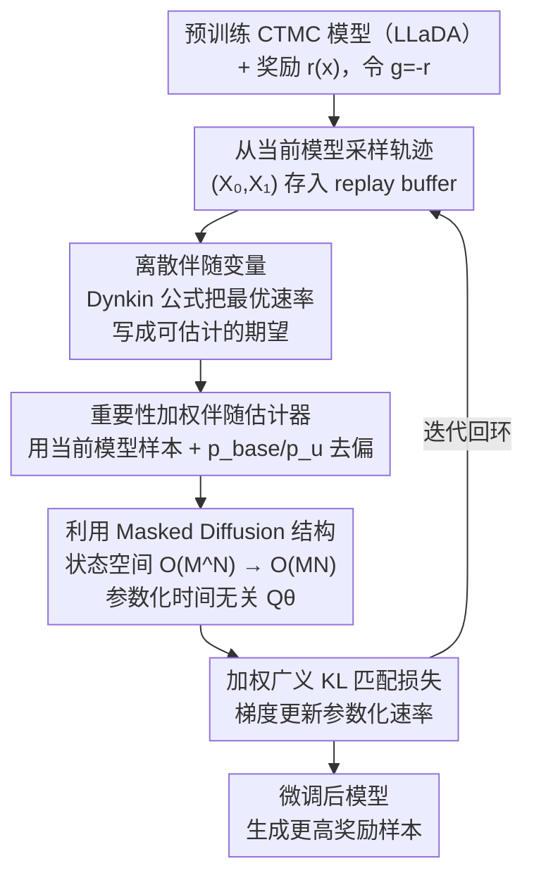

# Discrete Adjoint Matching

**会议**: ICLR 2026  
**arXiv**: [2602.07132](https://arxiv.org/abs/2602.07132)  
**代码**: 无  
**领域**: 图像生成 / 离散生成模型微调  
**关键词**: Adjoint Matching, 离散伴随变量, CTMC, 扩散式LLM微调, 熵正则化奖励优化

## 一句话总结

提出 Discrete Adjoint Matching（DAM），从纯统计学视角（而非控制论）推导出离散状态空间上的伴随变量，将连续域的 Adjoint Matching 推广到基于连续时间马尔可夫链（CTMC）的离散生成模型，实现了对扩散式 LLM（LLaDA-8B）的有效微调，在 Sudoku 上将准确率从 11.5% 提升至 89.2%。

## 研究背景与动机

**领域现状**：熵正则化奖励优化 $\min_u \mathbb{E}[g(X_1)] + D_{\text{KL}}(p^u \| p^{\text{base}})$ 是微调生成模型的标准范式，广泛用于 RLHF、条件生成等场景。其最优解的解析形式为 $p^\star(X) \propto p^{\text{base}}(X) e^{-g(X_1)}$，即让模型分布向高奖励区域偏移的同时不偏离参考分布太远。在连续状态空间中，Adjoint Matching（AM）通过引入伴随变量将优化问题转化为匹配问题，在图像微调、分子生成等任务上取得了很好的效果。

**现有痛点**：AM 的核心依赖于连续空间的梯度信息——终端伴随量是 $\tilde{a}_1(X) = \nabla g(X_1)$，动力学涉及 Jacobian $\nabla u^{\text{base}}$。然而，离散状态空间处处不可微，$g(x)$ 没有梯度，速率函数 $u_t(y,x)$ 代替了 SDE 的漂移项，这些根本性差异使得连续 AM 无法直接适用于离散域。

**核心矛盾**：近年来基于 CTMC 的离散扩散模型（如 MDLM、LLaDA 等扩散式 LLM）在文本生成中崭露头角，但如何为这类模型做有原则的奖励优化微调仍是开放问题。现有方法如 D1 采用策略梯度的近似，需要处理难以估计的似然和不可微奖励，训练稳定性受限。

**切入角度**：作者观察到 AM 中伴随变量的本质不是控制论概念，而是一个统计量——它估计的是最优解与基础模型之间的比值。在离散域中，这个比值可以用 Dynkin 公式（一种将函数值表达为随机过程期望的工具）来估计，完全绕过了对可微性的需求。

**核心 idea**：用 Dynkin 公式从纯统计学角度推导离散伴随变量，将最优 CTMC 速率的估计转化为匹配问题，从而实现对 CTMC 离散生成模型的有原则微调。

## 方法详解

### 整体框架

DAM 的输入是一个预训练的基于 CTMC 的离散生成模型（如 LLaDA 扩散式 LLM）和一个奖励函数 $r(x)$（设 $g(x) = -r(x)$），输出是微调后、能生成更高奖励样本的模型。它的整体逻辑是把"奖励微调"重新表述成一个**速率匹配**问题：熵正则化最优解 $p^\star \propto p^{\text{base}} e^{-g}$ 对应一个最优 CTMC 速率 $u_t^\star(y,x)$，只要训练一个参数化速率去逼近它，模型就被推向高奖励区域。难点全在"最优速率"这个匹配目标本身——它在离散域里**既不可微、又采不到、状态空间还指数大**，DAM 的三个关键设计正是逐一拆掉这三道坎：用 Dynkin 公式构造**离散伴随变量**，把最优速率写成一个可估计的期望（绕开不可微）；再用**重要性加权**让这个期望能用当前模型的样本无偏估出（绕开"采不到最优分布"）；最后借 **masked diffusion 结构**把状态空间从 $O(M^N)$ 压到 $O(MN)$（绕开维度灾难）。训练时用一个加权广义 KL 损失，在 replay buffer 上迭代地把参数化速率匹配到伴随估计器给出的目标，整体是一个"采样轨迹 → 估计伴随 → 匹配更新"的回环。

### 关键设计

**1. 离散伴随变量：用 Dynkin 公式给出最优速率的无偏估计器**

离散域处处不可微，连续 AM 赖以工作的梯度终端量 $\nabla g$ 在这里根本不存在，必须换一条路构造伴随变量。DAM 先把最优 CTMC 速率写成解析形式 $u_t^\star(y,x) = u_t^{\text{base}}(y,x) \cdot e^{-V_t(y)+V_t(x)}$，其中 $V_t(x) = -\log \sum_z p_{1|t}^{\text{base}}(z|x) e^{-g(z)}$ 是值函数，于是问题落到了估计指数值差 $e^{-V_t(y)+V_t(x)}$ 上。作者把 Dynkin 公式（一种将函数值写成随机过程期望的工具）作用在 CTMC 上，得到离散伴随变量 $\tilde{a}_t(y;X)$，它满足一个线性 ODE，终端条件为

$$\tilde{a}_1(y;X) = e^{-g(y)+g(X_1)}$$

注意这是指数形式的终端损失差，而非连续 AM 中的梯度 $\nabla g$——整个推导不碰任何导数，因此不受不可微性困扰。Dynkin 公式对任何 Feller 过程都成立，在 SDE 上特化为 Itô 引理、在 CTMC 上则给出这套离散伴随系统，这也解释了为什么伴随变量的本质是统计量而非微分量。一个值得注意的结构差异是：离散伴随量以**乘法方式**修正基础速率（$u^{\text{base}} \cdot \mathbb{E}[\tilde{a}]$），而连续 AM 是加法修正（$u^{\text{base}} - \mathbb{E}[\tilde{a}]$），对应离散域里最优解对基础模型的"缩放"而非"平移"。

**2. 重要性加权伴随估计器：把无法采样的最优分布换成当前模型并去偏**

上面的伴随 ODE 有解析解 $\tilde{a}_t(y;X_1) = \sum_z p_{1|t}^{\text{base}}(z|y) e^{-g(z)+g(X_1)}$，但它需要从最优分布 $p^\star$ 采样 $X_1$——而 $p^\star$ 恰恰是我们还没拿到的目标，没法直接采。DAM 转而用当前模型采样 $X_1 \sim p^u$，再用自归一化重要性采样把分布错配带来的偏差修回去：

$$\hat{a}_t(y;Z,\{X_1^{(k)}\}) = \frac{p_{1|t}^{\text{base}}(Z|y)}{p_{1|t}^u(Z|y)} e^{-g(Z)} \cdot \left(\frac{1}{K}\sum_k \frac{p_{1|t}^{\text{base}}(X_1^{(k)}|x)}{p_{1|t}^u(X_1^{(k)}|x)} e^{-g(X_1^{(k)})}\right)^{-1}$$

其中的重要性权重就是 $p^{\text{base}}/p^u$ 的比值，对 CTMC 模型可以高效计算。这一步不是锦上添花：在合成任务 Pinwheel 上，直接用原始解析解的偏差和方差都明显高于重要性加权版本，而加权后 DAM 成为一致估计器（$K \to \infty$ 时无偏），实验里两个 jump 都能稳定收敛。

**3. 利用 Masked Diffusion 结构：把 $O(M^N)$ 的状态空间压到 $O(MN)$**

直接在完整离散状态空间上算伴随量完全不现实——vocab=1000、seq_len=100 就意味着 $10^{300}$ 个状态。DAM 借力一个现实观察：几乎所有基础 CTMC 都是 masked diffusion 模型（从全 mask 状态逐步 unmask），其速率矩阵具有分解形式 $u_t^{\text{base}}(y,x) = \lambda_t^{\text{base}}(x) Q^{\text{base}}(y|x)$，其中 $Q^{\text{base}}$ 被限制在"一次只 unmask 一个 token"的转移上。作者进一步证明（Proposition 2.5）最优速率 $u_t^\star$ 自动保持同样的 masked 结构，于是只需参数化一个时间无关的 $Q^\theta(y|x)$ 并用 LLM 来建模，完全不必改动模型架构。正是这一结构保持性，让 DAM 从理论玩具变成可以真正微调大规模扩散式 LLM 的方法。

### 损失函数 / 训练策略

DAM 使用广义 KL 散度（gKL）作为匹配函数：$D_{\text{gKL}}(u,w) = \sum_{y \neq x} [u(y,x) - w(y,x) + w(y,x)\log \frac{w(y,x)}{u(y,x)}]$，相比朴素 $\ell_2$ 损失能更好地保持离散域的概率结构（如非负性）。训练时，从当前模型采样轨迹存入 replay buffer，通过 reciprocal projection 采样中间状态 $X_t$，按模型分布采样跳转目标 $y$ 并用 $p_t^u(y|x)^{-1}$ 去偏差。每轮迭代采样 $K$ 条模型轨迹计算重要性加权伴随估计，再用加权 gKL 损失更新模型。

## 实验关键数据

### 合成实验：收敛到最优分布

在 91×91 离散网格上的 Checkerboard 和 Pinwheel 任务中，DAM 与 D1、SVDD 对比。由于状态空间小，可以精确计算最优分布 $p^\star$。

| 方法 | Checkerboard 视觉匹配 | Pinwheel $D_{\text{KL}}(p^\star \| p^u)$ 收敛 | 说明 |
|------|---------------------|----------------------------------------------|------|
| DAM（重要性加权） | 最接近 $p^\star$ | 稳定收敛到 $\sim 10^{-3}$ | 两个 jump 都稳定 |
| DAM（解析伴随消融） | 略差 | 收敛但偏差更大 | 验证重要性加权有效 |
| D1 | 明显偏差 | 平台期，未收敛 | 策略梯度近似受限 |
| SVDD | 明显偏差 | 平台期，未收敛 | 值函数回归方式的局限 |

### 数学推理任务：微调 LLaDA-8B-Instruct

| 任务 | 序列长度 | LLaDA 基线 | + D1 | + DAM | DAM 提升 |
|------|---------|-----------|------|-------|---------|
| GSM8K | 128 | 68.6% | 75.6% | **75.7%** | +7.1 pp |
| GSM8K | 256 | 76.8% | 79.8% | **79.9%** | +3.1 pp |
| MATH500 | 128 | 28.8% | 31.2% | **32.6%** | +3.8 pp |
| MATH500 | 256 | 30.8% | **37.2%** | 36.4% | +5.6 pp |
| Countdown | 128 | 34.8% | 43.8% | **60.2%** | +25.4 pp |
| Countdown | 256 | 19.5% | 31.3% | **55.5%** | +36.0 pp |
| Sudoku | 128 | 11.5% | 23.8% | **89.2%** | +77.7 pp |
| Sudoku | 256 | 6.4% | 12.9% | **88.1%** | +81.7 pp |

### 测试时泛化（跨序列长度）

| 方法 | 训练长度 | Countdown 128/256/512 | Sudoku 128/256/512 |
|------|---------|----------------------|-------------------|
| DAM | 128 | 60.2 / 59.8 / 59.0 | 89.2 / 88.6 / 84.9 |
| D1 | 128 | 43.8 / 33.6 / 28.1 | 23.8 / 16.9 / 10.0 |
| DAM | 256 | 58.6 / 55.5 / 49.6 | 87.0 / 88.1 / 87.1 |
| D1 | 256 | 33.2 / 31.3 / 37.1 | 18.4 / 12.9 / 11.0 |

### 关键发现

- **Countdown 和 Sudoku 上 DAM 大幅领先 D1**：Sudoku 上差距达 65+ 个百分点，说明在需要精确约束满足的任务上，DAM 的有原则优化远优于策略梯度近似
- **GSM8K 和 MATH500 上差距较小**：这两个任务上 D1 的近似假设可能已经足够有效，DAM 优势不明显
- **重要性加权伴随估计器明显优于解析版本**：在 Pinwheel 合成实验中，重要性加权版本的偏差和方差都显著更低
- **泛化性强**：DAM 微调的模型在不同测试序列长度上保持稳定性能（Sudoku: 89.2→88.6→84.9），而 D1 退化严重（23.8→16.9→10.0）

## 亮点与洞察

- **统计学视角绕过不可微性**：整个推导不依赖任何梯度，而是通过 Dynkin 公式这一概率论基本工具实现。这说明伴随变量的本质是统计量而非微分量，连续域中恰好两者重合
- **乘法 vs 加法修正的深层含义**：连续 AM 用 $u^{\text{base}} - \mathbb{E}[\tilde{a}]$ 的加法修正，离散 DAM 用 $u^{\text{base}} \cdot \mathbb{E}[\tilde{a}]$ 的乘法修正。这反映了连续域中最优解对基础模型的"偏移"vs 离散域中的"缩放倍率"，是两种空间几何结构差异的自然体现
- **Masked 结构保持定理**：Proposition 2.5 证明最优速率自动保持 masked diffusion 的结构约束，这意味着 DAM 可以无缝使用现有 LLM 架构进行参数化和推理，实际部署门槛极低

## 局限与展望

- **仅验证在 masked CTMC 模型上**：所有实验都基于 masked diffusion 模型（LLaDA），未验证对非 masked CTMC（如 uniform transition）或其他离散生成模型的效果，论文自身也指出将 DAM 应用于非 masked CTMC 是未来工作
- **实验域较窄**：仅有合成任务和数学推理，缺乏代码生成、蛋白质设计、自然语言对话等更广泛应用的验证
- **与自回归 LLM 不兼容**：DAM 本质上针对 CTMC 类离散扩散模型设计，无法直接用于 GPT 等自回归模型的 RLHF，应用范围受限于新兴的扩散式 LLM 生态
- **计算效率存疑**：每步训练需要采样 $K$ 条模型轨迹计算重要性加权，加上 replay buffer 管理，实际训练开销远高于简单的策略梯度方法
- **GSM8K/MATH500 上优势不明显**：在这些主流数学推理 benchmark 上与 D1 差距很小，缺乏"杀手级"证据说明理论上的优雅在实践中能带来显著收益

## 相关工作与启发

- **vs Adjoint Matching (AM)**：连续域版本，通过控制论推导伴随变量，依赖梯度信息。DAM 证明了统计学视角可以完全替代控制论视角，且更通用
- **vs D1 (Zhao et al., 2025)**：当前 masked CTMC 微调的 SOTA 方法，采用策略梯度方式。DAM 在约束满足类任务上大幅领先，但在一般数学推理上优势有限
- **vs SVDD (Li et al., 2024)**：基于值函数回归的方法，通过奖励回归估计值函数。DAM 直接估计指数值差而非值函数本身，理论性质更好
- **vs DiffuCoder / DRAKES**：其他离散扩散模型微调方法，多需要近似处理不可微奖励或不可tractable的似然。DAM 的匹配框架天然适配不可微奖励

## 评分

- 新颖性: ⭐⭐⭐⭐⭐ 从统计学视角推导离散伴随变量，绕过不可微性的思路非常优雅，是真正的理论创新
- 实验充分度: ⭐⭐⭐ 合成实验充分验证了理论，但应用实验域较窄，GSM8K/MATH500 上优势不明显
- 写作质量: ⭐⭐⭐⭐⭐ 理论推导严谨清晰，统计学视角和控制论视角双线并行，结构优秀
- 价值: ⭐⭐⭐⭐ 为离散扩散模型微调提供了有原则的理论框架，但实际影响取决于扩散式 LLM 的发展前景
- **Flow Matching / Score Matching**: DAM 延续了"匹配"这一优雅的训练范式，将其推广到离散域
- **启发**: 在微调离散生成模型时，匹配方法可能比策略梯度方法更合适，因为前者利用了生成模型的结构化先验知识

## 评分

- 新颖性: ⭐⭐⭐⭐⭐
- 实验充分度: ⭐⭐⭐
- 写作质量: ⭐⭐⭐⭐
- 价值: ⭐⭐⭐⭐

<!-- RELATED:START -->

## 相关论文

- [\[ICLR 2026\] Loopholing Discrete Diffusion: Deterministic Bypass of the Sampling Wall](loopholing_discrete_diffusion_deterministic_bypass_of_the_sampling_wall.md)
- [\[ICLR 2026\] JointDiff: Bridging Continuous and Discrete in Multi-Agent Trajectory Generation](jointdiff_bridging_continuous_and_discrete_in_multi-agent_trajectory_generation.md)
- [\[ICLR 2026\] Embracing Discrete Search: A Reasonable Approach to Causal Structure Learning](embracing_discrete_search_a_reasonable_approach_to_causal_structure_learning.md)
- [\[ICLR 2026\] Improving Discrete Diffusion Unmasking Policies Beyond Explicit Reference Policies (UPO)](improving_discrete_diffusion_unmasking_policies_beyond_explicit_reference_polici.md)
- [\[ICLR 2026\] Branched Schrödinger Bridge Matching](branched_schrödinger_bridge_matching.md)

<!-- RELATED:END -->
