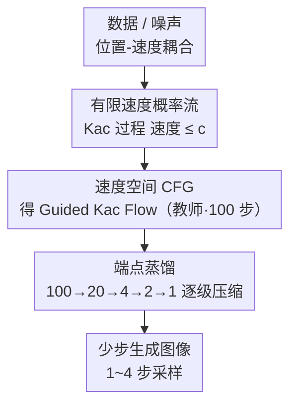

# DistillKac: Few-Step Image Generation via Damped Wave Equations

**会议**: ICLR 2026  
**arXiv**: [2509.21513](https://arxiv.org/abs/2509.21513)  
**代码**: 无  
**领域**: 扩散模型 / 少步生成 / 新PDE框架  
**关键词**: damped wave equation, Kac process, finite-speed flow, endpoint distillation, few-step generation

## 一句话总结
用阻尼波方程（telegrapher equation）及其随机 Kac 表示替代 Fokker-Planck 方程作为生成模型的概率流基础，实现有限速度传播的概率流，并提出端点蒸馏（endpoint distillation）方法实现少步生成，在 CIFAR-10 上 4 步 FID=4.14、1 步 FID=5.66。

## 研究背景与动机

**领域现状**：扩散模型基于 Fokker-Planck 方程（抛物型 PDE），其反向速度场在终端时间附近变得刚性（stiff），因为扩散过程允许无限传播速度。

**现有痛点**：反向 ODE 的速度范数在 $t \to T$ 时可以无界增长，导致末端采样不稳定，需要大量步数才能保证精度。蒸馏时学生模型在大步长下容易偏离教师轨迹。

**核心矛盾**：无限速度传播 → 速度场刚性 → 采样不稳定 → 需要多步。能否从 PDE 层面就解决这个问题？

**本文目标** 引入双曲型 PDE（阻尼波方程）作为替代，利用其有限速度传播特性来获得更稳定的少步生成。

**切入角度**：阻尼波方程是 Fokker-Planck 方程的推广——扩散是阻尼和速度趋向无穷时的极限。Kac 过程天然有速度上界 $c$，保证全局有界的动能和 Wasserstein 空间中的 Lipschitz 正则性。

**核心 idea**：有限速度的概率流让端点匹配可以自动保证全程路径接近，从而使少步蒸馏更稳定。

## 方法详解

### 整体框架

这篇论文要解决的是少步生成里"末端速度场刚性"的老问题，思路是从概率流的 PDE 基础下手——把扩散模型所依赖的 Fokker-Planck 方程（抛物型）换成阻尼波方程 $\partial_{tt} p + \lambda \partial_t p = c^2 \nabla^2 p$（双曲型，又叫 telegrapher 方程）。整个 pipeline 分三段：先用阻尼波方程的随机 Kac 表示构造一个**有限速度**的概率流（粒子位置-速度耦合演化，速度被硬约束在上界 $c$ 内）；再在这个速度场上做 classifier-free guidance，得到可控的 Guided Kac Flow，并把它训成 100 步教师；最后用端点蒸馏把教师逐级压成 1 步学生。关键在于：因为概率流速度有界、轨迹被关在因果锥里，端点对齐就能"免费"换来整条路径对齐，这是少步蒸馏能稳住的根本原因。

### 关键设计

**1. 有限速度概率流：用 Kac 过程把速度场关进上界 $c$，消掉末端刚性**

扩散模型反向 ODE 的速度范数在 $t \to T$ 附近会无界增长，根因是 Fokker-Planck 允许无限传播速度，末端因此变得刚性、必须靠很多步去逼近。本文改用阻尼波方程的随机 Kac 表示：粒子的位置 $X_t$ 和速度 $V_t$ 耦合演化，速度始终满足 $|V_t| \leq c$，方向在一维里按 Poisson 过程随机翻转、高维里则按 Poisson 时刻重采样方向。速度有了硬上界，轨迹就被约束在因果锥内、不会无限传播，于是动能全局有界、概率流在 Wasserstein 空间里具有 Lipschitz 正则性。末端不再刚性，数值积分自然更稳，少步采样也更鲁棒。扩散其实是这个框架的一个极限——当阻尼率和速度同时趋于无穷时，阻尼波方程退化回 Fokker-Planck。

**2. 速度空间 CFG：在速度场而非 score 场上做引导，天然不破坏速度约束**

要做条件生成就得加 classifier-free guidance，但传统 CFG 在 score 空间操作，外推出的合成场可能违背有限速度约束、把前面辛辛苦苦关进因果锥的轨迹又放出去。本文把引导直接搬到 Kac 速度场上：

$$u_{\text{guided}} = (1+w)\, u_\theta^{\text{cond}} - w\, u_\theta^{\text{uncond}}$$

并证明在温和条件下这个引导速度场仍然平方可积，即引导后的概率流依旧合法、有限速度结构不被破坏。由此得到的 Guided Kac Flow 既能条件控制，又保住了整套稳定性前提，作为后续蒸馏的 100 步教师。

**3. 端点蒸馏 + 路径稳定性定理（Theorem 8）：端点对齐换来整段轨迹对齐**

蒸馏最怕的是学生在大步长下偏离教师轨迹。本文让学生只去匹配教师在每个时间段端点 $t_k$ 上的输出（端点 MSE），而 Theorem 8 证明：借助 Kac 流的 Lipschitz 正则性，一旦学生和教师在端点 $t_k$ 对齐，它们在整个区间 $[t_{k+1}, t_k]$ 内都会保持接近，且误差以 $O(M^{-1})$ 衰减（$M$ 为 Euler 学生的步数）。也就是说，只在稀疏的端点上做监督，就能保证全程路径不跑偏。这是有限速度流独有的红利——无限速度的扩散流给不出这种端点→路径的稳定性保证，因此它的少步蒸馏更难稳。

### 损失函数 / 训练策略

教师是 100 步的 Guided Kac Flow，用 AB-2（二阶 Adams-Bashforth）积分——二阶精度但每步只需一次函数评估。蒸馏目标是端点 MSE 损失，按 100→20→4→2→1 逐级迭代蒸馏，每一阶段的学生再作为下一阶段的教师。backbone 用 UNet，在 CIFAR-10、CelebA-64、LSUN Bedroom-256 上训练。

## 实验关键数据

### 主实验

| 方法 | NFE | FID (CIFAR-10) | FID (CelebA-64) |
|------|-----|---------------|----------------|
| Guided Kac Flow (100步, AB-2) | 100 | 3.58 | 3.50 |
| **DistillKac** | **20** | **3.72** | **3.42** |
| DistillKac | 4 | 4.14 | 4.36 |
| DistillKac | 2 | 4.68 | 5.66 |
| DistillKac | 1 | 5.66 | 7.45 |
| DDIM (100步) | 100 | 4.16 | 6.53 |
| DDIM (20步) | 20 | 6.84 | 13.73 |
| Progressive Distillation | 4 | 3.00 | — |
| iCT | 2 | 2.46 | — |

### 关键发现
- 100→1 步蒸馏 FID 仅增加 2.08（3.58→5.66），展示了有限速度流的端点稳定性优势
- 在 20 步时 DistillKac（3.72）大幅优于 DDIM（6.84），4 步时差距更大（4.14 vs 不可用）
- AB-2 积分器效率最优：二阶精度但每步只需一次函数评估
- 但绝对 FID 值不如 EDM（1.79）或 iCT（2.46），说明 Kac 流基础模型的拟合能力还需提升

## 亮点与洞察
- **PDE 视角的创新**：将生成模型从抛物型 PDE（Fokker-Planck）扩展到双曲型 PDE（阻尼波方程），这是一个根本性的范式扩展。Table 1 中三类 PDE（抛物/椭圆/双曲）对应三类生成模型的分类很有启发性。
- **端点-路径稳定性**定理是核心理论贡献——有限速度流的几何特性使得端点教学可以"免费"获得路径一致性，这是蒸馏方法设计的理论基石。
- 潜在价值：如果 Kac 流基础模型质量能进一步提升（如用 DiT），有限速度的稳定性优势可能在大规模模型上更显著。

## 局限与展望
- 绝对生成质量不如 SOTA（FID 3.58 vs EDM 1.79），Kac 流基础模型还需改进
- 仅在小规模数据集（CIFAR-10, CelebA-64）上验证，缺少 ImageNet/高分辨率实验
- Kac 过程的速度上界 $c$ 和阻尼率 $\lambda$ 需要调优，增加了超参数
- 高维扩展中 Kac 过程的方向重采样机制效率未被充分分析
- 与一致性模型（iCT, sCT）的对比不够全面

## 相关工作与启发
- **vs Kac Flow (Duong et al., 2026)**: DistillKac 在此基础上增加了 CFG 和蒸馏，将 FID 从 6.42 降至 3.58（100步）和 5.66（1步）
- **vs Progressive Distillation**: 思路类似但理论基础不同——DistillKac 有端点-路径稳定性的理论保证
- **vs Flow Matching/Rectified Flow**: 都是 ODE 流，但 Kac 有有限速度约束，可能在末端更稳定

## 评分
- 新颖性: ⭐⭐⭐⭐⭐ 双曲型 PDE 生成模型框架开创性，理论贡献突出
- 实验充分度: ⭐⭐⭐ 仅小数据集，绝对性能不够强
- 写作质量: ⭐⭐⭐⭐⭐ 理论推导严谨优雅，PDE 到生成模型的映射清晰
- 价值: ⭐⭐⭐⭐ 开辟新方向（双曲型生成模型），但需要更多后续工作验证大规模可行性

<!-- RELATED:START -->

## 相关论文

- [\[CVPR 2026\] Uni-DAD: Unified Distillation and Adaptation of Diffusion Models for Few-step Few-shot Image Generation](../../CVPR2026/image_generation/uni-dad_unified_distillation_and_adaptation_of_diffusion_models_for_few-step_few.md)
- [\[CVPR 2026\] BiFM: Bidirectional Flow Matching for Few-Step Image Editing and Generation](../../CVPR2026/image_generation/bifm_bidirectional_flow_matching_for_few-step_image_editing_and_generation.md)
- [\[CVPR 2026\] FlowSteer: Guiding Few-Step Image Synthesis with Authentic Trajectories](../../CVPR2026/image_generation/flowsteer_guiding_few-step_image_synthesis_with_authentic_trajectories.md)
- [\[CVPR 2026\] Few-Step Diffusion Sampling Through Instance-Aware Discretizations](../../CVPR2026/image_generation/few-step_diffusion_sampling_through_instance-aware_discretizations.md)
- [\[CVPR 2026\] Refining Few-Step Text-to-Multiview Diffusion via Reinforcement Learning](../../CVPR2026/image_generation/refining_few-step_text-to-multiview_diffusion_via_reinforcement_learning.md)

<!-- RELATED:END -->
